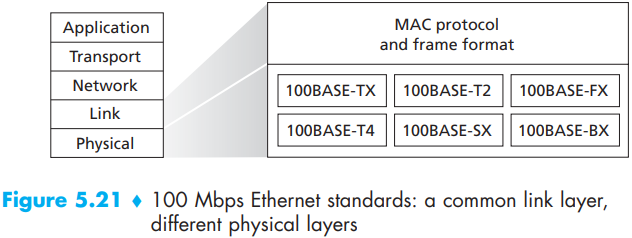

# Chapter 5 The Link Layer: Links, Access Networks, and LANs

[TOC]

The Services Provided by the Link Layer:

- Framing.
- Link access.
- Reliable delivery.
- Error detection and correction.

The link layer is implemented in a `network adapter`, also sometimes known as a `network interface card (NIC)`.

On the sending side, the controller takes a datagram that has been created and stored in host memory by the higher layers of the protocol stack, encapsulates the datagram in a link-layer frame (filling in the frame's various fields), and then transmits the frame into the communication link, following the link-access protocol. On the receiving side, a controller receives the entire frame and extracts the network-layer datagram. If the link layer performs error detection, then it is the sending controller that sets the error-detection bits in the frame header, and it is the receiving controller that performs error detection.

The link layer is implemented in hardware, and part of the link layer is implemented in software that runs on the host's CPU.

`bit-level error detection and correction`. Detecting and correcting the corruption of bits in a link-layer frame sent from one node to another physically connected neighboring node -- are two services often provided by the link layer.

`Cyclic redundancy check (CRC)` codes are also known as `polynomial codes`, since it is possible to view the bit string to be sent as a polynomial whose coefficients are the 0 and 1 values in the bit string, with operations on the bit string interpreted as polynomial arithmetic.

Let us now turn to the crucial question of how the sender computes $R$. Recall that we want to find $R$ such that there is an $n$ such that
$$
D \cdot 2^r\ XOR\ R = nG
$$
That is, we want to choose $R$ such that $G$ divides into $D \cdot 2^r\ XOR\ R$ without remainder. If we XOR (that is, add modulo-2, without carry) $R$ to both sides of the above equation, we get
$$
D \cdot 2^r = nG\ XOR\ R
$$
This equation tells us that if we divide $D \cdot 2^r$ by $G$, the value of the remainder is precisely $R$. In other words, we can calculate $R$ as
$$
R = remainder \frac{D \cdot 2^r}{G}
$$

In a random access protocol, a transmitting node always transmits at the full rate of the channel, namely, $R$ bps. When there is a collision, each node involved in the collision repeatedly retransmits its frame (that is, packet) until its frame gets through without a collision. But when a node experiences a collision, it doesn't necessarily retransmit the frame right away. Instead, it waits a random delay before retransmitting the frame.

The slotted ALOHA protocol required that all nodes synchronize their transmissions to start at the beginning of a slot.

In order to present a closed-form approximation of the efficiency of Ethernet, let $d_{prop}$ denote the maximum time it takes signal energy to propagate between any two adapters. Let $d_{trans}$ be the time to transmit a maximum-size frame. A derivation of the efficiency of CSMA/CD is beyond the scope of this book. Here we simply state the following approximation:
$$
Efficiency = \frac{1}{1 + 5d_{prop}/d_{trans}}
$$
We see from this formula that as $d_{prop}$ approaches 0, the efficiency approaches 1. 

Switched Local Area Networks:

Ethernet has pretty much taken over the wired LAN market.

- `Data field (46 to 1,500 bytes)`.
- `Destination address (6 bytes)`.
- `Source address (6 bytes)`.
- `Type field (2 bytes)`.
- `Cyclic redundancy check (CRC) (4 bytes)`.
- `Preamble (8bytes)`.

Gigabit Ethernet is an extension to the highly successful 10 Mbps and 100 Mbps Ethernet standards. Offering a raw data rate of 1,000 Mbps, Gigabit Ethernet maintains full compatibility with the huge installed base of Ethernet equipment.

Having described the basic operation of a link-layer swith, let's now consider their features and properties. We can identify several advantages of using switches, rather than broadcast links such as buses or hub-based star topologies:

- `Elimination of collisions`.
- `Heterogeneous links`.
- `Management`.

Switches Versus Routers:

`vritual local area networks (VLANs)`. As the name suggests, a switch that supports VLANs allows multiple `virtual` local area networks to be defined over a single `physical` local area network infrastructure.

Multiprotocol Label Switching (MPLS) used to improve the forwarding speed of IP routers by adopting a key concept from the world of virtual-circuit network: a fixed-length label.

The MPLS-capable routers R1 through R4 do so without ever touching the IP header of a packet.

Load Balancing:

Trends in Data Center Networking:

A day in the life of a Web page request example:

