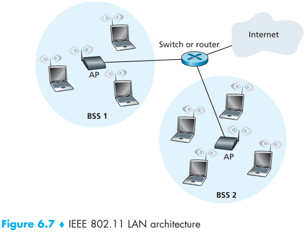
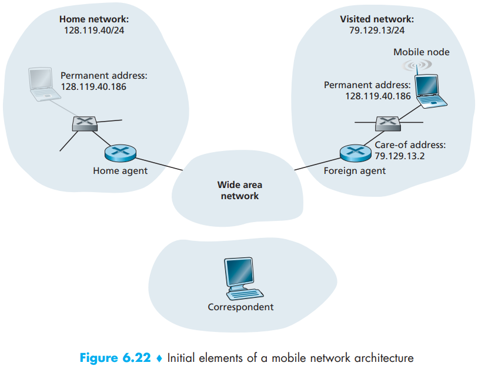
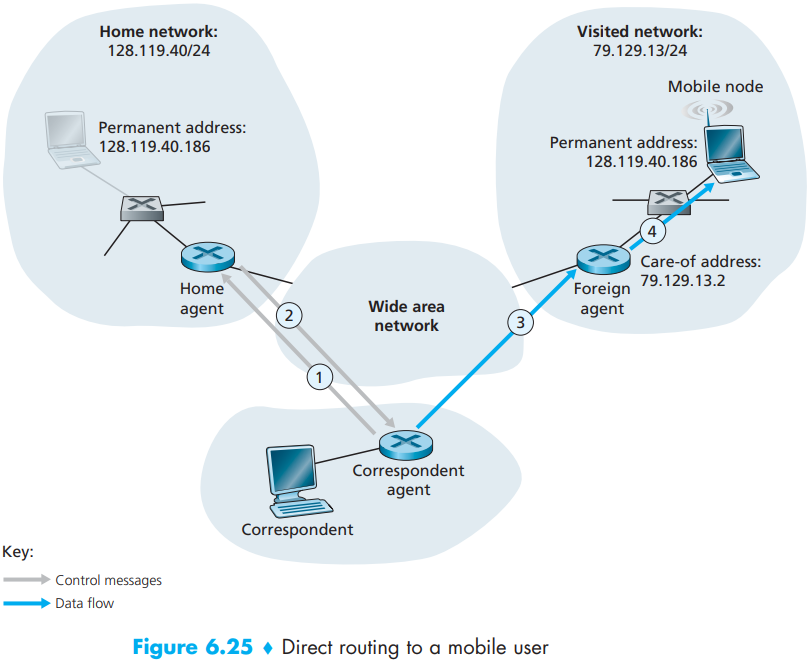

# Chapter6 Wireless and Mobile Networks

- `Wireless links`.
- `Base station`.
- `Network infrastructure`.

At the highest level we can classify wireless networks according to two criteria:1. whether a packet in the wireless network crosses exactly `one wireless hop` or `multiple wireless hops`. 2. whether there is `infrastructure` such as a base station in the network:

- `Single-hop, infrastructure-based`.
- `Single-hop, infrastructure-less`.
- `Multi-hop, infrastructure-base`.
- `Multi-hop, infrastructure-less`.

We can  find a number of important differences between a wired link and a wireless link:

- `Decreasing signal strength`.
- `Interference from other sources`.
- `Multipath propagation`.

`The signal-to-noise ratio (SNR)` is a relative measure of the strength of the received signal (i.e., the information being transmitted) and this noise.

There are several physical-layer characteristics:

- `For a given modulation scheme, the higher the SNR, the lower the BER`.
- `For a given SNR, a modulation technique with a higher bit transmission rate (whether in error or not) will have a higher BER`.
- `Dynamic selection of the physical-layer modulation technique can be used to adapt the modulation technique to channel conditions`.

A higher and time-varying bit error rate is not the only difference between between a wired and wireless link. With the so-called `hidden terminal problem`, physical obstructions in the environment may prevent A and C from hearing each other's transmissions, even though A's and C's transmissions are indeed interfering at the destination, B. A second scenario that results in undetectable collisions at the receiver results from the `fading` of a signal's strength as it propagates through the wireless medium.

Code division multiple access (CDMA) belongs to the family of channel partitioning protocols. In a CDMA protocol, each bit being sent is encoded by multiplying the bit by a signal (the code) that changes at a much faster rate (known as the chipping rate) than the original sequence of data bits.

To illustrate how CDMA works, let us focus on the $i$th data bit, $d_i$. For the $m$th mini-slot of the bit-transmission time of $d_i$, the output of the CDMA encoder, $Z_{i, m}$, is the value of $d_i$ multiplied by the $m$th bit in the assigned CDMA code, $c_m$:
$$
Z_{i, m} = d_i \cdot c_m \qquad (6.1)
$$
In a simple world, with no interfering senders, the receiver would receive the encoded bits, $Z_{i, m}$, and recover the original data bit, $d_i$, by computing:
$$
d_i = \frac{1}{M} \sum_{m=1}^{M}Z_{i, m} \cdot c_m \qquad (6.2)
$$
In the presence of multiple senders, sender $s$ computes its encoded transmissions, $Z_{i,m}^s$, in exactly the same manner as in Equation 6.1. The value received at a receiver during the $m$th mini-slot of the $i$th bit slot, however, is now the sum of the transmitted bits from all $N$ senders during that mini-slot:
$$
Z_{i, m}^{*} = \sum_{s = 1}^{N}Z_{i, m}^s
$$
Amazingly, if the senders' codes are chosen carefully, each receiver can recover the data sent by a given sender out of the aggregate signal simply by using the sender's code in exactly the same manner as in Equation 6.2:
$$
d_i = \frac{1}{M} \sum_{m = 1}^{M} Z_{i, m}^{*} \cdot c_m \qquad (6.3)
$$

The fundamental building block of the 802.11 architecture is the `basic service set (BBS)`. A BSS contains one or more wireless stations and a central `base station`, known as an `access point (AP)` in 802.11 parlance.

wireless LANs that deploy APs are often referred to as `infrastructure wireless LANs`, with the "infrastructure" being the APs along with the wired Ethernet infrastructure that interconnects the APs and a router.

When a network administrator installs an AP, the administrator assigns a one or two word `Service Set Identifier (SSID)` to the access point. The administrator must also assign a channel number to the AP.

The 802.11 standard requires that an AP periodically send `beacon frames`, each of which includes the AP's SSID and MAC address. The process of scanning channels and listening for beacon frames is known as `passive scanning`. A wireless host can also perform `active scanning`, by broadcasting a probe frame that will be received by all APs within the wireless host's range. APs respond to the probe request frame with a probe response frame. The wireless host can then choose the AP with which to associate from among the responding APs.

Unlike the 802.3 Ethernet protocol, the 802.11 MAC protocol does not implement collision detection. There are two important reasons for this:

- The ability to detect collisions requires the ability to send (the sttion's own signal) and receive (to determine whether another station is also transmitting) at the same time. Because the strength of the received signal is typically very small compared to the strength of the transmitted signal at the 802.11 adapter, it is costly to build hardware that can detect a collision.
- More importantly, even if the adapter could transmit and listen at the same time (and presumably abort transmission when it senses a busy channel), the adapter would still not be able to detect all collisions.

When the destination station receives a frame that passes the CRC, it waits a short period of time known as the `Short Inter-frame Spacing (SIFS)` and then sends back an acknowledgment frame. If the transmitting station does not receive an acknowledgment within a given amount of time, it assumes that an error has occurred and retransmits the frame, using the CSMA/CA protocol to access the channel. If an acknowledgment is not received after some fixed number of retransmissions, the transmitting station gives up and discards the frame.

Although the 802.11 frame shares many similarities with an Ethernet frame, it also contains a number of fields that are specific to its use for wireless links.

An IEEE 802.15.1 network operates over a short range, at low power, and at low cost. It is essentially a low-power, short-range, low-rate “cable replacement” technology for interconnecting notebooks, peripheral devices, cellular phones, and smartphones, whereas 802.11 is a higher-power, medium-range, higher-rate “access” technology.

A second personal area network standardized by the IEEE is the 802.14.5 standard [IEEE 802.15 2012] known as Zigbee. While Bluetooth networks provide a “cable replacement” data rate of over a Megabit per second, Zigbee is targeted at lowerpowered, lower-data-rate, lower-duty-cycle applications than Bluetooth.

The term cellular refers to the fact that the region covered by a cellular network is partitioned into a number of geographic coverage areas, known as cells.

In a network setting, the permanent home of a mobile node (such as a laptop or smartphone) is known as the `home network`, and the entity within the home network that performs the mobility management functions discussed below on behalf of the mobile node is known as the `hoem agent`. The network in which the mobile node is currently residing is known as the `home agent`. The network in which the mobile node is currently residing is known as the `foreign` (or `visited`) `network`, and the entity within the foreign network that helps the mobile node with the mobility management functions discussed below is known as a `foreign agent`.

Two approache of Routing to a Mobile Node:

- `indirect routing`. the correspondent simply addresses the datagram to the mobile node’s permanent address and sends the datagram into the network, blissfully unaware of whether the mobile node is resident in its home network or is visiting a foreign network; mobility is thus completely transparent to the correspondent. Such datagrams are first routed, as usual, to the mobile node’s home network.

  

- `Direct routing`. overcomes the inefficiency of triangle routing, but does so at the cost of additional complexity. In the direct routing approach, a correspondent agent in the correspondent’s network first learns the COA of the mobile node. This can be done by having the correspondent agent query the home agent, assuming that (as in the case of indirect routing) the mobile node has an up-to-date value for its COA registered with its home agent. It is also possible for the correspondent itself to perform the function of the correspondent agent, just as a mobile node could perform the function of the foreign agent.

  

The mobile IP standard consists of three main pieces:

- `Agent discovery`.
- `Registration with the home agent`.
- `Indirect routing of datagrams`.

A mobile IP node arriving to a new network, whether attaching to a foreign network or returning to its home network, must learn the identity of the corresponding foreign or home agent. Indeed it is the discovery of a new foreign agent, with a new network address, that allows the network layer in a mobile node to learn that it has moved into a new foreign network. This process is known as `agent discovery`. Agent discovery can be accomplished in one of two ways:

- `agent advertisement`. a foreign or home agent advertises its services using an extension to the existing router discovery protocol [RFC 1256].

  

  - `Home agent bit (H)`. Indicates that the agent is a home agent for the network in which it resides.
  - `Foreign agent bit (F)`. Indicates that the agent is a foreign agent for the network in which it resides.
  - `Registration required bit (R)`. Indicates that a mobile user in this network must register with a foreign agent. In particular, a mobile user cannot obtain a careof address in the foreign network (for example, using DHCP) and assume the functionality of the foreign agent for itself, without registering with the foreign agent.
  - `M, G encapsulation bits`. Indicate whether a form of encapsulation other than IP-in-IP encapsulation will be used.
  - `Care-of address (COA) fields`. A list of one or more care-of addresses provided by the foreign agent. In our example below, the COA will be associated with the foreign agent, who will receive datagrams sent to the COA and then forward them to the appropriate mobile node. The mobile user will select one of these addresses as its COA when registering with its home agent.

- `agent solicitation`. a mobile node wanting to learn about agents without waiting to receive an agent advertisement can broadcast an agent solicitation message, which is simply an ICMP message with type value 10. An agent receiving the solicitation will unicast an agent advertisement directly to the mobile node, which can then proceed as if it had received an unsolicited advertisement.

We’re now in a position to describe how a call is placed to a mobile GSM user in a visited network.

A handoff occurs when a mobile station changes its association from one base station to another during a call.

Given high bit error rates on wireless links and the possibility of handoff loss, TCP’s congestion-control response could be problematic in a wireless setting. Three broad classes of approaches are possible for dealing with this problem:

- `Local recovery`.
- `TCP sender awareness of wireless links`.
- `Split-connection approaches`.

## Summary

TODO

