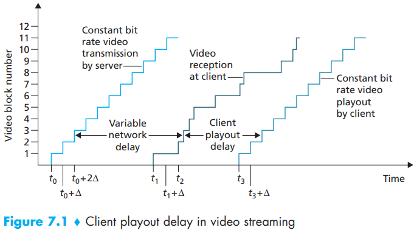
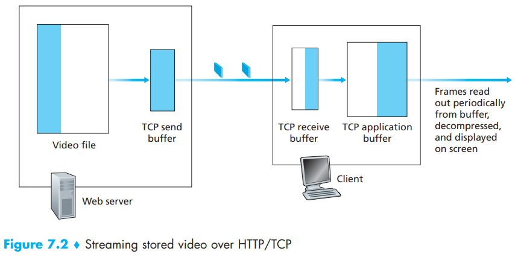
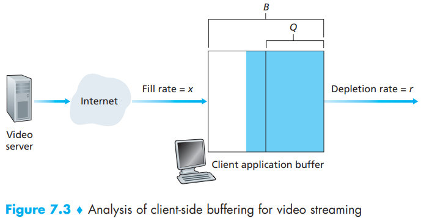
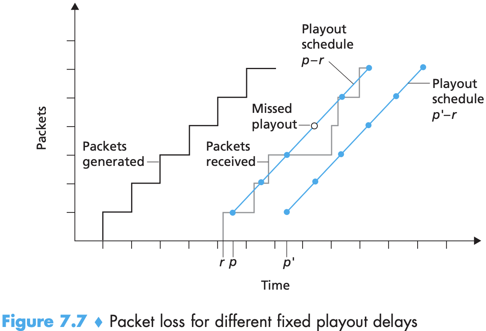
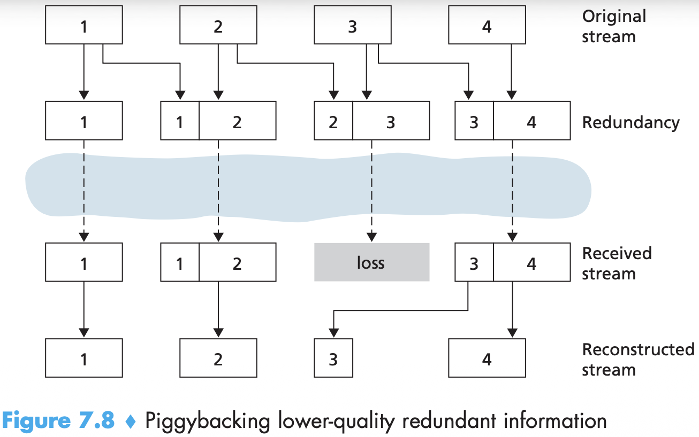
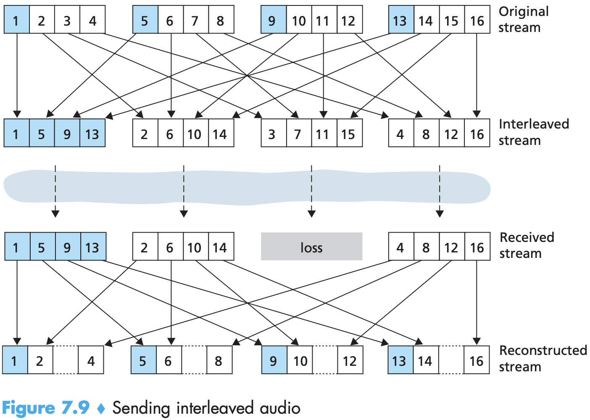

# Chapter7 Multimedia Networking

[TOC]

The most salient characteristic of video is its `high bit rate`. Another important characteristic of video is that it can be compressed, thereby trading off video quality with bit rate。

Streaming stored video has three key distinguishing features：

- `Streaming`.
- `Interactivity`.
- `Continuous playout`.

Streaming video systems can be classified into three categories:

- `UDP streaming`.
- `HTTP streaming`.
- `adaptive HTTP streaming`.

Before passing the video chunks to UDP, the server will encapsulate the video chunks within transport packets specially designed for transporting audio and video, using the Real-Time Transport Protocol (RTP) [RFC 3550] or a similar (possibly proprietary) scheme. 

Another distinguishing property of UDP streaming is that in addition to the serverto-client video stream, the client and server also maintain, in parallel, a separate control connection over which the client sends commands regarding session state changes (such as pause, resume, reposition, and so on). The Real-Time Streaming Protocol (RTSP) [RFC 2326], explained in some detail in the companion Web site for this textbook, is a popular open protocol for such a control connection.

In HTTP streaming, the video is simply stored in an HTTP server as an ordinary file with a specific URL. When a user wants to see the video, the client establishes a TCP connection with the server and issues an HTTP GET request for that URL. The server then sends the video file, within an HTTP response message, as quickly as possible, that is, as quickly as TCP congestion control and flow control will allow. On the client side, the bytes are collected in a client application buffer. Once the number of bytes in this buffer exceeds a predetermined threshold, the client application begins playback—specifically, it periodically grabs video frames from  the client application buffer, decompresses the frames, and displays them on the user’s screen.

Thus, when the available rate in the network is less than the video rate, playout will alternate between periods of continuous playout and periods of freezing.

**Note that when the available rate in the network is more than the video rate, after the initial buffering delay, the user will enjoy continuous playout until the video ends. **

`End-to-end delay` is the accumulation of transmission, processing, and queuing delays in routers; propagation delays in links; and end-system processing delays.

`Jitter` can often be removed by using sequence numbers, timestamps, and a playout delay, as discussed below.

Following [Ramjee 1994], we now describe a generic algorithm that the receiver can use to adaptively adjust its layout delays. To this end, let:

- $t_i$ = the timestamp of the $i$th packet = the time the packet was generated by the sender.
- $r_i$ = the time packet $i$ is received by receiver.
- $p_i$ = the time packet $i$ is played at receiver.

The end-to-end network delay of the $i$th packet is $r_i - t_i$. Due to network jitter, this delay will vary from packet to packet. Let $d_i$ denote an estimate of the `average` network delay upon reception of the $i$th packet. This estimate is constructed from the timestamps as follows:
$$
d_i = (1 - u)d_{i - 1} + u(r_i - t_i)
$$
, where $u$ is a fixed constant (for example, $u$ = 0.01). Thus $d_i$ is a smoothed average of the observed network delays $r_1 - t_1$, ..., $r_i - t_i$.

Let $v_i$ denote an estimate of the average deviation of the delay from the estimated average delay. This estimate is also constructed from the timestamps:
$$
v_i = (1 - u)v_{i - 1} + u|r_i - t_i - d_i|
$$
, the estimates $d_i$ and $v_i$ are calculated for every packet received, although they are used only to determine the playout point for the first packet in any talk spurt.

Once having calculated these estimates, the receiver employs the following algorithm for the playout of packets. If packet $i$ is the first packet of a talk spurt, it's playout time, $p_i$, is computed as:
$$
p_i = t_i + d_i + Kv_i
$$
, where $K$ is a positive constant (for example, $K$= 4).

In particular, let:
$$
q_i = p_i - t_i
$$
, be the length of time from when the first packet in the talk spurt is generated until it is played out. If packet $j$ also belongs to this spurt, it is played out at time:
$$
p_j = t_j + q_i
$$
Two types of loss anticipation schemes are:

- **forward error correction (FEC)**

  1. The first mechanism sends a redundant encoded chunk after every $n$ chunks.
  2. The second FEC mechanism is to send a lower-resolution audio stream as the redundant information.

- **interleaving**

  

  

  

