# Chapter8 Security in Computer Networks

Identify the following desirable properties of secure communication:

- `Confidentiality`.
- `Message integrity`.
- `End-point authentication`.
- `Operational security`.

Cryptographic techniques allow a sender to disguise data so that an intruder can gain no information from the intercepted data. The receiver, of course, must be able to recover the original data from the disguised data.

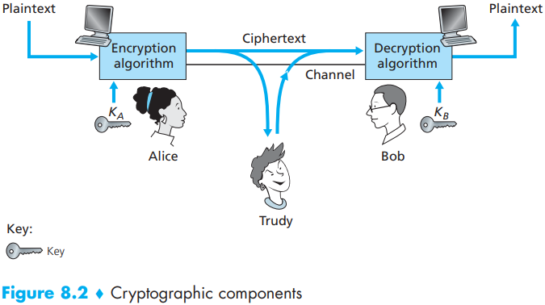

When considering how easy it might be for Trudy to break encryption scheme, one can distinguish three different scenarios, depending on what information the intruder has:

- `Ciphertext-only attack`.
- `Known-plaintext attack`.
- `Chosen-plaintext attack`.

There are two broad classes of symmetric encryption techniques:

- stream ciphers.

- block ciphers.

  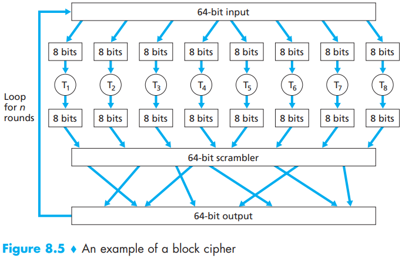

`Cipher Block Chaining (CBC)`. random value along with the very first message, and then have the sender and receiver use the computed coded blocks in place of the subsequent random number. Specifically, CBC operates as follows:

1. Before encrypting the message (or the stream of data), the sender generates a random $k$-bit string, called the `Initialization Vector (IV)`. Denote this initialization vector by $c(0)$. The sender sends the IV to the receiver in `cleartext`.
2. For the first block, the sender calculates $m(1) \oplus c(0)$, that is, calculates the exclusive-or of the first block of cleartext with the IV. It then runs the result through the block-cipher algorithm to get the corresponding ciphertext block; that is, $c(1) = K_S(m(1) \oplus c(0))$. The sender sends the encrypted block $c(1)$ to the receiver.
3. For the $i$th block, the sender generates the ith ciphertext block from $c(i) = K_S(m(i) \oplus c(i - 1))$.

Public Key Encryption:

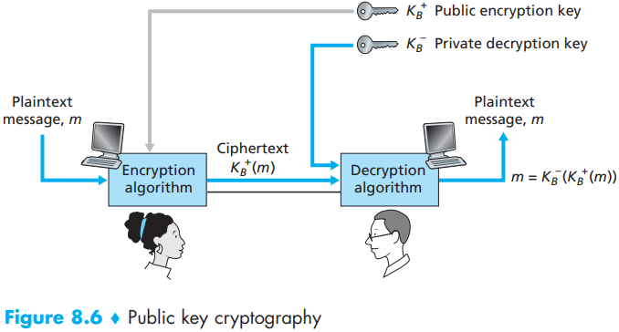

`RAS algorithm` has become almost synonymous with public key cryptography. There are two interrelated components of RSA:

- The choice of the public key and the private key.
- The encryption and decryption algorithm.

Under RSA encryption, a message (uniquely represented by an integer), $m$, is exponentiated to the power $e$ using modulo-$n$ arithmetic, that is,
$$
c = m^e\ mod\ n
$$
Decryption is performed by raising this value to the power $d$, again using modulo-$n$ arithmetic. The result of an encryption step followed by a decryption step is thus $(m^e\ mod\ n)^d\ mod\ n$. Let’s now see what we can say about this quantity. As mentioned earlier, one important property of modulo arithmetic is $(a\ mod\ n)^d\ mod\ n = a^d\ mod\ n$ for any values $a$, $n$, and $d$. Thus, using $a = m^e$ in this property, we have
$$
(m^e\ mod\ n)^d\ mod\ n = m^{ed}\ mod\ n
$$
It therefore remains to show that $m^{ed}\ mod\ n = m$. Although we’re trying to remove some of the magic about why RSA works, to establish this, we’ll need to use a rather magical result from number theory here. Specifically, we’ll need the result that says if $p$ and $q$ are prime, $n = pq$, and $z = (p - 1)(q - 1)$, then $x^y\ mod\ n$ is the same as $x^{y\ mod\ z}\ mod\ n$ [Kaufman 1995]. Applying this result with $x = m$ and $y = ed$ we have
$$
m^{ed}\ mod\ n = m^{(ed\ mod\ z)} mod\ n
$$
But remember that we have chosen $e$ and $d$ such that $ed\ mod\ z = 1$. This gives us
$$
m^{ed}\ mod\ n = m^1\ mod\ n = m
$$
The security of RSA relies on the fact that there are no known algorithms for quickly factoring a number, in this case the public value $n$, into the primes $p$ and $q$. If one knew $p$ and $q$, then given the public value $e$, one could easily compute the secret key, $d$. On the other hand, it is not known whether or not there exist fast algorithms for factoring a number, and in this sense, the security of RSA is not guaranteed.

A `cryptographic hash function` is required to have the following additional property:

- It is computationally infeasible to find any two different messages $x$ and $y$ such that $H(x) = H(y)$.

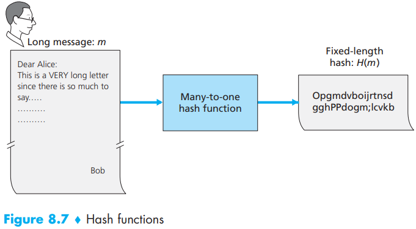

let’s take a first stab at how we might perform message integrity:

1. Alice creates message $m$, concatenates $s$ with $m$ to create $m + s$, and calculates the hash $H(m + s)$ (for example with SHA-1). $H(m + s)$ is called the `message authentication code (MAC)`.
2. Alice then appends the MAC to the message $m$, creating an extended message $(m, H(m + s))$, and sends the extended message to Bob.
3. Bob receives an extended message $(m, h)$ and knowing $s$, calculates the $MAC H(m + s)$. If $H(m + s) = h$, Bob concludes that everything is fine.

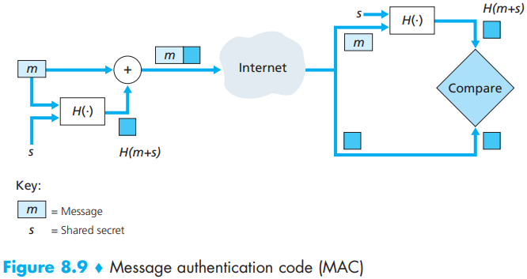

 A `digital signature` is a cryptographic technique for achieving these goals in a digital world.

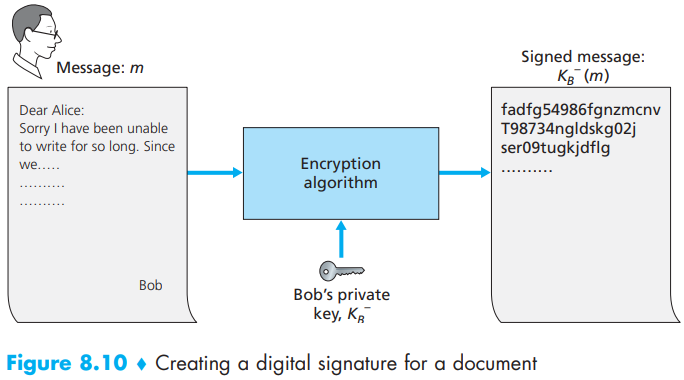

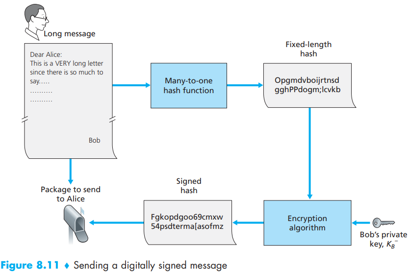

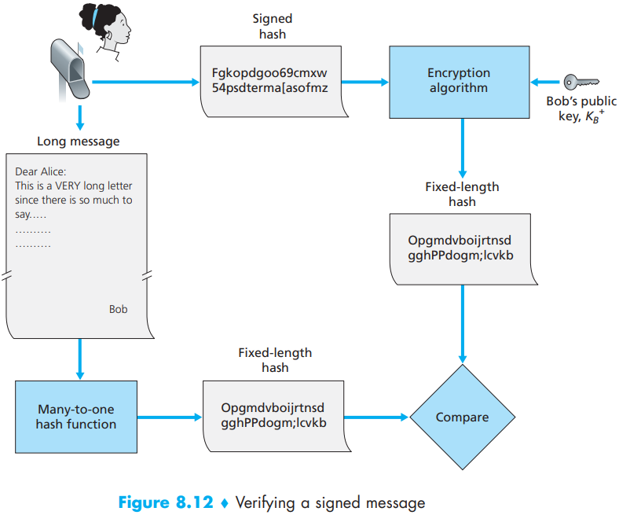

An important application of digital signatures is `public key certification`, that is, certifying that a public key belongs to a specific entity

Binding a public key to a particular entity is typically done by a `Certification Authority (CA)`, whose job is to validate identities and issue certificates. A CA has the following roles:

1. A CA verifies that an entity (a person, a router, and so on) is who it says it is. There are no mandated procedures for how certification is done. When dealing with a CA, one must trust the CA to have performed a suitably rigorous identity verification.

2. Once the CA verifies the identity of the entity, the CA creates a certificate that binds the public key of the entity to the identity. The certificate contains the public key and globally unique identifying information about the owner of the public key (for example, a human name or an IP address). The certificate is digitally signed by the CA. 

   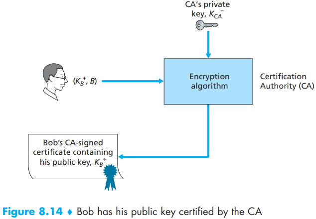

`End-point authentication` is the process of one entity proving its identity to another entity over a computer network.

A `nonce` is a number that a protocol will use only once in a lifetime. That is, once a protocol uses a nonce, it will never use that number again. 

SSL is often used to provide security to transactions that take place over HTTP. However, because SSL secures TCP, it can be employed by any application that runs over TCP. SSL provides a simple Application Programmer Interface (API) with sockets, which is similar and analogous to TCP’s API. When an application wants to employ SSL, the application includes SSL classes/libraries.

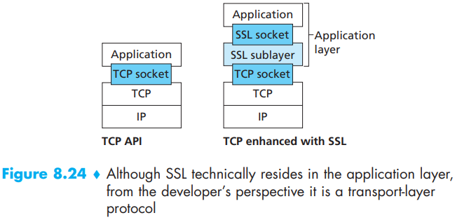

The IP security protocol, more commonly known as IPsec, provides security at the network layer. IPsec secures IP datagrams between any two network-layer entities, including hosts and routers. As we will soon describe, many institutions (corporations, government branches, non-profit organizations, and so on) use IPsec to create virtual private networks (VPNs) that run over the public Internet.

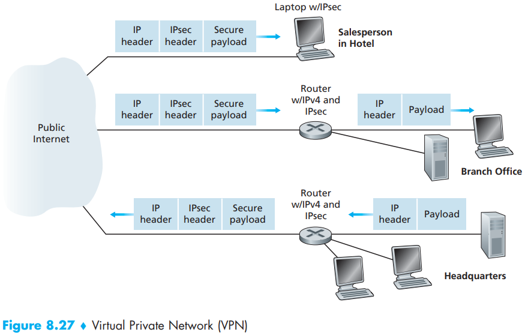

In the IPsec protocol suite, there are two principal protocols: the `Authentication Header (AH)` protocol and the `Encapsulation Security Payload (ESP)` protocol. When a source IPsec entity (typically a host or a router) sends secure datagrams to a destination entity (also a host or a router), it does so with either the AH protocol or the ESP protocol. The AH protocol provides source authentication and data integrity but does not provide confidentiality. The ESP protocol provides source authentication, data integrity, and confidentiality. Because confidentiality is often critical for VPNs and other IPsec applications, the ESP protocol is much more widely used than the AH protocol.

Before sending IPsec datagrams from source entity to destination entity, the source and destination entities create a network-layer logical connection. This logical connection is called a `security association (SA)`. An SA is a simplex logical connection; that is, it is unidirectional from source to destination. If both entities want to send secure datagrams to each other, then two SAs (that is, two logical connections) need to be established, one in each direction.

**Keep in mind, however, that not all traffic sent into the Internet by the gateway routers or by the laptops will be IPsec secured.**

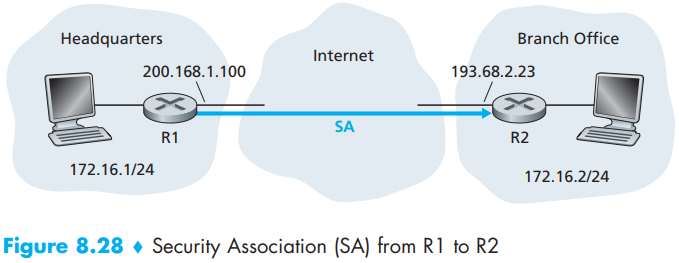

IPsec has two different packet forms, one for the so-called `tunnel mode` and the other for the so-called `ransport mode`.

Large, geographically distributed deployments require an automated mechanism for creating the SAs. IPsec does this with the Internet Key Exchange (IKE) protocol, specified in RFC 5996.

IKE has some similarities with the handshake in SSL (see Section 8.6). Each IPsec entity has a certificate, which includes the entity’s public key. As with SSL, the IKE protocol has the two entities exchange certificates, negotiate authentication and encryption algorithms, and securely exchange key material for creating session keys in the IPsec SAs. Unlike SSL, IKE employs two phases to carry out these tasks.

WEP does not specify a key management algorithm, so it is assumed that the host and wireless access point have somehow agreed on the key via an out-of-band method. Authentication is carried out as follows:

1. WEP does not specify a key management algorithm, so it is assumed that the host and wireless access point have somehow agreed on the key via an out-of-band method. Authentication is carried out as follows.
2. The access point responds to the authentication request with a 128-byte nonce value.
3. The wireless host encrypts the nonce using the symmetric key that it shares with the access point.
4. The access point decrypts the host-encrypted nonce.

If the decrypted nonce matches the nonce value originally sent to the host, then the host is authenticated by the access point.

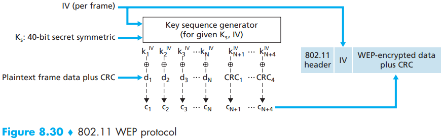

In addition to the wireless client and access point, 802.11i defines an authentication server with which the AP can communicate. Separating the authentication server from the AP allows one authentication server to serve many APs, centralizing the (often sensitive) decisions regarding authentication and access within the single server, and keeping AP costs and complexity low. 802.11i operates in four phases:

1. `Discovery`.

   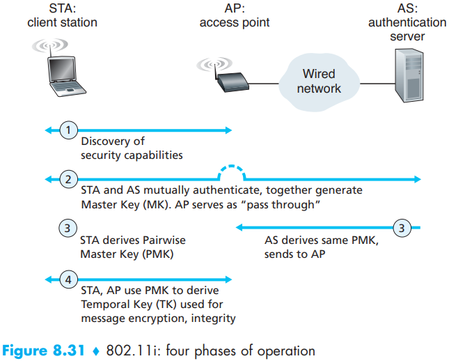

2. `Mutual authentication and Master Key (MK) generation`.

   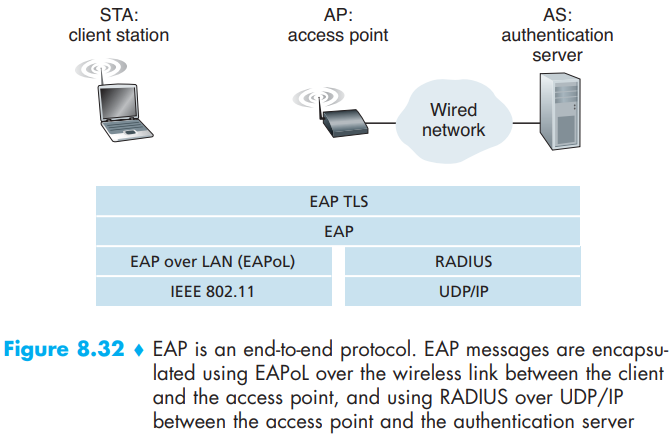

3. `Pairwise Master Key (PMK) generation`.

4. `Temporal Key (TK) generation`.

A firewall is a combination of hardware and software that isolates an organization’s internal network from the Internet at large, allowing some packets to pass and blocking others. A firewall allows a network administrator to control access between the outside world and resources within the administered network by managing the traffic flow to and from these resources. A firewall has three goals:

- All traffic from outside to inside, and vice versa, passes through the firewall.
- Only authorized traffic, as defined by the local security policy, will be allowed to pass.
- The firewall itself is immune to penetration.

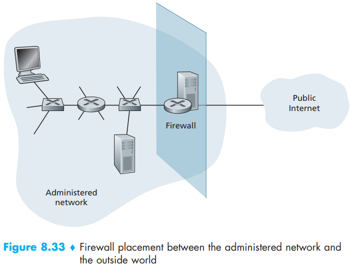

Firewalls can be classified in three categories:

- traditional packet filters.

  Filtering decisions are typically based on:

  - IP source or destination address.
  - Protocol type in IP datagram field: TCP, UDP, ICMP, OSPF, and so on.
  - TCP or UDP source and destination port.
  - TCP flag bits: SYN, ACK, and so on.
  - ICMP message type.
  - Different rules for datagrams leaving and entering the network.
  - Different rules for the different router interfaces.

- stateful filters.

- application gateways.

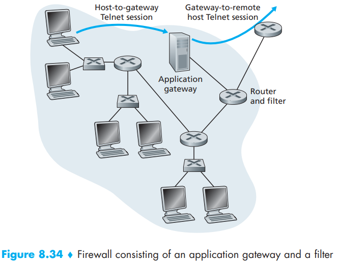

## Summary

TODO