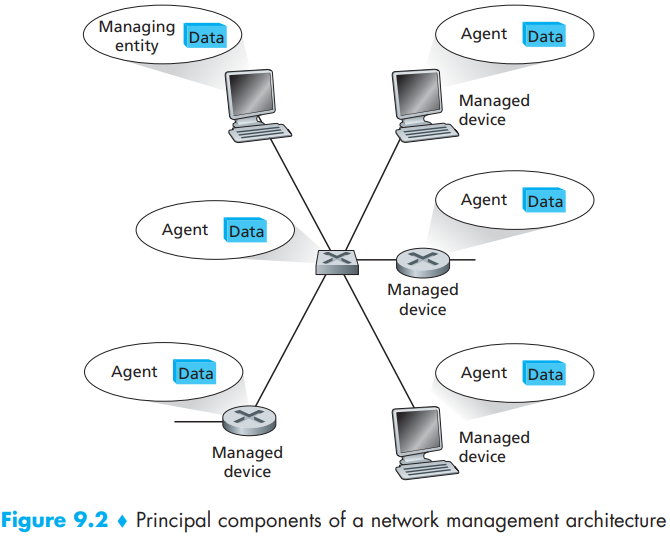

# Chapter 9 Network Management

[TOC]

Even in such a simple network, there are many scenarios in which a network administrator might benefit tremendously from having appropriate network management tools:

- `Detecting failure of an interface card at a host or a router`.
- `Host monitoring`.
- `Monitoring traffic to aid in resource deployment`.
- `Detecting rapid changes in routing tables`.
- `Monitoring for SLAs`.
- `Intrusion detection`.

The International Organization for Standardization (ISO) has created a network management model that is useful for placing the anecdotal scenarios above in a more structured framework. Five areas of network management are defined:

- `Performance management`.
- `Fault management`.
- `Configuration management`.
- `Accounting management`.
- `Security management`.

definition of network management from [Saydam 1996]:

“Network management includes the deployment, integration, and coordination of the hardware, software, and human elements to monitor, test, poll, configure, analyze, evaluate, and control the network and element resources to meet the real-time, operational performance, and Quality of Service requirements at a reasonable cost.”

The architecture of a network management system is conceptually identical to this simple human organizational analogy. The network management field has its own specific terminology for the various components of a network management architecture, and so we adopt that terminology here.

The Internet-Standard Management Framework addresses the questions posed above. The framework consists of four parts:

- Definitions of network management objects, known as MIB objects.
- A data definition language, known as SMI.
- A protocol, SNMP.
- Security and administration capabilities.

At the top of the hierarchy are the ISO and the Telecommunication Standardization Sector of the International Telecommunication Union (ITU-T), the two main standards organizations dealing with ASN.1, as well as a branch for joint efforts by these two organizations.

A PDU sent by an SNMP application next passes through the SNMP “engine” before it is sent via the appropriate transport protocol.

SNMPv3 provides for encryption, authentication, protection against playback attacks (see Section 8.3), and access control:

- `Encryption`.
- `Authentication`.
- `Protection against playback`.
- `Access control`.

The architecture of network management systems revolves around five key components: (1) a network manager, (2) a set of managed remote (from the network manager) devices, (3) the Management Information Bases (MIBs) at these devices, containing data about the devices’ status and operation, (4) remote agents that report MIB information and take action under the control of the network manager, and (5) a protocol for communication between the network manager and the remote devices.