# 第六章 处理器控制

[TOC]

TODO


## 6.3 流水线简介

- 时钟周期 计算机发生的最小事件；
- 机器周期 执行一条指令所需的时间。

指令执行阶段：

- 取指
- 译码
- 读操作数
- 执行
- 保存操作数

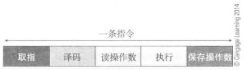

*指令在假想计算机上的执行过程*

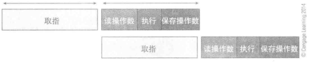

*RISC 1的流水线*

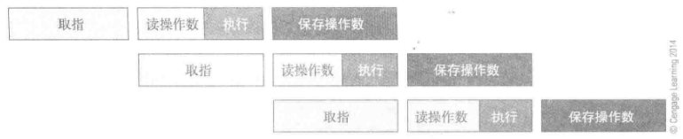

*RISC 2的流水线*

流水线的最优长度与实现技术有关。

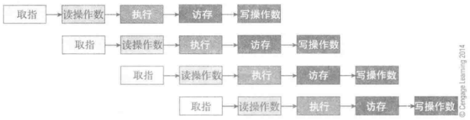

*五阶段流水线*

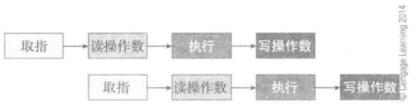

*四阶段流水线*

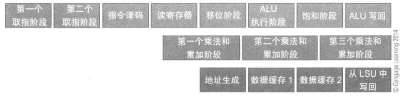

*ARM的流水线*


*SPARC T1的流水线*

### 6.3.1 加速比

`加速比（speedup ratio）` 带流水线系统与不带流水线系统的速度之比，用来描述流水线的性能。

若有$i$条指令在流水线上执行，那么需要花费$i + (n - 1)$个周期；如果不使用流水线，系统将需要使用$n \times i$个周期；因此加速比为：

$S = \frac{n \times i}{i + (n - 1)}$ = $\frac{n}{1 + \frac{n - 1}{i}}$

- $S$ 加速比；
- $i$ 指令条数；
- $n$ 流水段数（一条指令可拆分的步骤数）；

在极限情况下，当$i = 1$时$S$的值为$1$，当$i = \infty$时，加速比为$n$。

### 6.3.2 实现流水线

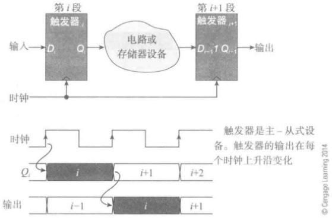

*流水段；第$i$段以一个$D$触发器开始。为使系统能够正确工作，这个触发器必须是一个能够隔离其输入和输出的主从设备。假设$D$触发器的输出$Q$在时钟上升沿变化。*

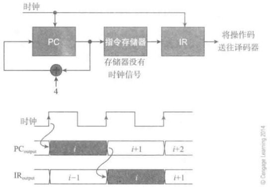

*流水线处理器读指令的过程*

- 程序计数器和指令寄存器是两个带锁存的段。
- `寄存器文件` 用来保存临时变量的通用寄存器的集合，在每个周期必须完成3个动作。

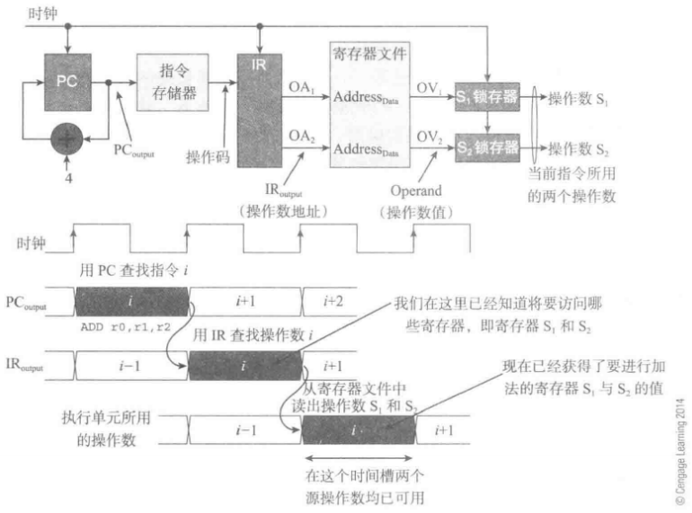

*读操作数的值*

- $OA_1$ 操作数地址1；
- $OV_1$ 操作数值1；
- $i$ 程序计数器的初始值。

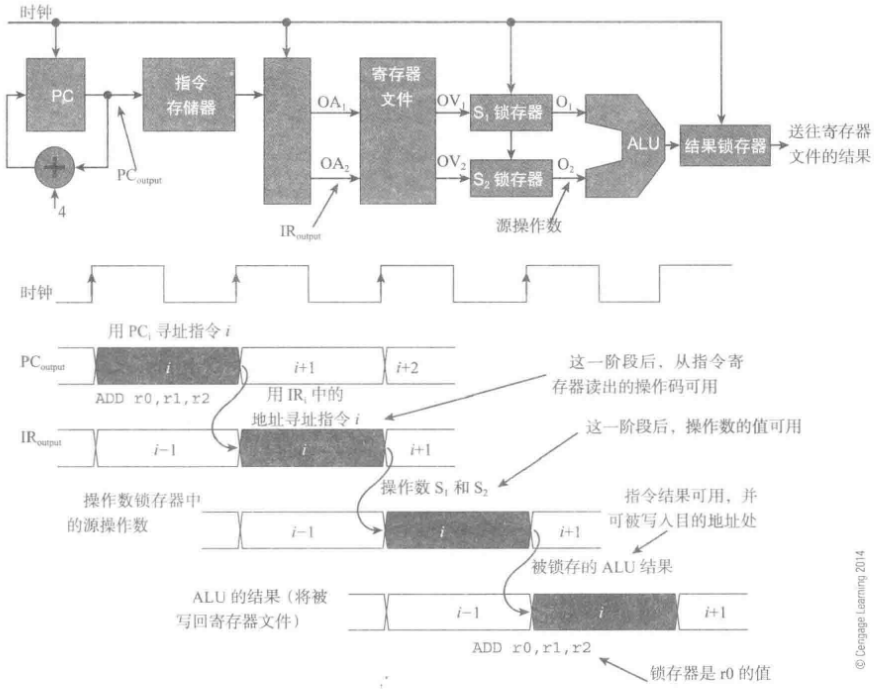

*完成指令（寄存器-寄存器型）*

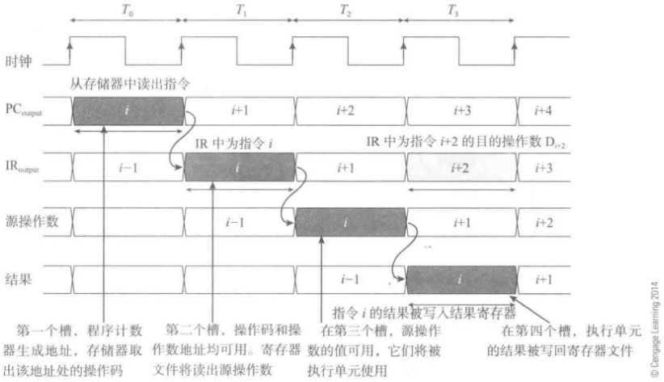

*4个时钟脉冲后流水线的状态*

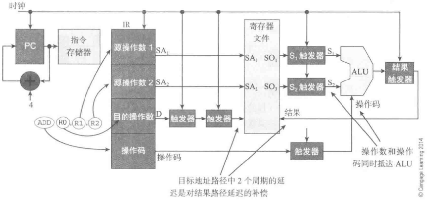

*流水线中的补偿延迟*

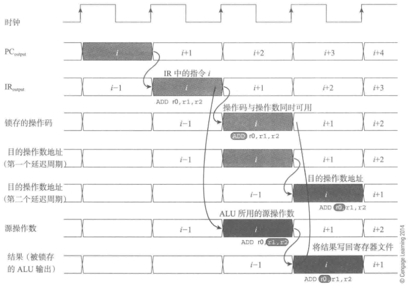

*流水线中的补偿延迟时序图*

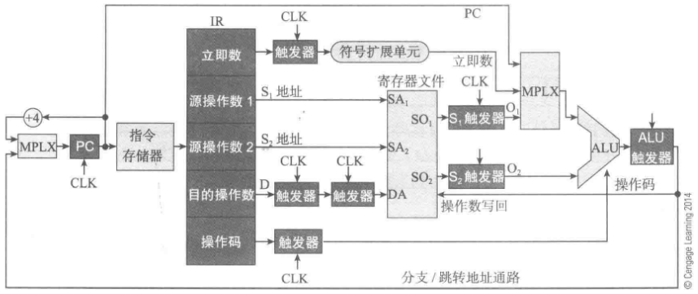

*通过增加立即数通路和条件分支功能扩展流水线体系结构*

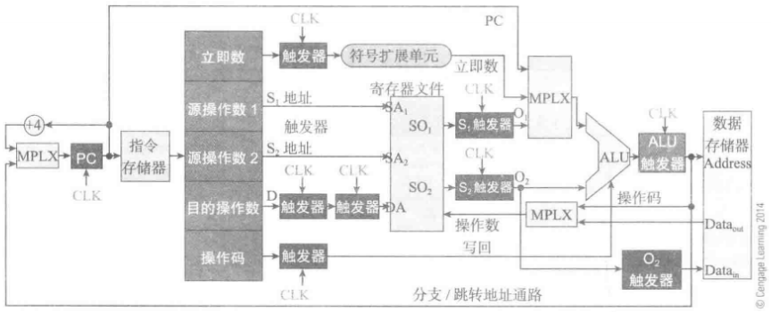

*通过增加数据存储器扩展流水线体系结构*

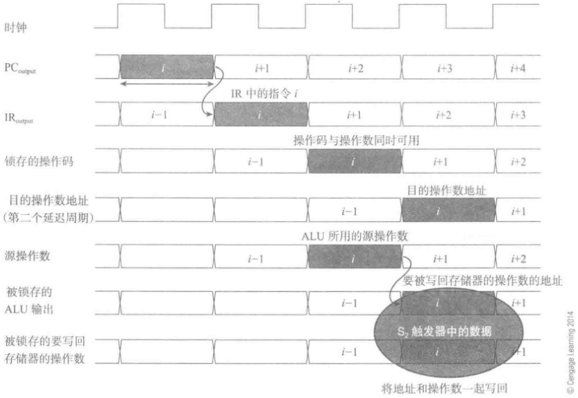

*存储器store操作的时序图*

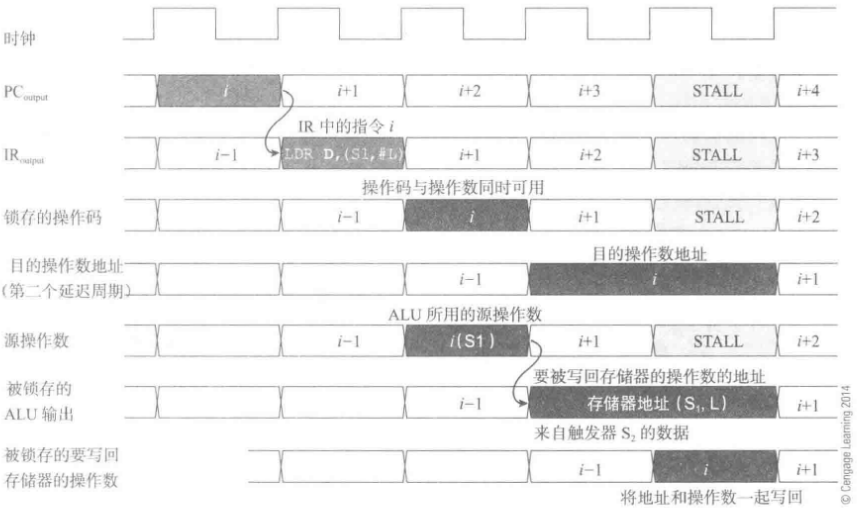

*修改load操作的时序*

### 6.3.3 冒险

- `数据冒险（data hazard）` 一条指令的处理依赖它之前且依然在流水线中的一条指令所产生的数据的情形。
- `控制冒险（control hazard）` 发生在分支转移成功并且流水线中所有已经被执行的指令都不得不被丢弃的时候。
- `结构冒险（structure hazard）` 发生在当两个事件同时请求相同的资源。

当流水线中的数据作废了或者流水线由于引入空闲状态而暂停时，我们就说产生了一个`气泡（bubble）`。另一个描述气泡的术语是`流水线暂停（pipeline stall）`。流水线越长，遇到分支时要作废的指令也就越多。

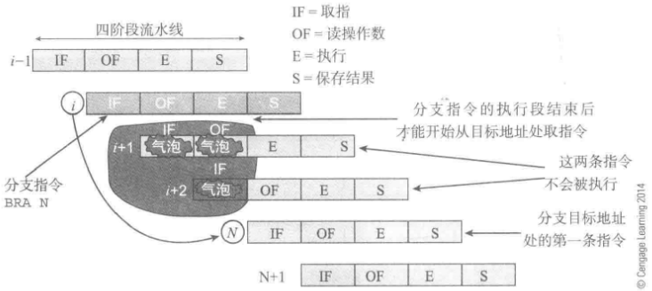

*分支指令引起的流水线气泡*

1. 延迟分支

   `延迟跳转（delayed jump）`或`分支执行（branch-and-execute）`技术。

   例：

   ```assembly
   ADD R3,R2,R1 ;[R3] <- [R2] + [R1]
   B   N        ;[PC] <- [N]        ;跳转到地址N处
   ADD R5,R4,R6 ;[R5] <- [R4] + [R6];在延迟槽中执行
   ADD R7,R8,R9 ;不会执行，因为分支转移成功
   ```

   处理器计算`R3 = R2 + R1`后遇到分支。由于指令`ADD R5, R4, R6`紧接在分支之后，因此也会执行该指令。

   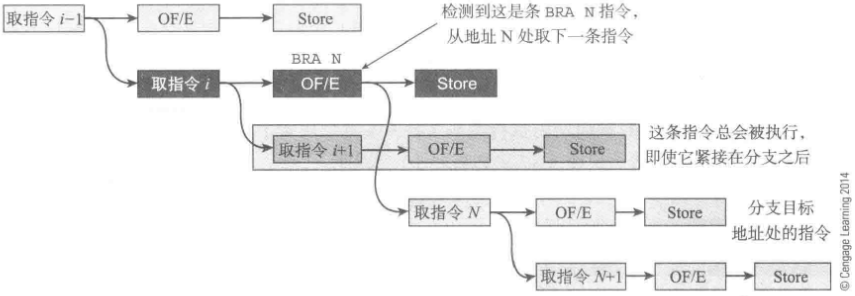

   *RISC 2的延迟跳转机制*

2. 数据冒险

   当前指令的输出依赖于前面一条还未执行完的指令的结果时会引起`数据相关（data dependency）`。数据冒险是由于要保持指令执行顺序的需要而产生的。

   例：

   ```assembly
   ADD R2,R1,R0 ;[R2] <- [R1] + [R0]
   SUB R4,R5,R2 ;[R4] <- [R5] + [R2] ;依赖于前面一条指令的运算结果
   ADD R9,R5,R6 ;[R9] <- [R5] . [R6]
   ```

   按照操作顺序，数据冒险可以被分为以下几类：

   - RAW 读后写（也叫真数据相关）

     例：

     ```assembly
     ADD T1,A,B  ;[T1] <- [A] + [B]  ;T1的值在4个周期后才可用
     SUB T2,T1,C ;[T2] <- [T1] - [C] ;这条指令使用的T1还没有被计算出来
     AND X,T1,T2 ;[X]  <- [T1] . [T2];这条指令使用的T2还没有被计算出来
     ```

     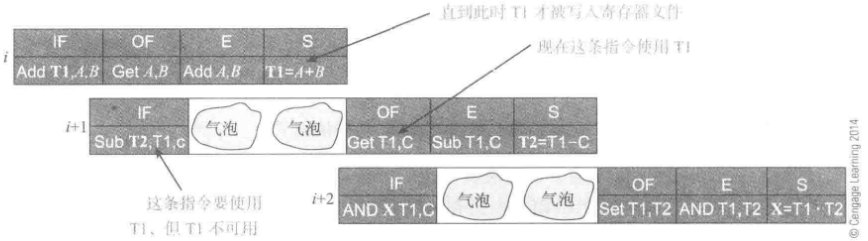

     *RAW数据相关的影响*

   - WAW 写后写（也叫输出相关）

     例：

     ```assembly
     ADD R1,R2,R3
     SUB R1,R4,R5
     ```

   - WAR 写后读（也叫反数据相关）

     例：

     ```assembly
     ADD R1,R2,R3
     SUB R2,R4,R5
     ```

     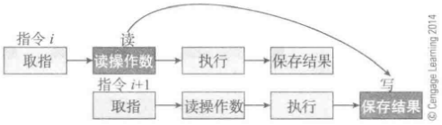

     *WAR冒险*

   例，通过直接将操作数传递给下一条指令来减少数据相关的影响：

   ```assembly
   ADD R3,R1,R2 ;[R3] <- [R1] + [R2]
   ADD R6,R4,R5 ;[R6] <- [R4] + [R5]
   ADD R9,R1,R2 ;[R9] <- [R1] + [R2]
   ADD R7,R3,R4 ;[R7] <- [R3] + [R4] ;吓一跳指令需要R7产生了RAW冒险
   ADD R8,R1,R7 ;[R8] <- [R1] + [R7]
   ```

   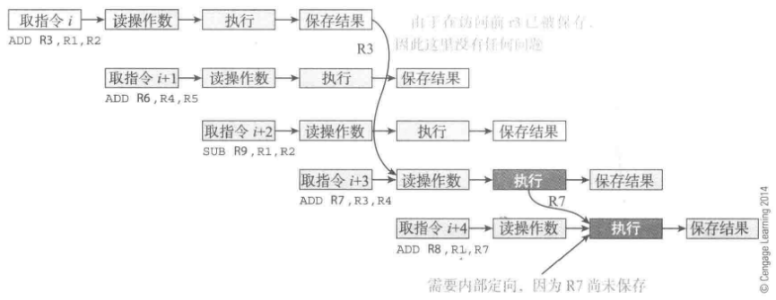

   *通过内部定向处理数据相关*

   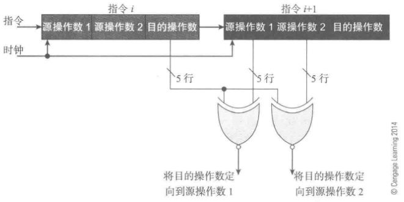

   *检测数据相关*

   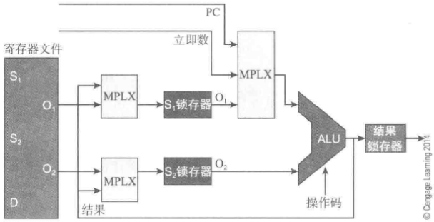

   *内部定向的实现*

   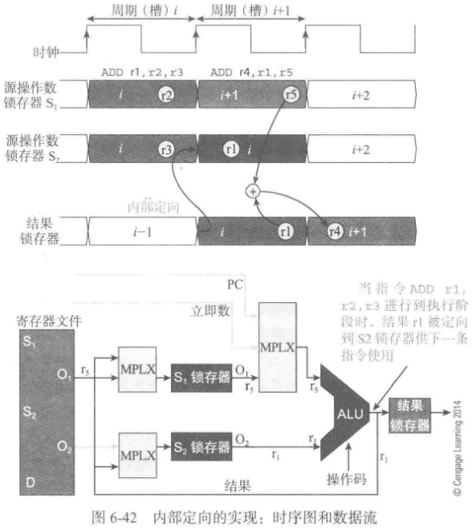

   *内部定向的实现：时序图和数据流*


## 6.4 分支和分支开销

`分支开销（branch penalty）` 执行一个引起非顺序控制流的操作所花费的时间（即额外的时钟周期数）。

无条件分支（例如BRA target）总会转移成功，并强制流水线从目标地址处继续执行。无条件分支等价于高级语言的goto语句，并且其结果在编译时就可以知道了。

条件分支的结果由处理器条件码寄存器中的一个或多个标志位（或一些等价的机制）决定，因此直到运行时才能知道。

### 6.4.1 分支方向

应该更加重视转移成功的分支的处理，而不是那些转移不成功的（会产生很大开销的分支除外）。

### 6.4.2 流水线中分支的影响

表6-9 RISC流水线上分支指令的影响：

| 时钟周期 | 取指    | 读操作数 | 执行    | 保存    |
| -------- | ------- | -------- | ------- | ------- |
| 0        | $i - 2$ | $i - 3$  | $i - 4$ | $i - 5$ |
| 1        | $i - 1$ | $i - 2$  | $i - 3$ | $i - 4$ |
| 2        | $i$     | $i - 1$  | $i - 2$ | $i - 3$ |
| 3        | $i + 1$ | $i$      | $i - 1$ | $i - 2$ |
| 4        | $i + 2$ | $i + 1$  | $i$     | $i - 1$ |
| 5        | $N$     |          |         | $i$     |
| 6        | $N + 1$ | $N$      |         |         |
| 7        | $N + 2$ | $N + 1$  | $N$     |         |
| 8        | $N + 3$ | $N + 2$  | $N + 1$ | $N$     |
| 9        | $N + 4$ | $N + 3$  | $N + 2$ | $N + 1$ |

表6-10 提前进行分支处理的影响：

| 时钟周期 | 取指          | 读操作数      | 执行          | 保存          |
| -------- | ------------- | ------------- | ------------- | ------------- |
| 2        | $i[分支指令]$ | $i - 1$       | $i - 2$       | $i - 3$       |
| 3        | $i + 1[气泡]$ | $i[分支处理]$ | $i - 1$       | $i - 2$       |
| 4        | $N$           | $i + 1[气泡]$ | $i$           | $i - 1$       |
| 5        | $N + 1$       | $N$           | $i + 1[气泡]$ | $i$           |
| 6        | $N + 2$       | $N + 1$       | $N$           | $i + 1[气泡]$ |
| 7        | $N + 3$       | $N + 2$       | $N + 1$       | $N$           |
| 8        | $N + 4$       | $N + 3$       | $N + 2$       | $N + 1$       |

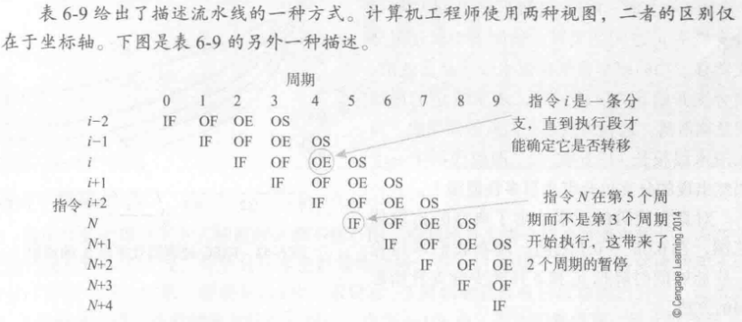

### 6.4.3 分支开销

为系统构建一个概率模型：

假设：

1. 每个非分支指令都在一个周期内执行完；
2. 给定指令是分支的概率为$P_b$；
3. 分支转移执行的概率为$P_t$；
4. 如果分支转移成功，额外开销为$b$个周期；
5. 如果分支转移不成功，则没有额外开销，并且仅需1个周期。

在程序执行期间完成一条指令所需的平均周期数为非分支指令的CPI加上转移成功的分支指令的CPI，再加上转移不成功的分支指令的CPI。即：

$T_{ave} = (1 - P_b) \times 1 + P_b \times P_1 \times (1 + b) + P_b(1 - P_t) \times 1 = 1 + P_b P_t b$

上面的公式说明：分支指令的数量，分支转移成功的概率以及每条分支指令的开销都会影响分支开销。若用$P_e$（有效分支概率）替代$P_b P_t$，则每条指令所花的平均周期数为$1 + p_e b$。RISC处理器的效率$E$，可被定义为：

$E = \frac{没有分支指令时的平均CPI}{有分支指令时的平均CPI} \times 100\%$

即

$E = \frac{1}{1 + P_e b} \times 100\%$

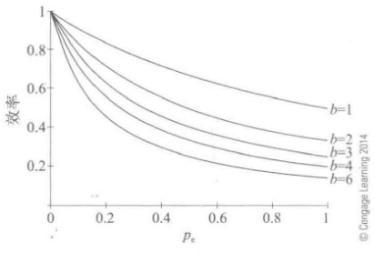

*RISC处理器效率是$P_e$的函数*

### 6.4.4 延迟分支

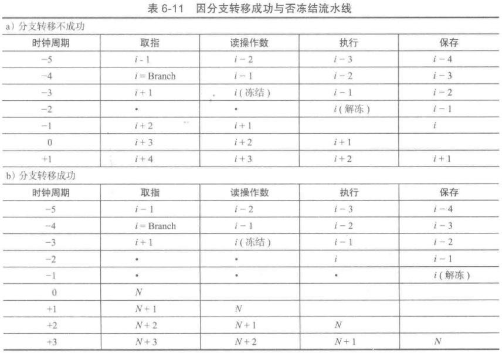

按照上表中指令执行顺序来计算分支开销。转移不成功的分支会引入一个时钟周期的额外开销，而转移成功的分支会引入3个时钟周期的额外开销。因此，每条指令的平均周期数：

$T_{ave} = 1 \times (1 - P_b) + 2 \times P_b(1 - P_t) + 4 \times P_b P_t = 1 + P_b + 2 P_b P_t$

如果$P_b$取值为0.2，$P_t$取值为0.8（20%的指令是分支指令，80%的分支会转移成功），我们会得到：

$T_{ave} = 1 + 0.2 + 2 \times 0.2 \times 0.8 = 1.52$

这个等式表示分支指令使性能下降了52%。

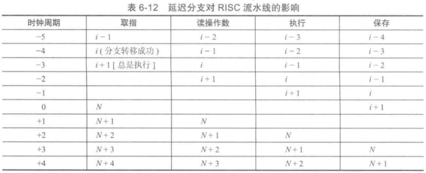

按照上表中指令执行顺序来计算分支开销。当分支转移不成功时，分支开销为0，因为指令$i + 1$总会被执行，所以仅有两个时钟周期的损失：

$T_{ave} = 1 \times (1 - P_b) + 1 \times P_b(1 - P_t) + 3 \times P_b P_t = 1 + 2 P_b P_t$

若$Pb$的取值为0.2，$P_t$为0.8，则有$T_{ave} = 1 + 2 \times 0.2 \times 0.8 = 1.32$，这表明与简单冻结流水线相比性能得到了一定的提升。

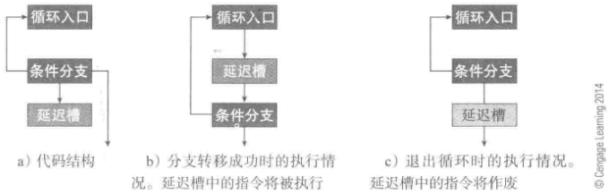

*HP-PA延迟槽作废指令的效果*


## 6.5 分支预测

`清空流水线` 当分支转移成功时，一些本不应该被执行的指令已经开始在流水线上执行，将这些指令作废，同时损失一些时钟周期。

预测一个有两种可能输出的系统的行为（分支转移成功或者不成功），会有4种可能：

1. 预测分支转移成功且分支转移成功--正确输出。
2. 预测分支转移成功且分支转移不成功--不正确输出。
3. 预测分支转移不成功且分支转移不成功--正确输出。
4. 预测分支转移不成功但分支转移成功--不正确输出。

表6-13 分支开销：

| 结果           | 预测           | 分支执行时间 | 分支开销 |
| -------------- | -------------- | ------------ | -------- |
| 分支转移成功   | 分支转移成功   | $a$          | $a -1$   |
| 分支转移成功   | 分支转移不成功 | $b$          | $b - 1$  |
| 分支转移不成功 | 分支转移成功   | $c$          | $c - 1$  |
| 分支转移不成功 | 分支转移不成功 | $d$          | $d - 1$  |

假设：

- 一条指令是分支指令的概率为$P_b$（$P_b$的值可以通过测量静态或动态指令数来得到）。
- 分支指令转移成功的概率为$P_t$。
- 分支预测正确的概率为$P_e$。

一条分支指令的执行时间（即所需的时钟周期数）为：

$C_{ave} = a(P_{预测转移且转移}) + b(P_{预测不转移但转移}) + c(P_{预测转移但没有转移}) + d(P_{预测不转移且没有转移})$

一条分支指令的执行时间为$(1 - P_b) + P_b C_{ave}$。

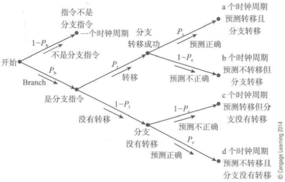

*分支预测树*

如果一个事件或它的对立事件一定会发生，则它们的概率之和为1，利用这一原理可得：

$(1 - P_b) = 一条指令不是分支指令的概率。$

$(1 - P_t) = 一个分支转移不成功的概率。$

$(1 - P_c) = 预测不正确的概率。$

每条分支指令的平均CPI的计算方法如下，沿着每一条可能的路径，将发生的概率与所需的执行时间相乘，然后将所有路径的时间相加；即：

$C_{ave} = a \times (p_i \times p_c) + bp_i \times (1 - p_c) + c \times (1 - p_t) \times (1 - p_c) + d \times (1 - p_t) \times p_c$

简化上述公式；假设：

$a = d = N$

$b = c = B$

因此，平均CPI为$1 - P_b + P_b \times C_{ave}$；即

$(1 - P_b) + P_b \times [N \times P_i \times P_c + B \times P_i \times (1 - P_c) + B \times (1 - P_t) \times (1 - P_c) + N \times (1 - P_t) \times P_c] = (1 - P_b) + P_b \times P_b \times [N \times P_c + B \times (1 - P_c)]$。

若进一步假设预测正确时不会产生任何开销（即$N = 1$），则有：

$(1 - P_b) + P_b \times [1 \times P_c + B \times (1 - P_c)]$。

分支预测的方法：

- `静态分支预测` 
- `动态分支预测`


## 6.6 动态分支预测

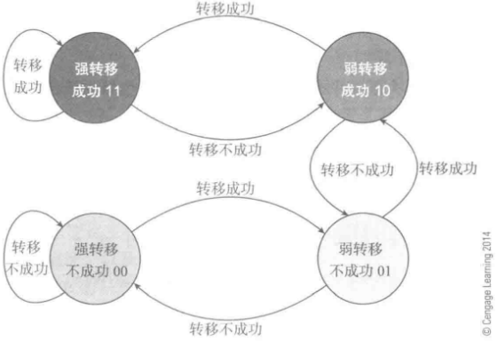

*饱和计数器分支预测器的状态图*

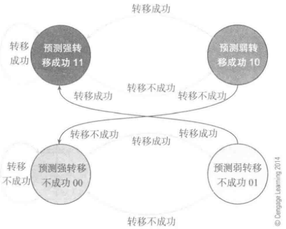

*另一种两位分支预测状态机*

### 6.6.1 分支目标缓冲

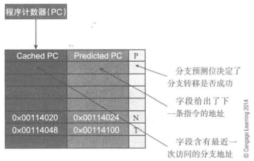

*简单的分支目标缓冲*

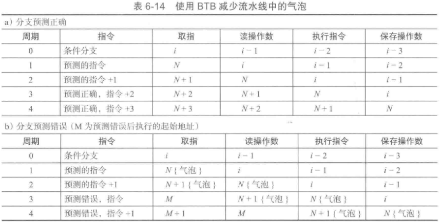

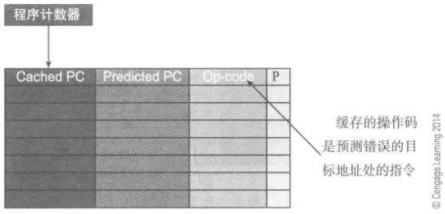

*缓存了预测错误地址处操作码的改进后的分支目标缓冲*

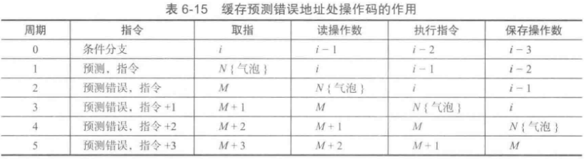

$T_{ave} = 1 + P_bP_t((1 - P_m)b_1 + b_2P_m)$

- $b_1$ 是在非顺序指令在BTB中时的分支开销；
- $b_2$ 是非顺序指令不在BTB中时的分支开销；
- $P_m$ 是访问BTB时没有命中的概率。

### 6.6.2 两级分支预测

下图描述了全局行为的含义。每个方框中包含一条程序中的分支。请注意一些分支出现了几次，这是因为通过程序中不同路径可以抵达这些分支。每个分支下面的判断框表示分支转移成功或不成功。

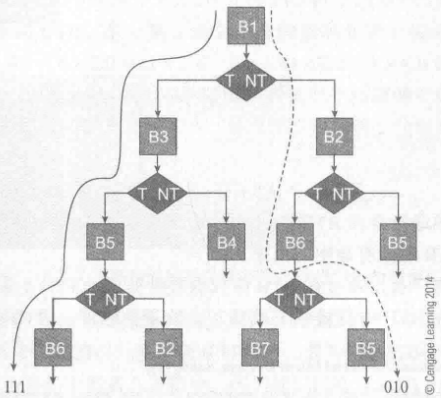

`分支模式历史（BPH）` 当遇到分支时，分支结果将被记录在一个移位寄存器中。

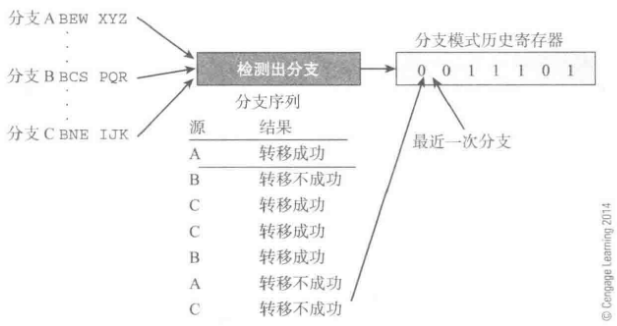

*记录分支序列--分支模式历史*

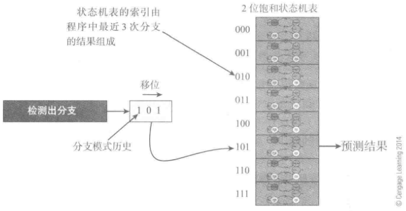

*使用模式历史来索引状态机*

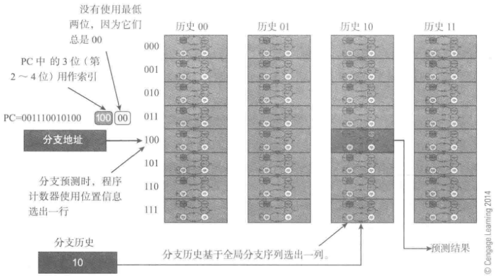

*两级分支预测*

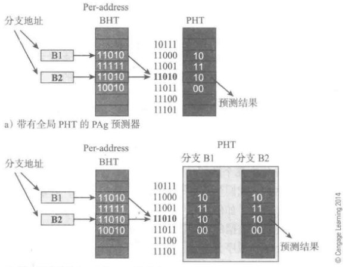

*PAg和PAp分支结果预测器*

