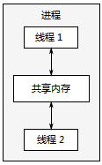

# Chapter1 - Hello, world of concurrency in C++

[TOC]


## 1.1 What is concurrency?

### 1.1.1 Concurrency in computer systems

`task switching` By doing a bit of one task and then a bit of another and so on, it appears that the tasks are happening concurrently. 


*Fingure 1.1 Two approaches to concurrency: parallel execution on a dual-core machine versus task switching on a single-core machine*


*Figure 1.2 Task switching of four tasks on two cores*


*Figure 1.3 Communication between a pair of processes running concurrently*



*Figure 1.4 Communication between a pair of threads running concurrently in a single process*


## 1.2 Why use concurrency?

### 1.2.1 Using concurrency for separation of concerns

Separation of concerns is almost always a good idea when writing software; by group-ing related bits of code together and keeping unrelated bits of code apart, you can make your programs easier to understand and test, and thus less likely to contain bugs.

### 1.2.2 Using concurrency for performance

There are two ways to use concurrency for performance:

1. `task parallelism` divide a single task into parts and run each in parallel, thus reducing the total runtime.
2. `data parallelism` The divisions may be either in terms of processing -- one thread performs one part of the algorithm while another thread performs a different part -- or in terms of data -- each thread performs the same operation on different parts of the data.

### 1.2.3 When not to use concurrency

Code using concurrency is harder to understand in many cases, so there's a direct intellectual cost to writing and maintaining multithreaded code, and the additional complexity can also lead to more bugs.

There's an inherent overhead associated with launching a thread, because the OS has allocate the associated kernel resources and stack space and then add the new thread to the scheduler, all of which takes time.

Furthermore, threads are a limited resource. If you have too many threads run-ning at once, this consumes OS resources and may make the system as a whole run slower.

Finally, the more threads you have running, the more context switching the operating system has to do.


## 1.3 Concurrency and multithreading in C++

### 1.3.1 History of multithreading in C++

### 1.3.2 Concurrency support in the new standard

### 1.3.3 Efficiency in the C++ Thread Library

### 1.3.4 Platform-specific facilities


## 1.4 Getting started

### 1.4.1 Hello, Concurrent World

```c++
#include <iostream>
#include <thread>  //①
void hello()  //②
{
  std::cout << "Hello Concurrent World\n";
}
int main()
{
  std::thread t(hello);  //③
  t.join();  //④
}
```

*Listing 1.1 A simple Hello, Concurrent World program*


## 1.5 Summary


