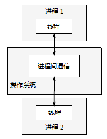

# 第一章 你好，c++并发世界

[TOC]


## 1.1 什么是并发

最简单和最基本的并发,是指两个或更多独立的活动同时发生。

### 1.1.1 计算机系统中的并发


*图 1.1 并发的两种方式：双核机器的真正并行 Vs. 单核机器的任务切换*


*图 1.2 四个任务在两个核心之间的切换*

### 1.1.2 并发的途径

*多进程并发* 将应用程序分为多个独立的进程，它们在同一时刻运行。



*图 1.3 一对并发运行的进程之间的通信*

*多线程并发* 在单个进程中运行多个线程。


*图 1.4 同一进程中的一对并发运行的线程之间的通信*

地址空间共享，以及缺少线程间数据的保护，使得操作系统的记录工作量减小，所以使用多线程相关的开销远远小于使用多个进程。


## 1.2 为什么使用并发？

### 1.2.1 为了分离关注点

通过将相关的代码与无关的代码分离，可以使程序更容易理解和测试，从而减少出错的可能性。

### 1.2.2 为了性能

将一个单个任务分成几部分，且各自并行运行，从而降低总运行时间。这就是`任务并行（*task parallelism*）`。

一个线程执行算法的一部分，而另一个线程执行算法的另一个部分——或是在数据方面——每个线程在不同的数据部分上执行相同的操作（第二种方式）。这就是`数据并行（*data parallelism*）`。

### 1.2.3 什么时候不使用并发

使用并发的代码在很多情况下难以理解，因此编写和维护的多线程代码就会产生直接的脑力成本，同时额外的复杂性也可能引起更多的错误。

因为操作系统需要分配内核相关资源和堆栈空间，所以在启动线程时存在固有的开销，然后才能把新线程加入调度器中，所有这一切都需要时间。

线程是有限的资源。如果让太多的线程同时运行，则会消耗很多操作系统资源，从而使得操作系统整体上运行得更加缓慢。

运行越多的线程，操作系统就需要做越多的上下文切换，每个上下文切换都需要耗费本可以花在有价值工作上的时间。


## 1.3 C++中的并发和多线程

### 1.3.1 C++多线程历史

### 1.3.2 新标准支持并发

### 1.3.3 C++线程库的效率

### 1.3.4 平台相关的工具


## 1.4 开始入门

### 1.4.1 你好，并发世界

清单 1.1 一个简单的**Hello, Concurrent World**程序：

```c++
#include <iostream>
#include <thread>  //①
void hello()  //②
{
  std::cout << "Hello Concurrent World\n";
}
int main()
{
  std::thread t(hello);  //③
  t.join();  //④
}
```


## 1.5 小结


