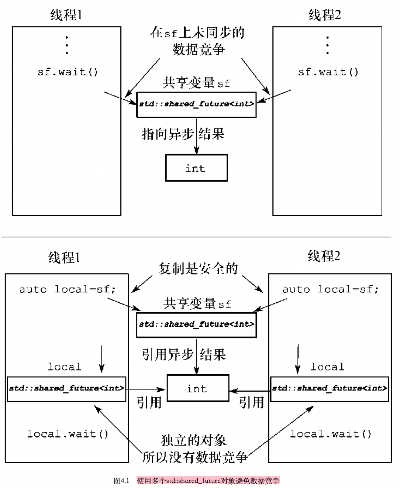
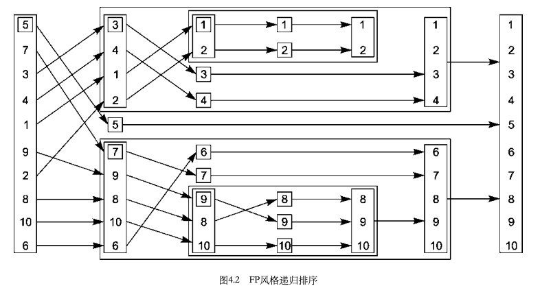

# 第四章 同步并发操作

[TOC]


## 等待事件或其他条件

如果一个线程正等待着第二个线程完成一项任务，那么它有以下选择：

1. 一直检查共享数据（由互斥元保护）中的标识，并且让第二个线程在完成任务时设置该标识
2. 使用`std::this_thread::sleep_for()`，让等待中的线程在检查之间休眠一会
3. 使用c++标准库提供的工具来等待事件本身。

### 用条件变量等待条件

头文件`<condition_variable>`

- `std::condition_variable`

  仅限于和`std::mutex`一起工作

- `std::condition_variable_any`

  可以与复合成为类似互斥元的最低标准的任何东西一起工作，此函数更加普遍，但是有性能代价；除非必要，应该首选`std::condition_variable`

使用`std::condition_variable`等待数据：

```c++
std::mutex mut;
std::queue<data_chunk> data_queue; // 用来给线程间传递数据
std::condition_variable data_cond;
void data_preparation_thread()
{
  while(more_data_to_prepare())
  {
    data_chunk const data=prepare_data();
    std::lock_guard<std::mutex> lk(mut);
    data_queue.push(data);
    data_cond.notify_one();	// 通知等待中的线程
  }
}
void data_processing_thread()
{
  while(true)
  {
    std::unique_lock<std::mutex> lk(mut);
    data_cond.wait(lk, []{return !data_queue.empty();});
    data_chunk data=data_queue.front();
    data_queue.pop();
    lk.unlock();
    process(data);
    if (is_last_chunk(data))
      break;
  }
}
```

当等待线程重新获取互斥元并检查条件时，如果它并非直接响应另一个线程的通知，这就是所谓的伪唤醒(spurious wake)。

### 使用条件变量建立一个线程安全队列

使用条件变量的线程安全队列的完整类定义

```c++
#include <queue>
#include <memory>
#include <mutex>
#include <condition_variable>
template<typename T>
class threadsafe_queue
{
private:
  mutable std::mutex mut;
  std::queue<T> data_queue;
  std::condition_variable data_cond;
public:
  threadsafe_queue()
  {}
  threadsafe_queue(threadsafe_queue const& other)
  {
    std::lock_guard<std::mutex> lk(other.mut);
    data_queue=other.data_queue;
  }
  void push(T new_value)
  {
    std::lock_guard<std::mutex> lk(mut);
    data_queue.push(new_value);
    data_cond.notify_one();
  }
  void wait_and_pop(T& value)
  {
    std::unique_lock<std::mutex> lk(mut);
    data_cond.wait(lk, [this]{return !data_queue.empty();});
    value=data_queue.front();
    data_queue.pop();
  }
  std::shared_ptr<T> wait_and_pop()
  {
    std::unique_lock<std::mutex> lk(mut);
    data_cond.wait(lk, [this]{return !data_queue.empty();});
    std::shared_prt<T> res(std::make_shared<T>(data_queue.front()));
    data_queue.pop();
    return res;
  }
  bool try_pop(T& value)
  {
    std::lock_guard<std::mutex> lk(mut);
    if (data_queue.empty())
      return false;
    value=data_queue.front();
    data_queue.pop();
    return true;
  }
  std::shared_ptr<T> try_pop()
  {
    std::lock_guard<std::mutex> lk(mut);
    if (data_queue.empty())
      returnj std::shared_ptr<T>();
    std::shared_PTR<T> res(std::make_shared<T>(data_queue.front()));
    data_queue.pop();
    return res;
  }
  bool empty() const
  {
    std::lock_guard<std::mutex> lk(mut);
    return data_queue.empty();
  }
};
```

由于锁定互斥元是一种可变的操作，故互斥元对象必须标记为mutable。


## 使用future等待一次性事件

c++标准库中有两类future，是由`<future>`库的头文件中声明的两个类模板实现的：

- 唯一future(unique futures, `std::future<>`)
- 共享future(shared futures, `std::shared_future<>`)

### 从后台任务中返回值

使用`std::future`获取异步任务的返回值：

```c++
#include <future>
#include <iostream>
int find_the_answer_to_ltuae();
void do_other_stuff();
int main()
{
  std::future<int> the_answer=std::async(find_the_answer_to_ltuae);
  do_other_stuff();
  std::cout<<"The answer is "<<the_answer.get()<<std::endl;
}
```

使用`std::async`来将参数传递给函数：

```c++
#include <string>
#include <future>
struct X
{
  void foo(int,std::string const&);
  std::string bar(std::string const&);
};
X x;
auto f1=std::async(&X::foo, &x, 42, "hello"); // 调用p->foo(42,"hello"),其中p是&x
auto f2=std::async(&X::bar, x, "goodbye"); // 调用tmpx.bar("goodbye"),其中tmpx是x的副本
struct Y
{
  double operator(){double};
};
Y y;
auto f3=std::async(Y{},3.14); // 调用tmpy(3.141),其中tmpy是从Y()移动构造的
auto f4=std::async(std::ref(y),2.718); // 调用y(2.718)
X baz(X&);
std::async(baz, std::ref(x)); // 调用baz(x)
class move_only
{
public:
  move_only();
  move_only(move_only&&);
  move_only(move_only const&) = delete;
  move_only& operator=(move_only&&);
  move_only& operator=(move_only const&) = delete;
  
  void operator()();
};
auto f5=std::async(move_only()); // 调用tmp(),其中tmp是从std::move(move_only())构造的
```

### 将任务与future相关联

`std::packaged_task<>`将一个future绑定到一个函数或可调用对象上。当`std::packaged_task<>`对象被调用时，他就调用相关联的函数或可调用对象，并且让future就绪，将返回值作为关联数据存储。

`std::packaged_task<>`特化的部分类定义：

```c++
template<>
class packaged_task<std::string(std::vector<char>*, int)>
{
public:
  template<typename Callable>
  explicit packaged_task(Callable&& f);
  std::future<std::string> get_future();
  void operator()(std::vector<char>*, int);
}
```

使用std::packaged_task在GUI线程上运行代码：

```c++
#include <deque>
#include <mutex>
#include <future>
#include <thread>
#include <utility>
std::mutex m;
std::deque<std::packaged_task<void()> > tasks;
bool gui_shutdown_message_received();
void get_and_process_gui_message();
void gui_thread()
{
  while(!gui_shutdown_message_received())
  {
    get_and_process_gui_message();
    std::packaged_task<void()> task;
    {
      std::lock_guard<std::mutex> lk(m);
      if (tasks.empty())
        continue;
      task=std::move(tasks.front());
      tasks.pop_front();
    }
    task();
  }
}
std::thread gui_bg_thread(gui_thread);
template<typename Func>
std::future<void> post_task_for_gui_thread(Func f)
{
  std::packaged_task<void()> task(f); // 新建任务
  std::future<void> res=task.get_future(); // 从任务中获取future
  std::lock_guard<std::mutex> lk(m);
  tasks.push_back(std::move(task));
  return res;
}
```

### 生成std::promise

`std::promise<T>`提供一种设置值（类型T）方式，它可以在这之后通过相关联的`std::future<T>`对象进行读取。等待中的线程可以阻塞future，同时提供数据的线程可以使用配对中的promise项，来设置相关的值并使future就绪。

使用promise在单个线程中处理多个连接：

```c++
#include <future>
void process_connections(connection_set& connections)
{
  while(!done(connections))
  {
    for(connection_iterator connection=connections.begin(), end=connections.end();
        connection != end;
        ++connection)
    {
      if(connection->has_incoming_data())
      {
        data_packet data=connection->incoming();
        std::promise<payload_type>& p=connection->get_promise(data.id);
        p.set_value(data.payload);
      }
      if(connection->has_outgoing_data())
      {
        outgoing_packet data=connection->top_of_outgoing_queue();
        connection->send(data.payload);
        data.promise.set_value(true); // 传输成功
      }
    }
  }
}
```

### 为future保存异常

如果作为`std::async`一部分的函数调用引发了异常，该异常会被存储在`future`中，代替所存储的值，`future`变成就绪，并且对`get()`的调用会重新引发所存储的异常。

将异常存储置`future`的方式：

- 将函数封装入`std::packaged_task`的时候，当任务被调用时，如果封装的函数引发异常，该异常代替结果存入future，准备在调用get()时引发。
- 销毁与future关联的std::promise或std::packaged_task,而无需在promise上调用设置函数或是调用打包任务。在任何一种情况下，如果future尚未就绪，`std::promise`或`std::packaged_task`的析构函数会将具有`std::future_errc::broken_promise`错误代码的`std::future_error`异常存储在相关联的状态中。

### 等待自多个线程

`std::future`是**仅可移动的**，所以所有权可以在实例间转移，但是一次只有一个实例指向特定的异步结果。

`std::shared_future`实例是**可复制的**，因此可以有多个对象引用同一个相关状态。




## 有时间限制的等待

有2类可供指定的超时：

1. 基于时间段的超时，即等待一个指定的时间长度
2. 绝对超时，即等到一个指定的时间点

### 时间

时钟提供4个不同部分信息的类：

- 现在（now）时间
- 用来表示从时钟获取到的时间值的类型
- 时钟的节拍周期
- 时钟是否以均匀的速率进行计时，决定其是否为匀速（steady）时钟

**匀速（steady）时钟：**以均匀速率计时且不能被调整的时钟

### 时间段

标准库在`std::chrono`命名空间中为各种时间段提供了一组预定义的typedef：

- nanoseconds
- microseconds
- milliseconds
- seconds
- minutes
- hours

在无需截断值的场合，时间段之间的转换是隐式的（因此将小时转换成秒是可以的，但将秒转换成小时则不然）。显式转换可以通过`std::chrono::duration_cast<>`实现，例：

```c++
std::chrono::milliseconds ms(54802);
std::chrono::seconds s=std::chrono::duration_cast<std::chrono::seconds>(ms);
```

时间段中单位数量的计数可以通过`count()`成员函数获取，因此`std::chrono::milliseconds(1234).cunt()`为1234。

基于时间段的等待是通过`std::chrono::duration<>`实例完成的，例：

```c++
std::future<int> f=std::async(some_task);
if(f.wait_for(std::chrono::milliseconds(35))==std::future_status::ready)
  do_something_with(f.get());
```

当等待一个future时：

- 如果等待超时，返回`std::future_status::timeout`
- 若future就绪，返回`std::future_status::ready`
- 如果future任务推迟，返回`std::future_status::deferred`

### 时间点

等待一个具有超时的条件变量：

```c++
#include <condition_variable>
#include <mutex>
#include <chrono>
std::condtion_variable cv;
bool done;
std::mutex m;
bool wait_loop()
{
  auto const timeout=std::chrono::steady_clock::now()+std::chrono::milliseconds(500);
  std::unique_lock<std::mutex> lk(m);
  while(!done)
  {
    if(cv.wait_until(lk, timeout)==std::cv_status::timeout)
      break;
  }
  return done;
}
```

### 接受超时的函数

| 类/命名空间                                                  | 函数                                                         | 返回值                                                       |
| ------------------------------------------------------------ | ------------------------------------------------------------ | ------------------------------------------------------------ |
| `std::this_thread`命名空间                                   | - `sleep_for(duration)`<br>- `sleep_until(time_point)`       | 不可用                                                       |
| `std::condition_variable`或<br> `std::condition_variable_any` | - `wait_for(lock, duration)`<br>- `wait_until(lock, time_point)` | - `std::cv_status::timeout`或<br>- `std::cv_status::no_timeout` |
|                                                              | - `wait_for(lock, duration, predicate)`<br>- `wait_until(lock, time_point, predicate)` | bool-当唤醒时predicate的返回值                               |
| `std::timed_mutex`或<br>`std::recursive_timed_mutex`         | - `try_lock_for(duration)`<br>- `try_lock_until(time_point)` | bool-true如果获得了锁，否则false                             |
| `std::unique_lock<TimedLockable>`                            | - `unique_lock(lockable, duration)`<br>- `unique_lock(lockable, time_point)` | 不可用-owns_lock()在新构造的对象上；如果获得了锁返回true，否则false |
|                                                              | - `try_lock_for(duration)`<br>- `try_lock_until(time_point)` | bool-true如果获得了锁，否则false                             |
| `std::future<ValueType>`或<br>`std::shared_future<ValueType>` | - `wait_for(duration)`<br>- `wait_until(time_point)`         | `std::future_status::timeout`如果等待超时，<br>`std::future_status::ready`如果future就绪或<br>`std::future_status::deferred`如果future持有的延迟函数还没有开始 |


## 使用操作同步来简化代码

### 带有future的函数式编程

**函数式编程（functional programming, FP）**指的是一种编程风格，函数调用的结果仅单纯依赖于该函数的参数而不依赖于任何外部状态。



快速排序的顺序实现：

```c++
template<typename T>
std::list<T> sequential_quick_sort(std::list<T> input)
{
  if(input.empty())
  {
    return input;
  }
  std::list<T> result;
  result.splice(result.begin(), input, input.begin());
  T const& pivot=*result.begin();
  auto divide_point=std::partition(input.begin(), input.end(), [&](T const& t){return t<pivot;});
  std::list<T> lower_part;
  lower_part.splice(lower_part.end(), input, input.begin(), divide_point);
  auto new_lower(sequential_quick_sort(std::move(lower_part)));
  auto new_higher(sequential_quick_sort(std::move(input)));
  result.splice(result.begin(), new_lower);
  return result;
}
```

使用future的并行快速排序：

```c++
template<typename T>
std::list<T> parallel_quick_sort(std::list<T> input)
{
  if(input.empty())
  {
    return input;
  }
  std::list<T> result;
  result.splice(result.begin(), input, input.begin());
  T const& pivot=*result.begin();
  auto divide_point=std::partition(input.begin(), input.end(), [&](T const& t){return t<pivot;});
  std::list<T> lower_part;
  lower_part.splice(lower_part.end(), input, input.begin(), divide_point);
  std::future<std::list<T> > new_lower(std::async(&parallel_quick_sort<T>, std::move(lower_part)));
  auto new_higher(parallel_quick_sort(std::move(input)));
  result.splice(result.end(), new_higher);
  result.splice(result.begin(), new_lower.get());
  return result;
}
```

一个简单的spawn_task的实现：

```c++
template<typename F, typename A>
std::future<std::result_of<F(A&&)>::type>
  spawn_task(F&& f, A&& a)
{
  typedef std::result_of<F(A&&)>::type result_type;
  std::packaged_task<result_type(A&&)>
    task(std::move(f));
  std::future<result_type> res(task.get_future());
  std::thread t(std::move(task), std::move(a));
  t.detach();
  return res;
}
```

### 具有消息传递的同步操作

**CSP(Communicating Sequential Process, 通信顺序处理)：**如果没有共享数据，则每一个线程可以完全独立地推理得到，只需基于它对所接收到的消息如何进行反应。因此每个线程实际上可以等效为一个状态机：当它接收到消息时，它会根据初始状态进行操作，并以某种方式更新其状态，并可能像其他线程发送一个或多个消息。

**角色模型(actor model)：**系统中有多个离散的角色（均运行在独立线程上），用来相互发送消息以完成手头任务，除了直接通过消息传递的状态外，没有任何共享状态。

ATM逻辑类的简单实现：

```c++
struct card_inserted
{
  std::string account;
};
class atm
{
  messaging::receiver incoming;
  messaging::sender bank;
  messaging::sender interface_hardware;
  void (atm::*state)();
  std::string account;
  std::string pin;
  void waiting_for_card()
  {
    interface_hardware.send(display_enter_card());
    incoming.wait()
      .handle<card_inserted>(
    		[&](card_inserted const& msg)
      	{
        	account=msg.account;
          pin="";
          interface_hardware.send(display_enter_pin());
          state=&atm::getting_pin;
        });
  }
  void getting_pin();
public:
  state=&atm::waiting_for_card;
  try
  {
    for(;;)
    {
      (this->*state)();
    }
  }
  catch(messaging::close_queue const&)
  {
  }
}

// 简单ATM实现的getting_pin状态函数
void atm::getting_pin()
{
  incoming.wait()
    .handle<digit_pressed>(
    	[&](digit_pressed const& msg)
    	{
        unsigned const pin_length=4;
        pin+=msg.digit;
        if(pin.length()==pin_length)
        {
          bank.send(verify_pin(account, pin, incoming));
          state=&atm::verifying_pin;
        }
      })
    .handle<clear_last_pressed>(
  		[&](clear_last_pressed const& msg)
    	{
        if(!pin.empty())
        {
          pin.resize(pin.length()-1);
        }
      })
    .handle<cancel_pressed>(
  		[&](cancel_pressed const& msg)
    	{
        state=&atm::done_processing;
      });
}
```

