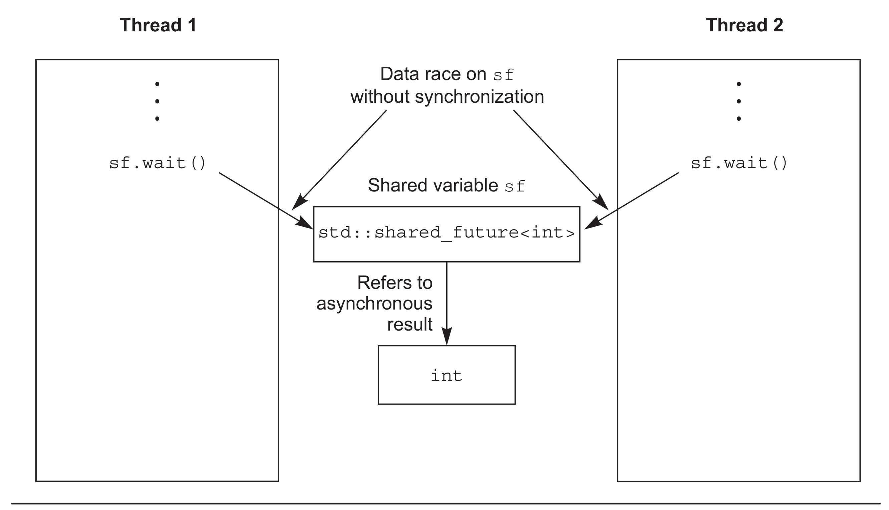
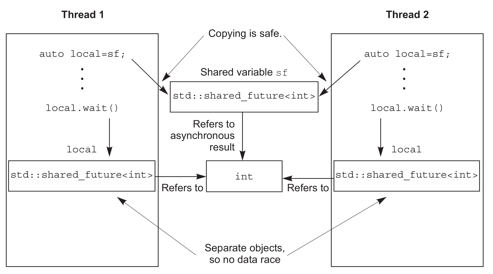

# Chapter4 Synchronizing concurrent operations

 
<!-- vim-markdown-toc GFM -->

* [4.2 Waiting for an event or other condition](#42-waiting-for-an-event-or-other-condition)
    - [4.1.1 Waiting for condition with condition variables](#411-waiting-for-condition-with-condition-variables)
    - [4.1.2 Building a thread-safe queue with condition variables](#412-building-a-thread-safe-queue-with-condition-variables)
* [4.2 Waiting for one-off events with futures](#42-waiting-for-one-off-events-with-futures)
    - [4.2.1 Returning values from background tasks](#421-returning-values-from-background-tasks)
    - [4.2.2 Associating a task with future](#422-associating-a-task-with-future)
    - [4.2.3 Making (std::) promises](#423-making-std-promises)
    - [4.2.4 Saving an exception for the future](#424-saving-an-exception-for-the-future)
    - [4.2.5 Waiting from multiple threads](#425-waiting-from-multiple-threads)
* [4.3 Waiting with a time limit](#43-waiting-with-a-time-limit)
    - [4.3.1 Clocks](#431-clocks)
    - [4.3.2 Durations](#432-durations)
    - [4.3.3 Time points](#433-time-points)
    - [4.3.4 Functions that accept timeouts](#434-functions-that-accept-timeouts)
* [4.4 Using synchronization of operations to simplify code](#44-using-synchronization-of-operations-to-simplify-code)
    - [4.4.1 Functional programming with futures](#441-functional-programming-with-futures)
    - [4.4.2 Synchronizing operations with message passing](#442-synchronizing-operations-with-message-passing)
* [4.5 Summary](#45-summary)

<!-- vim-markdown-toc -->


## 4.2 Waiting for an event or other condition

if one thread is waiting for a second thread to complete a task, it has several options. First, it could just keep checking a flag in shared data (protected by a mutex) and have the second thread set the flag when it completes the task. This is wateful on two counts: the thread consumes valuable processing time repeatedly checking the flag, and when the mutex is locked by the waiting thread, it can't be locked by any other thread. Both of these work against the thread doing the waiting, because they limit the resources available to the tread being waited for and even prevent it from setting the flag when it's done.

### 4.1.1 Waiting for condition with condition variables

The Standard C++ Library provides not one but two implementations of a condition variable:

- `std::condition_variable` limited to working with `std::mutex`.
- `std::condition_variable_any` can work with anything that meets some minimal criteria for beging mutex-like,hence the `_any` suffix.

`std::condition_variable_any` is more general, there's the potential for additional costs in terms of size, performance, or operating system resources, so `std::condition_variable` should be preferred unless the addition flexibility is required.

```c++
std::mutex mut;
std::queue<data_chunk> data_queue;  // 1
std::condition_variable data_cond;

void data_preparation_thread()
{
  while(more_data_to_prepare())
  {
    data_chunk const data=prepare_data();
    std::lock_guard<std::mutex> lk(mut);
    data_queue.push(data);  // 2
    data_cond.notify_one();  // 3
  }
}

void data_processing_thread()
{
  while(true)
  {
    std::unique_lock<std::mutex> lk(mut);  // 4
    data_cond.wait(
         lk,[]{return !data_queue.empty();});  // 5
    data_chunk data=data_queue.front();
    data_queue.pop();
    lk.unlock();  // 6
    process(data);
    if(is_last_chunk(data))
      break;
  }
}
```

*Listing4.1 Waiting for data to process with a std::conditon_variable*

### 4.1.2 Building a thread-safe queue with condition variables

```c++
template <class T, class Container = std::deque<T> >
class queue {
public:
  explicit queue(const Container&);
  explicit queue(Container&& = Container());
  template <class Alloc> explicit queue(const Alloc&);
  template <class Alloc> queue(const Container&, const Alloc&);
  template <class Alloc> queue(Container&&, const Alloc&);
  template <class Alloc> queue(queue&&, const Alloc&);

  void swap(queue& q);

  bool empty() const;
  size_type size() const;

  T& front();
  const T& front() const;
  T& back();
  const T& back() const;

  void push(const T& x);
  void push(T&& x);
  void pop();
  template <class... Args> void emplace(Args&&... args);
};
```

*Listing 4.2 std::queue interface*

```c++
#include <memory> // 为了使用std::shared_ptr

template<typename T>
class threadsafe_queue
{
public:
  threadsafe_queue();
  threadsafe_queue(const threadsafe_queue&);
  threadsafe_queue& operator=(
      const threadsafe_queue&) = delete;  // 不允许简单的赋值

  void push(T new_value);

  bool try_pop(T& value);  // 1
  std::shared_ptr<T> try_pop();  // 2

  void wait_and_pop(T& value);
  std::shared_ptr<T> wait_and_pop();

  bool empty() const;
};
```

*Listing 4.3 The interface of your threadsafe_queue*

```c++
#include <queue>
#include <mutex>
#include <condition_variable>

template<typename T>
class threadsafe_queue
{
private:
  std::mutex mut;
  std::queue<T> data_queue;
  std::condition_variable data_cond;
public:
  void push(T new_value)
  {
    std::lock_guard<std::mutex> lk(mut);
    data_queue.push(new_value);
    data_cond.notify_one();
  }

  void wait_and_pop(T& value)
  {
    std::unique_lock<std::mutex> lk(mut);
    data_cond.wait(lk,[this]{return !data_queue.empty();});
    value=data_queue.front();
    data_queue.pop();
  }
};
threadsafe_queue<data_chunk> data_queue;  // 1

void data_preparation_thread()
{
  while(more_data_to_prepare())
  {
    data_chunk const data=prepare_data();
    data_queue.push(data);  // 2
  }
}

void data_processing_thread()
{
  while(true)
  {
    data_chunk data;
    data_queue.wait_and_pop(data);  // 3
    process(data);
    if(is_last_chunk(data))
      break;
  }
}
```

*Listing 4.4 Extracting push() and wait_and_pop() from listing 4.1*

```c++
#include <queue>
#include <memory>
#include <mutex>
#include <condition_variable>

template<typename T>
class threadsafe_queue
{
private:
  mutable std::mutex mut;  // 1 互斥量必须是可变的 
  std::queue<T> data_queue;
  std::condition_variable data_cond;
public:
  threadsafe_queue()
  {}
  threadsafe_queue(threadsafe_queue const& other)
  {
    std::lock_guard<std::mutex> lk(other.mut);
    data_queue=other.data_queue;
  }

  void push(T new_value)
  {
    std::lock_guard<std::mutex> lk(mut);
    data_queue.push(new_value);
    data_cond.notify_one();
  }

  void wait_and_pop(T& value)
  {
    std::unique_lock<std::mutex> lk(mut);
    data_cond.wait(lk,[this]{return !data_queue.empty();});
    value=data_queue.front();
    data_queue.pop();
  }

  std::shared_ptr<T> wait_and_pop()
  {
    std::unique_lock<std::mutex> lk(mut);
    data_cond.wait(lk,[this]{return !data_queue.empty();});
    std::shared_ptr<T> res(std::make_shared<T>(data_queue.front()));
    data_queue.pop();
    return res;
  }

  bool try_pop(T& value)
  {
    std::lock_guard<std::mutex> lk(mut);
    if(data_queue.empty())
      return false;
    value=data_queue.front();
    data_queue.pop();
    return true;
  }

  std::shared_ptr<T> try_pop()
  {
    std::lock_guard<std::mutex> lk(mut);
    if(data_queue.empty())
      return std::shared_ptr<T>();
    std::shared_ptr<T> res(std::make_shared<T>(data_queue.front()));
    data_queue.pop();
    return res;
  }

  bool empty() const
  {
    std::lock_guard<std::mutex> lk(mut);
    return data_queue.empty();
  }
};
```

*Listing 4.5 Full class definition for a thread-safe queue using condition variables*


## 4.2 Waiting for one-off events with futures

`future`: if a thread needs to wait for a specific one-off event, it somehow obtains a future representing this event. The thread can then periodically wait on the future for short periods of time to see if the event has occurred while performing some other task in between checks. Alternatively, it can do another task until it needs the event to have happened before it can proceed and then just wait for the future to become `ready`.

There are two sorts of futures in the C++ Standard Library, implemented as two class templates declared in the <future> library header:

- `unique futures`
- `shared futures`

If multiple threads need to access a single future object, they must protect access via a mutex or other synchronization mechanism. However, multiple threads may each access their own copy of a `std:shared_future<>` without further synchronization, even if they all refer to the same asynchronous result.

### 4.2.1 Returning values from background tasks

```c++
#include <future>
#include <iostream>

int find_the_answer_to_ltuae();
void do_other_stuff();
int main()
{
  std::future<int> the_answer=std::async(find_the_answer_to_ltuae);
  do_other_stuff();
  std::cout<<"The answer is "<<the_answer.get()<<std::endl;
}
```

*Listing 4.6 Using std::future to get the return value of an asynchronous task*

`std::async` allows you to pass additional arguments to the function by adding extra arguments to the call, in the same way that `std::thread` does.

```c++
#include <string>
#include <future>
struct X
{
  void foo(int,std::string const&);
  std::string bar(std::string const&);
};
X x;
auto f1=std::async(&X::foo,&x,42,"hello");  // 调用p->foo(42, "hello")，p是指向x的指针
auto f2=std::async(&X::bar,x,"goodbye");  // 调用tmpx.bar("goodbye")， tmpx是x的拷贝副本
struct Y
{
  double operator()(double);
};
Y y;
auto f3=std::async(Y(),3.141);  // 调用tmpy(3.141)，tmpy通过Y的移动构造函数得到
auto f4=std::async(std::ref(y),2.718);  // 调用y(2.718)
X baz(X&);
std::async(baz,std::ref(x));  // 调用baz(x)
class move_only
{
public:
  move_only();
  move_only(move_only&&)
  move_only(move_only const&) = delete;
  move_only& operator=(move_only&&);
  move_only& operator=(move_only const&) = delete;
  
  void operator()();
};
auto f5=std::async(move_only());  // 调用tmp()，tmp是通过std::move(move_only())构造得到
```

*Listing 4.7 Passing aguments to a functioni with std::async*

### 4.2.2 Associating a task with future

`std::packaged_task<>` ties a future to a function or callable object. When the `std::packaged_task<>` object is invoked, it calls the associated function or callable object and makes the future `ready` with the return value stored as the associated data.

```c++
template<>
class packaged_task<std::string(std::vector<char>*,int)>
{
public:
  template<typename Callable>
  explicit packaged_task(Callable&& f);
  std::future<std::string> get_future();
  void operator()(std::vector<char>*,int);
};
```

*Listing 4.8 Partial class definition for a speciallization fo std::packaged_task<>*

The `std::packaged_task` object is thus a callable object, and it can be wrapped in a `std::function` object, passed to a `std::thread` as the thread function, passed to another function that requires a callable object, or even inovked directly. When then `std::packaged_task` is invoked as a function object, the arguments supplied to the function call operator are passed on to the contained function, and the return value is stored as the asynchronous result in the `std::future` obtained from `get_future()`. You can thus wrap a task in a `std::packaged_task` and retrieve the future before passing the `std::packaged_task` obejct elsewhere to be invoked in due course. When you need the result, you can wait for the future to become ready. The following example shows this in action.

**PASSING TASKS BETWEEN THREADS**

```c++
#include <deque>
#include <mutex>
#include <future>
#include <thread>
#include <utility>

std::mutex m;
std::deque<std::packaged_task<void()> > tasks;

bool gui_shutdown_message_received();
void get_and_process_gui_message();

void gui_thread()  // 1
{
  while(!gui_shutdown_message_received())  // 2
  {
    get_and_process_gui_message();  // 3
    std::packaged_task<void()> task;
    {
      std::lock_guard<std::mutex> lk(m);
      if(tasks.empty())  // 4
        continue;
      task=std::move(tasks.front());  // 5
      tasks.pop_front();
    }
    task();  // 6
  }
}

std::thread gui_bg_thread(gui_thread);

template<typename Func>
std::future<void> post_task_for_gui_thread(Func f)
{
  std::packaged_task<void()> task(f);  // 7
  std::future<void> res=task.get_future();  // 8
  std::lock_guard<std::mutex> lk(m);
  tasks.push_back(std::move(task));  // 9
  return res; // 10
}
```

*Listing 4.9 Running code on a GUI thread using std::packaged_task*

### 4.2.3 Making (std::) promises

A `std::promise/std::future` pair would provide one possible mechanism for this facility; the waitin thread could block on the future, while the thread providing the data could use the promise half of the pairing to set associated value and make the future `ready`.

```c++
#include <future>

void process_connections(connection_set& connections)
{
  while(!done(connections))  // 1
  {
    for(connection_iterator  // 2
            connection=connections.begin(),end=connections.end();
          connection!=end;
          ++connection)
    {
      if(connection->has_incoming_data())  // 3
      {
        data_packet data=connection->incoming();
        std::promise<payload_type>& p=
            connection->get_promise(data.id);  // 4
        p.set_value(data.payload);
      }
      if(connection->has_outgoing_data())  // 5
      {
        outgoing_packet data=
            connection->top_of_outgoing_queue();
        connection->send(data.payload);
        data.promise.set_value(true);  // 6
      }
    }
  }
}
```

*Listing 4.10 Handling multiple connections from a single thread using promises*

### 4.2.4 Saving an exception for the future

if the function call invoked as part of `std::async` throws an exception, that exception is stored in the future in place of a stored value, the future becomes `ready` and a call to `get()` rethrows that stored exception(Note: the standard leaves it unspecified whether it is the original exception object that's rethrown or a copy; different compilers and libraries make different choices on this matter.) The same happens if you wrap the function in a `std::packaged_task` when the task is invoked, if the wrapped function throws an exception, that exception is stored in the future in place of the result, ready to be thrown on a call to `get()`.

### 4.2.5 Waiting from multiple threads

Instances of `std::shared_futurel` that reference some asynchronous state are constructed from instances of `std::future` that reference that state. Since `std::future` objects don't share ownership of the asynchronous state with any other object, the ownership must be transferred into the `std::shared_future` using `std::move`, leaving the `std::future` in an empty state, as if it was default constructed.





*Figure 4.1 Using multiple std::shared_future objects to avoid data races*

the transfer of ownership is implicit for rvalues, so you can construct a `std::shared_future` directly from the return value of the `get_future()` member function of a `std::promise` object, for example:

```c++
std::promise<std::string> p;
std::shared_future<std::string> sf(p.get_future());
```


## 4.3 Waiting with a time limit

There are two sorts of timeouts you may wish to specify:
- `duration-based timeout`
- `absolute timeout` 

### 4.3.1 Clocks

a clock is a class that provides four distinct pieces of information:
- The time now;
- The tyep of the value used to represent the times obtained from the clock;
- The tick period of the clock;
- Whether or not the clock ticks at a uniform rate and is thus considered to be a `steady` clock.

### 4.3.2 Durations

For example, you can wait for up to 35 milliseconds for a future to be ready:

```c++
std::future<int> f = std::async(some_task);
if (f.wait_for(std::chrono::milliseconds(35)) == std::future_status::ready)
    do_something_with(f.get());
```

### 4.3.3 Time points

```c++
#include <condition_variable>
#include <mutex>
#include <chrono>

std::condition_variable cv;
bool done;
std::mutex m;

bool wait_loop()
{
  auto const timeout= std::chrono::steady_clock::now()+
      std::chrono::milliseconds(500);
  std::unique_lock<std::mutex> lk(m);
  while(!done)
  {
    if(cv.wait_until(lk,timeout)==std::cv_status::timeout)
      break;
  }
  return done;
}
```

*Listing 4.11 Waiting for condition variable with a timeout*

### 4.3.4 Functions that accept timeouts

| Class/Namespace                                             | Functions                                                                      | Return values                                                                                                                                                                                         |
|-------------------------------------------------------------|--------------------------------------------------------------------------------|-------------------------------------------------------------------------------------------------------------------------------------------------------------------------------------------------------|
| std::this_thread namespace                                  | sleep_for(duration)<br>sleep_until(time_point)                                 | N/A                                                                                                                                                                                                   |
| std::condition_variable or <br> std::condition_variable_any | wait_for(lock, duration)<br>wait_until(lock, time_point)                       | std::cv_status::timeout or <br> std::cv_status::no_timeout                                                                                                                                            |
|                                                             | wait_for(lock, duration, predicate)<br>wait_until(lock, time_point, predicate) | bool --the return value of the predicate when awakened                                                                                                                                                |
| std::timed_mutex or <br> std::recursive_tiemd_mutex         | try_lock_for(duration)<br>try_lock_until(time_point)                           | bool --true if the lock was acquired, false otherwise                                                                                                                                                 |
| std::unique_lock<TimedLockable>                             | unique_lock(lockable, duration)<br>unique_lock(lockable, time_point)           | N/A --owns_lock() on the newly constructed object; returns true if the lock was acquired, false otherwise                                                                                             |
|                                                             | try_lock_for(duration)<br>try_lock_until(time_point)                           | bool --true if the lock was acquired, false otherwise                                                                                                                                                 |
| std::future<ValueType> or<br>std::shared_future<ValueType>  | wait_for(duration)<br>wait_until(time_point)                                   | std::future_status::timeout if the waitn timed out, std::future_status::ready if the future is ready, or std::future_status::deferred if the future holds a deferred function that hasn't yet started |

*Table 4.1 Functions that accept timeouts*


## 4.4 Using synchronization of operations to simplify code

### 4.4.1 Functional programming with futures

The term `functional programming (FP)` refers to a style of programming where the result of a function call depends solely on the parameters to that function and doesn't depend on any external state.

**FP-STYLE QUICKSORT**


*Figure 4.2 FP-style recursive sorting*

```c++
template<typename T>
std::list<T> sequential_quick_sort(std::list<T> input)
{
  if(input.empty())
  {
    return input;
  }
  std::list<T> result;
  result.splice(result.begin(),input,input.begin());  // 1
  T const& pivot=*result.begin();  // 2

  auto divide_point=std::partition(input.begin(),input.end(),
             [&](T const& t){return t<pivot;});  // 3

  std::list<T> lower_part;
  lower_part.splice(lower_part.end(),input,input.begin(),
             divide_point);  // 4
  auto new_lower(
             sequential_quick_sort(std::move(lower_part)));  // 5
  auto new_higher(
             sequential_quick_sort(std::move(input)));  // 6

  result.splice(result.end(),new_higher);  // 7
  result.splice(result.begin(),new_lower);  // 8
  return result;
}
```

*Listing 4.12 A sequential implementation of Quicksort*

**FP-STYLE PARALLEL QUICKSORT**

```c++
template<typename T>
std::list<T> parallel_quick_sort(std::list<T> input)
{
  if(input.empty())
  {
    return input;
  }
  std::list<T> result;
  result.splice(result.begin(),input,input.begin());
  T const& pivot=*result.begin();

  auto divide_point=std::partition(input.begin(),input.end(),
                [&](T const& t){return t<pivot;});
  
  std::list<T> lower_part;
  lower_part.splice(lower_part.end(),input,input.begin(),
                divide_point);

  std::future<std::list<T> > new_lower(  // 1
                std::async(&parallel_quick_sort<T>,std::move(lower_part)));

  auto new_higher(
                parallel_quick_sort(std::move(input)));  // 2

  result.splice(result.end(),new_higher);  // 3
  result.splice(result.begin(),new_lower.get());  // 4
  return result;
}
```

*Listing 4.13 Parallel Quicksort using futures*

```c++
template<typename F,typename A>
std::future<std::result_of<F(A&&)>::type>
   spawn_task(F&& f,A&& a)
{
  typedef std::result_of<F(A&&)>::type result_type;
  std::packaged_task<result_type(A&&)>
       task(std::move(f)));
  std::future<result_type> res(task.get_future());
  std::thread t(std::move(task),std::move(a));
  t.detach();
  return res;
}
```

*Listing 4.14 A sample implementation of spawn_task*

Functional programming isn't the only concurrent programming paradigm that eschews shared mutable data; another paradigm is CSP(Communicating Sequential Processes), where threads are conceptually entirely separate, with no shared data but with communication channels that allow message to be passed between them. This is paradigm adopted by the programming language Erlang and MPI(Message Passing Interface) environment commonly used for high-performance computing in C and C++.

### 4.4.2 Synchronizing operations with message passing

The idea of CSP is simple: if there's no shared data, each thread can be reasoned about entirely independently, purely on the basis of how it behaves in response to the messages that it received. Each thread is therefore effectively a state machine: when it receives a message, it updates its state in some manner and maybe sends one or more messages to other threads, with the processing performed depending on the initial state.


*Figure 4.3 A simple state machine model for an ATM*

```c++
struct card_inserted
{
  std::string account;
};

class atm
{
  messaging::receiver incoming;
  messaging::sender bank;
  messaging::sender interface_hardware;
  void (atm::*state)();

  std::string account;
  std::string pin;

  void waiting_for_card()  // 1
  {
    interface_hardware.send(display_enter_card());  // 2
    incoming.wait().  // 3
      handle<card_inserted>(
      [&](card_inserted const& msg)  // 4
      {
       account=msg.account;
       pin="";
       interface_hardware.send(display_enter_pin());
       state=&atm::getting_pin;
      }
    );
  }
  void getting_pin();
public:
  void run()  // 5
  {
    state=&atm::waiting_for_card;  // 6
    try
    {
      for(;;)
      {
        (this->*state)();  // 7
      }
    }
    catch(messaging::close_queue const&)
    {
    }
  }
};
```

*Listing 4.15 A simple implementation of an ATM logic class*

```c++
void atm::getting_pin()
{
  incoming.wait()
    .handle<digit_pressed>(  // 1
      [&](digit_pressed const& msg)
      {
        unsigned const pin_length=4;
        pin+=msg.digit;
        if(pin.length()==pin_length)
        {
          bank.send(verify_pin(account,pin,incoming));
          state=&atm::verifying_pin;
        }
      }
      )
    .handle<clear_last_pressed>(  // 2
      [&](clear_last_pressed const& msg)
      {
        if(!pin.empty())
        {
          pin.resize(pin.length()-1);
        }
      }
      )
    .handle<cancel_pressed>(  // 3
      [&](cancel_pressed const& msg)
      {
        state=&atm::done_processing;
      }
      );
}
```

*Listing 4.16 The getting_pin state function for the simple ATM implementation*


## 4.5 Summary


