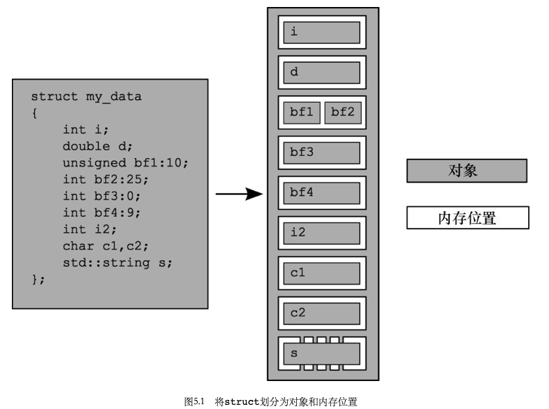
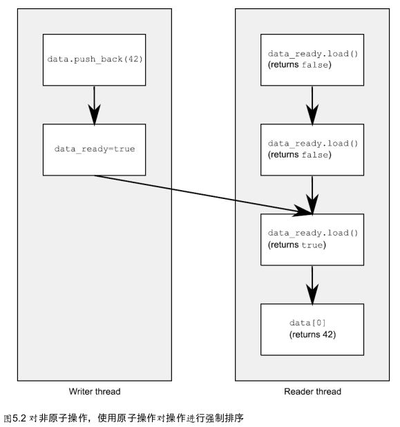
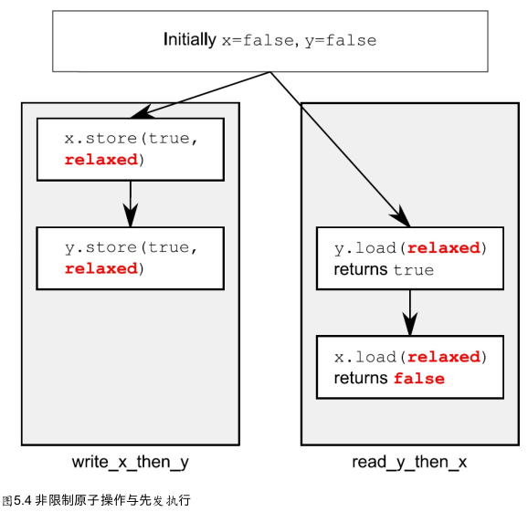
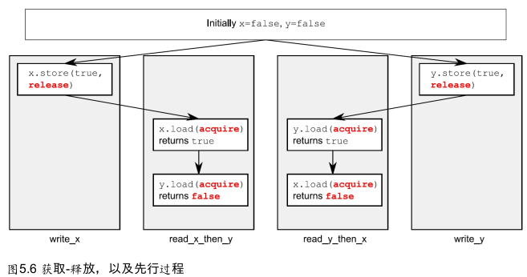
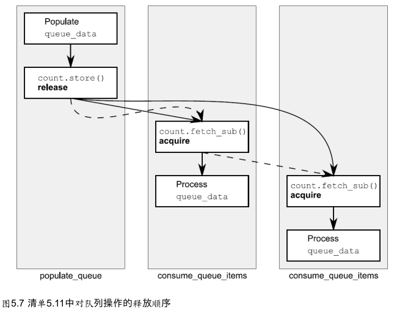

# 第五章 c++内存模型和原子类型上操作


## 内存模型基础

内存模型包括两个方面：

- 基本结构方面
- 并发方面

### 对象和内存位置

- 每个变量都是一个对象，包括其他对象的成员。
- 每个对象占据至少一个内存位置。
- 如int或char这样的基本类型的变量恰好一个内存位置，不论其大小，即便它们相邻或是数组的一部分。
- 相邻的位域是相同内存位置的一部分。




## c++中的原子操作及类型

**原子操作（atomic operation）：**一个不可分割的操作。

### 标准原子类型

标准原子类型的替代名称和它们所对应的`std::atomic<>`特化：

| 原子类型        | 对应的特化                        |
| --------------- | --------------------------------- |
| atomic_bool     | `std::atomic<bool>`               |
| atomic_char     | `std::atomic<char>`               |
| atomic_schar    | `std::atomic<signed char>`        |
| atomic_uchar    | `std::atomic<unsigned char>`      |
| atomic_int      | `std::atomic<int>`                |
| atomic_uint     | `std::atomic<unsigned>`           |
| atomic_short    | `std::atomic<short>`              |
| atomic_ushort   | `std::atomic<unsigned short>`     |
| atomic_long     | `std::atomic<long>`               |
| atomic_ulong    | `std::atomic<unsigned long>`      |
| atomic_llong    | `std::atomic<long long>`          |
| atomic_ullong   | `std::atomic<unsigned long long>` |
| atomic_char16_t | `std::atomic<char16_t>`           |
| atomic_char32_t | `std::atomic<char32_t>`           |
| atomic_wchar_t  | `std::atomic<wchar_t>`            |

标准库原理类型定义以及对应的内置类型定义：

| 原子typedef           | 对应的标准库typedef |
| --------------------- | ------------------- |
| atomic_int_least8_t   | int_least8_t        |
| atomic_uint_least8_t  | uint_least8_t       |
| atomic_int_least16_t  | int_least16_t       |
| atomic_uint_least16_t | uint_least16_t      |
| atomic_int_least32_t  | int_least32_t       |
| atomic_uint_least32_t | uint_least32_t      |
| atomic_int_least64_t  | int_least64_t       |
| atomic_uint_least64_t | uint_least64_t      |
| atomic_int_fast8_t    | int_fast8_t         |
| atomic_uint_fast8_t   | uint_fast8_t        |
| atomic_int_fast16_t   | int_fast16_t        |
| atomic_uint_fast16_t  | uint_fast16_t       |
| atomic_int_fast32_t   | int_fast32_t        |
| atomic_uint_fast32_t  | uint_fast32_t       |
| atomic_int_fast64_t   | int_fast64_t        |
| atomic_uint_fast64_t  | uint_fast64_t       |
| atomic_intptr_t       | intptr_t            |
| atomic_uintptr_t      | uintptr_t           |
| atomic_size_t         | size_t              |
| atomic_ptrdiff_t      | ptrdiff_t           |
| atomic_intmax_t       | intmax_t            |
| atomic_uintmax_t      | uintmax_t           |

三种类型运算：

- 存储（store）操作
  - memory_order_relaxed
  - memory_order_release
  - memory_order_seq_cst
- 载入（load）操作
  - memory_order_relaxed
  - memory_order_consume
  - memory_order_acquire
  - memory_order_seq_cst
- 读-修改-写（read-modify-write）操作
  - memory_order_relaxed
  - memory_order_consume
  - memory_order_acquire
  - memory_order_release
  - memory_order_acq_rel
  - memory_order_seq_cst

### `std::atomic_flag`上的操作

类型为`std::atomic_flag`的对象必须用`ATOMIC_FLAG_INIT`初始化。这会将该标志初始化为清除状态。在这里没有其他的选择，此标志总是以清除开始。

```c++
std::atomic_flag f=ATOMIC_FLAG_INIT;
```

一旦标识对象初始化完成，你只能对它做三件事：销毁，清除或设置并查询其先前的值。

使用`std::atomic_flag`的自旋锁互斥实现：

```c++
class spinlock_mutex
{
  std::atomic_flag flag;
public:
  spinlock_mutex():
  	flag(ATOMIC_FLAG_INIT)
  {}
  void lock()
  {
    while(flag.test_and_set(std::memory_order_acquire));
  }
  void unlock()
  {
    flag.clear(std::memory_order_release);
  }
};
```

### 基于`std::atomic`的相关操作

不能拷贝构造和拷贝赋值，但是可以使用一个非原子的bool类型构造它；例：

```c++
std::atomic<bool> b(true);
b=false;
```

cas(compare and swap):读，改，写操作。当前值与预期值一致时，存储新值，否则返回false。例：

```c++
bool expected=false;
extern atomic<bool> b;
while(!b.compare_exchange_weak(expected, true) && !expected);
```

- compare_excahge_weak

  能更好的避免一个双重循环的执行

- compare_exchange_strong

### `std::atomic`指针运算

`std::atomic<T*>`提供`fetch_add()`和`fetch_sub()`操作，它们都是读-改-写操作，它们可以拥有任意的内存顺序标签，以及加入到一个释放序列中。指定的语序不可能是操作符的形式，因为没办法提供必要的信息：这些形式都具有memory_order_seq_cst语义。

```c++
class Foo{};
Foo some_array[5];
std::atomic<Foo*> p(some_array);
Foo* x=p.fetch_add(2); // p加2，并返回原始值
assert(x==some_array);
assert(p.load()==&some_array[2]);
x=(p-=1);	// p减1，并返回原始值
assert(x==&some_array[1]);
assert(p.load==&some_array[1]);
```

函数也允许内存顺序语义作为给定函数的参数：

```c++
p.fetch_add(3, std::memory_order_release);
```

### `std::atomic<>`初级类模板

原子类型的可用操作：

| 操作                                       | atomic_flag | `atomic<bool>` | `atomic<T*>` | `atomic<integral-type>` | `atomic<other-type>` |
| ------------------------------------------ | ----------- | -------------- | ------------ | ----------------------- | -------------------- |
| test_and_set                               | *           |                |              |                         |                      |
| clear                                      | *           |                |              |                         |                      |
| is_lock_free                               |             | *              | *            | *                       | *                    |
| load                                       |             | *              | *            | *                       | *                    |
| store                                      |             | *              | *            | *                       | *                    |
| exchange                                   |             | *              | *            | *                       | *                    |
| compare_exchange_weak,<br>compare_exchange |             | *              | *            | *                       | *                    |
| fetch_add, `+=`                            |             |                | *            | *                       | *                    |
| fetch_sub, `-=`                            |             |                | *            | *                       |                      |
| fetch_or, `|=`                             |             |                |              | *                       |                      |
| fetch_and, `&=`                            |             |                |              | *                       |                      |
| fetch_xor, `^=`                            |             |                |              | *                       |                      |
| `++`, `--`                                 |             |                | *            | *                       |                      |

### 原子操作的释放函数

可用的原子操作有：

- 载入(load)
- 存储(store)
- 交换(exchange)
- 比较/交换(compare/exchange)


## 同步操作和强制顺序

从不同的线程中读取和写入变量：

```c++
#include <vector>
#include <atomic>
#include <iostream>
std::vector<int> data;
std::atomic<bool> data_ready(false);
void reader_thread()
{
    while(!data_ready.load())
    {
        std::this_thread::sleep(std::milliseconds(1));
    }
    std::count <<"The answer=" <<data[0] <<"\n";
}
void writer_thread()
{
    data.push_back(42);
    data_ready=true;
}
```



### synchronizes-with关系

synchronizes-with关系是你只能在原子类型上的操作之间得到的东西。

### happens-before关系

一个函数调用的参数的估计顺序是未指定的，例：

```c++
#include <iostream>
void foo(int a, int b)
{
    std::cout<<a<<","<<b<<std::endl;
}
int get_num()
{
    static int i=0;
    return ++i;
}
int main()
{
    foo(get_num(), get_num()); // 对get_num()的调用是无序的
}
```

### 原子操作的内存顺序

六种内存顺序选项可以应用到原子类型上的操作：

**顺序一致(sequentially consistent)顺序：**默认的顺序被命名为顺序一致(sequentially consistent)，因为这意味着程序的行为与一个简单的顺序的世界观是一致的。

- memory_order_seq_cst

顺序一致隐含着总体顺序，例：

```c++
#include <atomic>
#include <thread>
#include <assert.h>
std::atomic<bool> x, y;
std::atomic<int> z;
void write_x()
{
    x.store(true, std::memory_order_seq_cst); // 1
}
void write_y()
{
    y.store(true, std::memory_order_seq_cst); // 2
}
void read_x_then_y()
{
    while (!x.load(std::memory_order_seq_cst));
    if (y.load(std::memory_order_seq_cst)) // 3
        ++z;
}
void read_y_then_x()
{
    while(!y.load(std::memory_order_seq_cst));
    if (x.load(std::memory_order_seq_cst)) // 4
        ++z;
}
int main()
{
    x = false;
    y = false;
    z = 0;
    std::thread a(write_x);
    std::thread b(write_y);
    std::thread c(read_x_then_y);
    std::thread d(read_y_then_x);
    a.join();
    b.join();
    c.join();
    d.join();
    assert(z.load()!=0); // 5
}
```


**获得-释放(acquire-release)顺序:**线程不必和事件的顺序一致，在没有其他的顺序约束时，唯一的要求是所有的线程对每个独立变量的修改顺序达成一致。

- memory_order_consume
- memory_order_acquire
- memory_order_release
- memory_order_acq_rel

**松散(relaxed)顺序:**

- memory_order_relaxed

放松操作有极少数的排序要求，例：

```c++
#include <atomic>
#include <thread>
#include <assert.h>
std::atomic<bool> x, y;
std::atomic<int> z;
void write_x_then_y()
{
    x.store(true, std::memory_order_relaxed); // 1
    y.store(true, std::memory_order_relaxed); // 2
}
void read_y_then_x()
{
    while(!y.load(std::memory_order_relaxed)); // 3
    if(x.load(std::memory_order_relaxed)) // 4
        ++z;
}
int main()
{
    x=false;
    y=false;
    z=0;
    std::thread a(write_x_then_y);
    std::thread b(read_y_then_x);
    a.join();
    b.join();
    assert(z.load() != 0); // 5
}
```



非限制操作-多线程版：

```c++
#include <thread>
#include <atomic>
#include <iostream>
std::atomic<int> x(0), y(0), z(0); // 1
std::atomic<bool> go(false); // 2
unsigned const loop_count=10;
struct read_values
{
    int x, y, z;
};
read_values values1[loop_count];
read_values values2[loop_count];
read_values values3[loop_count];
read_values values4[loop_count];
read_values values5[loop_count];
void increment(std::atomic<int>* var_to_inc, read_values* values)
{
    while(!go)
        std::this_thread::yield(); // 自旋，等待信号
    for(unsigned i=0; i < loop_count; ++i)
    {
        values[i].x=x.load(std::memory_order_relaxed);
        values[i].y=y.load(std::memory_order_relaxed);
        values[i].z=z.load(std::memory_order_relaxed);
        var_to_inc->store(i+1, std::memory_order_relaxed);
        std::this_thread::yield();
    }
}

void read_vals(read_values* values)
{
    while(!go)
        std::this_thread::yield(); // 自旋，等待信号
    for(unsigned i=0; i < loop_count; ++i)
    {
        values[i].x=x.load(std::memory_order_relaxed);
        values[i].y=y.load(std::meomry_order_relaxed);
        values[i].z=z.load(std::memory_order_relaxed);
        var_to_inc->store(i+1, std::memory_order_relaxed);
        std::this_thread::yield();
    }
}

void read_vals(read_values* values)
{
    while(!go)
        std::this_thread::yield(); // 自旋，等待信号
    for(unsigned i=0; i<loop_count; ++i)
    {
        values[i].x=x.load(std::memory_order_relaxed);
        values[i].y=y.load(std::memory_order_relaxed);
        values[i].z=z.load(std::memory_order_relaxed);
        std::this_thread::yield();
    }
}

void read_vals(read_values* values)
{
    while(!go)
        std::this_thread::yield(); // 自旋，等待信号
    for(unsigned i=0; i<loop_count; ++i)
    {
        values[i].x=x.load(std::memory_order_relaxed);
        values[i].y=y.load(std::memory_order_relaxed);
        values[i].z=z.load(std::memory_order_relaxed);
        std::this_thread::yield();
    }
}

void print(read_values* v)
{
    for (unsigned i=0; i<loop_count; ++i)
    {
        if(i)
            std::cout << ",";
        std::count<<"("<<v[i].x<<","<<v[i].y<<","<<v[i].z<<")";
    }
    std::cout<<std::endl;
}
int main()
{
    std::thread t1(increment, &x, values1);
    std::thread t2(increment, &y, values2);
    std::thread t3(increment, &z, values3);
    std::thread t4(read_vals, values4);
    std::thread t5(read_vals, values5);
    
    go=true; // 开始执行主循环的信号
    
    t5.join();
    t4.join();
    t3.join();
    t2.join();
    t1.join();
    
    print(values1);
    print(values2);
    print(values3);
    print(values4);
    print(values5);
}
```

获取-释放的先行关系：



```c++
#include <atomic>
#include <thread>
#include <assert.h>
std::atomic<bool> x, y;
std::atomic<int> z;
void write_x()
{
    x.store(true, std::memory_order_release);
}
void write_y()
{
    y.store(true, std::memory_order_release);
}
void read_x_then_y()
{
    while(!x.load(std::memory_order_acquire));
    if (y.load(std::memory_order_acquire))
        ++z;
}
void read_y_then_z()
{
    while(!y.load(std::memory_order_acquire));
    if(x.load(std::memory_order_acquire))
        ++z;
}
int main()
{
    x=false;
    y=false;
    z=0;
    std::thread a(write_x);
    std::thread b(write_y);
    std::thread c(read_x_then_y);
    std::thread d(read_y_then_x);
    a.join();
    b.join();
    c.join();
    d.join();
    assert(z.load() != 0);
}
```

获取-释放操作会影响序列中的释放操作：

```c++
#include <atomic>
#include <thread>
#include <assert.h>
std::atomic<bool> x, y;
std::atomic<int> z;
void write_x_then_y()
{
    x.store(true, std::memory_order_relaxed);
    y.store(true, std::memory_order_release);
}
void read_y_then_x()
{
    while(!y.load(std::memory_order_acquire));
    if (x.load(std::memory_order_relaxed))
        ++z;
}
int main()
{
    x=false;
    y=false;
    z=0;
    std::thread a(write_x_then_y);
    std::thread b(read_y_then_x);
    a.join();
    b.join();
    assert(z.load()!=0);
}
```

### 释放队列与同步

使用原子操作从队列中读取数据：



```c++
#include <atomic>
#include <thread>
std::vector<int> queue_data;
std::atomic<int> count;
void populate_queue()
{
    unsigned const number_of_items=20;
    queue_data.clear();
    for (unsigned i=0; i<number_of_items;++i)
    {
        queue_data.push_back(i);
    }
    count.store(number_of_items, std::memory_order_release); // 初始化存储
}

void consume_queue_items()
{
    while(true)
    {
        int item_index;
        if((item_index=count.fetch_sub(1, std::memory_order_acquire)) <= 0)
        {
            wait_for_more_items(); // 等待更多元素
            continue;
        }
        process(queue_data[item_index - 1]); // 安全读取queue_data
    }
}

int main()
{
    std::thread a(populate_queue);
    std::thread b(consume_queue_items);
    std::thread c(consume_queue_items);
    a.join();
    b.join();
    c.join();
}
```

### 栅栏

栅栏可以让自由操作变得有序：

```c++
#include <atomic>
#include <thread>
#include <assert.h>
std::atomic<bool> x, y;
std::atomic<int> z;
void write_x_then_y()
{
    x.store(true, std::memory_order_relaxed);
    std::atomic_thread_fence(std::memory_order_release); // 释放栅栏
    y.store(true, std::memory_order_relaxed);
}
void read_y_then_x()
{
    while(!y.load(std::memory_order_relaxed));
    std::atomic_thread_fence(std::memory_order_acquire); // 获取栅栏
    if (x.load(std::memory_order_relaxed))
        ++z;
}
int main()
{
    x=false;
    y=false;
    z=0;
    std::thread a(write_x_then_y);
    std::thread b(read_y_then_x);
    a.join();
    b.join();
    assert(z.load() != 0);
}
```

### 原子操作对非原子的操作排序

使用非原子操作执行序列：

```c++
#include <atomic>
#include <thread>
#include <assert.h>

bool x=false;
std::atomic<bool> y;
std::atomic<int> z;

void write_x_then_y()
{
    x=true; // 在栅栏前存储x
    std::atomic_thread_fence(std::memory_order_release);
    y.store(true, std::memory_order_relaxed); // 在栅栏后存储y
}
void read_y_then_x()
{
    while (!y.load(std::memory_order_relaxed)); // 在y写入前，持续等待
    std::atomic_thread_fence(std::memory_order_acquire);
    if (x) // 这里读到的值，是前面写入的值
        ++z;
}

int main()
{
    x=false;
    y=false;
    z=0;
    std::thread a(write_x_then_y);
    std::thread b(read_y_then_x);
    a.join();
    b.join();
    assert(z.load() != 0); // 断言将不会触发
}
```

