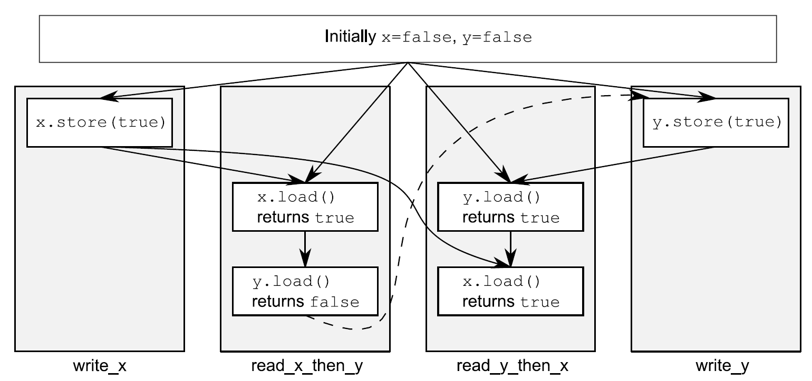
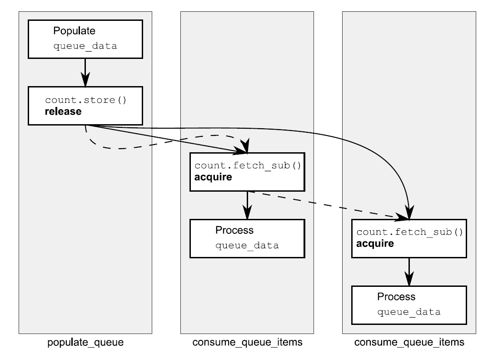

# Chapter - 5 The C++ memory model and operations on atomic types

<!-- vim-markdown-toc GFM -->

* [5.1 Memory model basics](#51-memory-model-basics)
    - [5.1.1 Objects and memory locations](#511-objects-and-memory-locations)
    - [5.1.2 Objects, memory locations, and concurrency](#512-objects-memory-locations-and-concurrency)
    - [5.1.3 Modification orders](#513-modification-orders)
* [5.2 Atomic operations and types in C++](#52-atomic-operations-and-types-in-c)
    - [5.2.1 The standard atomic types](#521-the-standard-atomic-types)
    - [5.2.2 Operations on std::atomic_flag](#522-operations-on-stdatomic_flag)
    - [5.2.3 Operations on std::atomic<bool>](#523-operations-on-stdatomicbool)
    - [5.2.4 Operations on std::atomic<T*>: pointer arithmetic](#524-operations-on-stdatomict-pointer-arithmetic)
    - [5.2.5 Operations on standard atomic integral types](#525-operations-on-standard-atomic-integral-types)
    - [5.2.6 The std::atomic<> primary class template](#526-the-stdatomic-primary-class-template)
    - [5.2.7 Free functions for atomic operations](#527-free-functions-for-atomic-operations)
* [5.3 Synchronizing operations and enforcing ordering](#53-synchronizing-operations-and-enforcing-ordering)
    - [5.3.1 The synchronizes-with relationship](#531-the-synchronizes-with-relationship)
    - [5.3.2 The happens-before relationship](#532-the-happens-before-relationship)
    - [5.3.3 Memory ordering for atomic operations](#533-memory-ordering-for-atomic-operations)
    - [5.3.4 Release sequences and synchronizes-with](#534-release-sequences-and-synchronizes-with)
    - [5.3.5 Fences](#535-fences)
    - [5.3.6 Ordering nonatomic operations with atomics](#536-ordering-nonatomic-operations-with-atomics)
* [5.4 Summary](#54-summary)

<!-- vim-markdown-toc -->


## 5.1 Memory model basics

### 5.1.1 Objects and memory locations


*Figure 5.1 The division of a struct into objects and memory locations*

 There are four important things to take away from this:

 - Every variable is an object, including those that are members of other objects.
 - Every object occupies *at least one* memory location.
 - Variables of fundamental type such as `int` or `char` are `exactly one` memory location, whatever their size, even if they're adjacent or part of an array.
 - Adjacent bit fields are part of the same memory location.

### 5.1.2 Objects, memory locations, and concurrency

In order to avoid the race condition, there has to be an enforced ordering between the accesses in the two threads. One way to ensure there's a defined ordering is to use mutexes as described in chapter3; if the same mutex is locked prior to both accesses, only one thread can access the memory location at a time, so one must happen before the other. The other way is to use the synchronization properties of `atomic` operations(see section 5.2 for the definition of atomic operations) either on the same or other memory locations to enforce an ordering between the accesses in the two threads. The use of atomic operations to enforce an ordering is described in section 5.3. If more than two threads access the same memory location, each pair of accesses must have a defined ordering.

If there's no enforced ordering between two accesses to single memory location from separate threads, one or both of those accesses is not atomic, and one or both is write, then this is a data race and causes undefined behavior.

### 5.1.3 Modification orders


## 5.2 Atomic operations and types in C++

An `atomic` operation is an indivisible operation. You can't observe such an operation half-done from any thread in the system; it's either done or not done. If the load operation that reads the value of an object is `atomic`, and all modifications to that object are also `atomic`, that load will retrieve either the initial value of the object or the value stored by one of the modifications.

### 5.2.1 The standard atomic types

*Table 5.1 The alternative  names for the standard atomic types and their corresponding `std::atomic<>` specializations*

| Atomic type     | Corresponding specialization    |
|-----------------|---------------------------------|
| atomic_bool     | std::atomic<bool>               |
| atomic_char     | std::atomic<char>               |
| atomic_schar    | std::atomic<signed char>        |
| atomic_uchar    | std::atomic<unsigned char>      |
| atomic_int      | std::atomic<int>                |
| atomic_uint     | std::atomic<unsigned>           |
| atomic_short    | std::atomic<short>              |
| atomic_ushort   | std::atomic<unsigned short>     |
| atomic_long     | std::atomic<long>               |
| atomic_ulong    | std::atomic<unsigned long>      |
| atomic_llong    | std::atomic<long long>          |
| atomic_ullong   | std::atomic<unsigned long long> |
| atomic_char16_t | std::atomic<char16_t>           |
| atomic_char32_t | std::atomic<char32_t>           |
| atomic_wchar_t  | std::atomic<wchar_t>            |

*Table 5.2 The standard atomic typedefs and their corresponding built-in typedefs*

| 原子typedef           | 对应的标准库typedef |
|-----------------------|---------------------|
| atomic_int_least8_t   | int_least8_t        |
| atomic_uint_least8_t  | uint_least8_t       |
| atomic_int_least16_t  | int_least16_t       |
| atomic_uint_least16_t | uint_least16_t      |
| atomic_int_least32_t  | int_least32_t       |
| atomic_uint_least32_t | uint_least32_t      |
| atomic_int_least64_t  | int_least64_t       |
| atomic_uint_least64_t | uint_least64_t      |
| atomic_int_fast8_t    | int_fast8_t         |
| atomic_uint_fast8_t   | uint_fast8_t        |
| atomic_int_fast16_t   | int_fast16_t        |
| atomic_uint_fast16_t  | uint_fast16_t       |
| atomic_int_fast32_t   | int_fast32_t        |
| atomic_uint_fast32_t  | uint_fast32_t       |
| atomic_int_fast64_t   | int_fast64_t        |
| atomic_uint_fast64_t  | uint_fast64_t       |
| atomic_intptr_t       | intptr_t            |
| atomic_uintptr_t      | uintptr_t           |
| atomic_size_t         | size_t              |
| atomic_ptrdiff_t      | ptrdiff_t           |
| atomic_intmax_t       | intmax_t            |
| atomic_uintmax_t      | uintmax_t           |


it suffices to know that the operations are divided into three categories:

- Store operations, which can have `memory_order_relaxed`, `memory_order_release`, or `memory_order_seq_cst` ordering;
- Load operations, which can have `memory_order_relaxed`, `memory_order_sonsume`, `memory_order_acquire`, or `memory_order_seq_cst` ordering;
- Read-modify-write operations, which can have `memory_order_relaxed`, `memory_order_consume`, `memory_order_acquire`, `memory_order_release`, `memory_order_acq_rel`, or `memory_order_seq_cst` ordering.

### 5.2.2 Operations on std::atomic_flag

```c++
class spinlock_mutex
{
  std::atomic_flag flag;
public:
  spinlock_mutex():
    flag(ATOMIC_FLAG_INIT)
  {}
  void lock()
  {
    while(flag.test_and_set(std::memory_order_acquire));
  }
  void unlock()
  {
    flag.clear(std::memory_order_release);
  }
};
```

*Listing 5.1 Implementation of a spinlock mutex using std::atomic_flag*

### 5.2.3 Operations on std::atomic<bool>

The compare/exchange operation is the cornerstone of programming with atomic types; it compares the value of the atomic variable with a supplied expected value and stores the supplied desired value if they're equal. If the values aren't equal, the expected value and stores the supplied desired value if they're equal. If the values aren't equal, the expected value is updated with the actual value of the atomic variable. The return type of the compare/exchange functions is a `bool`, which is `true` if the store was performed and false otherwise.

Because `compare_exchange_weak()` can fail spuriously, it must typically be used in a loop:

```c++
bool expected=false;
extern atomic<bool> b; // 设置些什么
while(!b.compare_exchange_weak(expected,true) && !expected);
```

### 5.2.4 Operations on std::atomic<T*>: pointer arithmetic

Beacuse both `fetch_add()` and `fetch_sub()` are read-modify-write operations, they can have any of the memory-ordering tags and can participate in a `release wequence`. Specifying the ordering semantics isn't possible for the operator forms, because there's no way of providing the onformation: these forms therefore always have `memory_order_seq_cst` semantics.

```c++
class Foo{};
Foo some_array[5];
std::atomic<Foo*> p(some_array);
Foo* x=p.fetch_add(2);  // p加2，并返回原始值
assert(x==some_array);
assert(p.load()==&some_array[2]);
x=(p-=1);  // p减1，并返回原始值
assert(x==&some_array[1]);
assert(p.load()==&some_array[1]);
```

The function forms also allow the memory-ordering semantics to be specified as an additional function call argument:

```c++
p.fetch_add(3,std::memory_order_release);
```

### 5.2.5 Operations on standard atomic integral types

### 5.2.6 The std::atomic<> primary class template

In order to use `std::atomic<UDT>` for some user-defined type UDT, this type must have a `trivial` copy-assignment operator. This means that the type must not have any virtual functions or virtual base classes and must use the compiler-generated copy-assignment operator. Not only that, but every base class and non-static data member of a user-defined type must also have a trivial copy-assignment operator. This essentially permits the compiler to use `memcpy()` or an equivalent operation for assignment operations, because there's no user-written code to run.

Finally, the type must be `bitwise equality comparable`. This goes alongside the assign-ment requirements; not only must you be able to copy an object of type UDT using `memcpy()`, but you must be able to compare instances for equality using `memcmp()`. 

don't pass pointers and references to protected data outside the scope of the lock by passing them as arguments to user-suplied functions.

### 5.2.7 Free functions for atomic operations

*Table 5.3 The operations available on atomic types*

| 操作                                       | atomic_flag | `atomic<bool>` | `atomic<T*>` | `atomic<integral-type>` | `atomic<other-type>` |
|--------------------------------------------|-------------|----------------|--------------|-------------------------|----------------------|
| test_and_set                               | *           |                |              |                         |                      |
| clear                                      | *           |                |              |                         |                      |
| is_lock_free                               |             | *              | *            | *                       | *                    |
| load                                       |             | *              | *            | *                       | *                    |
| store                                      |             | *              | *            | *                       | *                    |
| exchange                                   |             | *              | *            | *                       | *                    |
| compare_exchange_weak,<br>compare_exchange |             | *              | *            | *                       | *                    |
| fetch_add, `+=`                            |             |                | *            | *                       | *                    |
| fetch_sub, `-=`                            |             |                | *            | *                       |                      |
| fetch_or, `                                | =`          |                |              |                         | *                    |  |
| fetch_and, `&=`                            |             |                |              | *                       |                      |
| fetch_xor, `^=`                            |             |                |              | *                       |                      |
| `++`, `--`                                 |             |                | *            | *                       |                      |

example:

```c++
std::shared_ptr<my_data> p;
void process_global_data()
{
  std::shared_ptr<my_data> local=std::atomic_load(&p);
  process_data(local);
}
void update_global_data()
{
  std::shared_ptr<my_data> local(new my_data);
  std::atomic_store(&p,local);
}
```

## 5.3 Synchronizing operations and enforcing ordering

```c++
#include <vector>
#include <atomic>
#include <iostream>

std::vector<int> data;
std::atomic<bool> data_ready(false);

void reader_thread()
{
  while(!data_ready.load())  // 1
  {
    std::this_thread::sleep(std::milliseconds(1));
  }
  std::cout<<"The answer="<<data[0]<<"\m";  // 2
}
void writer_thread()
{
  data.push_back(42);  // 3
  data_ready=true;  // 4
}

```

*Listing 5.2 Reading and writing variables from different threads*

 

*Figure 5.2 Enforcing an ordering between nonatomic operations using atomic operations *

### 5.3.1 The synchronizes-with relationship

The synchronizes-With relationship is something that you can get only between operations on atomic types.

### 5.3.2 The happens-before relationship

```c++
#include <iostream>
void foo(int a,int b)
{
  std::cout<<a<<”,”<<b<<std::endl;
}
int get_num()
{
  static int i=0;
  return ++i;
}
int main()
{
  foo(get_num(),get_num());  // 无序调用get_num()
}
```

*Listing 5.3 Order of evaluation of arguments to a function call is unspecified*

### 5.3.3 Memory ordering for atomic operations

These distinct memory-ordering models can have varying costs on different CPU architectures.

The availability of the distinct memory-ordering models allows expert to take advantage of the increased performance of the more fine-grained ordering relation-ships where they're advantageous while allowing the use of the default sequentially consistent ordering(which is considerably easier to reason about than the others) for those cases that are less critical.

**SEQUENTIALLY CONSISTENT ORDERING**

The default ordering is named `sequentially consistent` because it implies that the vehavior of the program is consistent with a simple sequential view of the world. If all operations on instances of atomic types are sequentially consisten, the behavior of a multithreaded program is as if all these operations were performed in some particular sequence by a single thread.

This ease of understanding can come at a price, though. On a weakly ordered machine with many processors, it can impose a noticeable performance penalty, beacuse the overall sequence of operations must be kept consistent between the processors, possibly requiring extensive (and expensive!) synchronization operations between the processors.

```c++
#include <atomic>
#include <thread>
#include <assert.h>

std::atomic<bool> x,y;
std::atomic<int> z;

void write_x()
{
  x.store(true,std::memory_order_seq_cst);  // 1
}

void write_y()
{
  y.store(true,std::memory_order_seq_cst);  // 2
}
void read_x_then_y()
{
  while(!x.load(std::memory_order_seq_cst));
  if(y.load(std::memory_order_seq_cst))  // 3
    ++z;
}
void read_y_then_x()
{
  while(!y.load(std::memory_order_seq_cst));
  if(x.load(std::memory_order_seq_cst))  // 4
    ++z;
}
int main()
{
  x=false;
  y=false;
  z=0;
  std::thread a(write_x);
  std::thread b(write_y);
  std::thread c(read_x_then_y);
  std::thread d(read_y_then_x);
  a.join();
  b.join();
  c.join();
  d.join();
  assert(z.load()!=0);  // 5
}
```

*Listing 5.4 Sequential consistency implies a total ordering*

**NON-SEQUENTIALLY CONSISTENT MEMORY ORDERINGS**



*Figure 5.3 Sequential consistency and happens-before*

Even if the trheads are running the same bit of code, they can disagree on the order of events because of operations in other threads in the absence of explicit ordering constraints, because the different CPU caches and internal buffers can hold different values for the same memory. It's so important I'll say it again: `threads don't have to agree on the order of events`.

**Relaxed ORDERING**

```c++
#include <atomic>
#include <thread>
#include <assert.h>

std::atomic<bool> x,y;
std::atomic<int> z;

void write_x_then_y()
{
  x.store(true,std::memory_order_relaxed);  // 1
  y.store(true,std::memory_order_relaxed);  // 2
}
void read_y_then_x()
{
  while(!y.load(std::memory_order_relaxed));  // 3
  if(x.load(std::memory_order_relaxed))  // 4
    ++z;
}
int main()
{
  x=false;
  y=false;
  z=0;
  std::thread a(write_x_then_y);
  std::thread b(read_y_then_x);
  a.join();
  b.join();
  assert(z.load()!=0);  // 5
}
```

*Listing 5.5 Relaxed operations have very few ordering requirements*


*Figure 5.4 Relaxed atomics and happens-before*

```c++
#include <thread>
#include <atomic>
#include <iostream>

std::atomic<int> x(0),y(0),z(0);  // 1
std::atomic<bool> go(false);  // 2

unsigned const loop_count=10;

struct read_values
{
  int x,y,z;
};

read_values values1[loop_count];
read_values values2[loop_count];
read_values values3[loop_count];
read_values values4[loop_count];
read_values values5[loop_count];

void increment(std::atomic<int>* var_to_inc,read_values* values)
{
  while(!go)
    std::this_thread::yield();  // 3 自旋，等待信号
  for(unsigned i=0;i<loop_count;++i)
  {
    values[i].x=x.load(std::memory_order_relaxed);
    values[i].y=y.load(std::memory_order_relaxed);
    values[i].z=z.load(std::memory_order_relaxed);
    var_to_inc->store(i+1,std::memory_order_relaxed);  // 4
    std::this_thread::yield();
  }
}

void read_vals(read_values* values)
{
  while(!go)
    std::this_thread::yield(); // 5 自旋，等待信号
  for(unsigned i=0;i<loop_count;++i)
  {
    values[i].x=x.load(std::memory_order_relaxed);
    values[i].y=y.load(std::memory_order_relaxed);
    values[i].z=z.load(std::memory_order_relaxed);
    std::this_thread::yield();
  }
}

void print(read_values* v)
{
  for(unsigned i=0;i<loop_count;++i)
  {
    if(i)
      std::cout<<",";
    std::cout<<"("<<v[i].x<<","<<v[i].y<<","<<v[i].z<<")";
  }
  std::cout<<std::endl;
}

int main()
{
  std::thread t1(increment,&x,values1);
  std::thread t2(increment,&y,values2);
  std::thread t3(increment,&z,values3);
  std::thread t4(read_vals,values4);
  std::thread t5(read_vals,values5);

  go=true;  // 6 开始执行主循环的信号

  t5.join();
  t4.join();
  t3.join();
  t2.join();
  t1.join();

  print(values1);  // 7 打印最终结果
  print(values2);
  print(values3);
  print(values4);
  print(values5);
}
```

*Listing 5.6 Relaxed operations on multiple threads*

**UNDERSTANDING RELAXED ORDERING**

**QCQUIRE-RELEASE ORDERING**

```c++
#include <atomic>
#include <thread>
#include <assert.h>

std::atomic<bool> x,y;
std::atomic<int> z;
void write_x()
{
  x.store(true,std::memory_order_release);
}
void write_y()
{
  y.store(true,std::memory_order_release);
}
void read_x_then_y()
{
  while(!x.load(std::memory_order_acquire));
  if(y.load(std::memory_order_acquire))  // 1
    ++z;
}
void read_y_then_x()
{
  while(!y.load(std::memory_order_acquire));
  if(x.load(std::memory_order_acquire))
    ++z;
}
int main()
{
  x=false;
  y=false;
  z=0;
  std::thread a(write_x);
  std::thread b(write_y);
  std::thread c(read_x_then_y);
  std::thread d(read_y_then_x);
  a.join();
  b.join();
  c.join();
  d.join();
  assert(z.load()!=0); // 3
}
```


*Figure 5.6 Acquire-release and happens-before*

```c++
#include <atomic>
#include <thread>
#include <assert.h>

std::atomic<bool> x,y;
std::atomic<int> z;

void write_x_then_y()
{
  x.store(true,std::memory_order_relaxed);  // 1 自旋，等待y被设置为true
  y.store(true,std::memory_order_release);  // 2
}
void read_y_then_x()
{
  while(!y.load(std::memory_order_acquire));  // 3
  if(x.load(std::memory_order_relaxed))  // 4
    ++z;
}
int main()
{
  x=false;
  y=false;
  z=0;
  std::thread a(write_x_then_y);
  std::thread b(read_y_then_x);
  a.join();
  b.join();
  assert(z.load()!=0);  // 5
}
```

*Listing 5.8 Acquire-release operations can impose ordering on relaxed operations*

if A inter-thread happens-before B and B inter-thread happens-before C, then A inter-thread happens-before C. This means that acquire-release ordering can be used to synchronize data across several threads, even when the "intermediate" threads haven't actually touched the data.

**TRANSITIVE SYNCHRONIZATION WITH ACQUIRE-RELEASE ORDERING**

```c++
std::atomic<int> data[5];
std::atomic<bool> sync1(false),sync2(false);

void thread_1()
{
  data[0].store(42,std::memory_order_relaxed);
  data[1].store(97,std::memory_order_relaxed);
  data[2].store(17,std::memory_order_relaxed);
  data[3].store(-141,std::memory_order_relaxed);
  data[4].store(2003,std::memory_order_relaxed);
  sync1.store(true,std::memory_order_release);  // 1.设置sync1
}

void thread_2()
{
  while(!sync1.load(std::memory_order_acquire));  // 2.直到sync1设置后，循环结束
  sync2.store(true,std::memory_order_release);  // 3.设置sync2
}
void thread_3()
{
  while(!sync2.load(std::memory_order_acquire));   // 4.直到sync1设置后，循环结束
  assert(data[0].load(std::memory_order_relaxed)==42);
  assert(data[1].load(std::memory_order_relaxed)==97);
  assert(data[2].load(std::memory_order_relaxed)==17);
  assert(data[3].load(std::memory_order_relaxed)==-141);
  assert(data[4].load(std::memory_order_relaxed)==2003);
}
```

*Listing 5.9 Transitive synchronization using acquire and release ordering*

**DATA DEPENDENCY WITH ACQUIRE-RELEASE ORDERING AND MEMORY_ORDER_CONSUME**

There are two new relations that deal with data dependencies: `dependency-ordered-before` and `carries-a-dependency-to`. Just like sequenced-before, carries-a-dependency-to applies strictly within a single thread and essentially models the data dependency between operations; if the result of an operation A is used as an operand for an operation B, then A carries-a-dependency-to B. If the result of operation A is value of a scalar type such as an `int`, then the relationship still applies if the result of A is stored in a variable, and that variable is then used as an operand for operation B. This operation is also transitive, so if A carries-a-dependency-to B, and B carries-a-dependency-to C, then A carries-a-dependency-to C.

```c++
struct X
{
int i;
std::string s;
};

std::atomic<X*> p;
std::atomic<int> a;

void create_x()
{
  X* x=new X;
  x->i=42;
  x->s="hello";
  a.store(99,std::memory_order_relaxed);  // 1
  p.store(x,std::memory_order_release);  // 2
}

void use_x()
{
  X* x;
  while(!(x=p.load(std::memory_order_consume)))  // 3
    std::this_thread::sleep(std::chrono::microseconds(1));
  assert(x->i==42);  // 4
  assert(x->s=="hello");  // 5
  assert(a.load(std::memory_order_relaxed)==99);  // 6
}

int main()
{
  std::thread t1(create_x);
  std::thread t2(use_x);
  t1.join();
  t2.join();
}
```

*Listing 5.10 Using std::memory_order_consume to synchronize data*

### 5.3.4 Release sequences and synchronizes-with

If the store is tagged with `memory_order_release`, `memory_order_acq_rel`, or `memory_order_seq_cst`, and the load is tagged with `memory_order_consume`, `memory_order_acquire`, or `memory_order_seq_cst`, and each operation in the chain loads the value written by the previous operation, then the chain of operations constitutes a `release sequence` and the initial store synchronizes-with(for `memory_order_acquire` or `memory_order_seq_cst`) or is dependency-ordered-before (for `memory_order_consume`) the final load. Any atomic read-modify-write operations in the chain can have any memory ordering(even `memory_order_relaxed`).

```c++
#include <atomic>
#include <thread>

std::vector<int> queue_data;
std::atomic<int> count;

void populate_queue()
{
  unsigned const number_of_items=20;
  queue_data.clear();
  for(unsigned i=0;i<number_of_items;++i)
  {
    queue_data.push_back(i);
  }

  count.store(number_of_items,std::memory_order_release);  // 1 初始化存储
}

void consume_queue_items()
{
  while(true)
  {
    int item_index;
    if((item_index=count.fetch_sub(1,std::memory_order_acquire))<=0)  // 2 一个“读-改-写”操作
    {
      wait_for_more_items();  // 3 等待更多元素
      continue;
    }
    process(queue_data[item_index-1]);  // 4 安全读取queue_data
  }
}

int main()
{
  std::thread a(populate_queue);
  std::thread b(consume_queue_items);
  std::thread c(consume_queue_items);
  a.join();
  b.join();
  c.join();
}
```

*Listing 5.11 Reading values from a queue with atomic operations*



### 5.3.5 Fences

These are operations that encorce memory-ordering constraints without modifying any data and are typically combined with atomic operations that use the `memory_order_relaxed` ordering constraints. Fences are global operations and affect the ordering of other atomic operations in the thread that executed the fence. Fences are also commonly called `memory barriers`, and they get their name because they put a line in the code that certain operations can't cross.

```c++
#include <atomic>
#include <thread>
#include <assert.h>

std::atomic<bool> x,y;
std::atomic<int> z;

void write_x_then_y()
{
  x.store(true,std::memory_order_relaxed);  // 1
  std::atomic_thread_fence(std::memory_order_release);  // 2
  y.store(true,std::memory_order_relaxed);  // 3
}

void read_y_then_x()
{
  while(!y.load(std::memory_order_relaxed));  // 4
  std::atomic_thread_fence(std::memory_order_acquire);  // 5
  if(x.load(std::memory_order_relaxed))  // 6
    ++z;
}

int main()
{
  x=false;
  y=false;
  z=0;
  std::thread a(write_x_then_y);
  std::thread b(read_y_then_x);
  a.join();
  b.join();
  assert(z.load()!=0);  // 7
}
```

*Listing 5.12 Relaxed operations can be ordered with fences*

### 5.3.6 Ordering nonatomic operations with atomics

```c++
#include <atomic>
#include <thread>
#include <assert.h>

bool x=false;  // x现在是一个非原子变量
std::atomic<bool> y;
std::atomic<int> z;

void write_x_then_y()
{
  x=true;  // 1 在栅栏前存储x
  std::atomic_thread_fence(std::memory_order_release);
  y.store(true,std::memory_order_relaxed);  // 2 在栅栏后存储y
}

void read_y_then_x()
{
  while(!y.load(std::memory_order_relaxed));  // 3 在#2写入前，持续等待
  std::atomic_thread_fence(std::memory_order_acquire);
  if(x)  // 4 这里读取到的值，是#1中写入
    ++z;
}
int main()
{
  x=false;
  y=false;
  z=0;
  std::thread a(write_x_then_y);
  std::thread b(read_y_then_x);
  a.join();
  b.join();
  assert(z.load()!=0);  // 5 断言将不会触发
}
```

*Listing 5.13 Enforcing ordering on nonatomic operations*


## 5.4 Summary


