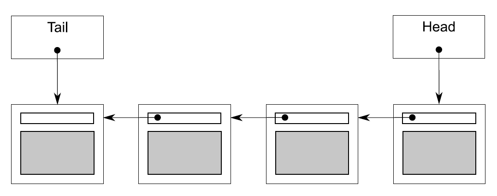

# Chapter6 Designing lock-based concurrent data structures


<!-- vim-markdown-toc GFM -->

* [6.1 What does it mean to design for concurrency?](#61-what-does-it-mean-to-design-for-concurrency)
    - [6.1.1 Guidelines for designing data structures for concurrency](#611-guidelines-for-designing-data-structures-for-concurrency)
* [6.2 Lock-based concurrent data structures](#62-lock-based-concurrent-data-structures)
    - [6.2.1 A thread-safe stack using locks](#621-a-thread-safe-stack-using-locks)
    - [6.2.2 A thread-safe queue using locks and condition variables](#622-a-thread-safe-queue-using-locks-and-condition-variables)
    - [6.2.3 A thread-safe queue using fine-grained locks and condition variables](#623-a-thread-safe-queue-using-fine-grained-locks-and-condition-variables)
* [6.3 Designing more complex lock-based data structures](#63-designing-more-complex-lock-based-data-structures)
    - [6.3.1 Writing a thread-safe lookup table using locks](#631-writing-a-thread-safe-lookup-table-using-locks)
    - [6.3.2 Writing a thread-safe list using locks](#632-writing-a-thread-safe-list-using-locks)
* [6.4 Summary](#64-summary)

<!-- vim-markdown-toc -->


## 6.1 What does it mean to design for concurrency?

No data will be lost or corrupted, all invariants will be upheld, and there'll be no problematic race conditions. Such a data structure is said to be `thread-safe`.

`serialization` threads take turns accessing the data protected by the mutex; they must access it serially rather than concurrently.

### 6.1.1 Guidelines for designing data structures for concurrency

you have two aspects to consider when designing data structures for concurrent access: ensuring that the accesses are safe and enabling genuine concurrent access:

- Ensure that no thread can see a state where the invariants of the data structure have been broken by the actions of another thread.
- Take care to avoid race conditions inherent in the interface to the data structure by providing functions for complete operations rather than for operation steps.
- Pay attention to how the data structure behaves in the presence of exceptions to ensure that the invariants are not broken.
- Minimize the opportunities for deadlock when using the data structure by restricting the scope of locks and avoiding nested locks where possible.

here's a list of questions to ask yourself as the data structure designer:

- Can the scope of locks be restricted to allow some parts of an operation to be performed outside the lock?
- Can different parts of the data structure be protected with different mutexes?
- Do all operations require the same level of protection?
- Can a simple change to the data structure improve the opportunities for concurrency without affecting the operational semantics?


## 6.2 Lock-based concurrent data structures

### 6.2.1 A thread-safe stack using locks

```c++
#include <exception>

struct empty_stack: std::exception
{
  const char* what() const throw();
};

template<typename T>
class threadsafe_stack
{
private:
  std::stack<T> data;
  mutable std::mutex m;
public:
  threadsafe_stack(){}
  threadsafe_stack(const threadsafe_stack& other)
  {
    std::lock_guard<std::mutex> lock(other.m);
    data=other.data;
  }

  threadsafe_stack& operator=(const threadsafe_stack&) = delete;

  void push(T new_value)
  {
    std::lock_guard<std::mutex> lock(m);
    data.push(std::move(new_value));  // 1
  }
  std::shared_ptr<T> pop()
  {
    std::lock_guard<std::mutex> lock(m);
    if(data.empty()) throw empty_stack();  // 2
    std::shared_ptr<T> const res(
      std::make_shared<T>(std::move(data.top())));  // 3
    data.pop();  // 4
    return res;
  }
  void pop(T& value)
  {
    std::lock_guard<std::mutex> lock(m);
    if(data.empty()) throw empty_stack();
    value=std::move(data.top());  // 5
    data.pop();  // 6
  }
  bool empty() const
  {
    std::lock_guard<std::mutex> lock(m);
    return data.empty();
  }
};
```

*Listing 6.1 A class definition for a thread-safe stack*

Although it's safe for multiple threads to call the member functions concurrently, because of the use of locks, only one thread is ever actually doing any work in the stack data structure at a time.

### 6.2.2 A thread-safe queue using locks and condition variables

```c++
template<typename T>
class threadsafe_queue
{
private:
  mutable std::mutex mut;
  std::queue<T> data_queue;
  std::condition_variable data_cond;

public:
  threadsafe_queue()
  {}

  void push(T data)
  {
    std::lock_guard<std::mutex> lk(mut);
    data_queue.push(std::move(data));
    data_cond.notify_one();  // 1
  }

  void wait_and_pop(T& value)  // 2
  {
    std::unique_lock<std::mutex> lk(mut);
    data_cond.wait(lk,[this]{return !data_queue.empty();});
    value=std::move(data_queue.front());
    data_queue.pop();
  }

  std::shared_ptr<T> wait_and_pop()  // 3
  {
    std::unique_lock<std::mutex> lk(mut);
    data_cond.wait(lk,[this]{return !data_queue.empty();});  // 4
    std::shared_ptr<T> res(
      std::make_shared<T>(std::move(data_queue.front())));
    data_queue.pop();
    return res;
  }

  bool try_pop(T& value)
  {
    std::lock_guard<std::mutex> lk(mut);
    if(data_queue.empty())
      return false;
    value=std::move(data_queue.front());
    data_queue.pop();
    return true;
  }

  std::shared_ptr<T> try_pop()
  {
    std::lock_guard<std::mutex> lk(mut);
    if(data_queue.empty())
      return std::shared_ptr<T>();  // 5
    std::shared_ptr<T> res(
      std::make_shared<T>(std::move(data_queue.front())));
    data_queue.pop();
    return res;
  }

  bool empty() const
  {
    std::lock_guard<std::mutex> lk(mut);
    return data_queue.empty();
  }
};
```

*Listing 6.2 The full class definition for a thread-safe queue using condition variables*

```c++
template<typename T>
class threadsafe_queue
{
private:
  mutable std::mutex mut;
  std::queue<std::shared_ptr<T> > data_queue;
  std::condition_variable data_cond;
public:
  threadsafe_queue()
  {}

  void wait_and_pop(T& value)
  {
    std::unique_lock<std::mutex> lk(mut);
    data_cond.wait(lk,[this]{return !data_queue.empty();});
    value=std::move(*data_queue.front());  // 1
    data_queue.pop();
  }

  bool try_pop(T& value)
  {
    std::lock_guard<std::mutex> lk(mut);
    if(data_queue.empty())
      return false;
    value=std::move(*data_queue.front());  // 2
    data_queue.pop();
    return true;
  }

  std::shared_ptr<T> wait_and_pop()
  {
    std::unique_lock<std::mutex> lk(mut);
    data_cond.wait(lk,[this]{return !data_queue.empty();});
    std::shared_ptr<T> res=data_queue.front();  // 3
    data_queue.pop();
    return res;
  }

  std::shared_ptr<T> try_pop()
  {
    std::lock_guard<std::mutex> lk(mut);
    if(data_queue.empty())
      return std::shared_ptr<T>();
    std::shared_ptr<T> res=data_queue.front();  // 4
    data_queue.pop();
    return res;
  }

  void push(T new_value)
  {
    std::shared_ptr<T> data(
    std::make_shared<T>(std::move(new_value)));  // 5
    std::lock_guard<std::mutex> lk(mut);
    data_queue.push(data);
    data_cond.notify_one();
  }

  bool empty() const
  {
    std::lock_guard<std::mutex> lk(mut);
    return data_queue.empty();
  }
};
```

*Listing 6.3 A thread-safe queue holding std::shared_ptr<> instances*



*Figure 6.1 A queue represented using a single-linked list*

### 6.2.3 A thread-safe queue using fine-grained locks and condition variables

```c++
template<typename T>
class queue
{
private:
  struct node
  {
    T data;
    std::unique_ptr<node> next;

    node(T data_):
    data(std::move(data_))
    {}
  };

  std::unique_ptr<node> head;  // 1
  node* tail;  // 2

public:
  queue()
  {}
  queue(const queue& other)=delete;
  queue& operator=(const queue& other)=delete;
  std::shared_ptr<T> try_pop()
  {
    if(!head)
    {
      return std::shared_ptr<T>();
    }
    std::shared_ptr<T> const res(
      std::make_shared<T>(std::move(head->data)));
    std::unique_ptr<node> const old_head=std::move(head);
    head=std::move(old_head->next);  // 3
    return res;
  }

  void push(T new_value)
  {
    std::unique_ptr<node> p(new node(std::move(new_value)));
    node* const new_tail=p.get();
    if(tail)
    {
      tail->next=std::move(p);  // 4
    }
    else
    {
      head=std::move(p);  // 5
    }
    tail=new_tail;  // 6
  }
};
```

*Listing 6.4 A simple single-threaded queue implementation*

**ENABLING CONCURRENCY BY SEPARATING DATA**

```c++
template<typename T>
class queue
{
private:
  struct node
  {
    std::shared_ptr<T> data;  // 1
    std::unique_ptr<node> next;
  };

  std::unique_ptr<node> head;
  node* tail;

public:
  queue():
    head(new node),tail(head.get())  // 2
  {}
  queue(const queue& other)=delete;
  queue& operator=(const queue& other)=delete;

  std::shared_ptr<T> try_pop()
  {
    if(head.get()==tail)  // 3
    {
      return std::shared_ptr<T>();
    }
    std::shared_ptr<T> const res(head->data);  // 4
    std::unique_ptr<node> old_head=std::move(head);
    head=std::move(old_head->next);  // 5
    return res;  // 6
  }

  void push(T new_value)
  {
    std::shared_ptr<T> new_data(
      std::make_shared<T>(std::move(new_value)));  // 7
    std::unique_ptr<node> p(new node);  //8
    tail->data=new_data;  // 9
    node* const new_tail=p.get();
    tail->next=std::move(p);
    tail=new_tail;
  }
};
```

*Listing 6.5 A simple queue with a dummy node*

You're aiming for the maximum opportunities for concurrency, so you want to hold the locks for the smallest possible length of time.

```c++
template<typename T>
class threadsafe_queue
{
private:
  struct node
  {
    std::shared_ptr<T> data;
    std::unique_ptr<node> next;
  };
  std::mutex head_mutex;
  std::unique_ptr<node> head;
  std::mutex tail_mutex;
  node* tail;

  node* get_tail()
  {
    std::lock_guard<std::mutex> tail_lock(tail_mutex);
    return tail;
  }

  std::unique_ptr<node> pop_head()
  {
    std::lock_guard<std::mutex> head_lock(head_mutex);
    if(head.get()==get_tail())
    {
      return nullptr;
    }
    std::unique_ptr<node> old_head=std::move(head);
    head=std::move(old_head->next);
    return old_head;
  }
public:
  threadsafe_queue():
  head(new node),tail(head.get())
  {}
  threadsafe_queue(const threadsafe_queue& other)=delete;
  threadsafe_queue& operator=(const threadsafe_queue& other)=delete;

  std::shared_ptr<T> try_pop()
  {
     std::unique_ptr<node> old_head=pop_head();
     return old_head?old_head->data:std::shared_ptr<T>();
  }

  void push(T new_value)
  {
    std::shared_ptr<T> new_data(
      std::make_shared<T>(std::move(new_value)));
    std::unique_ptr<node> p(new node);
    node* const new_tail=p.get();
    std::lock_guard<std::mutex> tail_lock(tail_mutex);
    tail->data=new_data;
    tail->next=std::move(p);
    tail=new_tail;
  }
};
```

*Listing 6.6 A thread-safe queue with fine-grained locking*

**WAITING FOR AN ITEM TO POP**

```c++
template<typename T>
class threadsafe_queue
{
private:
  struct node
  {
    std::shared_ptr<T> data;
    std::unique_ptr<node> next;
  };

  std::mutex head_mutex;
  std::unique_ptr<node> head;
  std::mutex tail_mutex;
  node* tail;
  std::condition_variable data_cond;
public:
  threadsafe_queue():
    head(new node),tail(head.get())
  {}
  threadsafe_queue(const threadsafe_queue& other)=delete;
  threadsafe_queue& operator=(const threadsafe_queue& other)=delete;

  std::shared_ptr<T> try_pop();
  bool try_pop(T& value);
  std::shared_ptr<T> wait_and_pop();
  void wait_and_pop(T& value);
  void push(T new_value);
  bool empty();
};
```

*Listing 6.7 A thread-safe queue with locking and waiting: internals and interface*

```c++
template<typename T>
void threadsafe_queue<T>::push(T new_value)
{
  std::shared_ptr<T> new_data(
  std::make_shared<T>(std::move(new_value)));
  std::unique_ptr<node> p(new node);
  {
    std::lock_guard<std::mutex> tail_lock(tail_mutex);
    tail->data=new_data;
    node* const new_tail=p.get();
    tail->next=std::move(p);
    tail=new_tail;
  }
  data_cond.notify_one();
}
```

*Listing 6.8 A thread-safe queue with locking and waiting: pushing new values*

```c++
template<typename T>
class threadsafe_queue
{
private:
  node* get_tail()
  {
    std::lock_guard<std::mutex> tail_lock(tail_mutex);
    return tail;
  }

  std::unique_ptr<node> pop_head()  // 1
  {
    std::unique_ptr<node> old_head=std::move(head);
    head=std::move(old_head->next);
    return old_head;
  }

  std::unique_lock<std::mutex> wait_for_data()  // 2
  {
    std::unique_lock<std::mutex> head_lock(head_mutex);
    data_cond.wait(head_lock,[&]{return head.get()!=get_tail();});
    return std::move(head_lock);  // 3
  }

  std::unique_ptr<node> wait_pop_head()
  {
    std::unique_lock<std::mutex> head_lock(wait_for_data());  // 4
    return pop_head();
  }

  std::unique_ptr<node> wait_pop_head(T& value)
  {
    std::unique_lock<std::mutex> head_lock(wait_for_data());  // 5
    value=std::move(*head->data);
    return pop_head();
  }
public:
  std::shared_ptr<T> wait_and_pop()
  {
    std::unique_ptr<node> const old_head=wait_pop_head();
    return old_head->data;
  }

  void wait_and_pop(T& value)
  {
    std::unique_ptr<node> const old_head=wait_pop_head(value);
  }
};
```

*Listing 6.9 A thread-safe queue with locking and waiting: wait_and_pop()*

```c++
template<typename T>
class threadsafe_queue
{
private:
  std::unique_ptr<node> try_pop_head()
  {
    std::lock_guard<std::mutex> head_lock(head_mutex);
    if(head.get()==get_tail())
    {
      return std::unique_ptr<node>();
    }
    return pop_head();
  }

  std::unique_ptr<node> try_pop_head(T& value)
  {
    std::lock_guard<std::mutex> head_lock(head_mutex);
    if(head.get()==get_tail())
    {
      return std::unique_ptr<node>();
    }
    value=std::move(*head->data);
    return pop_head();
  }
public:
  std::shared_ptr<T> try_pop()
  {
    std::unique_ptr<node> old_head=try_pop_head();
    return old_head?old_head->data:std::shared_ptr<T>();
  }

  bool try_pop(T& value)
  {
    std::unique_ptr<node> const old_head=try_pop_head(value);
    return old_head;
  }

  bool empty()
  {
    std::lock_guard<std::mutex> head_lock(head_mutex);
    return (head.get()==get_tail());
  }
};
```

*Listing 6.10 A thread-safe queue with locking and waiting: try_pop() and empty()*


## 6.3 Designing more complex lock-based data structures

### 6.3.1 Writing a thread-safe lookup table using locks

**DESIGNING A MAP DATA STRUCTURE FOR FINE-GRAINED LOCKING**

```c++
template<typename Key,typename Value,typename Hash=std::hash<Key> >
class threadsafe_lookup_table
{
private:
  class bucket_type
  {
  private:
    typedef std::pair<Key,Value> bucket_value;
    typedef std::list<bucket_value> bucket_data;
    typedef typename bucket_data::iterator bucket_iterator;

    bucket_data data;
    mutable std::shared_mutex mutex;  // 1

    bucket_iterator find_entry_for(Key const& key) const  // 2
    {
      return std::find_if(data.begin(),data.end(),
      [&](bucket_value const& item)
      {return item.first==key;});
    }
  public:
    Value value_for(Key const& key,Value const& default_value) const
    {
      std::shared_lock<std::shared_mutex> lock(mutex);  // 3
      bucket_iterator const found_entry=find_entry_for(key);
      return (found_entry==data.end())?
        default_value:found_entry->second;
    }

    void add_or_update_mapping(Key const& key,Value const& value)
    {
      std::unique_lock<std::shared_mutex> lock(mutex);  // 4
      bucket_iterator const found_entry=find_entry_for(key);
      if(found_entry==data.end())
      {
        data.push_back(bucket_value(key,value));
      }
      else
      {
        found_entry->second=value;
      }
    }

    void remove_mapping(Key const& key)
    {
      std::unique_lock<std::shared_mutex> lock(mutex);  // 5
      bucket_iterator const found_entry=find_entry_for(key);
      if(found_entry!=data.end())
      {
        data.erase(found_entry);
      }
    }
  };

  std::vector<std::unique_ptr<bucket_type> > buckets;  // 6
  Hash hasher;

  bucket_type& get_bucket(Key const& key) const  // 7
  {
    std::size_t const bucket_index=hasher(key)%buckets.size();
    return *buckets[bucket_index];
  }

public:
  typedef Key key_type;
  typedef Value mapped_type;

  typedef Hash hash_type;
  threadsafe_lookup_table(
    unsigned num_buckets=19,Hash const& hasher_=Hash()):
    buckets(num_buckets),hasher(hasher_)
  {
    for(unsigned i=0;i<num_buckets;++i)
    {
      buckets[i].reset(new bucket_type);
    }
  }

  threadsafe_lookup_table(threadsafe_lookup_table const& other)=delete;
  threadsafe_lookup_table& operator=(
    threadsafe_lookup_table const& other)=delete;

  Value value_for(Key const& key,
                  Value const& default_value=Value()) const
  {
    return get_bucket(key).value_for(key,default_value);  // 8
  }

  void add_or_update_mapping(Key const& key,Value const& value)
  {
    get_bucket(key).add_or_update_mapping(key,value);  // 9
  }

  void remove_mapping(Key const& key)
  {
    get_bucket(key).remove_mapping(key);  // 10
  }
};
```

*Listing 6.11 A thread-safe lookup table*

```c++
std::map<Key,Value> threadsafe_lookup_table::get_map() const
{
  std::vector<std::unique_lock<std::shared_mutex> > locks;
  for(unsigned i=0;i<buckets.size();++i)
  {
    locks.push_back(
      std::unique_lock<std::shared_mutex>(buckets[i].mutex));
  }
  std::map<Key,Value> res;
  for(unsigned i=0;i<buckets.size();++i)
  {
    for(bucket_iterator it=buckets[i].data.begin();
        it!=buckets[i].data.end();
        ++it)
    {
      res.insert(*it);
    }
  }
  return res;
}
```

*Listing 6.12 Obtaining contents of a threadsafe_lookup_table as a std::map<>*

### 6.3.2 Writing a thread-safe list using locks

```c++
template<typename T>
class threadsafe_list
{
  struct node  // 1
  {
    std::mutex m;
    std::shared_ptr<T> data;
    std::unique_ptr<node> next;
    node():  // 2
      next()
    {}

    node(T const& value):  // 3
      data(std::make_shared<T>(value))
    {}
  };

  node head;

public:
  threadsafe_list()
  {}

  ~threadsafe_list()
  {
    remove_if([](node const&){return true;});
  }

  threadsafe_list(threadsafe_list const& other)=delete;
  threadsafe_list& operator=(threadsafe_list const& other)=delete;

  void push_front(T const& value)
  {
    std::unique_ptr<node> new_node(new node(value));  // 4
    std::lock_guard<std::mutex> lk(head.m);
    new_node->next=std::move(head.next);  // 5
    head.next=std::move(new_node);  // 6
  }

  template<typename Function>
  void for_each(Function f)  // 7
  {
    node* current=&head;
    std::unique_lock<std::mutex> lk(head.m);  // 8
    while(node* const next=current->next.get())  // 9
    {
      std::unique_lock<std::mutex> next_lk(next->m);  // 10
      lk.unlock();  // 11
      f(*next->data);  // 12
      current=next;
      lk=std::move(next_lk);  // 13
    }
  }

  template<typename Predicate>
  std::shared_ptr<T> find_first_if(Predicate p)  // 14
  {
    node* current=&head;
    std::unique_lock<std::mutex> lk(head.m);
    while(node* const next=current->next.get())
    {
      std::unique_lock<std::mutex> next_lk(next->m);
      lk.unlock();
      if(p(*next->data))  // 15
      {
         return next->data;  // 16
      }
      current=next;
      lk=std::move(next_lk);
    }
    return std::shared_ptr<T>();
  }

  template<typename Predicate>
  void remove_if(Predicate p)  // 17
  {
    node* current=&head;
    std::unique_lock<std::mutex> lk(head.m);
    while(node* const next=current->next.get())
    {
      std::unique_lock<std::mutex> next_lk(next->m);
      if(p(*next->data))  // 18
      {
        std::unique_ptr<node> old_next=std::move(current->next);
        current->next=std::move(next->next);
        next_lk.unlock();
      }  // 20
      else
      {
        lk.unlock();  // 21
        current=next;
        lk=std::move(next_lk);
      }
    }
  }
};
```

*Listing 6.13 A thread-safe list with iteration support*


## 6.4 Summary


