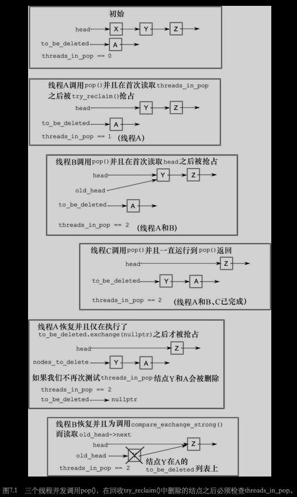

# 第七章 设计无锁的并发数据结构

[TOC]


## 定义和结果

阻塞（blocking）：使用互斥元，条件变量以及future来同步。

非阻塞（nonblocking）：不使用阻塞库函数的数据结构和算法。

### 无锁数据结构的优点和缺点

使用无锁数据结构的原因：

1. 为了实现最大程度的并发
2. 健壮性


## 无锁数据结构的例子

### 编写不用锁的线程安全栈

风险指针（hazard pointers）：如果一个线程准备访问别的线程准备删除的对象，那么他会用风险指针来引用对象，因此就可以通知别的线程删除此对象可能是有风险的。

```c++
unsigned const max_hazard_pointers=100;
struct hazard_pointer
{
  std::atomic<std::thread::id> id;
  std::atomic<void*> pointer;
};
hazard_pointer hazard_pointers[max_hazard_pointers];

class hp_owner
{
  hazard_pointer* hp;
public:
  hp_owner(hp_owner const&)=delete;
  hp_owner operator=(hp_owner const&)=delete;
  hp_owner() : hp(nullptr)
  {
    for (unsigned i = 0; i < max_hazard_pointers; ++i)
    {
      std::thread::id old_id;
      if(hazard_pointers[i].id.compare_exchange_strong( // 试着获取风险指针的所有权
        old_id, std::this_thread::get_id())){
        hp = &hazard_pointers[i];
        break;
      }
    }
    if (!hp)
    {
      throw std::runtime_error("No hazard pointers available");
    }
  }
  std::atomic<void*>& get_pointer()
  {
    return hp->pointer;
  }
  ~hp_owner()
  {
    hp->pointer.store(nullptr);
    hp->id.store(std::thread::id());
  }
}

template<typename T>
class lock_free_stack
{
private:
  struct node;
  struct counted_node_ptr
  {
    int external_count;
    node* ptr;
  };
  struct node
  {
    std::shared_ptr<T> data;
    node* next;
    
    node(T const& data_) : data(std::make_shared<T>(data_)) {}
  };
  
  std::atomic<counted_node_ptr> head;
  std::atomic<unsigned> thread_in_pop;
  std::atomic<node*> to_be_deleted;
  std::atomic<data_to_reclaim*> nodes_to_reclaim;
  
  void try_reclaim(node* old_head);
  static void delete_nodes(node* nodes)
  {
    while(nodes)
    {
      node* next = nodes->next;
      delte nodes;
      nodes = next;
    }
  }
  void increase_head_count(counted_node_ptr& old_counter)
  {
    counted_node_ptr new_counter;
    do
    {
      new_counter = old_counter;
      ++new_counter.external_count;
    }
    while (!head.compare_exchange_strong(old_counter, new_counter, 
                                         std::memory_order_acquire,
                                         std::memory_order_relaxed));
    old_counter.external_count = new_counter.external_count;
  }
  void try_reclaim(node* old_head)
  {
    if (threads_in_pop == 1)
    {
      node* nodes_to_delete = to_be_deleted.exchange(nullptr); // 列出将要被删除的节点清单
      if (!--threads_in_pop)
      {
        delete_nodes(nodes_to_delete);
      }
      else if (nodes_to_delete)
      {
        chain_pending_nodes(nodes_to_delete);
      }
      delete old_head;
    }
    else
    {
      chain_pending_node(old_head);
      --threads_in_pop;
    }
  }
  void chain_pending_nodes(node* nodes)
  {
    node* last = nodes;
    while (node* const next = last->next) // 跟随下一个指针，链至末尾
    {
      last = next;
    }
    chain_pending_nodes(nodes, last);
  }
  void chain_pending_nodes(node* first, node* last)
  {
    last->next = to_be_deleted;
    while (!to_be_deleted.compare_exchange_weak(last->next, first)); // 循环以保证last->next正确
  }
  void chain_pending_node(node* n)
  {
    chain_pending_nodes(n, n);
  }
  std::atomic<void*>& get_hazard_pointer_for_current_thread()
  {
    thread_local static hp_owner hazard; // 每个线程都有自己的风险指针
    return hazard.get_pointer();
  }
  bool outstanding_hazard_pointers_for(void* p)
  {
    for(unsigned i=0; i<maz_hazard_pointers; ++i)
    {
      if(hazard_pointers[i].pointer.load() == p)
      {
        return true;
      }
    }
    return false;
  }
  void add_to_reclaim_list(data_to_reclaim* node)
	{
  	node->next = nodes_to_reclaim.load();
  	while (!nodes_to_reclaim.compare_exchange_weak(node->next, node));
	}
	template<typename T>
	void reclaim_later(T* data)
	{
  	add_to_reclaim_list(new data_to_reclaim(data));
	}
	void delete_nodes_with_no_hazards()
	{
  	data_to_reclaim* current=nodes_to_reclaim.exchange(nullptr);
  	while(current)
    {
    	data_to_reclaim* const next = current->next;
    	if (!outstanding_hazard_pointers_for(current->data))
    	{
      	delete current;
    	}
    	else
    	{
      	add_to_reclaim_list(current);
    	}
    	current = next;
  	}
	}
  template<typename T>
	void do_delete(void* p)
	{
  	delete static_cast<T*>(p);
	}
  
	struct data_to_reclaim
	{
  	void* data;
  	std::function<void(void*)> deleter;
  	data_to_reclaim* next;
  
  	template<typename T>
  	data_to_reclaim(T* p) : data(p), deleter(&do_delete<T>), next(0) {}
  	~data_to_reclaim()
  	{
    	deleter(data);
  	}
	};
public:
  ~lock_free_stack()
  {
    while(pop());
  }
  void push(T const& data)
  {
    counted_node_ptr new_node; // 创建节点
    new_node.ptr = new node(data);
    new_node.external_count = 1;
    new_node.ptr->next = head.load(std::memory_order_relaxed); // 将next指针指向head
    while(!head.compare_exchange_weak(new_node->next, new_node,
                                      std::memory_order_release,
                                      std::memory_order_relaxed)); // 将head指向新节点
  }
  std::shared_ptr<T> pop()
  {
    counted_node_ptr old_head = head.load(std::memory_order_relaxed);
    for (;;)
    {
      increase_head_count(old_head);
      node* const ptr = old_head.ptr;
      if (!ptr)
      {
        return std::shared_ptr<T>();
      }
      if (head.compare_exchange_strong(old_head, ptr->next, std::memory_order_relaxed))
      {
        std::shared_ptr<T> res;
        res.swap(ptr->data);
        int const count_increase = old_head.external_count - 2;
        if (ptr->internal_count.fetch_add(count_increase,
                                         std::memory_order_release)==-count_increase)
        {
          delete ptr;
        }
        return res;
      }
      else if(ptr->internal_count.fetch_add(-1, std::memory_order_relaxed) == 1)
      {
        ptr->internal_count.load(std::memory_order_acquire);
        delete ptr;
      }
    }
  }
};
```



### 编写不用锁的线程安全队列

```c++
template<typename T>
class lock_free_queue
{
private:
  struct node;
  struct counted_node_ptr
  {
    int external_count;
    node* ptr;
  }
  std::atomic<counted_node_ptr> head;
  std::atomic<counted_node_ptr> tail;
  struct node_counter
  {
    unsigned internal_count=30;
    unsigned external_counters=2;
  };
  struct node
  {
    std::atomic<T*> data;
    std::atomic<node_counter> count;
    std::atomic<counted_node_ptr> next;
    
    void release_ref()
    {
    	node_counter old_counter = count.load(std::memory_order_relaxed);
      node_counter new_counter;
      do
      {
        new_counter = old_counter;
        --new_counter.internal_count;
      }
      while (!count.compare_exchange_strong(old_counter, new_counter,
                                            std::memory_order_acquire,
                                            std::memory_order_relaxed));
      if (!new_counter.internal_count && 
          !new_counter.external_counters)
      {
        delete this;
      }
    };
    
    node()
    {
      node_counter new_count;
      new_count.internal_count = 0;
      new_count.external_counters = 2;
      count.store(new_count);
      
      next.ptr = nullptr;
      next.external_count = 0;
    }
  };
  
  node* pop_head()
  {
    node* const old_head = head.load();
    if (old_head == tail.load())
    {
      return nullptr;
    }
    head.store(old_head->next);
    return old_head;
  };
  
  static void increase_external_count(std::atomic<counted_node_ptr>& counter,
                                      counted_node_ptr& old_counter)
  {
    counted_node_ptr new_counter;
    do
    {
      new_counter = old_counter;
      ++new_counter.external_count;
    }
    while (!counter.compare_exchange_strong(old_counter, new_counter, 
           	std::memory_order_acquire, std::memory_order_relaxed));
    old_counter.external_count = new_counter.external_count;
  };
  
  static void free_external_counter(counted_node_ptr &old_node_ptr)
  {
    node* const ptr = old_node_ptr.ptr;
    int const count_increase = old_node_ptr.external_count - 2;
    node_counter old_counter = ptr->count.load(std::memory_order_relaxed);
    node_counter new_counter;
    do
    {
      new_counter = old_counter;
      --new_counter.external_counters;
      new_counter.internal_count += count_increase; // 更新值
    }
    while (!ptr->count.compare_exchange_strong(
    			 old_counter, new_counter,
    		   std::memory_order_acquire, std::memory_order_relaxed));
    if (!new_counter.internal_count && !new_counter.external_counters) // 此节点没有引用，删除
    {
      delete ptr;
    }
  };
  
  void set_new_tail(counted_node_ptr &old_tail,
                    counted_node_ptr const &new_tail)
  {
  	node* const current_tail_ptr = old_tail.ptr;
    while (!tail.compare_exchange_weak(old_tail, new_tail) &&
           old_tail.ptr == current_tail_ptr);
    if (old_tail.ptr == current_tail_ptr)
      free_external_counter(old_tail);
    else
      current_tail_ptr->release_ref();
  }
  
public:
  lodk_free_queue() : head(new node), tail(head.load()) {}
  lock_free_queue(const lock_free_queue& other) = delete;
  lock_free_queue& operator=(const lock_free_queue& other) = delete;
  ~lock_free_queue()
  {
    while(node* const old_head = head.load())
    {
      head.store(old_head->next);
      delete old_head;
    }
  }
  std::unique_ptr<T> pop()
  {
    counted_node_ptr old_head = head.load(std::memory_order_relaxed);
    for (;;)
    {
      increase_external_count(head, old_head);
      node* const ptr = old_head.ptr;
      if (ptr == tail.load().ptr)
      {
        return std::unique_ptr<T>();
      }
      counted_node_ptr next = ptr->next.load();
      if (head.compare_exchange_strong(old_head, ptr->next))
      {
        T* const res = ptr->data.exchange(nullptr);
        free_external_counter(old_head);
        return std::unique_ptr<T>(res);
      }
      ptr->release_ref();
    }
  }
  void push(T new_value)
  {
    std::unique_ptr<T> new_data(new T(new_value));
    counted_node_ptr new_next;
    new_next.ptr = new node;
    new_next.external_count = 1;
    counted_node_ptr old_tail = tail.load();
    for (;;)
    {
      increase_external_count(tail, old_tail);
      T* old_data = nullptr;
      if (old_tail.ptr->data.compare_exchange_strong(
      			old_data, new_data.get())) // 解引用原子指针
      {
        couted_node_ptr old_next = {0};
        if (!old_tail.ptr->next.compare_exchange_strong(old_next, new_next))
        {
          delete new_next.ptr;
          new_next = old_next;
        }
        set_new_tail(old_tail, new_next);
        new_data.release();
        break;
      }
      else
      {
        counted_node_ptr old_next={0};
        if (
            old_tail.ptr->next.compare_exchange_strong(old_next, new_next)) {
          old_next = new_next;
          new_next.ptr = new node;
        }
        set_new_tail(old_tail, old_next); // 真正的更新
      }
    }
  }
};
```


## 编写无锁数据结构的准则

1. 准则：使用`std::memory_order_seq_cst`作为原型

2. 准则：使用无锁内存回收模式

   无锁代码最大的问题之一就是管理内存，当别的线程引用对象的时候就不能删除它们。以下三种方法来确保可以安全回收内存：

   - 等待知道没有线程访问该数据结构，并且删除所有等待删除的对象。
   - 使用风险指针来确定线程正在访问一个特定的对象。
   - 引用计数对象，只有直到没有显著的引用时才删除它们。

   另一个方法就是回收节点，并且当数据结构被销毁的时候才完全释放它们。因为节点是重复使用的，内存永远不会失效，这样避免未定义行为的困难就不存在了。但是会引来`ABA问题`。

3. 准则：当心ABA问题

   ABA问题是任何基于比较/交换的算法都必须提防的问题，它是这样的：

   1. 线程1读取一个原子变量x，并且发现它的值为A。
   2. 线程1基于这个值执行了一些操作，例如解引用它（如果它是指针的话）或者做一些查找操作。
   3. 线程1被操作系统阻塞了。
   4. 另一个线程在x上执行了一些操作，将它的值改为B。
   5. 第三个线程更改了与值A相关的值，因此线程1持有的数值就不再有效了。这个变化有可能很大，如释放它所指向的内存或者改变相关的值一样。
   6. 第三个线程基于新值将x的值改回A。如果这是一个指针，那么就可能是一个新的对象，此对象刚好与先前的对象使用了相同的地址。
   7. 线程1重新取得x，并在x上执行比较/交换操作，与A进行比较。比较/交换操作成功了（因为值确实是A），但是这个A的值是错误的。第二步中读取的值不再有效，但是线程1并不知道，并且将破坏数据机构。

4. 准则：识别忙于等待的循环以及辅助其它线程

