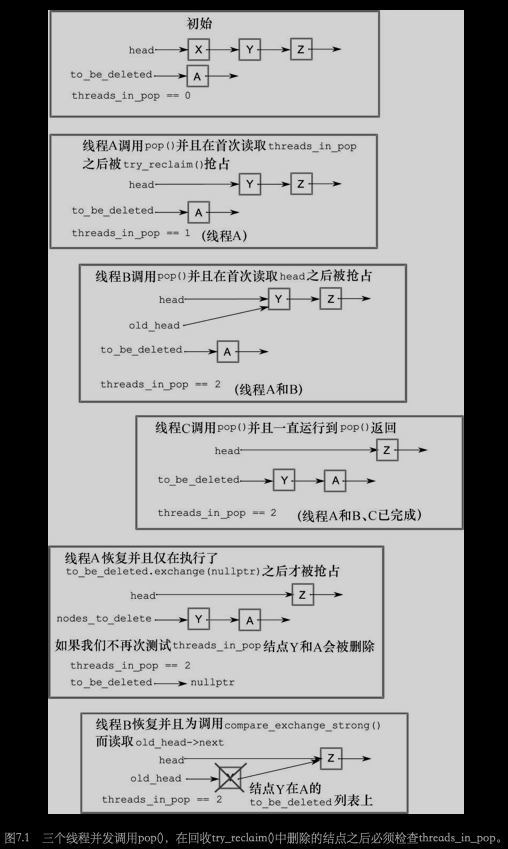

# 第七章 设计无锁的并发数据结构

[TOC]


## 7.1 定义和结果

`阻塞（blocking）`使用互斥元，条件变量以及future来同步。

`非阻塞（nonblocking）`不使用阻塞库函数的数据结构和算法。

### 7.1.1 非阻塞数据结构

```c++
class spinlock_mutex
{
  std::atomic_flag flag;
public:
  spinlock_mutex():
    flag(ATOMIC_FLAG_INIT)
  {}
  void lock()
  {
    while(flag.test_and_set(std::memory_order_acquire));
  }
  void unlock()
  {
    flag.clear(std::memory_order_release);
  }
};
```

### 7.1.2 无锁数据结构

无锁算法中的循环会让一些线程处于“饥饿”状态。如有线程在“错误”时间执行，那么第一个线程将会不停得尝试自己所要完成的操作(其他程序继续执行)。“无锁-无等待”数据结构，就为了避免这种问题存在的。

### 7.1.3 无等待数据结构

无等待数据结构就是：首先，是无锁数据结构；并且，每个线程都能在有限的步数内完成操作，暂且不管其他线程是如何工作的。由于会和别的线程产生冲突，所以算法可以进行无数次尝试，因此并不是无等待的。

### 7.1.4 无锁数据结构的优点和缺点

使用无锁数据结构的原因：

1. 为了实现最大程度的并发。
2. 代码健壮性。


## 7.2 无锁数据结构的例子

### 7.2.1 写一个无锁的线程安全栈

`风险指针（hazard pointers）`如果一个线程准备访问别的线程准备删除的对象，那么他会用风险指针来引用对象，因此就可以通知别的线程删除此对象可能是有风险的。

```c++
unsigned const max_hazard_pointers=100;
struct hazard_pointer
{
  std::atomic<std::thread::id> id;
  std::atomic<void*> pointer;
};
hazard_pointer hazard_pointers[max_hazard_pointers];

class hp_owner
{
  hazard_pointer* hp;
public:
  hp_owner(hp_owner const&)=delete;
  hp_owner operator=(hp_owner const&)=delete;
  hp_owner() : hp(nullptr)
  {
    for (unsigned i = 0; i < max_hazard_pointers; ++i)
    {
      std::thread::id old_id;
      if(hazard_pointers[i].id.compare_exchange_strong( // 试着获取风险指针的所有权
        old_id, std::this_thread::get_id())){
        hp = &hazard_pointers[i];
        break;
      }
    }
    if (!hp)
    {
      throw std::runtime_error("No hazard pointers available");
    }
  }
  std::atomic<void*>& get_pointer()
  {
    return hp->pointer;
  }
  ~hp_owner()
  {
    hp->pointer.store(nullptr);
    hp->id.store(std::thread::id());
  }
}

template<typename T>
class lock_free_stack
{
private:
  struct node;
  struct counted_node_ptr
  {
    int external_count;
    node* ptr;
  };
  struct node
  {
    std::shared_ptr<T> data;
    node* next;
    
    node(T const& data_) : data(std::make_shared<T>(data_)) {}
  };
  
  std::atomic<counted_node_ptr> head;
  std::atomic<unsigned> thread_in_pop;
  std::atomic<node*> to_be_deleted;
  std::atomic<data_to_reclaim*> nodes_to_reclaim;
  
  void try_reclaim(node* old_head);
  static void delete_nodes(node* nodes)
  {
    while(nodes)
    {
      node* next = nodes->next;
      delte nodes;
      nodes = next;
    }
  }
  void increase_head_count(counted_node_ptr& old_counter)
  {
    counted_node_ptr new_counter;
    do
    {
      new_counter = old_counter;
      ++new_counter.external_count;
    }
    while (!head.compare_exchange_strong(old_counter, new_counter, 
                                         std::memory_order_acquire,
                                         std::memory_order_relaxed));
    old_counter.external_count = new_counter.external_count;
  }
  void try_reclaim(node* old_head)
  {
    if (threads_in_pop == 1)
    {
      node* nodes_to_delete = to_be_deleted.exchange(nullptr); // 列出将要被删除的节点清单
      if (!--threads_in_pop)
      {
        delete_nodes(nodes_to_delete);
      }
      else if (nodes_to_delete)
      {
        chain_pending_nodes(nodes_to_delete);
      }
      delete old_head;
    }
    else
    {
      chain_pending_node(old_head);
      --threads_in_pop;
    }
  }
  void chain_pending_nodes(node* nodes)
  {
    node* last = nodes;
    while (node* const next = last->next) // 跟随下一个指针，链至末尾
    {
      last = next;
    }
    chain_pending_nodes(nodes, last);
  }
  void chain_pending_nodes(node* first, node* last)
  {
    last->next = to_be_deleted;
    while (!to_be_deleted.compare_exchange_weak(last->next, first)); // 循环以保证last->next正确
  }
  void chain_pending_node(node* n)
  {
    chain_pending_nodes(n, n);
  }
  std::atomic<void*>& get_hazard_pointer_for_current_thread()
  {
    thread_local static hp_owner hazard; // 每个线程都有自己的风险指针
    return hazard.get_pointer();
  }
  bool outstanding_hazard_pointers_for(void* p)
  {
    for(unsigned i=0; i<maz_hazard_pointers; ++i)
    {
      if(hazard_pointers[i].pointer.load() == p)
      {
        return true;
      }
    }
    return false;
  }
  void add_to_reclaim_list(data_to_reclaim* node)
	{
  	node->next = nodes_to_reclaim.load();
  	while (!nodes_to_reclaim.compare_exchange_weak(node->next, node));
	}
	template<typename T>
	void reclaim_later(T* data)
	{
  	add_to_reclaim_list(new data_to_reclaim(data));
	}
	void delete_nodes_with_no_hazards()
	{
  	data_to_reclaim* current=nodes_to_reclaim.exchange(nullptr);
  	while(current)
    {
    	data_to_reclaim* const next = current->next;
    	if (!outstanding_hazard_pointers_for(current->data))
    	{
      	delete current;
    	}
    	else
    	{
      	add_to_reclaim_list(current);
    	}
    	current = next;
  	}
	}
  template<typename T>
	void do_delete(void* p)
	{
  	delete static_cast<T*>(p);
	}
  
	struct data_to_reclaim
	{
  	void* data;
  	std::function<void(void*)> deleter;
  	data_to_reclaim* next;
  
  	template<typename T>
  	data_to_reclaim(T* p) : data(p), deleter(&do_delete<T>), next(0) {}
  	~data_to_reclaim()
  	{
    	deleter(data);
  	}
	};
public:
  ~lock_free_stack()
  {
    while(pop());
  }
  void push(T const& data)
  {
    counted_node_ptr new_node; // 创建节点
    new_node.ptr = new node(data);
    new_node.external_count = 1;
    new_node.ptr->next = head.load(std::memory_order_relaxed); // 将next指针指向head
    while(!head.compare_exchange_weak(new_node->next, new_node,
                                      std::memory_order_release,
                                      std::memory_order_relaxed)); // 将head指向新节点
  }
  std::shared_ptr<T> pop()
  {
    counted_node_ptr old_head = head.load(std::memory_order_relaxed);
    for (;;)
    {
      increase_head_count(old_head);
      node* const ptr = old_head.ptr;
      if (!ptr)
      {
        return std::shared_ptr<T>();
      }
      if (head.compare_exchange_strong(old_head, ptr->next, std::memory_order_relaxed))
      {
        std::shared_ptr<T> res;
        res.swap(ptr->data);
        int const count_increase = old_head.external_count - 2;
        if (ptr->internal_count.fetch_add(count_increase,
                                         std::memory_order_release)==-count_increase)
        {
          delete ptr;
        }
        return res;
      }
      else if(ptr->internal_count.fetch_add(-1, std::memory_order_relaxed) == 1)
      {
        ptr->internal_count.load(std::memory_order_acquire);
        delete ptr;
      }
    }
  }
};
```



### 7.2.2 停止内存泄漏：使用无锁数据结构管理内存

清单7.4 没有线程通过pop()访问节点时，就对节点进行回收：

```c++
template<typename T>
class lock_free_stack
{
private:
  std::atomic<unsigned> threads_in_pop;  // 1 原子变量
  void try_reclaim(node* old_head);
public:
  std::shared_ptr<T> pop()
  {
    ++threads_in_pop;  // 2 在做事之前，计数值加1
    node* old_head=head.load();
    while(old_head &&
      !head.compare_exchange_weak(old_head,old_head->next));
    std::shared_ptr<T> res;
    if(old_head)
    { 
      res.swap(old_head->data);  // 3 回收删除的节点
    }
    try_reclaim(old_head);  // 4 从节点中直接提取数据，而非拷贝指针
    return res;
  }
};
```

清单7.5 采用引用计数的回收机制：

```c++
template<typename T>
class lock_free_stack
{
private:
  std::atomic<node*> to_be_deleted;

  static void delete_nodes(node* nodes)
  {
    while(nodes)
    {
      node* next=nodes->next;
      delete nodes;
      nodes=next;
    }
  }
  void try_reclaim(node* old_head)
  {
    if(threads_in_pop==1)  // 1
    {
      node* nodes_to_delete=to_be_deleted.exchange(nullptr);  // 2 声明“可删除”列表
      if(!--threads_in_pop)  // 3 是否只有一个线程调用pop()？
      {
        delete_nodes(nodes_to_delete);  // 4
      }
      else if(nodes_to_delete)  // 5
      {
         chain_pending_nodes(nodes_to_delete);  // 6
      }
      delete old_head;  // 7
    }
    else
    {
      chain_pending_node(old_head);  // 8
      --threads_in_pop;
    }
  }
  void chain_pending_nodes(node* nodes)
  {
    node* last=nodes;
    while(node* const next=last->next)  // 9 让next指针指向链表的末尾
    {
      last=next;
    }
    chain_pending_nodes(nodes,last);
  }

  void chain_pending_nodes(node* first,node* last)
  {
    last->next=to_be_deleted;  // 10
    while(!to_be_deleted.compare_exchange_weak(  // 11 用循环来保证last->next的正确性
      last->next,first));
    }
    void chain_pending_node(node* n)
    {
      chain_pending_nodes(n,n);  // 12
    }
};
```

### 7.2.3 检测使用风险指针(不可回收)的节点

清单7.6 使用风险指针实现的pop()

```c++
std::shared_ptr<T> pop()
{
  std::atomic<void*>& hp=get_hazard_pointer_for_current_thread();
  node* old_head=head.load();
  do
  {
    node* temp;
    do  // 1 直到将风险指针设为head指针
    {
      temp=old_head;
      hp.store(old_head);
      old_head=head.load();
    } while(old_head!=temp);
  }
  while(old_head &&
    !head.compare_exchange_strong(old_head,old_head->next));
  hp.store(nullptr);  // 2 当声明完成，清除风险指针
  std::shared_ptr<T> res;
  if(old_head)
  {
    res.swap(old_head->data);
    if(outstanding_hazard_pointers_for(old_head))  // 3 在删除之前对风险指针引用的节点进行检查
    {
      reclaim_later(old_head);  // 4
    }
    else
    {
      delete old_head;  // 5
    }
    delete_nodes_with_no_hazards();  // 6
  }
  return res;
}
```

清单7.7 get_hazard_pointer_for_current_thread()函数的简单实现：

```c++
unsigned const max_hazard_pointers=100;
struct hazard_pointer
{
  std::atomic<std::thread::id> id;
  std::atomic<void*> pointer;
};
hazard_pointer hazard_pointers[max_hazard_pointers];

class hp_owner
{
  hazard_pointer* hp;

public:
  hp_owner(hp_owner const&)=delete;
  hp_owner operator=(hp_owner const&)=delete;
  hp_owner():
    hp(nullptr)
  {
    for(unsigned i=0;i<max_hazard_pointers;++i)
    {
      std::thread::id old_id;
      if(hazard_pointers[i].id.compare_exchange_strong(  // 6 尝试声明风险指针的所有权
         old_id,std::this_thread::get_id()))
      {
        hp=&hazard_pointers[i];
        break;  // 7
      }
    }
    if(!hp)  // 1
    {
      throw std::runtime_error("No hazard pointers available");
    }
  }

  std::atomic<void*>& get_pointer()
  {
    return hp->pointer;
  }

  ~hp_owner()  // 2
  {
    hp->pointer.store(nullptr);  // 8
    hp->id.store(std::thread::id());  // 9
  }
};

std::atomic<void*>& get_hazard_pointer_for_current_thread()  // 3
{
  thread_local static hp_owner hazard;  // 4 每个线程都有自己的风险指针
  return hazard.get_pointer();  // 5
}
```

清单7.8 回收函数的简单实现：

```c++
template<typename T>
void do_delete(void* p)
{
  delete static_cast<T*>(p);
}

struct data_to_reclaim
{
  void* data;
  std::function<void(void*)> deleter;
  data_to_reclaim* next;

  template<typename T>
  data_to_reclaim(T* p):  // 1
    data(p),
    deleter(&do_delete<T>),
    next(0)
  {}

  ~data_to_reclaim()
  {
    deleter(data);  // 2
  }
};

std::atomic<data_to_reclaim*> nodes_to_reclaim;

void add_to_reclaim_list(data_to_reclaim* node)  // 3
{
  node->next=nodes_to_reclaim.load();
  while(!nodes_to_reclaim.compare_exchange_weak(node->next,node));
}

template<typename T>
void reclaim_later(T* data)  // 4
{
  add_to_reclaim_list(new data_to_reclaim(data));  // 5
}

void delete_nodes_with_no_hazards()
{
  data_to_reclaim* current=nodes_to_reclaim.exchange(nullptr);  // 6
  while(current)
  {
    data_to_reclaim* const next=current->next;
    if(!outstanding_hazard_pointers_for(current->data))  // 7
    {
      delete current;  // 8
    }
    else
    {
      add_to_reclaim_list(current);  // 9
    }
    current=next;
  }
}
```

### 7.2.4 检测使用引用计数的节点

清单7.9 无锁栈——使用无锁`std::shared_ptr<>`的实现：

```c++
template<typename T>
class lock_free_stack
{
private:
  struct node
  {
    std::shared_ptr<T> data;
    std::shared_ptr<node> next;
    node(T const& data_):
      data(std::make_shared<T>(data_))
    {}
  };

  std::shared_ptr<node> head;
public:
  void push(T const& data)
  {
    std::shared_ptr<node> const new_node=std::make_shared<node>(data);
    new_node->next=head.load();
    while(!std::atomic_compare_exchange_weak(&head,
        &new_node->next,new_node));
  }
  std::shared_ptr<T> pop()
  {
    std::shared_ptr<node> old_head=std::atomic_load(&head);
    while(old_head && !std::atomic_compare_exchange_weak(&head,
        &old_head,old_head->next));
    return old_head ? old_head->data : std::shared_ptr<T>();
  }
};
```

清单7.10 使用分离引用计数的方式推送一个节点到无锁栈中：

```c++
template<typename T>
class lock_free_stack
{
private:
  struct node;

  struct counted_node_ptr  // 1
  {
    int external_count;
    node* ptr;
  };

  struct node
  {
    std::shared_ptr<T> data;
    std::atomic<int> internal_count;  // 2
    counted_node_ptr next;  // 3

    node(T const& data_):
      data(std::make_shared<T>(data_)),
      internal_count(0)
    {}
  };

  std::atomic<counted_node_ptr> head;  // 4

public:
  ~lock_free_stack()
  {
    while(pop());
  }

  void push(T const& data)  // 5
  {
    counted_node_ptr new_node;
    new_node.ptr=new node(data);
    new_node.external_count=1;
    new_node.ptr->next=head.load();
    while(!head.compare_exchange_weak(new_node.ptr->next,new_node));
  }
};
```

清单7.11 使用分离引用计数从无锁栈中弹出一个节点：

```c++
template<typename T>
class lock_free_stack
{
private:
  void increase_head_count(counted_node_ptr& old_counter)
  {
    counted_node_ptr new_counter;

    do
    {
      new_counter=old_counter;
      ++new_counter.external_count;
    }
    while(!head.compare_exchange_strong(old_counter,new_counter));  // 1

    old_counter.external_count=new_counter.external_count;
  }
public:
  std::shared_ptr<T> pop()
  {
    counted_node_ptr old_head=head.load();
    for(;;)
    {
      increase_head_count(old_head);
      node* const ptr=old_head.ptr;  // 2
      if(!ptr)
      {
        return std::shared_ptr<T>();
      }
      if(head.compare_exchange_strong(old_head,ptr->next))  // 3
      {
        std::shared_ptr<T> res;
        res.swap(ptr->data);  // 4

        int const count_increase=old_head.external_count-2;  // 5

        if(ptr->internal_count.fetch_add(count_increase)==  // 6
           -count_increase)
        {
          delete ptr;
        }

        return res;  // 7
      }
      else if(ptr->internal_count.fetch_sub(1)==1)
      {
        delete ptr;  // 8
      }
    }
  }
};
```

### 7.2.5 应用于无锁栈上的内存模型

清单7.12 基于引用计数和松散原子操作的无锁栈

```c++
template<typename T>
class lock_free_stack
{
private:
  struct node;
  struct counted_node_ptr
  {
    int external_count;
    node* ptr;
  };

  struct node
  {
    std::shared_ptr<T> data;
    std::atomic<int> internal_count;
    counted_node_ptr next;

    node(T const& data_):
      data(std::make_shared<T>(data_)),
      internal_count(0)
    {}
  };

  std::atomic<counted_node_ptr> head;

  void increase_head_count(counted_node_ptr& old_counter)
  {
    counted_node_ptr new_counter;

    do
    {
      new_counter=old_counter;
      ++new_counter.external_count;
    }
    while(!head.compare_exchange_strong(old_counter,new_counter,
                                        std::memory_order_acquire,
                                        std::memory_order_relaxed));
    old_counter.external_count=new_counter.external_count;
  }
public:
  ~lock_free_stack()
  {
    while(pop());
  }

  void push(T const& data)
  {
    counted_node_ptr new_node;
    new_node.ptr=new node(data);
    new_node.external_count=1;
    new_node.ptr->next=head.load(std::memory_order_relaxed)
    while(!head.compare_exchange_weak(new_node.ptr->next,new_node,
                                      std::memory_order_release,
                                      std::memory_order_relaxed));
  }
  std::shared_ptr<T> pop()
  {
    counted_node_ptr old_head=
       head.load(std::memory_order_relaxed);
    for(;;)
    {
      increase_head_count(old_head);
      node* const ptr=old_head.ptr;
      if(!ptr)
      {
        return std::shared_ptr<T>();
      }
      if(head.compare_exchange_strong(old_head,ptr->next,
                                      std::memory_order_relaxed))
      {
        std::shared_ptr<T> res;
        res.swap(ptr->data);

        int const count_increase=old_head.external_count-2;

        if(ptr->internal_count.fetch_add(count_increase,
              std::memory_order_release)==-count_increase)
        {
          delete ptr;
        }

        return res;
      }
      else if(ptr->internal_count.fetch_add(-1,
                   std::memory_order_relaxed)==1)
      {
        ptr->internal_count.load(std::memory_order_acquire);
        delete ptr;
      }
    }
  }
};
```

### 7.2.6 写一个无锁的线程安全队列

清单7.13 单生产者/单消费者模型下的无锁队列：

```c++
template<typename T>
class lock_free_queue
{
private:
  struct node
  {
    std::shared_ptr<T> data;
    node* next;

    node():
       next(nullptr)
    {}
  };

  std::atomic<node*> head;
  std::atomic<node*> tail;

  node* pop_head()
  {
    node* const old_head=head.load();
    if(old_head==tail.load())  // 1
    {
      return nullptr;
    }
    head.store(old_head->next);
    return old_head;
  }
public:
  lock_free_queue():
      head(new node),tail(head.load())
  {}

  lock_free_queue(const lock_free_queue& other)=delete;
  lock_free_queue& operator=(const lock_free_queue& other)=delete;

  ~lock_free_queue()
  {
    while(node* const old_head=head.load())
    {
      head.store(old_head->next);
      delete old_head;
    }
  }
  std::shared_ptr<T> pop()
  {
    node* old_head=pop_head();
    if(!old_head)
    {
      return std::shared_ptr<T>();
    }

    std::shared_ptr<T> const res(old_head->data);  // 2
    delete old_head;
    return res;
  }

  void push(T new_value)
  {
    std::shared_ptr<T> new_data(std::make_shared<T>(new_value));
    node* p=new node;  // 3
    node* const old_tail=tail.load();  // 4
    old_tail->data.swap(new_data);  // 5
    old_tail->next=p;  // 6
    tail.store(p);  // 7
  }
};
```

清单7.15 使用带有引用计数tail，实现的无锁队列中的push()：

```c++
template<typename T>
class lock_free_queue
{
private:
  struct node;
  struct counted_node_ptr
  {
    int external_count;
    node* ptr;
  };

  std::atomic<counted_node_ptr> head;
  std::atomic<counted_node_ptr> tail;  // 1

  struct node_counter
  {
    unsigned internal_count:30;
    unsigned external_counters:2;  // 2
  };

  struct node
  {
    std::atomic<T*> data;
    std::atomic<node_counter> count;  // 3
    counted_node_ptr next;

    node()
    {
      node_counter new_count;
      new_count.internal_count=0;
      new_count.external_counters=2;  // 4
      count.store(new_count);

      next.ptr=nullptr;
      next.external_count=0;
     }
  };
public:
  void push(T new_value)
  {
    std::unique_ptr<T> new_data(new T(new_value));
    counted_node_ptr new_next;
    new_next.ptr=new node;
    new_next.external_count=1;
    counted_node_ptr old_tail=tail.load();

    for(;;)
    {
      increase_external_count(tail,old_tail);  // 5

      T* old_data=nullptr;
      if(old_tail.ptr->data.compare_exchange_strong(  // 6
           old_data,new_data.get()))
      {
        old_tail.ptr->next=new_next;
        old_tail=tail.exchange(new_next);
        free_external_counter(old_tail);  // 7
        new_data.release();
        break;
      }
      old_tail.ptr->release_ref();
    }
  }
};
```

清单7.16 使用尾部引用计数，将节点从无锁队列中弹出

```c++
template<typename T>
class lock_free_queue
{
private:
  struct node
  {
    void release_ref();
  };
public:
  std::unique_ptr<T> pop()
  {
    counted_node_ptr old_head=head.load(std::memory_order_relaxed);  // 1
    for(;;)
    {
      increase_external_count(head,old_head);  // 2
      node* const ptr=old_head.ptr;
      if(ptr==tail.load().ptr)
      {
        ptr->release_ref();  // 3
        return std::unique_ptr<T>();
      }
      if(head.compare_exchange_strong(old_head,ptr->next))  // 4
      {
        T* const res=ptr->data.exchange(nullptr);
        free_external_counter(old_head);  // 5
        return std::unique_ptr<T>(res);
      }
      ptr->release_ref();  // 6
    }
  }
};
```

清单7.17 在无锁队列中释放一个节点引用：

```c++
template<typename T>
class lock_free_queue
{
private:
  struct node
  {
    void release_ref()
    {
      node_counter old_counter=
        count.load(std::memory_order_relaxed);
      node_counter new_counter;
      do
      {
        new_counter=old_counter;
        --new_counter.internal_count;  // 1
      }
      while(!count.compare_exchange_strong(  // 2
            old_counter,new_counter,
            std::memory_order_acquire,std::memory_order_relaxed));
      if(!new_counter.internal_count &&
         !new_counter.external_counters)
      {
        delete this;  // 3
      }
    }
  };
};
```

清单7.18 从无锁队列中获取一个节点的引用：

```c++
template<typename T>
class lock_free_queue
{
private:
  static void increase_external_count(
    std::atomic<counted_node_ptr>& counter,
    counted_node_ptr& old_counter)
  {
    counted_node_ptr new_counter;
    do
    {
      new_counter=old_counter;
      ++new_counter.external_count;
    }
    while(!counter.compare_exchange_strong(
      old_counter,new_counter,
      std::memory_order_acquire,std::memory_order_relaxed));

    old_counter.external_count=new_counter.external_count;
  }
};
```

清单7.19 无锁队列中释放节点外部计数器：

```c++
template<typename T>
class lock_free_queue
{
private:
  static void free_external_counter(counted_node_ptr &old_node_ptr)
  {
    node* const ptr=old_node_ptr.ptr;
    int const count_increase=old_node_ptr.external_count-2;

    node_counter old_counter=
      ptr->count.load(std::memory_order_relaxed);
    node_counter new_counter;
    do
    {
      new_counter=old_counter;
      --new_counter.external_counters;  // 1
      new_counter.internal_count+=count_increase;  // 2
    }
    while(!ptr->count.compare_exchange_strong(  // 3
           old_counter,new_counter,
           std::memory_order_acquire,std::memory_order_relaxed));

    if(!new_counter.internal_count &&
       !new_counter.external_counters)
    {
      delete ptr;  // 4
    }
  }
};
```

清单7.20 修改pop()用来帮助push()完成工作：

```c++
template<typename T>
class lock_free_queue
{
private:
  struct node
  {
    std::atomic<T*> data;
    std::atomic<node_counter> count;
    std::atomic<counted_node_ptr> next;  // 1
  };
public:
  std::unique_ptr<T> pop()
  {
    counted_node_ptr old_head=head.load(std::memory_order_relaxed);
    for(;;)
    {
      increase_external_count(head,old_head);
      node* const ptr=old_head.ptr;
      if(ptr==tail.load().ptr)
      {
        return std::unique_ptr<T>();
      }
      counted_node_ptr next=ptr->next.load();  // 2
      if(head.compare_exchange_strong(old_head,next))
      {
        T* const res=ptr->data.exchange(nullptr);
        free_external_counter(old_head);
        return std::unique_ptr<T>(res);
      } 
      ptr->release_ref();
    }
  }
};
```

清单7.21 无锁队列中简单的帮助性push()的实现：

```c++
template<typename T>
class lock_free_queue
{
private:
  void set_new_tail(counted_node_ptr &old_tail,  // 1
                    counted_node_ptr const &new_tail)
  {
    node* const current_tail_ptr=old_tail.ptr;
    while(!tail.compare_exchange_weak(old_tail,new_tail) &&  // 2
          old_tail.ptr==current_tail_ptr);
    if(old_tail.ptr==current_tail_ptr)  // 3
      free_external_counter(old_tail);  // 4
    else
      current_tail_ptr->release_ref();  // 5
  }
public:
  void push(T new_value)
  {
    std::unique_ptr<T> new_data(new T(new_value));
    counted_node_ptr new_next;
    new_next.ptr=new node;
    new_next.external_count=1;
    counted_node_ptr old_tail=tail.load();

    for(;;)
    {
      increase_external_count(tail,old_tail);

      T* old_data=nullptr;
      if(old_tail.ptr->data.compare_exchange_strong(  // 6
         old_data,new_data.get()))
      {
        counted_node_ptr old_next={0};
        if(!old_tail.ptr->next.compare_exchange_strong(  // 7
           old_next,new_next))
        {
          delete new_next.ptr;  // 8
          new_next=old_next;  // 9
        }
        set_new_tail(old_tail, new_next);
        new_data.release();
        break;
      }
      else  // 10
      {
        counted_node_ptr old_next={0};
        if(old_tail.ptr->next.compare_exchange_strong(  // 11
           old_next,new_next))
        {
          old_next=new_next;  // 12
          new_next.ptr=new node;  // 13
        }
        set_new_tail(old_tail, old_next);  // 14
      }
    }
  }
};
```


## 7.3 对于设计无锁数据结构的指导建议

### 7.3.1 指导建议：使用`std::memory_order_seq_cst`的原型

使用`std::memory_order_seq_cst`作为原型。

### 7.3.2 指导建议：对无锁内存的回收策略

无锁代码最大的问题之一就是管理内存，当别的线程引用对象的时候就不能删除它们。以下三种方法来确保可以安全回收内存：

- 等待知道没有线程访问该数据结构，并且删除所有等待删除的对象。
- 使用风险指针来确定线程正在访问一个特定的对象。
- 引用计数对象，只有直到没有显著的引用时才删除它们。

另一个方法就是回收节点，并且当数据结构被销毁的时候才完全释放它们。因为节点是重复使用的，内存永远不会失效，这样避免未定义行为的困难就不存在了。但是会引来`ABA问题`。

### 7.3.3 指导建议：小心ABA问题

[ABA问题维基百科](https://en.wikipedia.org/wiki/ABA_problem)

ABA问题是任何基于比较/交换的算法都必须提防的问题，它是这样的：

1. 线程1读取一个原子变量x，并且发现它的值为A。
2. 线程1基于这个值执行了一些操作，例如解引用它（如果它是指针的话）或者做一些查找操作。
3. 线程1被操作系统阻塞了。
4. 另一个线程在x上执行了一些操作，将它的值改为B。
5. 第三个线程更改了与值A相关的值，因此线程1持有的数值就不再有效了。这个变化有可能很大，如释放它所指向的内存或者改变相关的值一样。
6. 第三个线程基于新值将x的值改回A。如果这是一个指针，那么就可能是一个新的对象，此对象刚好与先前的对象使用了相同的地址。
7. 线程1重新取得x，并在x上执行比较/交换操作，与A进行比较。比较/交换操作成功了（因为值确实是A），但是这个A的值是错误的。第二步中读取的值不再有效，但是线程1并不知道，并且将破坏数据机构。

### 7.3.4 指导建议：识别忙等待循环和帮助其他线程

识别忙于等待的循环以及辅助其它线程。


## 7.4 总结

