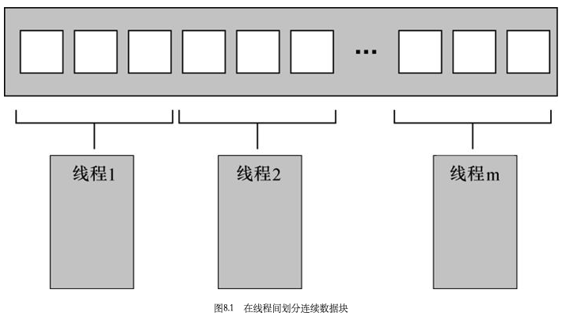
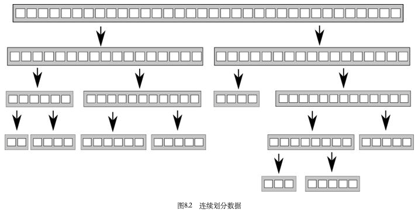

# 第八章 设计并发代码

[TOC]


## 在线程间划分工作的技术

### 处理开始前在线程间划分数据



### 递归地划分数据



使用待排序块栈的并行快速排序，例：

```c++
template<typename T>
struct sorter
{
  struct chunk_to_sort
  {
    std::list<T> data;
    std::promise<std::list<T> > promise;
  };
  thread_safe_stack<chunk_to_sort> chunks; // 未排序块
  std::vector<std::thread> threads; // 线程集
  unsigned const max_thread_count;
  std::atomic<bool> end_of_data;
  sorter() : 
  	max_thread_count(std::thread::hardware_concurrency() - 1), 
  	end_of_data(false)
  {}
  ~sorter()
  {
    end_of_data = true;
    for (unsigned i = 0; i < threads.size(); ++i)
    {
      threads[i].join();
    }
  }
  void try_sort_chunk()
  {
    boost::shared_ptr<chunk_to_sort > chunk = chunks.pop(); // 块出栈
    if (chunk)
    {
      sort_chunk(chunk); // 块排序
    }
  }
  
  std::list<T> do_sort(std::list<T>& chunk_data) // 真正的排序逻辑
  {
  	if (chunk_data.empty())  
    {
      return chunk_data;
    }
    std::list<T> result;
    result.splice(result.begin(), chunk_data, chunk_data.begin());
    T const& partition_val = *result.begin();
    typename std::list<T>::iterator divide_point = 
      std::partition(chunk_data.begin(), chunk_data.end(),
                     [&](T const& val){return val < partition_val; }); // 排序逻辑
    chunk_to_sort new_lower_chunk;
    new_lower_chunk.data.splice(new_lower_chunk.data.end(),
                                chunk_data, chunk_data.begin(), divide_point);
    std::future<std::list<T> > new_lower = new_lower_chunk.promise.get_future();
    chunks.push(std::move(new_lower_chunk)); // 压入栈
    if (threads.size() < max_thread_count)
    {
      threads.push_back(std::thread(&sorter<T>::sort_thread, this));
    }
    std::list<T> new_higher(do_sort(chunk_data));
    result.splice(result.end(), new_higher);
    while (new_lower.wait_for(std::chrono::seconds(0)) != 
          std::future_status::ready) // 等待线程结束
    {
      try_sort_chunk(); // 排序块;
    }
    result.splice(result.begin(), new_lower.get());
    return result;
  }
  void sort_chunk(boost::shared_ptr<chunk_to_sort > const& chunk)
  {
    chunk->promise.set_value(do_sort(chunk->data)); // 将结果存储在promise
  }
  void sort_thread()
  {
    while(!end_of_data) // 数据结束，线程退出
    {
      try_sort_chunk();
      std::this_thread::yield();
    }
  }
};

template<typename T>
std::list<T> parallel_quick_sort(std::list<T> input) // 对未排序块所在的栈进行分组
{
  if(input.empty())
  {
    return input;
  }
  sorter<T> s;
  return s.do_sort(input); // 设置数据结束标志位，通过标志位来结束线程
}
```

### 以任务类型划分工作

1. 以任务类型划分工作来分离关注点
2. 划分线程间的任务序列


## 影响并发代码性能的因素

- 处理器数量

  linux下可以使用`std::thread::hardwarre_concurrency()`来获取硬件支持的最大同时运行的线程数量

- 数据竞争

  **高竞争(high contention)：**一个处理器已经准备好更新这个值，但是另一个处理器已经在做了，这就要等待另一个处理器更新，并且这个改动已经传播完成。

  **低竞争(low contention)：**处理器很少需要互相等待。

  **乒乓缓存(cacheping-pong)：**数据在各处理器的缓存间来回传递，如果处理器因为需要等待缓存而被挂起，在这个时间里处理器无法工作，严重影响程序的性能。

  错误示例：

  ```c++
  std::mutex m;
  my_data data;
  void processing_loop_with_mutex()
  {
    while(true)
    {
      std::lock_guard<std::mutex> lk(m);
      if (done_processing(data)) break;
    }
  }
  ```

- 假共享

  处理器缓存的最小单位通常不是一个内存地址，而是一小块称为**缓存线(cacheline)**的内存。这些内存块一般大小为`32~64`字节，取决于具体的处理器。缓存只能处理缓存线大小的内存块，相邻地址的数据会被载入同一个缓存线。有时这是好事，线程访问的数据在同一个缓存线比分布在多个缓存线更好。但是如果缓存线内有不相关但需要被别的线程访问的数据，会导致严重的性能问题。

  **假共享(false sharing)：**一个线程在更改其访问的数据时，缓存线的所有权需要转移到其所在的处理器，而另一个线程所需的数据可能也在这个缓存线上，当它访问时缓存线又要再次转移。这个缓存线是两者共享的，然而其中的数据并不共享。通俗地说就是是一个线程访问的数据与另一个线程的靠的太近而导致的问题。

- 过度订阅和过多的任务切换

  频繁地切换任务会导致性能损失


## 为多线程性能设计数据结构

### 其他数据结构中的数据访问方式

- 在线程间改变数据分配，使得相邻的数据被同一个线程适用。
- 最小化任何给定线程需要的数据。
- 确保独立的线程访问的数据相隔足够远来避免假共享。


## 为并发设计时的额外考虑

### 并行算法中的异常安全

1. 增加异常安全性

   ```c++
   template<typename Iterator, typename T>
   T parallel_accumulate(Iterator first, Iterator last, T init)
   {
     unsigned long const length = std::distance(first, last);
     if (!length)
       return init;
     unsigned long const min_per_thread = 25;
     unsigned long const max_threads = (length+min_per_thread - 1)/min_per_thread;
     unsigned long const hardware_threads = std::thread::hardware_concurrency();
     unsigned long const num_threads = std::min(hardware_threads != 0 ? 
                                               hardware_threads : 2, max_threads);
     unsigned long const block_size = length / num_threads;
     std::vector<std::future<T> > futures(num_threads - 1);
     std::vector<std::thread> threads(num_threads - 1);
     join_threads joiner(threads);
     Iterator block_start = first;
     for (unsigned long i=0; i<(num_threads-1); ++i)
     {
       Iterator block_end = block_start;
       std::advance(block_end, block_size);
       std::packaged_task<T(Iterator, Iterator)> task(accumulate_block<Iterator, T>());
       futures[i] = task.get_future();
       threads[i] = std::thread(std::move(task), block_start, block_end);
       block_start = block_end;
     }
     T last_result = accumulate_block()(block_start, last);
     T result = init;
     for (unsigned long i = 0; i < (num_threads - 1); ++i)
     {
       result += futures[i].get(); // 阻塞
     }
     result += last_result;
     return result;
   }
   ```

2. `STD::ASYNC()`的异常安全

   ```c++
   template<typename Iterator, typename T>
   T parallel_accumulate(Iterator first, Iterator last, T init)
   {
     unsigned long const length = std::distance(first, last);
     unsigned long const max_chunk_size = 25;
     if (length <= max_chunk_size)
     {
       return std::accumulate(first, last, init);
     }
     else
     {
       Iterator mid_point = first;
       std::advance(mid_point, length/2);
       std::future<T> first_half_result = std::async(parallel_accumulate<Iterator, T>, first, mid_point, init); // 异步处理
       T second_half_result = parallel_accumulate(mid_point, last, T());
       return first_half_result.get() + second_half_result;
     }
   }
   ```

### 可扩展性和阿姆达定律

**可扩展性**是关于确保你的应用可以利用系统中增加的处理器。

**阿姆达尔定律(Amdahl's law)：**$P=\frac{1}{f_s + \frac{1 - f_s}{N}}$

- $P$: 性能
- $f_s$: "串行部分"
- $N$: 处理器个数

### 用并发提高响应性

例，从任务线程中分离GUI线程：

```c++
std::thread task_thread;
std::atomic<bool> task_cancelled(false);
void gui_thread()
{
  while(true)
  {
    event_data event = get_event();
    if (event.type == quit)
      break;
    process(event);
  }
}

void task()
{
  while(!task_complete() && !task_cancelled)
  {
    do_next_operation();
  }
  if (task_cancelled)
  {
    perform_cleanup();
  }
  else
  {
    post_gui_event(task_complete);
  }
}

void process(event_data const& event)
{
  switch(event.type)
  {
    case start_task:
      task_cancelled = false;
      task_thread=std::thread(task);
      break;
    case stop_task:
      task_cancelled=true;
      task_thread.join();
      break;
    case task_complete:
      task_thread.join();
      display_results();
      break;
    default:
      // ...
  }
}
```


## 在实践中设计并发代码

### `std::for_each`的并行实现

```c++
template<typename Iterator, typename Func>
void parallel_for_each(Iterator first, Iterator last, Func f)
{
  unsigned long const length = std::distance(first, last);
  if(!length)
    return;
  unisgned long const min_per_threads = 25;
  if (length < (2*min_per_thread))
  {
    std::for_each(first, last, f);
  }
  else
  {
    Iterator const mid_point = first + length/2;
    std::future<void> first_half = std::async(&parallel_for_each<Iterator, Func>, 
                                              first, mid_point, f);
    parallel_for_each(mid_point, last, f);
    first_half.get();
  }
}
```

### `std::find`的并行实现

```c++
template<typename Iterator, typename MatchType>
Iterator parallel_find_impl(Iterator first, Iterator last, MatchType match, 
                            std::atomic<bool>& done)
{
  try
  {
    unsigned long const length = std::distance(first, last);
    unsigned long const min_per_thread = 25;
    if (length < (2*min_per_thread))
    {
      for(;(first != last) && !done.load(); ++first)
      {
        if (*first == match)
        {
          done = true;
          return first;
        }
      }
      return last;
    }
    else
    {
      Iterator const mid_point = first + (length/2);
      std::future<Iterator> async_result = std::async(
        &parallel_find_impl<Iterator, MatchType>, mid_point, std::ref(done));
      Iterator const direct_result = 
        parallel_find_impl(first, mid_point, match, done);
      return (direct_result == mid_point) ? async_result.get() : direct_result;
    }
  }
  catch(...)
  {
    done = true;
    throw;
  }
}

template<typename Iterator, typename MatchType>
Iterator parallel_find(Iterator first, Iterator last, MatchType match)
{
  std::atomic<bool> done(false);
  return parallel_find_impl(first, last, match, done);
}
```

### `std::partial_sum`的并行实现

例，通过划分问题来并行计算分段的和：

```c++
template <typename Iterator>
void parallel_partial_sum(Iterator first, Iterator last)
{
  typedef typename Iterator::value_type value_type;
  struct process_chunk
  {
    void operator()(Iterator begin, Iterator last,
                    std::future<value_type>* previous_end_value,
                    std::promise<value_type>* end_value)
    {
      try
      {
        Iterator end = last;
        ++end;
        std::partial_sum(begin, end, begin);
        if (previous_end_value)
        {
          value_type& addend = previous_end_value->get();
          *last += addend;
          if (end_value)
          {
            end_value->set_value(*last);
          }
          std::for_each(begin, last, [addend](value_type& item){
            item += addend;
          });
        }
        else if(end_value)
        {
          end_value->set_value(*last);
        }
      }
      catch(...)
      {
        if (end_value)
        {
          end_value->set_exception(std::current_exception());
        }
        else
        {
          throw;
        }
      }
    }
  };
  unsigned long const length = std::distance(first, last);
  if (!length)
    return last;
  unsigned long const min_per_thread = 25; // 分为25个线程
  unsigned long const max_threads = (length+min_per_thread-1)/min_per_thread;
  unsigned long const hardware_threads = std::thread::hardware_concurrency();
  unsigned long const num_threads = std::min(hardware_threads != 0 ? 
                                             hardware_threads : 2, max_threads);
  unsigned long const block_size = length / num_threads;
  typedef typename Iterator::value_type value_type;
  std::vector<std::thread> threads(num_threads - 1);
  std::vector<std::promise<value_type> > end_values(num_threads - 1);
  std::vector<std::future<value_type> > previous_end_values;
  previous_end_values.reserve(num_threads - 1);
  join_threads joiner(threads);
  Iterator block_start = first;
  for (unsigned long i = 0; i < (num_threads - 1); ++i)
  {
    Iterator block_last = block_start;
    std::advance(block_last, block_size - 1);
    threads[i] = std::thread(process_chunk(),
                             block_start, block_last,
                             (i != 0) ? previous_end_values[i-1]:0,
                             &end_values[i]);
    block_start = block_last;
    ++block_start; // 传递下一个
    previous_end_values.push_back(end_values[i].get_future());
  }
  Iterator final_element = block_start;
  std::advance(final_element, std::distance(block_start, last) - 1);
  process_chunk()(block_start, final_element, 
                  (num_threads > 1) ? &previous_end_values.back() : 0, 0);
}
```

同步机制-栅栏(barrier)：只有所有线程都到达栅栏处，才能进行之后的操作；先到达的线程必须等待未到达的线程。

例：简单的栅栏类：

```c++
class barrier
{
    std::atomic<unsigned> count;
    std::atomic<unsigned> spaces;
    std::atomic<unsigned> generation;
    
public:
    explicit barrier(unsigned count_) :
    	count(count_), spaces(count), generation(0)
    {}
    
    void done_waiting()
    {
        --count;
        if (!--spaces)
        {
            spaces = count.load();
            ++generation;
        }
    }
    void wait()
    {
        unsigned const my_generation = generation;
        if (!--spaces)
        {
            spaces = count.load();
            ++generation;
        }
        else // 线程运行
        {
            while(generation == my_generation)
                std::this_thread::yield();
        }
    }
};

template <typename Iterator>
void parrallel_partial_sum(Iterator first, Iterator last)
{
    typedef typename Iterator::value_type value_type;
    struct process_element
    {
        void operator()(Iterator first, Iterator last,
                       					 std::vector<value_type>& buffer,
                       					  unsigned i, barrier& b)
        {
            value_type& ith_element = *(first+i);
            bool update_source = false;
            for (unsigned step = 0, stride=1; stride <= i; ++step, stride *= 2)
            {
                value_type const& source=(step%2) ? buffer[i]:ith_element;
                value_type& dest = (step%2) ? ith_element:buffer[i];
                value_type const& addend=(step%2) ? buffer[i-stride]:*(first+i-stride);
                dest = source + addend;
                update_source = !(step%2);
                b.wait();
            }
            if (update_source)
            {
                ith_element = buffer[i];
            }
            b.done_waiting();
        }
    };
    
    unsigned long const length = std::distance(first, last);
    if (length <= 1)
        return;
    std::vector<value_type> buffer(length);
    barrier b(length);
    std::vector<std::thread> threads(length-1);
    join_threads joiner(threads);
    Iterator block_start = first;
    
    Iterator block_start = first;
    for (unsigned long i = 0; i < (length - 1); ++i)
    {
        threads[i] = std::thread(process_element(), first, last, std::ref(buffer), i, std::ref(b));
    }
    process_element() (first, last, buffer, length - 1, b);
}
```

