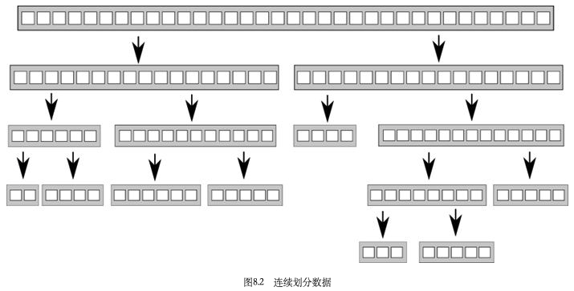

# Chapter8 - Designing concurrent code

[TOC]


## 8.1 Techniques for dividing work between threads

### 8.1.1 Dividing data between threads before processing begins


*Figure 8.1 Distributing consecutive chunks of data between threads*

### 8.1.2 Dividing data recursively



*Figure 8.2 Recursively dividing data*

```c++
template<typename T>
struct sorter  // 1
{
  struct chunk_to_sort
  {
    std::list<T> data;
    std::promise<std::list<T> > promise;
  };

  thread_safe_stack<chunk_to_sort> chunks;  // 2
  std::vector<std::thread> threads;  // 3
  unsigned const max_thread_count;
  std::atomic<bool> end_of_data;

  sorter():
    max_thread_count(std::thread::hardware_concurrency()-1),
    end_of_data(false)
  {}

  ~sorter()  // 4
  {
    end_of_data=true;  // 5

    for(unsigned i=0;i<threads.size();++i)
    {
      threads[i].join();  // 6
    }
  }

  void try_sort_chunk()
  {
    boost::shared_ptr<chunk_to_sort > chunk=chunks.pop();  // 7
    if(chunk)
    {
      sort_chunk(chunk);  // 8
    }
  }

  std::list<T> do_sort(std::list<T>& chunk_data)  // 9
  {
    if(chunk_data.empty())
    {
      return chunk_data;
    }

    std::list<T> result;
    result.splice(result.begin(),chunk_data,chunk_data.begin());
    T const& partition_val=*result.begin();

    typename std::list<T>::iterator divide_point=  // 10
       std::partition(chunk_data.begin(),chunk_data.end(),
        [&](T const& val){return val<partition_val;});

    chunk_to_sort new_lower_chunk;
    new_lower_chunk.data.splice(new_lower_chunk.data.end(),
       chunk_data,chunk_data.begin(),
       divide_point);

    std::future<std::list<T> > new_lower=
      new_lower_chunk.promise.get_future();
    chunks.push(std::move(new_lower_chunk));  // 11
    if(threads.size()<max_thread_count)  // 12
    {
      threads.push_back(std::thread(&sorter<T>::sort_thread,this));
    }

    std::list<T> new_higher(do_sort(chunk_data));

    result.splice(result.end(),new_higher);
    while(new_lower.wait_for(std::chrono::seconds(0)) !=
       std::future_status::ready)  // 13
    {
      try_sort_chunk();  // 14
    }

    result.splice(result.begin(),new_lower.get());
    return result;
  }

  void sort_chunk(boost::shared_ptr<chunk_to_sort> const& chunk)
  {
    chunk->promise.set_value(do_sort(chunk->data));  // 15
  }

  void sort_thread()
  {
    while(!end_of_data)  // 16
    {
      try_sort_chunk();  // 17
      std::this_thread::yield();  // 18
    }
  }
};

template<typename T>
std::list<T> parallel_quick_sort(std::list<T> input)  // 19
{
  if(input.empty())
  {
    return input;
  }
  sorter<T> s;

  return s.do_sort(input);  // 20
}
```

*Listing 8.1 Parallel Quicksort using a stack of pending chunks to sort*

### 8.1.3 Dividing work by task type


## 8.2 Factors affecting the performance of concurrent code

### 8.2.1 How many processors?

The number (and structure) of processors is the first big factor that affects the performance of a multithreaded application, and it's quite a crucial one.

To allow applications to scale the number of threads in line with the number of threads the hardware can run concurrently, the C++11 Standard Thread Library provides `std::thread::hardware_concurrency()`.

### 8.2.2 Data contention and cache ping-pong

the processors might actually find themselves `waiting` for each other; one processor is ready to update the value, but another processor is currently doing that, so it has to wait until the second processor has completed its update and the change has propagated. This situation is called `high contention`. If the processors rarely have to wait foreach other, you have `low contention`.

In a loop like this one, the data for counter wile be passed back and forth between the caches many times. This is called `cache ping-pong`.

The effects of contention with mutexes are usually different from the effects of contention with atomic operations for the simple reason that the use of a mutex naturally serializes threads at the operating system level rather than at the processor level. If you have enough threads ready to run, the operation system can schedule another thread to run while one thread is waiting for the mutex, whereas a processor stall prevents any threads from running on that processor. However, it will still impact the performance of those threads that are competing for the mutex; they can only run one at a time, after all.

### 8.2.3 False sharing

The cache line is shared, even though none of the data is, hence the term false sharing.

### 8.2.4 How close is your data?

Whereas false sharing is caused by having data accessed by one thread too close to data accessed by another thread, another pitfall associated with data layout directly impacts the performance of a single thread on tis own.

If there are more threads than cores or processors, the operating system might also choose to schedule a thread on one core for one time slice and then on another core for the next time slice. This will therefore require transferring the cache lines for that thread's data from the cache for the first core to the cache for the second; the more cache lines that need transferring, the more time consuming this will be. Although operating systems typically avoid this when they can, it does happen and does impact performance when it happens.

Oversubscription can arise when you have a task that repeatedly spawns new threads without limits, as the recursive quick sort from chapter 4 did, or where the natural number of threads when you separate by task type is more than the number of processors and the work is naturally CPU bound rather than I/O bound.


## 8.3 Designing data structures for multithreaded performance

### 8.3.1 Dividing array elements for complex operations


*Figure 8.3 Matrix multiplication*

### 8.3.2 Data access patterns in other data structures

Fundamentally, the same considerations apply when trying to optimize the data access patterns of other data structures as when optimizing access to arrays:

- Try to adjust the data distribution between threads so that data that's close together is worked on by the same thread.
- Try to minimize the data required by any given thread.
- Try to ensure that data accessed by separate threads is sufficiently far apart to avoid flase sharing.


## 8.4 Additional considerations when designing for concurrency

### 8.4.1 Exception safety in parallel algorithms

Exception safety is an essential aspect of good C++ code, and code that uses concurrency is no exception. In fact, parallel algorithms often reuire that you take more care with regard to exceptions than normal sequential algorithms. If an operation in a sequential algorithm throws an exception, the algorithm only has to worry about ensuring that it tidies up after itself to avoid resource leaks and broken invariats; it can merrily allow the exception to propagate to the caller for them to handle. By contrast, in a parallel algorithm many of the operations will be running on separate threads. In this case, the exception can't be allowed to propagate because it's on the wrong call stack. If a function spawned on a new thread exits with an exception, the application is terminated.

```c++
template<typename Iterator,typename T>
struct accumulate_block
{
  void operator()(Iterator first,Iterator last,T& result)
  {
    result=std::accumulate(first,last,result);  // 1
  }
};

template<typename Iterator,typename T>
T parallel_accumulate(Iterator first,Iterator last,T init)
{
  unsigned long const length=std::distance(first,last);  // 2

  if(!length)
    return init;

  unsigned long const min_per_thread=25;
  unsigned long const max_threads=
    (length+min_per_thread-1)/min_per_thread;

  unsigned long const hardware_threads=
    std::thread::hardware_concurrency();

  unsigned long const num_threads=
    std::min(hardware_threads!=0?hardware_threads:2,max_threads);

  unsigned long const block_size=length/num_threads;

  std::vector<T> results(num_threads);  // 3
  std::vector<std::thread> threads(num_threads-1);  // 4

  Iterator block_start=first;  // 5
  for(unsigned long i=0;i<(num_threads-1);++i)
  {
    Iterator block_end=block_start;  // 6
    std::advance(block_end,block_size);
    threads[i]=std::thread(  // 7
      accumulate_block<Iterator,T>(),
      block_start,block_end,std::ref(results[i]));
    block_start=block_end;  // 8
  }
  accumulate_block()(block_start,last,results[num_threads-1]);  // 9

  std::for_each(threads.begin(),threads.end(),
    std::mem_fn(&std::thread::join));

  return std::accumulate(results.begin(),results.end(),init);  // 10
}
```

*Listing 8.2 A naive parallel version of std::accumulate (from listing 2.8)*

```c++
template<typename Iterator,typename T>
struct accumulate_block
{
  T operator()(Iterator first,Iterator last)  // 1
  {
    return std::accumulate(first,last,T());  // 2
  }
};

template<typename Iterator,typename T>
T parallel_accumulate(Iterator first,Iterator last,T init)
{
  unsigned long const length=std::distance(first,last);

  if(!length)
    return init;

  unsigned long const min_per_thread=25;
  unsigned long const max_threads=
    (length+min_per_thread-1)/min_per_thread;

  unsigned long const hardware_threads=
    std::thread::hardware_concurrency();

  unsigned long const num_threads=
    std::min(hardware_threads!=0?hardware_threads:2,max_threads);

  unsigned long const block_size=length/num_threads;

  std::vector<std::future<T> > futures(num_threads-1);  // 3
  std::vector<std::thread> threads(num_threads-1);

  Iterator block_start=first;
  for(unsigned long i=0;i<(num_threads-1);++i)
  {
    Iterator block_end=block_start;
    std::advance(block_end,block_size);
    std::packaged_task<T(Iterator,Iterator)> task(  // 4
      accumulate_block<Iterator,T>());
    futures[i]=task.get_future();  // 5
    threads[i]=std::thread(std::move(task),block_start,block_end);  // 6
    block_start=block_end;
  }
  T last_result=accumulate_block()(block_start,last);  // 7

  std::for_each(threads.begin(),threads.end(),
    std::mem_fn(&std::thread::join));

  T result=init;  // 8
  for(unsigned long i=0;i<(num_threads-1);++i)
  {
    result+=futures[i].get();  // 9
  }
  result += last_result;  // 10
  return result;
}
```

*Listing 8.3 A parallel version of std::accumulate using std::packaged_task*

```c++
template<typename Iterator,typename T>
T parallel_accumulate(Iterator first,Iterator last,T init)
{
  unsigned long const length=std::distance(first,last);

  if(!length)
    return init;

  unsigned long const min_per_thread=25;
  unsigned long const max_threads=
    (length+min_per_thread-1)/min_per_thread;

  unsigned long const hardware_threads=
    std::thread::hardware_concurrency();

  unsigned long const num_threads=
    std::min(hardware_threads!=0?hardware_threads:2,max_threads);

  unsigned long const block_size=length/num_threads;

  std::vector<std::future<T> > futures(num_threads-1);
  std::vector<std::thread> threads(num_threads-1);
  join_threads joiner(threads);  // 1

  Iterator block_start=first;
  for(unsigned long i=0;i<(num_threads-1);++i)
  {
    Iterator block_end=block_start;
    std::advance(block_end,block_size);
    std::packaged_task<T(Iterator,Iterator)> task(
      accumulate_block<Iterator,T>());
    futures[i]=task.get_future();
    threads[i]=std::thread(std::move(task),block_start,block_end);
    block_start=block_end;
  }
  T last_result=accumulate_block()(block_start,last);
  T result=init;
  for(unsigned long i=0;i<(num_threads-1);++i)
  {
    result+=futures[i].get();  // 2
  }
  result += last_result;
  return result;
}
```

*Listing 8.4 An exception-safe parallel version of std::accumulate*

```c++
template<typename Iterator,typename T>
T parallel_accumulate(Iterator first,Iterator last,T init)
{
  unsigned long const length=std::distance(first,last);  // 1
  unsigned long const max_chunk_size=25;
  if(length<=max_chunk_size)
  {
    return std::accumulate(first,last,init);  // 2
  }
  else
  {
    Iterator mid_point=first;
    std::advance(mid_point,length/2);  // 3
    std::future<T> first_half_result=
      std::async(parallel_accumulate<Iterator,T>,  // 4
        first,mid_point,init);
    T second_half_result=parallel_accumulate(mid_point,last,T());  // 5
    return first_half_result.get()+second_half_result;  // 6
  }
}
```

*Listing 8.5 An exception-safe parallel version of std::accumulate using std::async*

### 8.4.2 Scalability and Amdahl's law

Scalability is all about ensuring that your application can take advantage of additional processors in the system it's running on.

Under such a simplified set of assumptions, you can therefore estimate the potential performance gain to be achieved by increasing the number of processors: if the "serial" sections constitute a fraction $f_s$ of the program, then the performance gain $P$ from using $N$ processors can be estimated as:

$P = \frac{1}{f_s + \frac{1 - f_s}{N}}$

One thing that's clear from Amdahl's law is that when you're using concurrency for performance, it's worth looking at the overall design of the application to maximize the potential for concurrency and ensure that there's always useful work for the processors to be doing. If you can reduce the size of the "serial" sections or reduce the potential for threads to wait, you can improve the potential for performance gains on systems with more processors. Alternatively, if you can provide more data for the system to process, and thus keep the parallel sections primed with work, you can reduce the serial fraction and increase the performance gain P.

### 8.4.3 Hiding latency with multiple threads

Rather than adding threads to ensure that all available processors are being used, sometimes it pays to add threads to ensure that external events are handled in a timely manner, to increase the `responsiveness` of the system.

### 8.4.4 Improving responsiveness with concurrency

By separating the concerns with concurrency, you can put the lengthy task on a whole new thread and leave a dedicated GUI thread to process the events. The threads can then communicate through simple mechanisms rather than having to somehow mix the event-handling code in with the task code.

```c++
std::thread task_thread;
std::atomic<bool> task_cancelled(false);

void gui_thread()
{
  while(true)
  {
    event_data event=get_event();
    if(event.type==quit)
      break;
    process(event);
  }
}

void task()
{
  while(!task_complete() && !task_cancelled)
  {
    do_next_operation();
  }
  if(task_cancelled)
  {
    perform_cleanup();
  }
  else
  {
    post_gui_event(task_complete);
  }
}

void process(event_data const& event)
{
  switch(event.type)
  {
  case start_task:
    task_cancelled=false;
    task_thread=std::thread(task);
    break;
  case stop_task:
    task_cancelled=true;
    task_thread.join();
    break;
  case task_complete:
    task_thread.join();
    display_results();
    break;
  default:
    //...
  }
}
```

*Listing 8.6 Separating GUI thread from task thread*


## 8.5 Designing concurrent code in practice

### 8.5.1 A parallel implementation of std::for_each

```c++
template<typename Iterator,typename Func>
void parallel_for_each(Iterator first,Iterator last,Func f)
{
  unsigned long const length=std::distance(first,last);

  if(!length)
    return;

  unsigned long const min_per_thread=25;
  unsigned long const max_threads=
    (length+min_per_thread-1)/min_per_thread;

  unsigned long const hardware_threads=
    std::thread::hardware_concurrency();

  unsigned long const num_threads=
    std::min(hardware_threads!=0?hardware_threads:2,max_threads);

  unsigned long const block_size=length/num_threads;

  std::vector<std::future<void> > futures(num_threads-1);  // 1
  std::vector<std::thread> threads(num_threads-1);
  join_threads joiner(threads);

  Iterator block_start=first;
  for(unsigned long i=0;i<(num_threads-1);++i)
  {
    Iterator block_end=block_start;
    std::advance(block_end,block_size);
    std::packaged_task<void(void)> task(  // 2
      [=]()
      {
        std::for_each(block_start,block_end,f);
      });
    futures[i]=task.get_future();
    threads[i]=std::thread(std::move(task));  // 3
    block_start=block_end;
  }
  std::for_each(block_start,last,f);
  for(unsigned long i=0;i<(num_threads-1);++i)
  {
    futures[i].get();  // 4
  }
}
```

*Listing 8.7 A parallel version of std::for_each*

```c++
template<typename Iterator,typename Func>
void parallel_for_each(Iterator first,Iterator last,Func f)
{
  unsigned long const length=std::distance(first,last);

  if(!length)
    return;

  unsigned long const min_per_thread=25;

  if(length<(2*min_per_thread))
  {
    std::for_each(first,last,f);  // 1
  }
  else
  {
    Iterator const mid_point=first+length/2;
    std::future<void> first_half=  // 2
      std::async(&parallel_for_each<Iterator,Func>,
                 first,mid_point,f);
    parallel_for_each(mid_point,last,f);  // 3
    first_half.get();  // 4
  }
}
```

*Listing 8.8 A parallel version of std::for_each using std::async*

### 8.5.2 A parallel implementation of std::find

```c++
template<typename Iterator,typename MatchType>
Iterator parallel_find(Iterator first,Iterator last,MatchType match)
{
  struct find_element  // 1
  {
    void operator()(Iterator begin,Iterator end,
                    MatchType match,
                    std::promise<Iterator>* result,
                    std::atomic<bool>* done_flag)
    {
      try
      {
        for(;(begin!=end) && !done_flag->load();++begin)  // 2
        {
          if(*begin==match)
          {
            result->set_value(begin);  // 3
            done_flag->store(true);  // 4
            return;
          }
        }
      }
      catch(...)  // 5
      {
        try
        {
          result->set_exception(std::current_exception());  // 6
          done_flag->store(true);
        }
        catch(...)  // 7
        {}
      }
    }
  };

  unsigned long const length=std::distance(first,last);

  if(!length)
    return last;

  unsigned long const min_per_thread=25;
  unsigned long const max_threads=
    (length+min_per_thread-1)/min_per_thread;

  unsigned long const hardware_threads=
    std::thread::hardware_concurrency();

  unsigned long const num_threads=
    std::min(hardware_threads!=0?hardware_threads:2,max_threads);

  unsigned long const block_size=length/num_threads;

  std::promise<Iterator> result;  // 8
  std::atomic<bool> done_flag(false);  // 9
  std::vector<std::thread> threads(num_threads-1);
  {  // 10
    join_threads joiner(threads);

    Iterator block_start=first;
    for(unsigned long i=0;i<(num_threads-1);++i)
    {
      Iterator block_end=block_start;
      std::advance(block_end,block_size);
      threads[i]=std::thread(find_element(),  // 11
                             block_start,block_end,match,
                             &result,&done_flag);
      block_start=block_end;
    }
    find_element()(block_start,last,match,&result,&done_flag);  // 12
  }
  if(!done_flag.load())  //13
  {
    return last;
  }
  return result.get_future().get();  // 14
}
```

*Listing 8.9 An implementation of a parallel find algorithm*

```c++
template<typename Iterator,typename MatchType>  // 1
Iterator parallel_find_impl(Iterator first,Iterator last,MatchType match,
                            std::atomic<bool>& done)
{
  try
  {
    unsigned long const length=std::distance(first,last);
    unsigned long const min_per_thread=25;  // 2
    if(length<(2*min_per_thread))  // 3
    {
      for(;(first!=last) && !done.load();++first)  // 4
      {
        if(*first==match)
        {
          done=true;  // 5
          return first;
        }
      }
      return last;  // 6
    }
    else
    { 
      Iterator const mid_point=first+(length/2);  // 7
      std::future<Iterator> async_result=
        std::async(&parallel_find_impl<Iterator,MatchType>,  // 8
                   mid_point,last,match,std::ref(done));
      Iterator const direct_result=
        parallel_find_impl(first,mid_point,match,done);  // 9
      return (direct_result==mid_point)?
        async_result.get():direct_result;  // 10
    }
  }
  catch(...)
  {
    done=true;  // 11
    throw;
  }
}

template<typename Iterator,typename MatchType>
Iterator parallel_find(Iterator first,Iterator last,MatchType match)
{
  std::atomic<bool> done(false);
  return parallel_find_impl(first,last,match,done);  // 12
}
```

*Listing 8.10 An implementation of a parallel find algorithm using std::async*

### 8.5.3 A parallel implementation of std::partial_sum

```c++
template<typename Iterator>
void parallel_partial_sum(Iterator first,Iterator last)
{
  typedef typename Iterator::value_type value_type;

  struct process_chunk  // 1
  {
    void operator()(Iterator begin,Iterator last,
                    std::future<value_type>* previous_end_value,
                    std::promise<value_type>* end_value)
    {
      try
      {
        Iterator end=last;
        ++end;
        std::partial_sum(begin,end,begin);  // 2
        if(previous_end_value)  // 3
        {
          value_type& addend=previous_end_value->get();  // 4
          *last+=addend;  // 5
          if(end_value)
          {
            end_value->set_value(*last);  // 6
          }
          std::for_each(begin,last,[addend](value_type& item)  // 7
                        {
                          item+=addend;
                        });
         }
         else if(end_value)
         {
           end_value->set_value(*last);  // 8
         }
       }
       catch(...)  // 9
       {
         if(end_value)
         {
           end_value->set_exception(std::current_exception());  // 10
         }
         else
         {
           throw;  // 11
         }
       }
     }
   };

  unsigned long const length=std::distance(first,last);

  if(!length)
    return last;

  unsigned long const min_per_thread=25;  // 12
  unsigned long const max_threads=
    (length+min_per_thread-1)/min_per_thread;

  unsigned long const hardware_threads=
    std::thread::hardware_concurrency();

  unsigned long const num_threads=
    std::min(hardware_threads!=0?hardware_threads:2,max_threads);

  unsigned long const block_size=length/num_threads;

  typedef typename Iterator::value_type value_type;

  std::vector<std::thread> threads(num_threads-1);  // 13
  std::vector<std::promise<value_type> >
    end_values(num_threads-1);  // 14
  std::vector<std::future<value_type> >
    previous_end_values;  // 15
  previous_end_values.reserve(num_threads-1);  // 16
  join_threads joiner(threads);

  Iterator block_start=first;
  for(unsigned long i=0;i<(num_threads-1);++i)
  {
    Iterator block_last=block_start;
    std::advance(block_last,block_size-1);  // 17
    threads[i]=std::thread(process_chunk(),  // 18
                           block_start,block_last,
                           (i!=0)?&previous_end_values[i-1]:0,
                           &end_values[i]);
    block_start=block_last;
    ++block_start;  // 19
    previous_end_values.push_back(end_values[i].get_future());  // 20
  }
  Iterator final_element=block_start;
  std::advance(final_element,std::distance(block_start,last)-1);  // 21
  process_chunk()(block_start,final_element,  // 22
                  (num_threads>1)?&previous_end_values.back():0,
                  0);
}
```

*Listing 8.11 Calculating partial sums in parallel by dividing the problem*

But in practice you rarely have such systems to work with except for those cases where a single processor can execute the same instruction across a small number of data elements simultaneously with so-called Single-Instruction/Multiple-Data(SIMD) instructions. Therefore, you must design your code for the general case and explicitly synchronize the threads at each step.

`barrier` a synchronization mechanism that causes threads to wait until the required number of threads has reached the barrier. Once all the threads have reached the barrier, they's all unblocked and may proceed.

```c++
class barrier
{
  unsigned const count;
  std::atomic<unsigned> spaces;
  std::atomic<unsigned> generation;
public:
  explicit barrier(unsigned count_):  // 1
    count(count_),spaces(count),generation(0)
  {}

  void wait()
  {
    unsigned const my_generation=generation;  // 2
    if(!--spaces)  // 3
    {
      spaces=count;  // 4
      ++generation;  // 5
    }
    else
    {
      while(generation==my_generation)  // 6
        std::this_thread::yield();  // 7
    }
  }
};
```

*Listing 8.12 A simple barrier class*

```c++
struct barrier
{
  std::atomic<unsigned> count;
  std::atomic<unsigned> spaces;
  std::atomic<unsigned> generation;

  barrier(unsigned count_):
    count(count_),spaces(count_),generation(0)
  {}

  void wait()
  {
    unsigned const gen=generation.load();
    if(!--spaces)
    {
      spaces=count.load();
      ++generation;
    }
    else
    {
      while(generation.load()==gen)
      {
        std::this_thread::yield();
      }
    }
  }

  void done_waiting()
  {
    --count;
    if(!--spaces)
    {
      spaces=count.load();
      ++generation;
    }
  }
};

template<typename Iterator>
void parallel_partial_sum(Iterator first,Iterator last)
{
  typedef typename Iterator::value_type value_type;

  struct process_element  // 1
  {
    void operator()(Iterator first,Iterator last,
                    std::vector<value_type>& buffer,
                    unsigned i,barrier& b)
    {
      value_type& ith_element=*(first+i);
      bool update_source=false;

      for(unsigned step=0,stride=1;stride<=i;++step,stride*=2)
      {
        value_type const& source=(step%2)?  // 2
          buffer[i]:ith_element;

        value_type& dest=(step%2)?
          ith_element:buffer[i];

        value_type const& addend=(step%2)?  // 3
          buffer[i-stride]:*(first+i-stride);

        dest=source+addend;  // 4
        update_source=!(step%2);
        b.wait();  // 5
      }
      if(update_source)  // 6
      {
        ith_element=buffer[i];
      }
      b.done_waiting();  // 7
    }
  };

  unsigned long const length=std::distance(first,last);

  if(length<=1)
    return;

  std::vector<value_type> buffer(length);
  barrier b(length);

  std::vector<std::thread> threads(length-1);  // 8
  join_threads joiner(threads);

  Iterator block_start=first;
  for(unsigned long i=0;i<(length-1);++i)
  {
    threads[i]=std::thread(process_element(),first,last,  // 9
                           std::ref(buffer),i,std::ref(b));
  }
  process_element()(first,last,buffer,length-1,b);  // 10
}
```

*Listing 8.13 A parallel implementation of partial_sum by pairwise updates*


## 8.6 Summary

