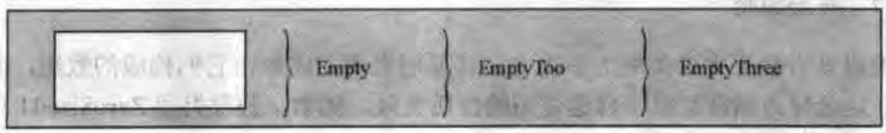
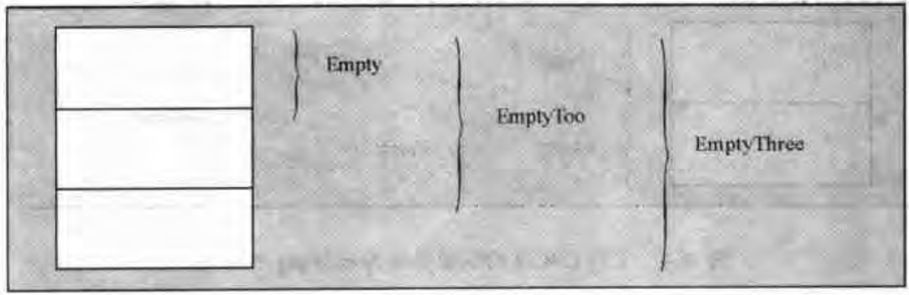
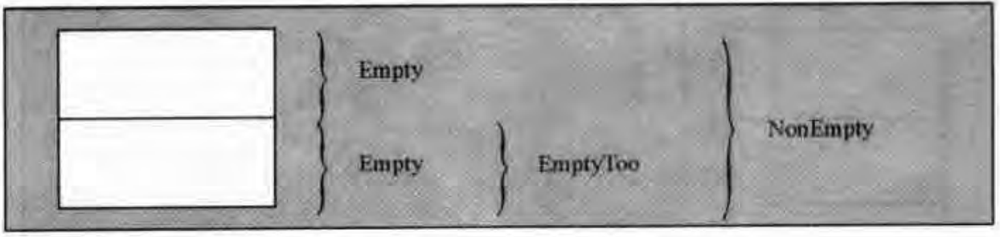

# 第16章 模版与继承


<!-- vim-markdown-toc GFM -->

* [16.1 命名模版参数](#161-命名模版参数)
* [16.2 空基类优化](#162-空基类优化)
    - [16.2.1 布局原则](#1621-布局原则)
    - [16.2.2 成员作基类](#1622-成员作基类)
* [16.3 奇特的递归模版模式](#163-奇特的递归模版模式)
* [16.4 参数化虚拟性](#164-参数化虚拟性)
* [16.5 本章后记](#165-本章后记)

<!-- vim-markdown-toc -->

模版与继承的结合，借助所谓的参数化继承（parameterized inheritance），能碰撞出不少精彩的技术火花。

## 16.1 命名模版参数

命名模版参数技术，代码如下所示：

```c++
#include <iostream>
#include <typeinfo>
using namespace std;

class DefaultPolicy1{};
class DefaultPolicy2{};
class DefaultPolicy3{};
class DefaultPolicy4{};

class DefaultPolicies {
    public:
        typedef DefaultPolicy1 P1;
        typedef DefaultPolicy2 P2;
        typedef DefaultPolicy3 P3;
        typedef DefaultPolicy4 P4;
};

class DefaultPolicyArgs : virtual public DefaultPolicies{};
template<typename Policy>
class Policy1_is : virtual public DefaultPolicies {
    public:
        typedef Policy P1;
};

template <typename Policy>
class Policy2_is : virtual public DefaultPolicies {
    public:
        typedef Policy P2;
};

template <typename Policy>
class Policy3_is : virtual public DefaultPolicies {
    public:
        typedef Policy P3;
};

template <typename Policy>
class Policy4_is : virtual public DefaultPolicies{
    public:
        typedef Policy P4;
};

template<typename Base, int D>
class CanMultiDerivedFromOneClass : public Base{};

template<typename Setter1, typename Setter2, typename Setter3, typename Setter4>
class PolicySelector : public CanMultiDerivedFromOneClass<Setter1, 1>,
    public CanMultiDerivedFromOneClass<Setter2, 2>,
    public CanMultiDerivedFromOneClass<Setter3, 3>,
    public CanMultiDerivedFromOneClass<Setter4, 4>
{};

template<typename PolicySet1 = DefaultPolicyArgs,
    typename PolicySet2 = DefaultPolicyArgs,
    typename PolicySet3 = DefaultPolicyArgs,
    typename PolicySet4 = DefaultPolicyArgs>
class MyClass{
    public:
        typedef PolicySelector<PolicySet1, PolicySet2, PolicySet3, PolicySet4> Policies;
};

int main(){
    typedef MyClass<Policy2_is<int>, Policy4_is<double> > MyClassDef;
    MyClassDef::Policies::P1 p1;
    MyClassDef::Policies::P2 p2;
    MyClassDef::Policies::P3 p3;
    MyClassDef::Policies::P4 p4;
    cout << typeid(p1).name() << endl;
    cout << typeid(p2).name() << endl;
    cout << typeid(p3).name() << endl;
    cout << typeid(p4).name() << endl;

    return 0;
}
```


## 16.2 空基类优化

### 16.2.1 布局原则

C++的设计者不允许类的大小为0。

C++标准规定，当空类作为基类时，只要不会与同一类型的另一个对象或子对象分配在同一地址，就不需为其分配任何空间。

空基类优化（empty base class optimization, EBCO）技术：

```c++
#include <iostream>

class Empty{
    typedef int Int; // typedef成员并不会使类成为非空
};

class EmptyToo : public Empty {
};

class EmptyThree : public EmptyToo {
};
```



*实现EBCO的编译器对EmptyThree的布局*



*不支持EBCO的编译器对EmptyThree的布局*



*支持EBCO的编译器对NonEmpty的布局*

### 16.2.2 成员作基类


## 16.3 奇特的递归模版模式

奇特的递归模版模式（Curiously Recurring Template Pattern, CRTP）代表了类实现技术中一种通用的模式，即派生类将本身作为模版参数传递给基类。例：

```c++
template <typename Derived>
class CuriousBase {
    ...
};

class Curious : public CuriousBase<Curious> {
    ...
};
```


## 16.4 参数化虚拟性

C++允许通过模版枝节参数化3种实体：类型，常数（nontype）和模版。同时，模版还能间接参数化其它属性，比如成员函数的虚拟性。


## 16.5 本章后记


