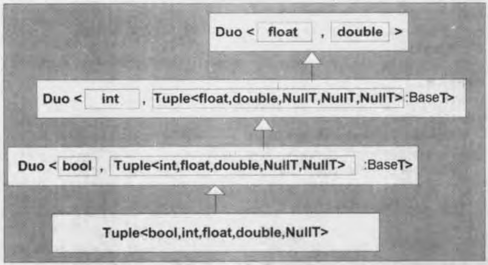

# Chapter 21. Tuples

[TOC]


A duo is the assembly of two objects into a single type. This is similar to the `std::pair` class template in the standard library, but because we will add slightly different functionality to this very basic utility, we opted for a name other than `pair` to avoid confusion with the standard item.

Consider the following object definition:

```c++
Duo<int, Duo<char, Duo<bool, double> > > q4;
```

The generic definition ensures that the result type is `void` for non `Duo`s:

```c++
template<int N, typename T>
class DuoT {
    public:
        typedef void ResultT;
};
```



*Figure 21.1. Type of `Tuple<bool, int, float, double>`*


## Glossary

<div style="width: 50%; float:left;">homogeneous `/ˌhɒmə'dʒiːniəs/` 同质的，同种的</div>
<div style="width: 50%; float:left;">pervasive `/pə'veɪsɪv/` 普遍的，渗透的，遍布的</div>
<div style="width: 50%; float:left;">nonhomogeneous `/'nɒnhɒmə'dʒiːnjəs/` 非均匀的，非同质的</div>
<div style="width: 50%; float:left;">aggregate `/'æɡrɪɡət/` 总计，总的，聚集</div>
<div style="width: 50%; float:left;">analogous `/ə'næləɡəs/` 类似的</div>
<div style="width: 50%; float:left;">formal `/'fɔːml/` 正式的，形式的，公开的，拘谨的</div>
<div style="width: 50%; float:left;">degenerate `/dɪ'dʒenəreɪt/` 退化，堕落</div>
<div style="width: 50%; float:left;">occasionally `/ə'keɪʒnəli/` 偶尔地</div>
<div style="width: 50%; float:left;">orthogonality `/ɔːθɒgə'nælɪtɪ/` 相互垂直，正交性</div>
<div style="width: 50%; float:left;">leverage `/'liːvərɪdʒ/` 杠杆，举债经营，对...产生影响</div>
<div style="width: 50%; float:left;">achieve `/ə'tʃiːv/` 完成，达到，实现</div>
<div style="width: 50%; float:left;">derivation `/ˌderɪ'veɪʃn/` 派生，推导，导数</div>
<div style="width: 50%; float:left;">appropriate `/ə'prəʊpriət/` 适当的，相称的，占用，拨款</div>
<div style="width: 50%; float:left;">hierarchy `/'haɪərɑːki/` 等级制度，统治集团</div>
<div style="width: 50%; float:left;">revision `/rɪ'vɪʒn/` 校订，修订本，修正，复习</div>
<div style="width: 50%; float:left;">limitation `/ˌlɪmɪ'teɪʃn/` 限制，限度，缺点</div>