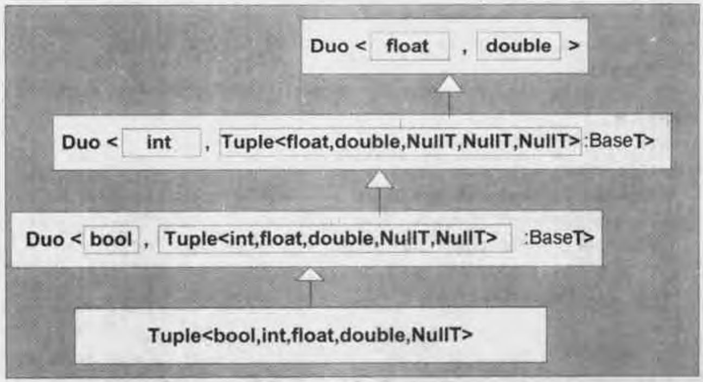

# 第21章 tuple

[TOC]


## 21.1 duo

简单的duo类就是与`std::pair`非常类似的类模版，它只能容纳2个不同类型的元素。


## 21.2 可递归duo

可递归duo示例：

```c++
Duo<int, Duo<char, Duo<bool, double> > > q4;
```

### 21.2.1 域的个数

### 21.2.2 域的类型

获取可递归duo的第n个类型，例：

```c++
template<int N, typename T>
class DuoT {
    public:
        typedef void ResultT;
};
```

### 21.2.3 域的值


## 21.3 tuple的构造



*Tuple<bool, int, float, double >的类型*


## 21.4 本章后记

