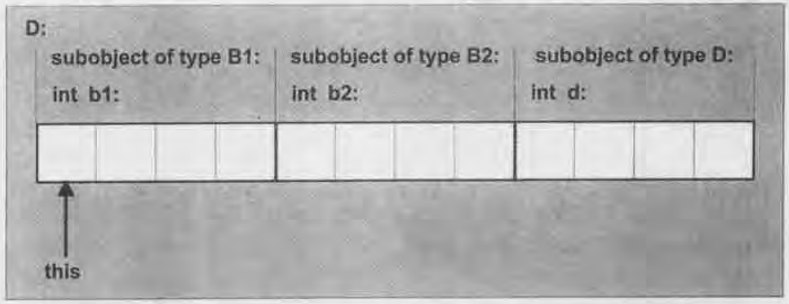

# Chapter 22. Function Objects and Callbacks

[TOC]

A function object (also called a functor) is any object that can be called using the `function call syntax`.

*Figure 22.1. Typical organization of type `D`*

The outline is not sufficient when it comes to virtual functions, and in practice, many implementations use a three-word structure for pointers to member functions:

1. The address of the member function, or `NULL` if it is a virtual function
2. The required `this` adjustment
3. A virtual function index

pass functors as function call arguments, this allows the caller to construct the function object(possibly using a nontrivial constructor) at run time.

In our framework, we handle only class-type functors and require them to provide the following information:

- The number of parameters of the functor(as a member enumerator constant `NumParams`)
- The type of each parameter(through member typedefs `Param1T, Param2T, Param3T, ...`)
- The return type of the functor(through a member typedef `Return T`)

The argument to be passed to the underlying functor can be one of three different values:

- The corresponding parameter of the bound functor
- The bound value
- The parameter of the bound functor that is one position to the left of the argument we must pass

## Glossary

concept `/'kɒnsept/` 观念，概念，想法

fuzzy `/'fʌzi/` 模糊的，含糊不清的，毛茸茸的

terminology `/ˌtɜːmɪ'nɒlədʒi/` 术语

sloppily `/'slɒpɪli/` 粗心地，泥泞地，邋遢地

motivate `/'məʊtɪveɪt/` 激发（欲望），给与动机

sophisticated `/sə'fɪstɪkeɪtɪd/` 老练的，精密的，复杂的，久经世故的

instruction `/ɪn'strʌkʃn/` 指令，教学，教诲，说明

dummy `/'dʌmi/` 傀儡，假人，仿制品，笨蛋，哑巴，保密

patch `/pætʃ/` 修补，掩饰，解决，补丁，眼罩，小片，膏药

impediment `/ɪm'pedɪmənt/` 障碍，阻碍，口吃

tremendously `/trə'mendəsli/` 惊人地，非常，十分

lax `/læks/` 松弛的，松懈的，元音的

versa `/'vɜːsə/` 反

subset `/'sʌbset/` 子集

denote `/dɪ'nəʊt/` 表示，象征

intrinsic `/ɪn'trɪnsɪk/` 内在的，固有的，本质的

contrast `/'kɒntrɑːst/` （计算机）反差，差别，对比，对照物

ampersand `/'æmpəsænd/` `&`符号

subsumed `/səb'sjuːm/` 归入，纳入，包含，包括

criterion `/kraɪ'tɪəriən/` 标准，准则

integrate `/'ɪntɪɡreɪt/` （数学）求积分，整合，结合，取消隔离，完整的，组合的

appropriate `/ə'prəʊpriət /` 适当的，相称的，占用，拨款

reemphasize `/'riːmfəsaɪz/` 再度强调，重新强调

introspection `/ˌɪntrə'spekʃn/` 内省，反省，自省

convention `/kən'venʃn/` 大会，协定，惯例，公约

composition `/ˌkɒmpə'zɪʃn/` 成分，作品，组织，作文，合成物

mitigate `/'mɪtɪɡeɪt/` 减轻，缓和

denote `/dɪ'nəʊt/` 表示，象征

validly `/'vælɪdli/` 正当地，妥当地

alleviate `/ə'liːvieɪt/` 减轻，缓和

reversal `/rɪ'vɜːsl/` 翻转，倒转，反转

usability `/ˌjuːzə'bɪlɪtɪ/` 可用性，合用，适用

concise `/kən'saɪs/` 简明地，简要的

commendable `/kə'mendəbl/` 可称赞的，可钦佩的

crucial `/'kruːʃl/` 决定性的，关键的

elegant `/'elɪɡənt/` 优雅的，雅致的

invocation `/ˌɪnvə'keɪʃn/` （计算机）调用，祈祷，实施

complicated `/'kɒmplɪkeɪtɪd/` 复杂难懂地，结构复杂的

preferably `/'prefrəbli/` 更好的，宁可，宁愿

automates `/'ɔːtəmeɪt/` 使自动化

respectively `/rɪ'spektɪvli/` 分别地，各自地

modular `/'mɒdjələ(r)/` 模块化的，组合的

admittedly `/əd'mɪtɪdli/` 不可否认的，公认的

trivial `/'trɪviəl/` 不重要的，琐碎的

penalty `/'penəlti/` 处罚，惩罚，不利，罚球

predicate `/'predɪkət/` 谓语，断定，意味，宣称，基于
