# 1 A Tour of Computer System

All information in a system including disk files, programs stored in memory, user data stored in memory, and data transferred across a network is represented as a bunch of bits. The only thing that distinguishes different data objects is the context in which we view them.

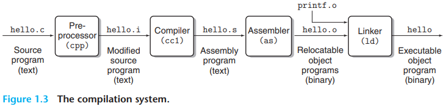

The programs that perform the four phases (`preprocessor`, `compiler`, `assembler`, and `linker`) are known collectively as the `compilation system`:

- `Preprocessing phase`. The preprocessor (cpp) modifies the original C program according to directives that begin with the `'#'` character.
- `Compilation phase`. The compiler (cc1) translates the text file `hello.i` into the text file `hello.s`, which contains an `assembly-language program`.
- `Assembly phase`. Next, the assembler (as) translates `hello.s` into machine language instructions, packages them in a form known as a `relocatable object program`, and stores the result in the object file `hello.o`. This file is a binary file containing 17 bytes to encode the instructions for function `main`.
- `Linking phase`. merged with our `hello.o` program.

there are some important reasons why programmers need to understand how compilation systems work:

- Optimizing program performance.
- Understanding link-time errors.
- Avoiding security holes.

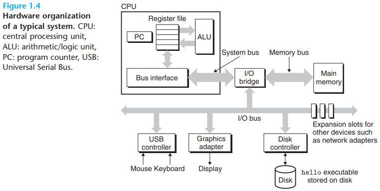

- `Buses`. Running throughout the system is a collection of electrical conduits called `buses` that carry bytes of information back and forth between the components. Buses are typically designed to transfer fixed-size chunks of bytes known as `words`. The number of bytes in a word (the `word size`) is a fundamental system parameter that varies across systems. Most machines today have word sizes of either 4 bytes (32 bits) or 8 bytes (64 bits).
- `I/O Devices`. Input/output (I/O) devices are the system's connection to the external world. Each I/O device is connected to the I/O bus by either a `controller` or an `adapter`. The distinction between the two is mainly one of packaging. Controllers are chipsets in the device itself or on the system's main printed circuit board (often called the `motherboard`). An adapter is a card that plugs into a slot on the motherboard. Regardless, the purpose of each is to transfer information back and forth between the I/O bus and an I/O device.
- `Main Memory` The `main memory` is a temporary storage device that holds both a program and the data it manipulates while the processor is executing the program. Physically, main memory consists of a collection of `dynamic random access memory` (DRAM) chips. Logically, memory is organized as a linear array of bytes, each with its own unique address (array index) starting at zero.
- `Processor` The `central processing unit` (CPU), or simply processor, is the engine that interprets (or `executes`) instructions stored in main memory. At its core is a word-size storage device (or `register`) called the `program counter` (PC). At any point in time, the PC points at (contains the address of) some machine-language instruction in main memory.

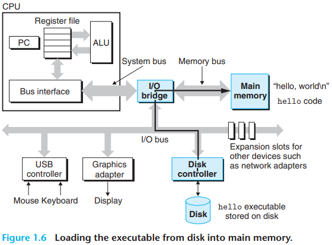

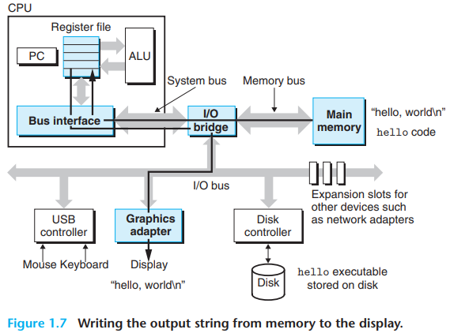

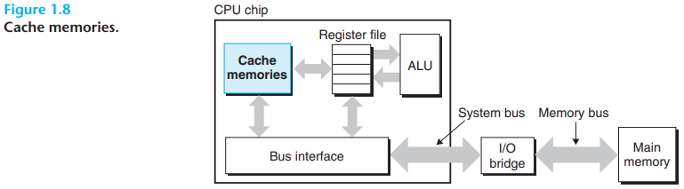

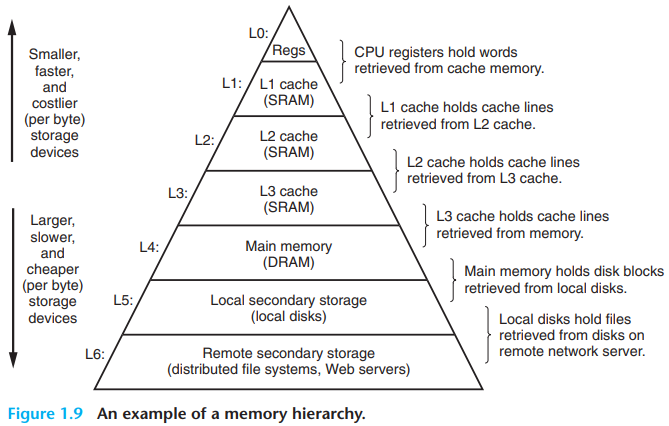

One of the most important lessons in this book is those application programmers who are aware of cache memories can exploit them to improve the performance of their programs by an order of magnitude.

The main idea of a memory hierarchy is that storage at one level serves as a cache for storage at the next lower level.

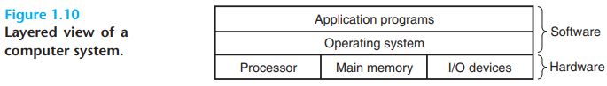

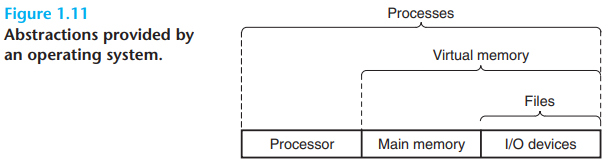

The operating system has two primary purposes: (1) to protect the hardware from misuse by runaway applications and (2) to provide applications with simple and uniform mechanisms for manipulating complicated and often wildly different low-level hardware devices.

files are abstractions for I/O devices, virtual memory is an abstraction for both the main memory and disk I/O devices, and processes are abstractions for the processor, main memory, and I/O devices.

A `process` is the operating system's abstraction for a running program. Multiple processes can run concurrently on the same system, and each process appears to have exclusive use of the hardware. By `concurrently`, we mean that the instructions of one process are interleaved with the instructions of another process.

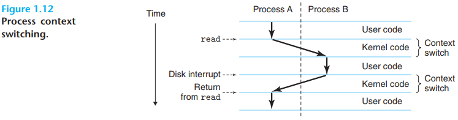

The operating system keeps track of all the state information that the process needs in order to run. This state, which is known as the `context`, includes information such as the current values of the PC, the register file, and the contents of main memory. At any point in time, a uniprocessor system can only execute the code for a single process. When the operating system decides to transfer control from the current process to some new process, it performs a `context switch` by saving the context of the current process, restoring the context of the new process, and then passing control to the new process. The new process picks up exactly where it left off.

the transition from one process to another is managed by the operating system `kernel`. The kernel is the portion of the operating system code that is always resident in memory. When an application program requires some action by the operating system, such as to read or write a file, it executes a special `system call` instruction, transferring control to the kernel. The kernel then performs the requested operation and returns back to the application program. Note that the kernel is not a separate process. Instead, it is a collection of code and data structures that the system uses to manage all the processes.

in modern systems, a process can actually consist of multiple execution units, called `threads`, each running in the context of the process and sharing the same code and global data.

`Virtual memory` is an abstraction that provides each process with the illusion that it has exclusive use of the main memory. Each process has the same uniform view of memory, which is known as its `virtual address space`.

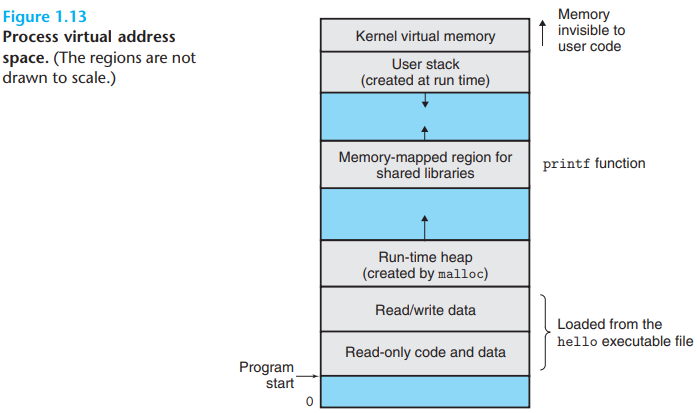

- `Program code and data`. Code begins at the same fixed address for all processes, followed by data locations that correspond to global C variables.
- `Heap`. The code and data areas are followed immediately by the run-time `heap`. Unlike the code and data areas, which are fixed in size once the process begins running, the heap expands and contracts dynamically at run time as a result of calls to C standard library routines such as `malloc` and `free`.
- `Shared libraries`. Near the middle of the address space is an area that holds the code and data for `shared libraries` such as the C standard library and the math library.
- `Stack`. At the top of the user's virtual address space is the `user stack` that the compiler uses to implement function calls. Like the heap, the user stack expands and contracts dynamically during the execution of the program. In particular, each time we call a function, the stack grows. Each time we return from a function, it contracts.
- `Kernel virtual memory`. The top region of the address space is reserved for the kernel. Application programs are not allowed to read or write the contents of this area or to directly call functions defined in the kernel code. Instead, they must invoke the kernel to perform these operations.

A `file` is a sequence of bytes, nothing more and nothing less. Every I/O device, including disks, keyboards, display, and even networks, is modeled as a file, All input and output in the system is performed by reading and writing files, using a small set of system calls known as `Unix I/O`.

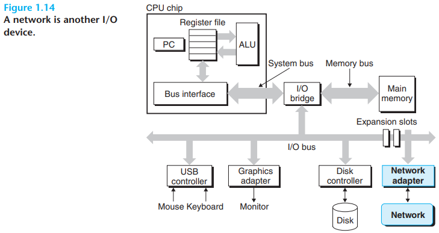

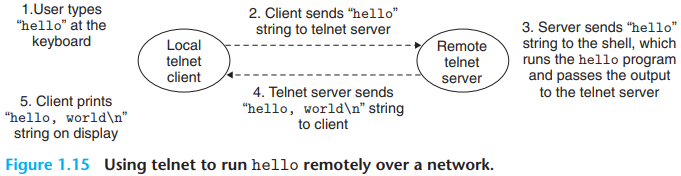

In practice, modern systems are often linked to other systems by networks. From the point of view of an individual system, the network can be viewed as just another I/O device.

`Amdahl’s law`. The main idea is that when we speed up one part of a system, the effect on the overall system performance depends on both how significant this part was and how much it sped up. Consider a system in which executing some application requires time $T_{old}$. Suppose some part of the system requires a fraction $\alpha$ of this time, and that we improve its performance by a factor of $k$. That is, the component originally required time $\alpha T_{old}$, and it now requires time $(\alpha T_{old})/k$. The overall execution time would thus be:
$$
\begin{equation}\begin{split}
T_{new} &= (1 - \alpha)T_{old} + (\alpha T_{old})/k \\
&= T_{old}[(1 - \alpha) + \alpha / k]
\end{split}\end{equation}
$$
From this, we can compute the speedup $S = T_{old} / T_{new}$ as 
$$
S = \frac{1}{(1 - \alpha) + \alpha / k} \qquad (1.1)
$$
One interesting special case of Amdahl's law is to consider the effect of setting $k$ to $\infty$. That is, we are able to take some part of the system and speed it up to the point at which it takes a negligible amount of time. We then get:
$$
S_{\infty} = \frac{1}{(1 - \alpha)} \qquad (1.2)
$$

## Summary

A computer system consists of hardware and systems software that cooperate to run application programs. Information inside the computer is represented as groups of bits that are interpreted in different ways, depending on the context. Programs are translated by other programs into different forms, beginning as ASCII text and then translated by compilers and linkers into binary executable files.

Processors read and interpret binary instructions that are stored in the main memory. Since computers spend most of their time copying data between memory, I/O devices, and the CPU registers, the storage devices in a system are arranged in a hierarchy, with the CPU registers at the top, followed by multiple levels of hardware cache memories, DRAM main memory, and disk storage. Storage devices that are higher in the hierarchy are faster and more costly per bit than those lower in the hierarchy. Storage devices that are higher in the hierarchy serve as caches for devices that are lower in the hierarchy. Programmers can optimize the performance of their C programs by understanding and exploiting the memory hierarchy.

The operating system kernel serves as an intermediary between the application and the hardware. It provides three fundamental abstractions: (1) Files are abstractions for I/O devices. (2) Virtual memory is an abstraction for both main memory and disks. (3) Processes are abstractions for the processor, main memory, and I/O devices.

Finally, networks provide ways for computer systems to communicate with one another. From the viewpoint of a particular system, the network is just another I/O device.

We use the term `concurrency` to refer to the general concept of a system with multiple, simultaneous activities, and the term `parallelism` to refer to the use of concurrency to make a system run faster.

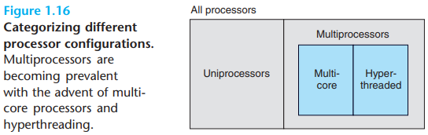

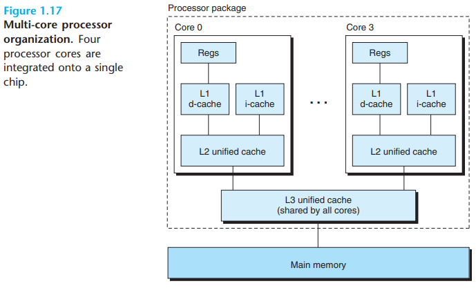

The use of multiprocessing can improve system performance in two ways. First, it reduces the need to simulate concurrency when performing multiple tasks. As mentioned, even a personal computer being used by a single person is expected to perform many activities concurrently. Second, it can run a single application program faster, but only if that program is expressed in terms of multiple threads that can effectively execute in parallel.

`pipelining`. where the actions required to execute an instruction are partitioned into different steps and the processor hardware is organized as series of stages, each performing one of these steps. The stages can operate in parallel, working on different parts of different instructions.

Processors that can sustain execution rates faster than 1 instruction per cycle are known as `superscalar` processors.

At the lowest level, many modern processors have special hardware that allows a single instruction to cause multiple operations to be performed in parallel, a mode known as `single-instruction, multiple-data` (SIMD) parallelism.

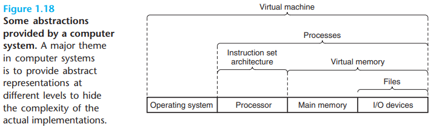

## Summary

A computer system consists of hardware and systems software that cooperate to run application programs. Information inside the computer is represented as groups of bits that are interpreted in different ways, depending on the context. Programs are translated by other programs into different forms, beginning as ASCII text and then translated by compilers and linkers into binary executable files.

Processors read and interpret binary instructions that are stored in main memory. Since computers spend most of their time copying data between memory, I/O devices, and the CPU registers, the storage devices in a system are arranged in a hierarchy, with the CPU registers at the top, followed by multiple levels of hardware cache memories, DRAM main memory, and disk storage, Storage devices that are higher in the hierarchy are faster and more costly per bit than those lower in the hierarchy. Storage devices that are higher in the hierarchy serve as caches for devices that are lower in the hierarchy. Programmers can optimize the performance of their C programs by understanding and exploiting the memory hierarchy.

The operating system kernel serves as an intermediary between the application and the hardware. It provides three fundamental abstractions: (1) Files are abstractions for I/O devices. (2) Virtual memory is an abstraction for both main memory and disks. (3) Processes are abstractions for the processor, main memory, and I/O devices.

Finally, networks provide ways for computer systems to communicate with one another. From the viewpoint of a particular system, the network is just another I/O device.

## Glossary

craft `/krɑːft/` 工艺，手艺，狡诈，船舶，航空器，行会会员

poise `/pɔɪz/` 平衡，姿态，镇静，做准备，盘旋

journey `/'dʒɜːni/` 旅程，行程

impact `/ɪmˈpækt/` 冲击，撞击，影响，挤入，压紧

practical `/'præktɪkl/` 明智的，实际的，可行的

tricks `/trɪks/` 戏法

exploit `/ɪkˈsplɔɪt/` 剥削，压榨，利用，开发，功绩，英勇行为

vulnerability `/ˌvʌlnərə'bɪləti/` （计算机）漏洞，易受攻击，弱点

plague `/pleɪɡ/` 瘟疫，灾祸，纠缠

nasty `/'nɑːsti/` 下流的，严重的

promise `/'prɒmɪs/` 允诺，承诺，发誓，预示，约定

integrate `/'ɪntɪɡreɪt/` （数学）求积分，整合，结合，取消隔离，完整的，组合的

concert `/'kɒnsət/` 音乐会，一致，和谐，协定，协同安排，合作

representation `/ˌreprɪzen'teɪʃn/` 陈述，表现，表示

invisible `/ɪn'vɪzəbl/` 无形的，看不见的

bunch `/bʌntʃ/` 串，束，一群，捆，突出物，凸起

finite `/'faɪnaɪt/` 有限的

affection `/ə'fekʃn/` 影响，感情，喜爱，慈爱

quirky `/ˈkwəːki/` 古怪的

flawed `/flɔːd/` 有裂纹的，有瑕疵的，有缺陷的

enormous `/ɪˈnɔːməs/` 巨大的，庞大的，极大的

expose `/ɪk'spəʊz/` 揭露，曝光，面临

wider `/waɪdə/` 更宽的，更广阔的

audience `/ˈɔːdiəns/` 观众，听众，读者

lack `/læk/` 缺乏，不足

approximation `/əˌprɒksɪ'meɪʃn/` 近似值，近似

phase `/feɪz/` 阶段，时期，逐步做

gibberish `/'dʒɪbərɪʃ/` 莫名其妙的话，胡言乱语

exempt `/ɪɡˈzempt/` 豁免，免除，免税

charity `/'tʃærəti/` 慈善，宽厚，仁慈

unencumbered `/ˌʌnɪn'kʌmbəd/` 没有阻碍的，没有负担的

owe `/əʊ/` 欠（债，钱，人情），感激，归功于，未付，欠账

intellectual `/ˌɪntəˈlektʃuəl/` 知识分子，智力的，理智的

rely `/rɪˈlʌɪ/` 依靠，依赖

sophisticate `/səˈfɪstɪkət/` 老练的，精密的，复杂的，老于世故的人，使...更精确

inner `/'ɪnə(r)/` 内心的，内部的，里面的，里面

tune `/tjuːn/` 曲调，曲子，（收音机）调谐

perplex `/pəˈpleks/` 困惑，迷惑

scary `/'skeəri/` 可怕的，引起恐慌的

vulnerability `/ˌvʌlnərə'bɪləti/` （计算机）漏洞，易受攻击，弱点

discipline `/ˈdɪsəplɪn/` 训练，行为准则，纪律，学科

interpreter `/ɪn'tɜːprɪtə(r)/` （计算机）解释器，口译员

similar `/ˈsɪm(ɪ)lə/` 相似的

circuit `/ˈsɜːkɪt/` 环形，电路，线路，巡回

board `/bɔːd/` 甲板，木板，董事会，理事会

arithmetic `/əˈrɪθmətɪk/` 算术，算术运算

microarchitecture `/maɪkrɔːtʃɪ'tektʃər/` （计算机）微体系架构

omit `/ə(ʊ)ˈmɪt/` 删掉，漏掉，省略，遗漏

travel `/'trævl/` 旅行，移动，去某地，传播，快速移动

perspective `/pə'spektɪv/` 远景，看法，透视

opposed `/əˈpəʊzd/` 完全不同的，相反的

troublesome `/'trʌblsəm/` 令人烦恼的，讨厌的，困难的，棘手的

semiconductor `/ˌsemikən'dʌktə(r)/` 半导体

magnitude `/ˈmæɡnɪtjuːd/` 巨大，重大，重要性，地震等级

interpose `/ˌɪntə'pəʊz/` 插入，介入，插嘴，调停

misuse `/ˌmɪsˈjuːz/` 误用，错用，滥用，虐待

runaway `/'rʌnəweɪ/` 逃亡者，逃跑的，失控的

via `/ˈvaɪə/` 通过，经由，凭借，经过（某一地方）

illusion `/ɪˈluːʒn/` 幻觉，幻想，错觉

scenario `/sɪˈnɑː.ri.əʊ/` 可能发生的事态，设想，剧本，情节，情况

topmost `/'tɒpməʊst/` 最高的，顶端的

sophisticate `/səˈfɪstɪkət/` 老练的，精密的，复杂的，老于世故的人，使...更精确

blissfully `/'blɪsfəli/` 幸福的

unaware `/ˌʌnə'weə(r)/` 没有发觉的，不知道的

whirlwind `/'wɜːlwɪnd/`  旋风，旋风般的突发事件

intertwine `/ˌɪntə'twaɪn/` 纠缠，缠绕

ultimate `/ˈʌltɪmət/` 根本的，最终的，精华

observation `/ˌɒbzə'veɪʃn/` 观察力，注意，评论

speed `/spiːd/` 速度，迅速，加速，急行

fraction `/ˈfrækʃn/` 部分，分数，小数，片段

substantial `/səb'stænʃl/` 大量的，坚固的，实质的，可观的，本质

truck `/trʌk/` 卡车，手推车，敞篷货车，交易，交往，以卡车运

estimate `/'estɪmət/` 估计，估价，评价

razor `/'reɪzə(r)/` 剃刀

blade `/bleɪd/` 刀片，桨叶，锋刃，叶片

juggler `/'dʒʌɡlə(r)/` 变戏法者，魔术师，行骗者

engage `/ɪnˈɡeɪdʒ/` 吸引，从事，聘用，约定，订婚

commonplace `/'kɒmənpleɪs/` 平凡的，普通的，老生常谈的

advent `/'ædvent/` 出现，到来

taxonomy `/tæk'sɒnəmi/` 分类，分类学

predict `/prɪ'dɪkt/` 预言，预报，预知，预测

dozens `/'dʌznz/` 几十，许多

conventional `/kən'venʃənl/` 传统的，惯例的，常规的

basis `/'beɪsɪs/` 基础，根据，基底

vintage `/'vɪntɪdʒ/` 佳酿的，古典的，优质的，收获，年代(葡萄；葡萄酒)，制造年代

sustain `/səˈsteɪn/` 维持，持久，遭受，蒙受

stage `/steɪdʒ/` 舞台，戏剧，阶段，步骤，组织，策划

formulate `/'fɔːmjuleɪt/` 用公式表示，规划，制定，系统性阐述

elaborate `/ɪˈlæbərət/` 精巧的，苦心经营的，详细描述的，详尽的，复杂的

prominent `/ˈprɒmɪnənt/`  重要的，杰出的，著名的，突出的

decrease `/dɪ'kriːs/` 减少，降低
