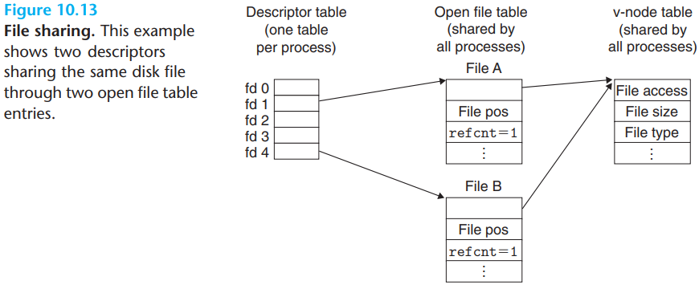

# 10 System-Level I/O

[TOC]

A Linux file is a sequence of $m$ bytes:
$$
B_0, B_1, ..., B_k, ..., B_{m-1}
$$
All I/O devices, such as networks, disks, and terminals, are modeled as files, and all input and output is performed by reading and writing the appropriate files.

Each Linux file has a type that indicates its role in the system:

- A `regular file` contains arbitrary data.
- A `directory` is a file consisting of an array of links, where each link maps a `filename` to a file, which may be another directory.
- A `socket` is a file that is used to communicate with another process across a network.

Pathnames have two forms:

- An `absolute pathname` start with a slash and denotes a path from the root node.
- A `relative pathname` starts with a filename and denotes a path from the current working directory.

The kernel represents open files using three related data structures:

- Descriptor table.
- File table.
- v-node table.

The Unix I/O model is implemented in the operating system kernel. It is available to applications through functions such as `open`, `close`, `lseek`, `read`, `write` and `stat`. The higher-level RIO and standard I/O functions. The RIO functions are robust wrappers for read and write that were developed specifically for this textbook. They automatically deal with short counts and provide an efficient buffered approach for reading text lines. The standard I/O functions provide a more complete buffered alternative to the Unix I/O functions, including formatted I/O routines such as `printf` and `scanf`.

So which of these functions should you use in your programs? Here are some basic guidelines:

1. Use the standard I/O functions whenever possible.
2. Don't use `scanf` or `rio_readlineb` to read binary files.
3. Use the RIO functions for I/O on network sockets.

Standard I/O streams are `full duplex` in the sense that programs can perform input and output on the same stream. However, there are poorly documented restrictions on streams that interact badly with restrictions on sockets:

1. Input functions following output functions.
2. Output functions following input functions.
