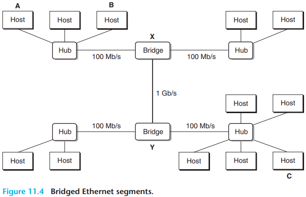
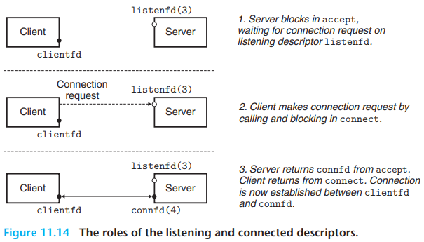

# 11 Network Programming

[TOC]

A client-server transaction consists of four steps:

1. When a client needs service, it initiates a transaction by sending a request to the server.
2. The server receives the request, interprets it, and manipulates its resources in the appropriate way.
3. The server sends a response to the client and then waits for the next request.
4. The client receives the response and manipulates it.

There are eight basic steps:

1. The client on host A invokes a system call that copies the data from the client's virtual address space into a kernel buffer.
2. The protocol software on host A creates a LAN1 frame by appending an internet header and a LAN1 frame header to the data. The internet header is addressed to internet host B. The LAN1 frame header is addressed to the router. It then passes the frame to the adapter.
3. The LAN1 adapter copies the frame to the network.
4. When the frame reaches the router, the router's LAN1 adapter reads it from the wire and passes it to the protocol software.
5. The router fetches the destination internet address from the internet packet header and uses this as an index into a routing table to determine where to forward the packet.
6. The router's LAN2 adapter copies the frame to the network.
7. When the frame reaches host B, its adapter reads the frame from the wire and passes it to the protocol software.
8. Finally, the protocol software on host B strips off the packet header and frame header. The protocol software will eventually copy the resulting data into the server's virtual address space when the server invokes a system call that reads the data.

From a programmer's perspective, we can think of the Internet as a worldwide collection of hosts with the following properties:

- The set of hosts is mapped to a set of 32-bit IP `addresses`.
- The set of IP addresses is mapped to a set of identifiers called `Internet domain names`.
- A process on one Internet host can communicate with a process on any other Internet host over a `connection`.

IP addresses are typically presented to humans in a form known as `dotted-decimal notation`, where each byte is represented by its decimal value and separated from the order bytes by a period.

A connection is uniquely identified by the socket addresses of its two endpoints. This pair of socket addresses is known as a  $socket pair$ and is denoted by the tuple:

$(cliaddr:cliport,\ serveraddr:servport)$

where $cliaddr$ is the client's IP address, $cliport$ is the client's port, $servaddr$ is the server's IP address, and $servport$ is the server's port.

The `sockets interface` is a set of functions that are used in conjunction with the Unix I/O functions to build network applications.

From the perspective of the Linux kernel, a socket is an endpoint for communication. From the perspective of a Linux program, a socket is an open file with a corresponding descriptor.

Web servers provide content to clients in two different ways:

- Fetch a disk file and return its contents to the client. The disk file is known as `static content` and the process of returning the file to the client is known as `serving static content`.
- Run an executable file and return its output to the client. The output produced by the executable at run time is known as `dynamic content`, and the process of running the program and returning its output to the client is known as `serving dynamic content`.

## Summary

Every network application is based on the client-server model. With this model, an application consists of a server and one or more clients. The server manages resources, providing a service for its clients by manipulating the resources in some way. The basic operation in the client-server model is a client-server transaction, which consists of a request from a client, followed by a response from the server.

Clients and servers communicate over a global network known as the Internet. From a programmer's point of view, we can think of the Internet as a worldwide collection of hosts with the following properties: (1)Each Internet host has a unique 32-bit name called its IP address. (2)The set of IP addresses is mapped to a set of Internet domain names. (3)Processes on different Internet hosts can communicate with each other over connections.

Clients and servers establish connections by using the sockets interface. A socket is an endpoint of a connection that is presented to applications in the form of a file descriptor. The sockets interface provides functions for opening and closing socket descriptors. Clients and servers communicate with each other by reading and writing these descriptors.

Web servers and their clients(such as browsers) communicate with each other using the HTTP protocol. A browser requests either static or dynamic content from the server. A request for static content is served by fetching a file from the server's disk and returning it to the client. The CGI standard provides a set of rules that govern how the client passes program arguments to the server, how the server passes these arguments and other information to the child process, and how the child sends its output back to the client. A simple but functioning Web server that serves both static and dynamic content can be implemented in a few hundred lines of C code.

## Glossary

rely `/rɪˈlʌɪ/` 依靠，依赖

retrieve `/rɪˈtriːv/` 取回，检索，挽救

behalf `/bɪ'hɑːf/` 代表，利益，方面

spool `/spuːl/` 缠绕，线轴，卷在线轴上

sophisticate `/səˈfɪstɪkət/` 老练的，精密的，复杂的，老于世故的人，使...更精确

scratch `/skrætʃ/` 划痕

hierarchical `/ˌhaɪə'rɑːkɪkl/` 按等级划分的

proximity `/prɒk'sɪməti/` 接近，亲近

span `/span/` 持续时间，范围，宽度，跨度，全长，跨越，涵盖

campus `/'kæmpəs/` 校园，场地

twist `/twɪst/` 扭曲，弯曲，转动，旋转

slavish `/ˈsleɪvɪʃ/` 盲从的，照搬的，无独创性的

lowercase `/'ləʊəˌkeɪs/` 小写体，小写字母

uppercase `/'ʌpəˌkeɪs/` 大写字母，大写的

namely `/'neɪmli/` 即，也就是

horizontal `/ˌhɒrɪ'zɒntl/` 水平的，水平面，横的

geographical `/ˌdʒiːə'ɡræfɪkl/` 地理的，地理学的

arbitrary `/ˈɑːbɪtrəri/` 任意的，武断的，随心所欲的，专制的

crucial `/'kruːʃl/` 决定性的，关键的

radical `/'rædɪkl/` 根本的，彻底的，激进的，激进分子

incompatible `/ˌɪnkəm'pætəbl/` 不相容的，不能并存的，矛盾的

discrete `/dɪˈskriːt/` 分散，分离，离散

encapsulation `/in.kæpsju'leiʃən/` 封装，包装，密封，胶囊化

topology `/tə'pɒlədʒi/` 拓扑，布局，地志学

architecture `/ˈɑːrkɪtektʃər/` 建筑学，体系，构造

duplex `/'djuːpleks/` （计算机）双方的，双倍的，复式房屋

bidirectional `/ˌbaɪdə'rekʃənl/` 双向的

monolithic `/ˌmɒnə'lɪθɪk/` 单体的，整体的

vast `/vɑːst/` 巨大的，广阔的，辽阔的，大量的

adoption `/ə'dɒpʃn/` 采用，采纳，收养

artifact `/'ɑːtɪˌfækt/` 人工制品，假象，人为现象

scalar `/ˈskeɪlər/` 数量，标量，无向量的

dash `/dæʃ/` 破折号，冲，猛冲，猛掷，泼溅，匆忙完成

nonprofit `/ˌnɒn'prɒfɪt/` 非赢利的，非赢利组织

consortium `/kən'sɔːtɪəm/` 财团，联合，合伙

conduct `/kən'dʌkt/` 行为，举止，品行，引导，导电，导热

trend `/trend/` 倾向，趋势，转向，方位

catastrophic `/ˌkæt.əˈstrɒf.ɪk/` 极差的，糟糕透顶的，灾难性的

backhoe `/'bækhəʊ/` 反向铲，反铲挖土机

ephemeral `/ɪˈfemərəl/` 短暂的，瞬息的

passionate `/'pæʃənət/` 热情的，激情的，易怒的

consensus `/kən'sensəs/` 共识，一致，同意

satellite `/'sætəlaɪt/` 卫星，人造卫星

backbone `/'bækbəʊn/` 脊骨，骨干，骨气，毅力

anatomy `/əˈnætəmi/` 解刨，解刨学，人体

overnight `/ˌəʊvəˈnʌɪt/` 一晚上，整晚，夜间的，过夜的

tremendously `/trə'mendəsli/` 惊人地，非常，十分

spark `/spɑːk/` 冒火花，闪烁，火星，激发，向...求爱

flurry `/'flʌri/` 发慌，焦躁，一阵疾风，阵雪，忙乱

conjunction `/kən'dʒʌŋkʃn/` 结合，关联，连词，(事件等的)同时发生

passive `/ˈpæsɪv/` 消极的，被动的

glance `/ɡlɑːns/` 扫视，瞥，掠过，反光，闪现

simultaneous `/ˌsɪml'teɪniəs/` 同步的，同时发生的

conjunction `/kən'dʒʌŋkʃn/` 结合，关联，连词，(事件等的)同时发生

obsolete `/ˈɒbsəliːt/` 过期的，过时的，淘汰，废弃

canonical `/kə'nɒnɪkl/` 权威的

elegant `/'elɪɡənt/` 优雅的，雅致的

opaque `/əʊˈpeɪk/` 不透明的，浑浊的，难懂，模糊，隐晦

subsume `/səb'sjuːm/` 归入，纳入，包含，包括

handy `/ˈhændi/` 方便的，手巧的，灵巧的，现成的

daunting `/dɔːntɪŋ/` 令人畏惧的

sophisticate `/səˈfɪstɪkət/` 老练的，精密的，复杂的，老于世故的人，使...更精确

intent `/ɪn'tent/` 意图，目的，意向，含义

interpret `/ɪnˈtɜːprət/` 解释，解释型（编程语言），说明，口译，领会，表演

workhorse `/'wɜːkhɔːs/` 驮马，做粗工者，重负荷机器

persistence `/pə'sɪstəns/` 坚持，毅力

practice `/ˈpræktɪs/` 习惯，习俗，实践，练习，实习

summarize `/'sʌməraɪz/` 概述；摘要而言

brand `/brænd/` 商标，烙印，牌子，标记

intermediate `/ˌɪntə'miːdiət/` 中间的，中级的，中等的，中学生，调解，调解人，媒介

digit `/ˈdɪdʒɪt/` 数字位，进制位，数字，手指，拇指，脚趾

permanent `/'pɜːmənənt/` 永久的，持久的，烫发

adder `/'ædə(r)/` 蝰蛇，加法器

lack `/læk/` 缺乏，不足

indicate `/ˈɪndɪkeɪt/` 指示，说明，象征，显示，预示

informational `/ˌɪnfə'meɪʃənl/` 信息的，介绍情况的

brevity `/'brevəti/` 简短，简洁，短暂

omitted `/əʊ'mɪtɪd/` 省略了的

intervention `/ˌɪntə'venʃn/` 介入，干预，调停

casual `/ˈkaʒʊ(ə)l/` 偶然的，随意的，漫不经心的，临时工

bible `/'baɪbl/` 圣经，有权威的书

consult `/kənˈsʌlt/` 参考，咨询，商量

premature `/ˈpremətʃə(r)/` 早产的，早熟的，仓促的

