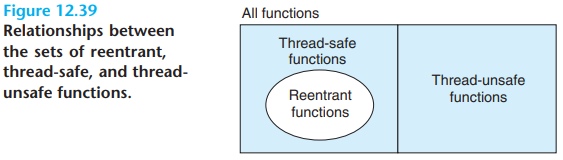
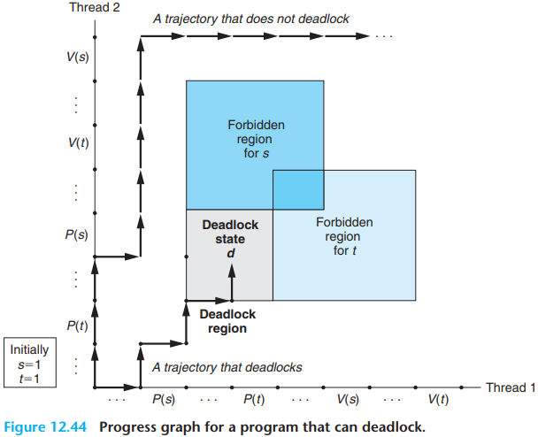

# 12 Concurrent Programming

[TOC]

Modern operating systems provide three basic approaches for building concurrent programs:

- `Processes`. With this approach, each logical control flow is a process that is scheduled and maintained by the kernel. Since processes have separate virtual address spaces, flows that want to communicate with each other must use some kind of explicit interprocess communication (IPC) mechanism.
- `I/O multiplexing`. This is a form of concurrent programming where applications explicitly schedule their own logical flows in the context of a single process. Logical flows are modeled as state machines that the main program explicitly transitions from state to state as a result of data arriving on file descriptors. Since the program is a single process, all flows share the same address space.
- `Threads`. Threads are logical flows that run in the context of a single process and are scheduled by the kernel. You can think of threads as a hybrid of the other two approaches, scheduled by the kernel-like process flows and sharing the same virtual address space like I/O multiplexing flows.

Pros and Cons of Processes:

- Having separate address spaces for processes is both an advantage and a disadvantage. It is impossible for one process to accidentally overwrite the virtual memory of another process, which eliminates a lot of confusing failures -- an obvious advantage.
- On the other hand, separate address spaces make it more difficult for processes to share state information. To share information, they must use explicit IPC(interprocess communications) mechanisms.
- Another disadvantage of process-based designs is that they tend to be slower because the overhead for process control and IPC is hight.

I/O multiplexing can be used as the basis for concurrent event-driven programs, where flows make progress as a result of cretain events.

The server uses the I/O multiplexing, courtesy of the select function, to detect the occurrence of input events. As each connected descriptor becomes ready for reading, the server executes the transition for the corresponding state machine.

Pros and Cons of I/O Multiplexing

- One advantage is that event-driven designs give programmers more control over the behavior of their programs than process-based designs.
- Another advantage is that an event-driven server based on I/O multiplexing runs in the context of a single process, and thus every logical flow has access to the entire address space of the process. This makes it easy to share data between flows.
- Finally, event-driven designs are often significantly more efficient than process-based designs because they do not require a process context switch to schedule a new flow.
- A significant disadvantage of event-driven designs is coding complexity.
- Another significant disadvantage of event-based designs is that they cannot fully utilize multi-core processors.

A thread is a logical flow that runs in the context of a process.

Thread execution differs from processes in some important ways:

- a thread context is much smaller than a process context.
- a thread context switch is faster than a process context switch.
- thread unlike processes, are not organized in a rigid parent-child hierarchy.

A thread terminates in one of the following ways:

- The thread terminates `implicitly` when its top-level thread routine returns.
- The thread terminates `explicitly` by calling the `pthread_exit` function.
- Some peer thread calls the Linux `exit` function, which terminates the process and all threads associated with the process.
- Another peer thread terminates the current thread by calling the `pthread_cancel` function with the ID of the current thread.

A joinable thread can be reaped and killed by other threads. Its memory resources (such as the stack) are not freed until it is reaped by another thread. In contrast, a detached thread cannot be reaped or killed by other threads. Its memory resources are freed automatically by the system when it terminates.

Thus, registers are never shared, whereas virtual memory is always shared.

Variables in threaded C programs are mapped to virtual memory according to their storage classes:

- `Global variables`. A global variable is any variable declared outside of a function. At run time, the read/write area of virtual memory contains exactly one instance of each global variable that can be referenced by any thread.
- `Local automatic variables`. A local automatic variable is one that is declared inside a function without the static attribute. At run time, each thread's stack contains its own instances of any local automatic variables. This is true even if multiple threads execute the same thread routine.
- `Local static variables`. A local static variable is one that is declared inside a function with the static attribute. As with global variables, the read/write area of virtual memory contains exactly one instance of each local static variable declared in a program.

We say that a variable `v` is shared if and only if one of its instances is referenced by more than one thread.

A progress graph models the execution of $n$ concurrent threads as a trajectory through an $n$-dimensional Cartesian space. Each axis $k$ corresponds to the progress of thread $k$. Each point $(I_1, I_2, ..., I_n)$ represents the state where thread $k(k = 1, ..., n)$ has completed instruction $I_k$. The origin of the graph corresponds to the initial state where none of the threads has yet completed an instruction.

In other words, we want to ensure that each thread has `mutually exclusive access` to the shared variable while it is executing the instructions in its critical section. The phenomenon in general is known as `mutual exclusion`.

On the progress graph, the intersection of the two critical sections defines a region of the state space known as an `unsafe region`.

A semaphore, $s$ is a global variable with a nonnegative integer value that can only be manipulated by two special operations, called $P$ and $V$:

- $P(s)$: If $s$ is nonzero, then $P$ decrements $s$ and returns immediately. If $s$ is zero, then suspend the thread until $s$ becomes nonzero and the thread is restarted by a $V$ operation. After restarting, the $P$ operation decrements $s$ and returns control to the caller.
- $V(s)$: The $V$ operation increments $s$ by 1. If there are any threads blocked at a $P$ operation waiting for $s$ to become nonzero, then the $V$ operation restarts exactly one of these threads, which then completes its $P$ operation by decrementing $s$.

when several threads are waiting at a semaphore, you cannot predict which one will be restarted as a result of the $V$.

The definitions of $P$ and $V$ ensure that a running program can never enter a state where a properly initialized semaphore has a negative value. This property, known as the semaphore invariant, provides a powerful tool for controlling the trajectories of concurrent programs.

Semaphores provide a convenient way to ensure mutually exclusive access to shared variables. The basic idea is to associate a semaphore $s$, initially 1, with each shared variable (or related set of shared variables) and then surround the corresponding critical section with $P(s)$ and $V(s)$ operations.

A semaphore that is used in this way to protect shared variables is called a `binary semaphore` because its value is always 0 or 1.

Binary semaphores whose purpose is to provide mutual exclusion are often called `mutexes`.

Performing a $P$ operation on a mutex is called `locking` the mutex.

Performing the $V$ operation is called `unlocking` the mutex.

A thread that has locked but not yet unlocked a mutex is said to be `holding` the mutex.

A semaphore that is used as a counter for a set of available resources is called a `counting sempahore`.

**Synchronization overhead is expensive and should be avoided if possible. If it cannot be avoided, the overhead should be amortized by as much useful computation as possible.**

The speedup of a parallel program is typically defined as
$$
S_p = \frac{T_1}{T_p}
$$
where $p$ is the number of processor cores and $T_k$ is the running time on $k$ cores.

A related measure, known as `efficiency`, is defined as 
$$
E_p = \frac{S_p}{p} = \frac{T_1}{p T_p}
$$
and is typically reported as a percentage in the range $(0, 100]$. Efficiency is a measure of the overhead due to parallelization. Programs with high efficiency are spending more time doing useful work and less time synchronizing and communicating than programs with low efficiency.

`weak scaling`, which increases the problem size along with the number of processors, such that the amount of work performed on each processor is held constant as the number of processors increases. With this formulation, speedup and efficiency are expressed in terms of the total amount of work accomplished per unit of time.

A function is said to be `thread-safe` if and only if it will always produce correct results when called repeatedly from multiple concurrent threads. If a function is not thread-safe, then we say it is `thread-unsafe`.

We can identify four (nondisjoint) classes of thread-unsafe functions:

- Class 1: Functions that do not protect shared variables.
- Class 2: Functions that keep state across multiple invocations.
- Class 3: Functions that return a pointer to a static variable.
- Class 4: Functions that call thread-unsafe functions.

`reentrant functions`: that are characterized by the property that they do not reference `any` shared data when they are called by multiple threads.

Reentrant functions are typically more efficient than non-reentrant threadsafe functions because they require no synchronization operations.

If all function arguments are passed by value (i.e., no pointers) and all data references are to local automatic stack variables (i.e., no references to static or global variables), then the function is `explicitly reentrant`, in the sense that we can assert its reentrancy regardless of how it is called.

`implicitly reentrant` function, in the sense that it is only reentrant if the calling threads are careful to pass pointers to nonshared data.

the lock-and-copy approach has number of disadvantages:

- First, the additional synchronization slows down the program.
- Second, functions that return pointers to complex structures of structures require a `deep copy` of the structures in order to copy the entire structure hierarchy.
- Third, the lock-and-copy approach will not work for a class 2 thread-unsafe function such as rand that relies on static state across calls.

Races usually occur because programmers assume that threads will take some particular trajectory through the execution state space, forgetting the golden rule that threaded programs must work correctly for any feasible trajectory.

Semaphores introduce the potential for a nasty kind of run-time error, called `deadlock`, where a collection of threads is blocked, waiting for a condition that will never be true.

From this graph, we can glean some important insights about deadlock:

- The programmer has incorrectly ordered the $P$ and $V$ operations such that the forbidden regions for the two semaphores overlap.
- The overlapping forbidden regions induce a set of states called the `deadlock region`.
- Deadlock is an especially difficult issue because it is not always predictable.

Mutex lock ordering rule: Given a total ordering of all mutexes, a program is deadlock-free if each thread acquires its mutexes in order and releases them in reverse order.

## Summary

Processes are scheduled automatically by the kernel, and because of their separate virtual address spaces, they require explicit IPC mechanisms in order to share data. Event-driven programs create their own concurrent logical flows, which are modeled as state machines, and use I/O multiplexing to explicitly schedule the flows. Because the program runs in a single process, sharing data between flows is fast and easy. Threads are a hybrid of these approaches. Like flows based on processes, threads are scheduled automatically by the kernel. Like flows based on I/O multiplexing, threads run in the context of a single process, and thus can share data quickly and easily.

Regardless of the concurrency mechanism, synchronizing concurrent accesses to shared data is a difficult problem. The $P$ and $V$ operations on semaphores have been developed to help deal with this problem. Semaphore operations can be used to provide mutually exclusive access to shared data, as well as to schedule access to resources such as the bounded buffers in producer-consumer systems and shared objects in readers-writers systems. A concurrent prethreaded echo server provides a compelling example of these usage scenarios for semaphores.

## Glossary

bibliographic `/ˌbibliə'ɡræfik,-kəl/` 书籍解题的,著书目录的

phenomenon `/fəˈnɒmɪnən/` 现象，杰出的人，奇人，奇事

exploit `/ɪkˈsplɔɪt/` 剥削，压榨，利用，开发，功绩，英勇行为

coalesce `/ˌkəʊə'les/` 合并，联合，接合

soak `/səʊk/` 侵泡，渗透，渗入，吸入，使喝醉

uniprocessor `/'juːnɪprəʊsesər/` （计算机）单处理器（单机）

investigate `/ɪn'vestɪɡeɪt/` 调查，研究

Pros `/prəʊ/` 正面，正面的，能手，行家，专业的

Cons `/kɔn/` 反面，发面的，骗局，精读，记诵

arbitrary `/ˈɑːbɪtrəri/` 任意的，武断的，随心所欲的，专制的

hodgepodge `/'hɒdʒpɒdʒ/` 混煮，杂烩菜

dilemma `/dɪˈlemə/` 困境，进退两难的

scenario /sɪˈnɑː.ri.əʊ/ 可能发生的事态，设想，剧本，情节，情况

courtesy `/'kɜːtəsi/` 礼貌，好意

granularity `/grænjʊ'lærɪtɪ/` 颗粒度，粒度

maxi `/'mæksi/` 长裙，最大，最长

complexity `/kəm'pleksəti/` 复杂性，复杂度

vulnerable `/'vʌlnərəbl/` 易受伤害的，有弱点的，脆弱的

malicious `/məˈlɪʃəs/` 恶毒的，蓄意的，怀有恶意的

adopt `/ə'dɒpt/` 采用，收养，接受

dissect `/dɪ'sekt/` 解剖，切细，仔细研究，详细分析

encapsulate `/ɪnˈkæpsjuleɪt/` 概括，压缩，简述，装入胶囊，包装

reap `/riːp/` 收割，获得，收获

arbitrary `/ˈɑːbɪtrəri/` 任意的，武断的，随心所欲的，专制的

intuitive `/ɪn'tjuːɪtɪv/` 直觉的

specification `/ˌspesɪfɪ'keɪʃn/` 规格，详述

overall `/ˌəʊvərˈɔːl/` 全面的，全部的，总体的，总计

perspective `/pə'spektɪv/` 远景，看法，透视

aspect `/ˈæspekt/`  外表，面貌，方面，层面，方位

nonetheless `/ˌnʌnðə'les/` 尽管如此(仍然)

reside `/rɪ'zaɪd/` 居住，属于，存在

denote `/dɪˈnəʊt/` 标志，象征，表示，预示

niters

trajectory `/trə'dʒektəri/` 轨道，弹道，轨迹

cartesian `/kɑː'tiːziən/` （数学）笛卡尔的

correspond `/kɒrɪˈspɒnd/` 通信，相符，符合

diagonal `/daɪˈæɡənl/` 斜线，对角线

critical `/ˈkrɪtɪkl/` 关键的，严重的，致命的

mutually `/'mjuːtʃuəli/` 相互的，彼此的

abuts `/ə'bʌt/` 邻接，毗连

perimeter `/pə'rɪmɪtə(r)/` 周长，周界，边缘

skirt `/skɜːt/` 裙子，下摆，边缘，教区，挡板，绕开

infeasible `/ɪn'fiːzəbl/` 行不通的，不可实行的

crucial `/'kruːʃl/` 决定性的，关键的

trajectory `/trə'dʒektəri/` 轨道，弹道，轨迹

visualize `/'vɪʒuəlaɪz/` 看得见，形象化，设想

scenario `/sɪˈnɑː.ri.əʊ/` 可能发生的事态，设想，剧本，情节，情况

bound `/baʊnd/` 约束，捆绑，界限，必然的，注定的，跳跃

exclusive `/ɪkˈskluːsɪv/` 专有的，独占的，专有的，排外的，独家

jitter `/'dʒɪtə/` 振动，紧张

reservoir `/ˈrezəvwɑː(r)/` 水库，储水池，储存器

prethreading `//` （计算机）预分配线程

indicate `/ˈɪndɪkeɪt/` 指示，说明，象征，显示，预示

symmetric `/sɪ'metrɪk/` 对称的

denote `/dɪˈnəʊt/` 标志，象征，表示，预示

scenario `/sɪˈnɑː.ri.əʊ/` 可能发生的事态，设想，剧本，情节，情况

interaction `/ˌɪntər'ækʃn/` 相互作用，相互影响

inspect `/ɪnˈspekt/` 检查，审查，查看，视察

favor `/'feɪvə/` 偏爱，好意，特权，赞成，给予，支持，关心

granted `/'ɡrɑːntɪd/` 的确，假定

deceptive `/dɪ'septɪv/` 骗人的，虚伪的，欺诈的

unimpeded `/ˌʌnɪm'piːdɪd/` 未受阻的，畅通无阻的

starvation `/stɑː'veɪʃn/` 饿死，饥饿

incur `/ɪnˈkɜːr/` 招致，引起，遭受，带来

nontrivial `/'nɒn'trɪvɪəl/` 非平凡的，重要的

mutual `/ˈmjuːtʃʊəl/` 相互的，关系对等的，共用的，互助的

exclusion `/ɪk'skluːʒn/` 排除，除外，逐出

cumulative `/'kjuːmjələtɪv/` 累积的，累计的，渐增的

sequential `/sɪ'kwenʃl/` 连续的

exploit `/ɪkˈsplɔɪt/` 剥削，压榨，利用，开发，功绩，英勇行为

mainstream `/'meɪnstriːm/` 主流

spreadsheet `/'spredʃiːt/` 电子制表软件，电子表格，试算表

disjoint `/dɪs'dʒɔɪnt/` 脱节，解体

treatment `/ˈtriːtm(ə)nt/` 对待，论述，探讨，治疗，处理

concise `/kən'saɪs/` 简明的，简要的

nasty `/'nɑːsti/` 下流的，严重的

extremely `/ɪk'striːmli/` 非常，极其

magnitude `/ˈmæɡnɪtjuːd/` 巨大，重大，重要性，地震等级

lesson `/'lesn/` 课程，榜样，典范，训斥，告诫

amortize `/ə'mɔːtaɪz/` 分期偿还，摊还

partial `/ˈpɑːʃl/` 部分，不完全的，偏爱

magnitude `/ˈmæɡnɪtjuːd/` 巨大，重大，重要性，地震等级

eliminate `/ɪˈlɪmɪneɪt/` 消灭，铲除，排除，淘汰

summing `/'sʌmɪŋ/` 求和，合计，概述

elapse `/əˈlaps/` 逝去（时间），过去

tricky `/'trɪki/` 棘手的，狡猾的，巧妙的

routine `/ruˈtin/` 常规，例行的，程序

magnitude `/ˈmæɡnɪtjuːd/` 巨大，重大，重要性，地震等级

eliminate `/ɪˈlɪmɪneɪt/` 消灭，铲除，排除，淘汰

tricky `/'trɪki/` 棘手的，狡猾的，巧妙的

elapse `/əˈlaps/` 逝去（时间），过去

exploit `/ɪkˈsplɔɪt/` 剥削，压榨，利用，开发，功绩，英勇行为

numerator `/'njuːməreɪtə(r)/` （数学）分子（除法）

feasible `/'fiːzəbl/` 可行的，可能的

efficiency `/ɪ'fɪʃnsi/` 功率，效率

fool `/fuːl/` 傻瓜，小丑，愚弄，欺骗，开玩笑，干蠢事，玩弄，鬼混

decade `/'dekeɪd/` 十年

advent `/'ædvent/` 出现，到来

accomplish `/əˈkʌmplɪʃ/` 达到，完成，结束

prediction `/prɪˈdɪkʃn/` 预言，预言的事物

complicated `/ˈkɒmplɪkeɪtɪd/` 复杂的，难懂的

iceberg `/ˈaɪsbɜːɡ/` 冰山

survey `/'sɜːveɪ/` 问卷，测量，调查，纵览，视察

couch `/kaʊtʃ/` 长椅，睡椅，兽穴，埋伏，躺下

pseudorandom `/psjuːdəʊ'rændəm/` （计算机）伪随机

prone `/prəʊn/` 易于...的，有...倾向的，俯卧的

disaster `/dɪ'zɑːstə(r)/` 灾难

recourse `/rɪ'kɔːs/` 依赖，求助，追索权

reentrant `/riː'entrənt/` （计算机）重入，凹入的，凹角

callee `/kɔː'liː/` 被召唤者，被呼叫者

deprecate `/ˈdeprəkeɪt/` 强烈反对，不赞成

disruptive `/dɪs'rʌptɪv/` 分裂的，破坏性的，制造混乱的

correctness `/kə'rektnəs/` 正确性，正确

spot `/spɒt/` 污点，斑点，地点，场所，现货，插播节目，职位，现货的

scary `/'skeəri/` 可怕的，引起恐慌的

unaware `/ˌʌnə'weə(r)/` 没有发觉的，不知道的

nasty `/'nɑːsti/` 下流的，严重的

glean `/ɡliːn/` 收集

trap `/træp/` 陷阱，圈套，牢笼，夹住，绊住，缠住

overlap `/ˈəʊvəlæp/` 重叠，交替

proper `/ˈprɒpə(r)/` 正确的，恰当的，完全的

bibliographic `/ˌbibliə'ɡræfik,-kəl/` 书籍解题的,著书目录的

barber `/ˈbɑːbə(r)/` 理发师，理发店

comprehensive `/ˌkɒmprɪ'hensɪv/` 可理解的，全面的，综合的，广泛的

pitfall `/ˈpɪtfɔːl/` 陷阱，困难，危险，隐患

pugh `/pjuː/` 表示轻蔑，嫌恶等时所发声音

flawed `/flɔːd/` 有裂纹的，有瑕疵的，有缺陷的

simultaneous `/ˌsɪml'teɪniəs/` 同步的，同时发生的
