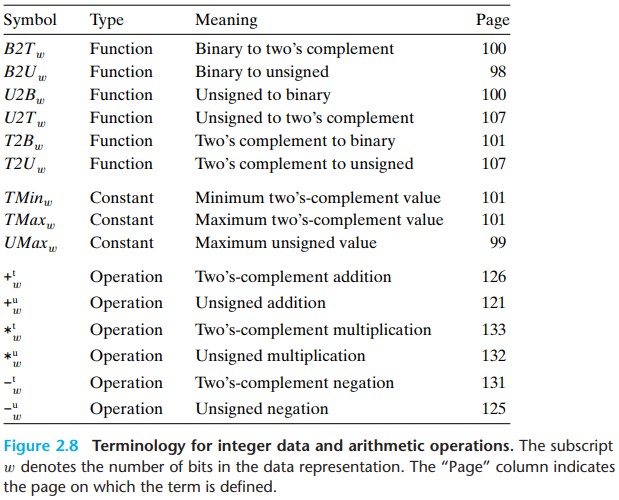
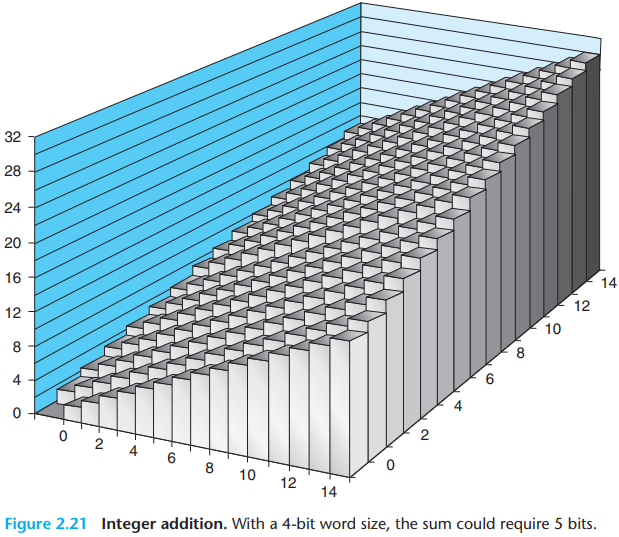

# 2 Representing and Manipulating Information

The three most important representations of numbers:

- `Unsigned` encodings are based on traditional binary notation, representing numbers greater than or equal to 0.
- `Two's-complement` encoding are the most common way to represent signed integers, that is, numbers that may be either positive or negative.
- `Floating-point` encodings are a base-2 version of scientific notation for representing real numbers.

Computer respresentations use a limited number of bits to encode a number, and hence some operations can `overflow` when the results are too large to be represented. This can lead to some surprising results.

Rather than accessing individual bits in memory, most computers use blocks of 8 bits, or `bytes`, as the smallest addressable unit of memory. A machine-level program views memory as a very large array of bytes, referred to as `virtual memory`. Every byte of memory is identified by a unique number, known as its `address`, and the set of all possible addresses is known as the `virtual address space`.

`program objects`, that is, program data, instructions, and control information.

Every computer has a `word` size, indicating the nominal size of pointer data. Since a virtual address is encoded by such a word, the most important system parameter determined by the word size is the maximum size of the virtual address space. That is, for a machine with a $w$-bit word size, the virtual addresses can range from 0 to $2^w - 1$, giving the program access to at most $2^w$ bytes.

`little endian`. where the least significant byte comes first.

`big endian`. where the most significant byte comes first.

Figure 2.8 lists the mathematical terminology we introduce to precisely define and characterize how computers encode and operate on integer data:

Let us consider an integer data type of $w$ bits. We write a bit vector as either $\vec x$, to denote the entire vector, or as $[x_{w-1}, x_{w-2}, \cdots, x_0]$ to denote the individual bits within the vector. We can express this interpretation as a function $B2U_w$ (for "binary to unsigned," length $w$):

PRINCIPLE: Definition of unsigned encoding 

For vector $\vec x - [x_{w-1}, x_{w-2}, \cdots, x_0]$:
$$
B2U_w(\vec x) = \sum_{i=0}^{w-1}x_i 2^i
$$

PRINCIPLE: Uniqueness of unsigned encoding 

Function $B2U_w$ is a bijection.

The mathematical term $bijection$ refers to a function $f$ that goes two ways: it maps a value $x$ to a value $y$ where $y = f(x)$, but it can also operate in reverse, since for every $y$, there is a unique value $x$ such that $f(x) = y$.

PRINCIPLE: Definition of two's-complement encoding 

For vector $\vec x = [x_{w-1}, x_{w-2}, \cdots, x_0]$:
$$
B2T_w(\vec x) \doteq -x_{w-1}2^{w-1} + \sum_{i=0}^{w-2}x_i 2^i
$$
The msot significant bit $w_{w-1}$ is also called the sign $bit$. Its "weight" is $-2^{w-1}$, the negation of its weight in an unsigned representation. When the sign bit is set to 1, the represented value is negative, and when set to 0, the value is nonnegative.

PRINCIPLE: Uniqueness of two's-complement encoding 

Function $B2T_w$ is a bijection.

We define function $T2B_w$ (for "two's complement to binary") to be the inverse of $B2T_w$. That is, for a number $x$, such that $TMin_w \leq x \leq TMax_w$, $T2B_w(x)$ is the (unique) $w$-bit pattern that encodes $x$.

There are two other standard representations for signed numbers:

- $Ones' complement$. This is the same as two's complement, except that the most significant bit has $weight - (2^{w-1} - 1)$ rather than $-2^{w-1}$:
  $$
  B2O_w(\vec x) \doteq -x_{w-1}(2^{w-1} - 1) + \sum_{i=0}^{w-2}x_i 2^i
  $$

- $Sign magnitude$. The most significant bit is a sign bit that determines whether the remaining bits should be given negative or positive weight:
  $$
  B2S_w(\vec x) \doteq (-1)^{x_{w-1}} \cdot (\sum_{i=0}^{w-2}x_i 2^i)
  $$

PRINCIPLE: Conversion from two's complement to unsigned 

For $x$ such that $TMin_w \leq x \leq TMax_w$:
$$
T2U_w(x) = 
\begin{cases}
x + 2^w, &x < 0\\
x, &x \geq 0
\end{cases}
$$
DERIVATION: Conversion from two's complement to unsigned
$$
B2U_w(T2B_w(x)) = T2U_w(x) = x + x_{w-1} 2^w
$$

PRINCIPLE: Unsigned to two's-complement conversion

For $u$ such that $0 \leq u \leq UMax_w$:
$$
U2T_w(u) = 
\begin{cases}
u, &u \leq TMax_w\\
u - 2^w, &u > TMax_w
\end{cases}
$$
DERIVATION: Unsigned to two's-complement conversion

Let $\vec u = U2B_w(u)$. This bit vector will also be the two's-complement representation of $U2T_w(u)$:
$$
U2T_w(u) = -u_{w - 1}2^w + u
$$

PRINCIPLE: Expansion of an unsigned number by zero extension

Define bit vectors $\vec u = [u_{w - 1}, u_{w - 2}, \cdots, u_0]$ of width $w$ and $\vec u' = [0, \cdots, 0, u_{w - 1}, u_{w - 2}, \cdots, u_0]$ of width $w'$, where $w' > w$. Then $B2U_w(\vec u) = B2U_{w'}(\vec u')$.

PRINCIPLE: Expansion of a two's-complement number by sign extension 

Define bit vector $\vec x = [x_{w-1}, x_{w-2}, \cdots, x_0]$ of width $w$ and $\vec x' = [x_{w-1}, \cdots, x_{w-1}, x_{w-1}, x_{w-2}, \cdots, x_0]$ of width $w'$, where $w' > w$. Then $B2T_w(\vec x) = B2T_{w'}(\vec x')$.

DERIVATION: Expansion of a two's-complement number by sign extension

Let $w' = w + k$, What we want to prove is that
$$
B2T_{w+k}([\underbrace{x_{w-1}, \cdots, x_{w-1}}_{k\ times}, x_{w-1}, x_{w-2}, \cdots, x_0]) = B2T_w([x_{w-1}, x_{w-2}, \cdots, x_0])
$$
The proof follows by induction on $k$. That is, if we can prove that sign extending by 1 bit preserves the numeric value, then this property will hold when sign extending by an arbitrary number of bits. Thus, the task reduces to proving that
$$
B2T_{w+1}([x_{w-1}, x_{w-1}, x_{w-2}, \cdots, x_0]) = B2T_w([x_{w-1}, x_{w-2}, \cdots, x_0])
$$
Expanding the left-hand expression give the following:
$$
\begin{equation}\begin{split}
B2T_{w+1}([x_{w-1}, x_{w-1}, x_{w-2}, \cdots, x_0]) &= -x_{w-1}2^w + \sum_{i=0}^{w-1}x_i 2^i \\
&= -x_{w-1}2^w + x_{w-1}2^{w-1} + \sum_{i=0}^{w-2}x_i 2^i \\
&= -x_{w-1}(2^w - 2^{w-1}) + \sum_{i = 0}^{w-2}x_i 2^i \\
&= -x_{w-1}2^{w-1} + \sum_{i=0}^{w-2}x_i 2^i \\
&= B2T_w([x_{w-1}, x_{w-2}, \cdots, x_0])
\end{split}\end{equation}
$$
PRINCIPLE: Truncation of an unsigned number

Let $\vec x$ be the bit vector $[x_{w - 1}, x_{w - 2}, \cdots, x_0]$, and let $\vec x'$ be the result of truncating it to $k$ bits: $\vec x' = [x_{k-1}, x_{k-2}, ..., x_0]$. Let $x = B2U_w(\vec x)$ and $x' = B2U_k(\vec x')$. Then $x' = x\ mod\ 2^k$.

DERIVATION: Truncation of an unsigned number

Applying the modulus operation to Equation 2.1 yields
$$
\begin{equation}\begin{split}
B2U_w([x_{w-1}, x_{w-2}, \cdots, x_0])\ mod\ 2^k &= \left[\sum_{i=0}^{w-1}x_i 2^i \right]\ mod\ 2^k \\
&= \left[\sum_{i = 0}^{k - 1}x_i 2^i \right]\ mod\ 2^k \\
&= \sum_{i = 0}^{k - 1} x_i 2^i \\
&= B2U_k([x_{k-1}, x_{k-2}, \cdots, x_0])
\end{split}\end{equation}
$$
In this derivation, we make use of the property that $2^i\ mod\ 2^k = 0$ for any $i \geq k$.

PRINCIPLE: Truncation of a two's-complement number

Let $\vec x$ be the bit vector $[x_{w-1}, x_{w-2}, \cdots, x_0]$, and let $\vec{'x}$ be the result of truncating it to $k$ bits: $\vec{x'} = [x_{k-1}, x_{k-2}, \cdots, x_0]$. Let $x = B2T_w(\vec x)$ and $x' = B2T_k(\vec{x'})$. Then $x' = U2T_k(x\ mod\ 2^k)$.

DERIVATION: Truncation of a two's-complement number

Using a similar argument to the one we used for truncation of an unsigned number shows that
$$
B2T_w([x_{w-1}, x_{w-2}, \cdots, x_0])\ mod\ 2^k = B2U_k([x_{k-1}, x_{k-2}, \cdots, x_0])
$$
That is, $x\ mod\ 2^k$ can be represented by an unsigned number having bit-level representation $[x_{k-1}, x_{k-2}, \cdots, x_0]$. Converting this to two's-complement number gives $x' = U2T_k(x\ mod\ 2^k)$.

Summarizing, the effect of truncation for unsigned numbers is
$$
B2U_k([x_{k-1}, x_{k-2}, \cdots, x_0]) = B2U_w([x_{w-1}, x_{w-2}, \cdots, x_0])\ mod\ 2^k
$$
while the effect for two's-complement numbers is
$$
B2T_k([x_{k-1}, x_{k-2}, \cdots, x_0]) = U2T_k(B2U_w([x_{w-1}, x_{w-2}, \cdots, x_0])\ mod\ 2^k)
$$

PRINCIPLE: Unsigned addition

For $x$ and $y$ such that $0 \leq x, y < 2^w$:
$$
x +_{w}^{u}y  = 
\begin{cases}
x + y, &u \leq TMax_w \qquad Normal\\
x + y - 2^w, &2^2 \leq x + y < x^{w+1}\qquad Overflow
\end{cases}
$$
DERIVATION: Unsigned addition

In general, we can see that if $x + y < 2^w$, the leading bit in the $(w + 1)$-bit representation of the sum will equal 0, and hence discarding it will not change the numeric value. On the other hand, if $2^w \leq x + y < 2^{w+1}$, the leading bit in the $(w + 1)$-bit representation of the sum will equal 1, and hence discarding it is equivalent to subtracting $2^w$ from the sum.

An arithmetic operation is said to `overflow` when the full integer result cannot fit within the word size limits of the data type.

PRINCIPLE: Detecting overflow of unsigned addition

For $x$ and $y$ in the range $0 \leq x, y \leq UMax_w$, let $s \doteq x +_{w}^{u} y$. Then the computation of $s$ overflowed if and only if $s < x$ (or equivalently, s < y).

DERIVATION: Detecting overflow of unsigned addition

Observe that $x + y \geq x$, and hence if $s$ did not overflow, we will surely have $x \geq x$. On the other hand, if $x$ did overflow, we have $s = x + y - 2^w$. Given that $y < 2^w$, we have $y - 2^w < 0$, and hence $s = x + (y - 2^w) < x$.

PRINCIPLE: Unsigned negation

For any number $x$ such that $0 \leq x < 2^w$, its $w$-bit unsigned negation $-_{w}^{u}x$ is given by the following:
$$
-_{w}^{u}x = 
\begin{cases}
x, &x = 0\\
2^w - x, &x > 0
\end{cases}
$$
DERIVATION: Unsigned negation

When $x = 0$, the additive inverse is clearly $0$. For $x > 0$, consider the value $2^w - x$. Observe that this number is in the range $0 < 2^w - x < 2^w$. We can also see that $(x + 2^w - x)\ mod\ 2^w = 2^w\ mod\ 2^w = 0$. Hence it is the inverse of $x$ under $+_{w}^{u}$.

PRINCIPLE: Two's-complement addition

For integer values $x$ and $y$ in the range $-2^{w-1} \leq x, y \leq 2^{w-1} - 1$:
$$
x +_{w}^{t}y = 
\begin{cases}
x + y - 2^w, &2^{w-1} \leq x + y\qquad Positive\ overflow\\
x + y, &-2^{w-1} \leq x + y < 2^{w - 1}\qquad Normal \\
x + y + 2^w, &x+y < -2^{w-1}\qquad Negative\ overflow
\end{cases}
$$

DERIVATION: Two's-complement addition

Since two's-complement addition has the exact same bit-level representation as unsigned addition, we can characterize the operation $+_{w}^{t}$ as one of converting its arguments to unsigned, performing unsigned addition, and then converting back to two's complement:
$$
\begin{equation}\begin{split}
x +_{w}^{t}y &= U2T_w(T2U_w(x) +_{w}^{u}T2U_w(y)) \\
&= U2T_w[(x_{w-1}2^w + x + y_{w-1}2^w + y)\ mod\ 2^w] \\
&= U2T_w[(x+y)\ mod\ 2^w]
\end{split}\end{equation}
$$
The term $x_{w-1}2^w$ and $y_{w-1}2^w$ drop out since they equal $0$ modulo $2^w$.

PRINCIPLE: Detecting overflow in two's-complement addition

For $x$ and $y$ in the range $TMin_w \leq x, y \leq TMax_w$, let $s \doteq x +_{w}^{t}y$. Then the computation of $s$ has had positive overflow if and only if $x > 0$ and $y > 0$ but $s \leq 0$. The computation has had negative overflow if and only if $x < 0$ but $s \geq 0$.

DERIVATION: Detecting overflow of two's-complement addition

Let us first do the analysis for positive overflow. If both $x > 0$ and $y > 0$ but $s \leq 0$, then clearly positive overflow has occurred. Conversely, positive overflow requires (1) that $x > 0$ and $y > 0$ (otherwise, $x + y < TMax_w$) and (2) that $s \leq 0$. A similar set of arguments holds for negative overflow.

PRINCIPLE: Two's-complement negation

For $x$ in the range $TMin_w \leq x \leq TMax_w$, its two's-complement negation $-_{w}^{t}$ is given by the formula
$$
-_{w}^{t}x = 
\begin{cases}
TMin_w, &x = TMin_w \\
-x, &x > TMin_w
\end{cases}
$$
DERIVATION: Two's-complement negation

Observe that $TMin_w + TMin_w = -2^{w-1} + -2^{w-1} = -2^w$. This would cause negative overflow, and hence $TMin_w +_{w}^{t}TMin_w = -2^w + 2^w = 0$. For values of $x$ such that $x > TMin_w$, the value $-x$ can also be represented as a $w$-bit two's-complement number, and their sum will be $-x + x = 0$.

PRINCIPLE: Unsigned multiplication

For $x$ and $y$ such that $0 \leq x, y \leq UMax_w$:
$$
x *_{w}^{u}y = (x \cdot y)\ mod\ 2^w
$$

PRINCIPLE: Two's-complement multiplication

For $x$ and $y$ such that $TMin_w \leq x, y \leq TMax_w$:
$$
x *_{w}^{t} y = U2T_w((x \cdot y)\ mod\ 2^w)
$$
We claim that the bit-level representation of the product operation is identical for both unsigned and two's-complement multiplication, as stated by the following principle:

PRINCIPLE: Bit-level equivalence of unsigned and two's-complement multiplication

Let $\vec x$ and $\vec y$ be bit vectors of length $w$. Define integers $x$ and $y$ as the values represented by these bits in two's-complement form: $x = B2T_w(\vec{x})$ and $y = B2T_w(\vec{y})$. Define nonnegative integers $x'$ and $y'$ as the values represented by these bits in unsigned form: $x' = B2U_w(\vec{x})$ and $y' = B2U_w(\vec{y})$. Then
$$
T2B_w(x *_{w}^{t} y) = U2B_w(x' *_{w}^{u} y')
$$
DERIVATION: Bit-level equivalence of unsigned and two's-complement multiplication

We have $x' = x + x_{w-1}2^w$ and $y' = y + y_{w-1}2^w$. Computing the product of these values modulo $2^w$ gives the following:
$$
\begin{equation}\begin{split}
(x' \cdot y')mod\ 2^w &= [(x + x_{w-1}2^w) \cdot (y + y_{w-1} 2^w)]\ mod\ 2^w \\
&= [x \cdot y + (x_{w-1}y + y_{w-1}x)2^w + x_{w-1}y_{w-1}2^{2w}]\ mod\ 2^w \\
&= (x \cdot y)\ mod\ 2^w 
\end{split}\end{equation}
$$
 The terms with weight $2^w$ and $2^{2w}$ drop out due to the modulus operator. We have $x *_{w}^{t} y = U2T_w((x \cdot y)\ mod\ 2^w)$. We can apply the operation $T2U_w$ to both sides to get
$$
T2U_w(x *_{w}^{t} y) = T2U_w(U2T_w((x \cdot y)\ mod\ 2^w)) = (x \cdot y)\ mod\ 2^w
$$
We can then apply $U2B_w$ to both sides to get
$$
U2B_w(T2U_w(x *_{w}^{t} y)) = T2B_w(x *_{w}^{t} y) = U2B_w(x' *_{w}^{u} y')
$$

PRINCIPLE: Multiplication by a power of 2

Let $x$ be the unsigned integer represented by bit pattern $[x_{w-1}, x_{w-2}, \cdots, x_0]$. Then for any $k \geq 0$, the $w + k$-bit unsigned representation of $x2^k$ is given by $[x_{w-1}, x_{w-2}, \cdots, x_0, 0, \cdots, 0]$, where $k$ zeros have been added to the right.

DERIVATION: Multiplication by a power of 2

This property can be derived using Equation 2.1:
$$
\begin{equation}\begin{split}
B2U_{w+k}([x_{w-1}, x_{w-2}, \cdots, x_0, 0, \cdots, 0]) &= \sum_{i=0}^{w-1}x_i 2^{i+k} \\
&= \left[ \sum_{i=0}^{w-1} x_i 2^i \right] \cdot 2^k \\
&= x2^k
\end{split}\end{equation}
$$
When shifting left by $k$ for a fixed word size, the high-order $k$ bits are discarded, yielding
$$
[x_{w-k-1}, x_{w-k-2}, \cdots, x_0, 0, \cdots, 0]
$$
but this is also the case when performing multiplication on fixed-size words.

PRINCIPLE: Unsigned multiplication by a power of 2

For $C$ variables $x$ and $k$ with unsigned values $x$ and $k$, such that $0 \leq k < w$, the $C$ expression $x \ll k$ yields the value $x *_{w}^{t} 2^k$.

PRINCIPLE: Unsigned division by a power of 2

For $C$ variables $x$ and $k$ with unsigned values $x$ and $k$, such that $0 \leq k < w$, the $C$ expression $x \gg k$ yields the value $\lfloor x/2^k \rfloor$.

DERIVATION: Unsigned division by a power of 2

Let $x$ be the unsigned integer represented by bit pattern $[x_{w-1}, x_{w-2}, \cdots, x_0]$, and let $k$ be in the range $0 \leq k < w$. Let $x'$ be the unsigned number with $w - k$-bit representation $[x_{w-1}, x_{w-2}, \cdots, x_k]$, and let $x''$ be the unsigned number with $k$-bit representation $[x_{k-1}, \cdots, x_0]$. We can therefore see that $x = 2^kx' + x''$, and that $0 \leq x'' < 2^k$. It therefore follows that $\lfloor x/2^k \rfloor = x'$.

Performing a logical right shift of bit vector $[x_{w-1}, x_{w-2}, \cdots, x_0]$ by $k$ yields the it vector
$$
[0, \cdots, 0, x_{w-1}, x_{w-2}, \cdots, x_k]
$$
This bit vector has numeric value $x'$, which we have seen is the value that would result by computing the expression $x \gg k$.

PRINCIPLE: Two's-complement division by a power of 2, rounding down

Let C variables $x$ and $k$ have two's-complement value $x$ and unsigned value $k$, respectively, such that $0 \leq k < w$. The C expression $x >> k$, when the shift is performed arithmetically, yields the value $\lfloor x/2^k \rfloor$.

DERIVATION: Two's-complement division by a power of 2, rounding down

Let $x$ be the two's-complement integer represented by bit pattern $[x_{w-1}, x_{w-2}, \cdots, x_0]$, and let $k$ be in the range $0 \leq k < w$. Let $x'$ be the two's-complement number represented by the $w-k$ bits $[x_{w-1}, x_{w-2}, \cdots, x_k]$, and let $x''$ be the unsigned number represented by the low-order $k$ bits $[x_{k-1}, \cdots, x_0]$. By a similar analysis as the unsigned case, we have $x = 2^k x' + x''$ and $0 \leq x'' < 2^k$, giving $x' = \lfloor x/2^k \rfloor$. Furthermore, observe that shifting bit vector $[x_{w-1}, x_{w-2}, \cdots, x_0]$ right arithmetically by $k$ yields the bit vector
$$
[x_{w-1}, \cdots, x_{w-1}, x_{w-1}, x_{w-2}, \cdots, x_k]
$$
which is the sign extension from $w-k$ bits to $w$ bits of $[x_{w-1}, x_{w-2}, \cdots, x_k]$. Thus, this shifted bit vector is the two's-complement representation of $\lfloor x/2^k \rfloor$.

PRINCIPLE: Two's-complement division by a power of 2, rounding up

Let C variables $x$ and $k$ have two's-complement value $x$ and unsigned value $k$, respectively, such that $0 \leq k < w$. The C expression $(x + (1 << k) - ) >> k$, when the shift is performed arithmetically, yields the value $\lceil x/2^k \rceil$.

DERIVATION: Two's-complement division by a power of 2, rounding up

To see that $\lceil x/y \rceil = \lfloor (x+y-1)/y \rfloor$, suppose that $x = qy + r$, where $0 \leq r < y$, giving $(x + y - 1)/y = q + (r + y - 1)$ and so $\lfloor (x + y - 1)/y \rfloor = q + \lfloor (r + y - 1)/y \rfloor$. The latter term will equal 0 when $r = 0$ and 1 when $r > 0$. That is, by adding a bias of $y - 1$ to $x$ and then rounding the division downward, we will get $q$ when $y$ divides $x$ and $q + 1$ otherwise.

Decimal notation uses a representation of the form
$$
d_m d_{m-1} \cdots d_1 d_0 \cdot d_{-1} d_{-2} \cdots d_{-n}
$$
where each decimal digit $d_i$ ranges between 0 and 9. This notation represents a value $d$ defined as:
$$
d = \sum_{i=-n}^{m}10^i \times d_i
$$
The weighting of the digits is defined relative to the decimal point symbol ('.'), meaning that digits to the left are weighted by nonnegative powers of 10, giving integral values, while digits to the right are weighted by negative powers of 10, giving fractional values.

By analogy, consider a notation of the form
$$
b_m b_{m-1} \cdots b_1 b_0 \cdot b_{-1}b_{-2} \cdots b_{-n+1}b_{-n}
$$
where each binary digit, or bit, $b_i$ ranges between 0 and 1, as is illustrated in Figure 2.31. This notation represents a number $b$ defined as
$$
b = \sum_{i = -n}^{m} 2^i \times b_i
$$
The symbol '.' now becomes a `binary point`, with bits on the left being weighted by nonnegative powers of 2, and those on the right being weighted by negative powers of 2.

The IEEE floating-point standard represents a number in a form $V = (-1)^s \times M \times 2^E$:

- The sign $s$ determines whether the number is negative (s = 1) or positive (s = 0), where the interpretation of the sign bit for numeric value 0 is handled as a special case.
- The significand $M$ is a fractional binary number that ranges either between $1$ and $2 - \epsilon$ or between $0$ and $1 - \epsilon$.
- The exponent $E$ weights the value by a (possibly negative) power of 2.

The bit representation of a floating-point number is divided into three fields to encode these values:

- The single sign bit $s$ directly encodes the sign $s$.
- The $k$-bit exponent field $exp = e_{k-1} \cdots e_1e_0$ encodes the exponent $E$.
- The $n$-bit fraction field $frac = f_{n-1} \cdots f_1 f_0$ encodes the significand $M$, but the value encoded also depends on whether or not the exponent field equals 0.

## Summary

TODO

## Glossary

presence `/'prezns/` 出席，存在，到场

punch `/pʌntʃ/` 拳打，拳击，打洞

finite `/'faɪnaɪt/` 有限的

approximate `/əˈprɒksɪmət/` 近似，接近

commutativity `/kəmjuːtə'tɪvɪtɪ/` 可换性，交换的，互相的

finite `/'faɪnaɪt/` 有限的

precision `/prɪˈsɪʒn/` 精确，准确，细致

stem `/stem/` 柄，茎，船首，起源于，阻止，遏制

precisely `/prɪ'saɪsli/` 精确地

vulnerability `/ˌvʌlnərə'bɪləti/` （计算机）漏洞，易受攻击，弱点

legion `/'liːdʒən/` 军团，很多的

obligation `/ˌɒblɪ'ɡeɪʃn/` 义务，责任

treatment `/ˈtriːtm(ə)nt/` 对待，论述，探讨，治疗，处理

verbose `/vɜː'bəʊs/` 罗嗦的，冗长的

tedious `/ˈtiːdiəs/` 沉闷的，乏味的，冗长的

interpret `/ɪnˈtɜːprət/` 解释，解释型（编程语言），说明，口译，领会，表演

vagary `/'veɪgərɪ/` 奇特，好奇，变幻莫测

omit `/ə(ʊ)ˈmɪt/` 删掉，漏掉，省略，遗漏

strive `/straɪv/` 努力，奋斗，力争

satirize `/'sætəraɪz/` 讽刺

corporate `/ˈkɔːpərət/`  公司的，全体的，共同的

emotion `/ɪˈməʊʃn/` 情绪，情感，激情

faction `/'fækʃn/` 内讧，小集团，派系斗争

boil `/bɔɪl/` 煮沸，沸腾，翻滚

degenerate `/dɪ'dʒenəreɪt/` 退化，堕落

bicker `/'bɪkə(r)/` 口角，斗嘴，闪烁，潺潺流水声

sociopolitical `/ˌsəʊsiəʊpə'lɪtɪkl/` 社会政治的

adhere `/ədˈhɪə(r)/` 遵守，附着，黏附

arbitrary `/ˈɑːbɪtrəri/` 任意的，武断的，随心所欲的，专制的

versa `/versa/` 反，反的

inspect `/ɪnˈspekt/` 检查，审查，查看，视察

circumvent `/ˌsɜːkəm'vent/` 绕行，避开，围住

observe `/əbˈzɜːv/` 注意到，看到，观察

asterisk `/æstərɪsk/` 星号(*)

coincidental `/kəʊˌɪnsɪ'dentl/` 巧合的

creation `/kri'eɪʃn/` 创造，创作

wholly `/'həʊlli/` 完全地，全部地，一概

consortium `/kən'sɔːtɪəm/` 财团，联合，合伙

devise `/dɪ'vaɪz/` 设计，发明，遗赠

comprehensive `/ˌkɒmprɪ'hensɪv/` 可理解的，全面的，综合的，广泛的

repertoire `/'repətwɑː(r)/` 全部节目，全部才能

perspective `/pə'spektɪv/` 角度，远景，看法，透视

bitwise `/bɪt'waɪz/` （计算机）按位，逐位

procedure `/prəˈsiːdʒə/` 程序

intellectual `/ˌɪntəˈlektʃuəl/` 知识分子，智力的，理智的

amusement `/ə'mjuːzmənt/` 乐趣，娱乐，消遣

indication `/ˌɪndɪ'keɪʃn/` 指示，表示，迹象

modulo `/mɒdjəˌloʊ/` （数学）求模（运算），系数，模数

