# 3 Machine-Level Representation of Programs

[TOC]

`Instruction set architecture`(ISA), defining the processor state, the format of the instructions, and the effect each of these instructions will have on the state.

The machine code for x86-64 differs greatly from the original C code. Parts of the processor state are visible that normally are hidden from the C programmer:

- The `program counter` indicates the address in memory of the next instruction to be executed.
- The `integer register file` contains 16 named locations storing 64-bit values.
- The condition code registers hold status information about the most recently executed arithmetic or logical instruction. 
- A set of vector registers can each hold one or more integer or floating-point values.

Data Formats:

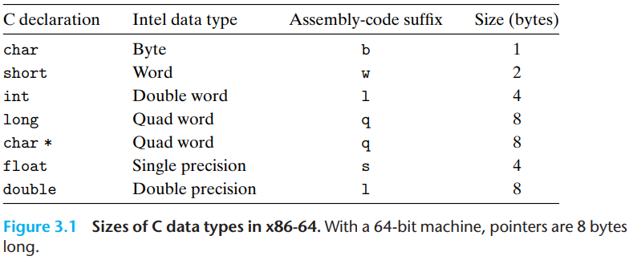

An x86-64 central processing unit (CPU) contains a set of 16 general-purpose registers storing 64-bit values. These registers are used to store integer data as well as pointers.

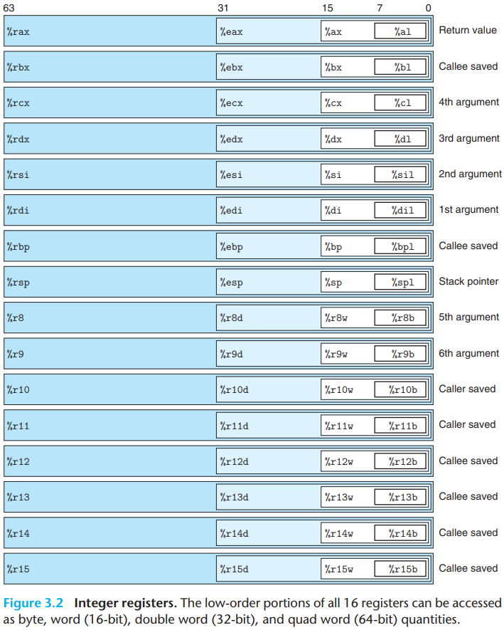

Most instructions have one or more `operands` specifying the source values to use in performing an operation and the destination location into which to place the result.

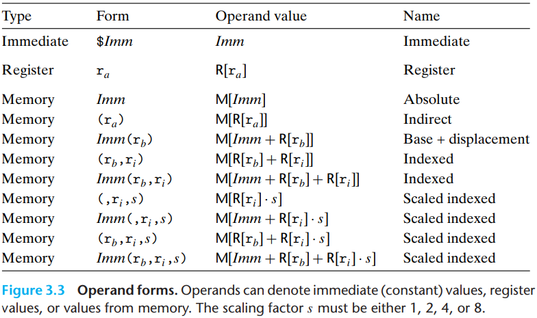

Data movement instructions-MOV class. These instructions copy data from a source location to a destination location, without any transformation.

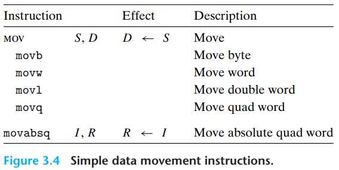

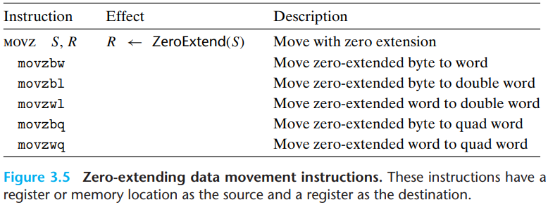

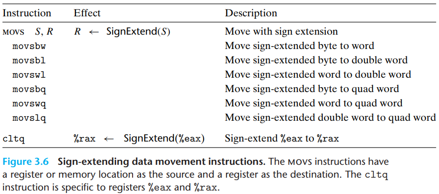

The stack plays a vital role in the handling of procedure calls. By way of background, a stack is a data structure where values can be added or deleted, but only according to a "last-in, first-out" discipline.

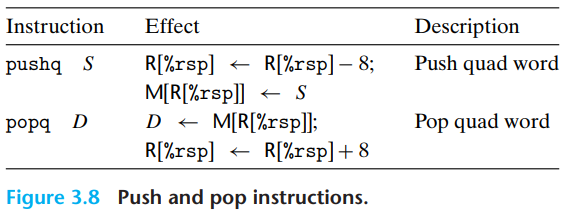

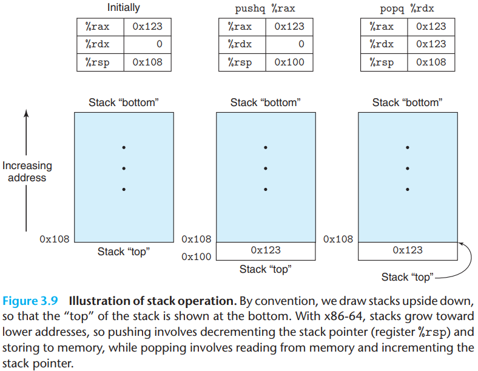

Integer and logic operations.

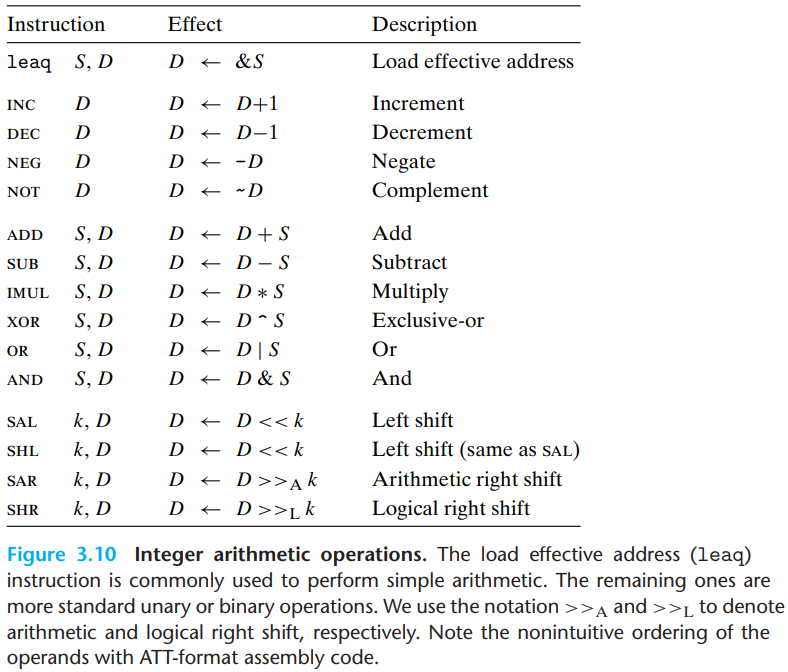

The `load effective address` instruction `leaq` is actually a variant of the `movq` in struction. It has the form of an instruction that reads from memory to a register, but it does not reference memory at all. Its first operand appears to be a memory reference, but instead of reading from the designated location, the instruction copies the effective address to the destination.

`oct word`. instructions that support generating the full 128-bit product of two 64-bit numbers, as well as integer division.

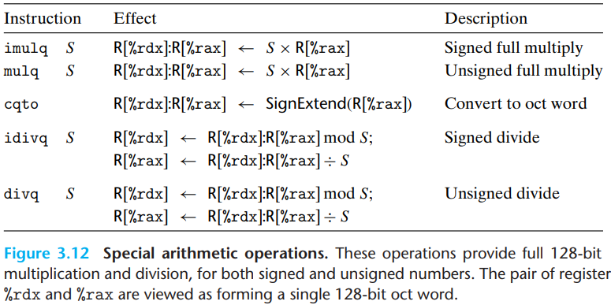

The CPU maintains a set of single-bit `condition code` registers describing attributes of the most recent arithmetic or logical operation. These registers can then be tested to perform conditional branches. These condition codes are the most useful:

- CF: Carry flag. The most recent operation generated a carry out of the most significant bit. Used to detect overflow for unsigned operations.
- ZF: Zero flag. The most recent operation yielded zero.
- SF: Sign flag. The most recent operation yielded a negative value.
- OF: Overflow flag. The most recent operation caused a two's-complement overflow-either negative or positive.

There are two instruction classes that set condition codes without altering any other registers:

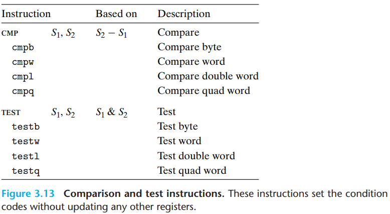

A SET instruction has either one of the low-order single-byte register elements or a single-byte memory location as its destination, setting this byte to either 0 or 1. To generate a 32-bit or 64-bit result, we must also clear the high-order bits:

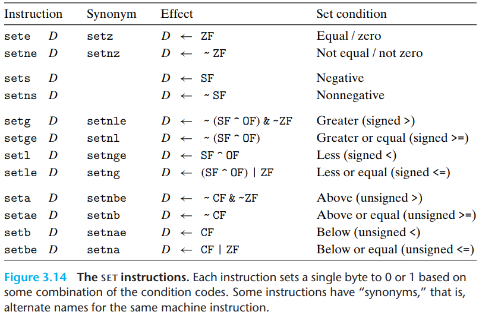

A `jump` instruction can cause the execution to switch to a completely new position in the program. These jump destinations are generally indicated in assembly code by a `label`:

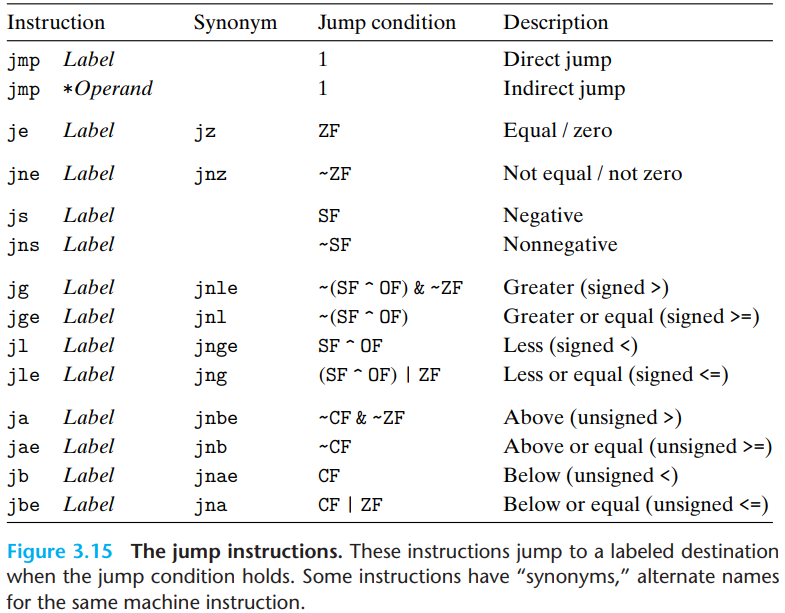

To understand how conditional operations can be implemented via conditional data transfers, consider the following general form of conditional expression and assignment:

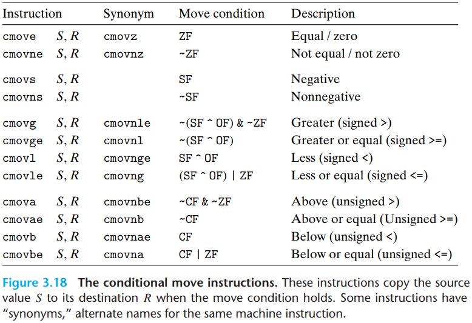

A `switch` statement provides a multiway branching capability based on the value of an integer index. They are particularly useful when dealing with tests where there can be a large number of possible outcomes. Not onley do they make the C code more readable, but they also allow an efficient implementation using a data structure called a `jump table`. A jump table is an array where entry $i$ is the address of a code segment implementing the action the program should take when the switch index equals $i$. The code performs an array reference into the jump table using the switch index to determine the target for a jump instruction.

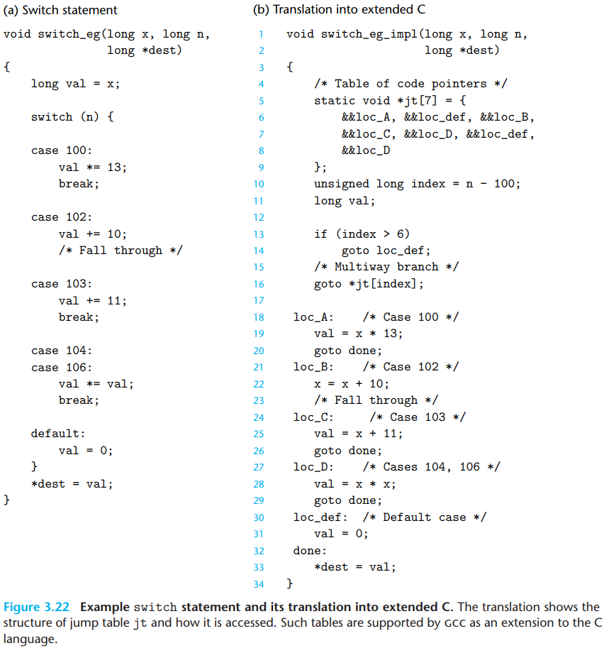

Procedures are a key abstraction in software. They provide a way to package code that implements some functionality with a designated set of arguments and an optional return value. This function can then be invoked from different points in a program.

There are many different attriutes that must be handled when providing machine-level support for procedures. Suppose procedure $P$ calls procedure $Q$, and $Q$ then executes and returns back to $P$. These actions involve one or more of the following mechanisms:

- Passing control. The program counter must be set to the starting address of the code for $Q$ upon entry and then set to the instruction in $P$ following the call to $Q$ upon return.
- Passing data. $P$ must be able to provide one or more parameters to $Q$, and $Q$ msut be able to return a value back to $P$.
- Allocating and deallocating memory. $Q$ may need to allocate space for local variables when it begins and then free that storage before it returns.

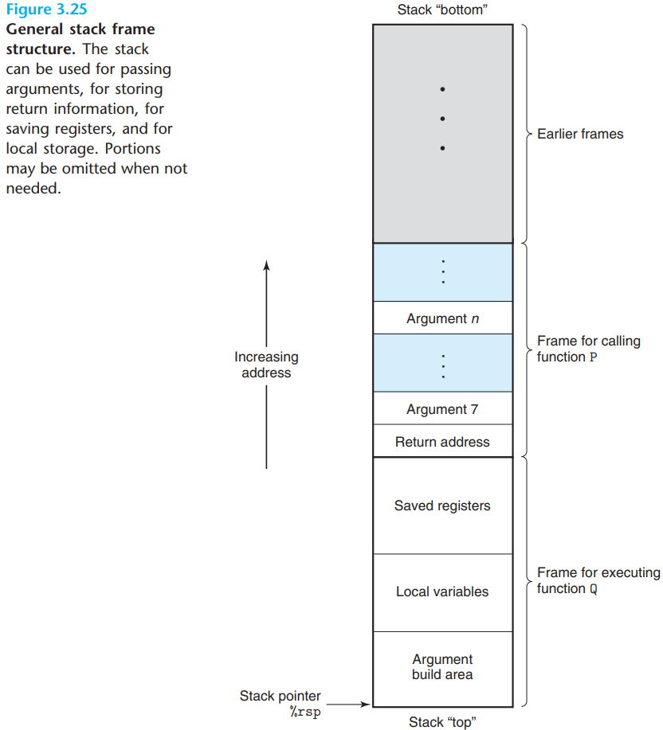

In addition to passing control to a procedure when called, and then back again when the procedure returns, procedure calls may involve passing data as arguments, and returning from a procedure may also involve returning a value. With x86-64, most of these data passing to and from procedures take place via registers:

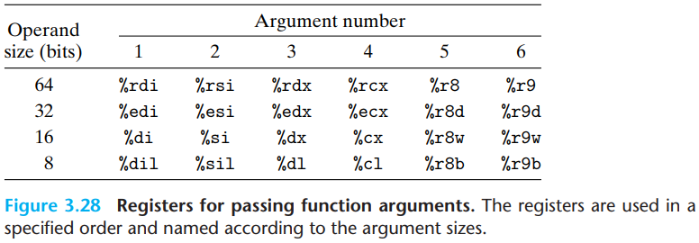

The set of program registers acts as a single resource shared by all of the procedures. Although only one procedure can be active at a given time, we must make sure that when one procedure (the caller) calls another (the callee), the callee does not overwrite some register value that the caller planned to use later. For this reason, x86-64 adopts a uniform set of conventions for register usage that must be respected by all procedures, including those in program libraries:

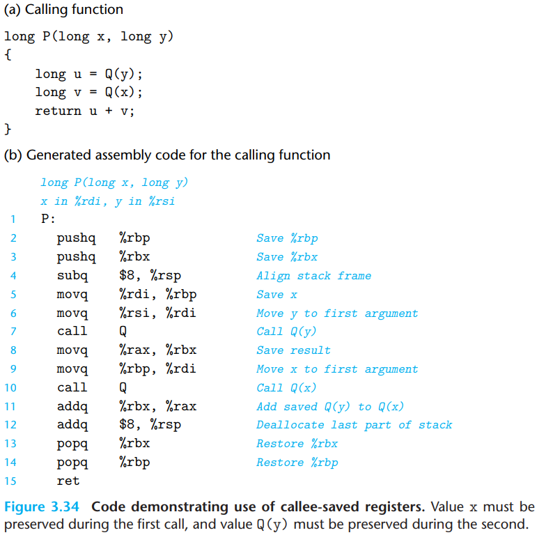

Our stack discipline provides a mechanism where each invocation of a function has its own private storage for state information(saved values of the return location can callee-saved registers). If need be, it can also provide storage for local variables. The stack discipline of allocation and deallocation naturally matches the call-return ordering of functions. This method of implementing function calls and returns even works for more complex patterns, including mutual recursion:

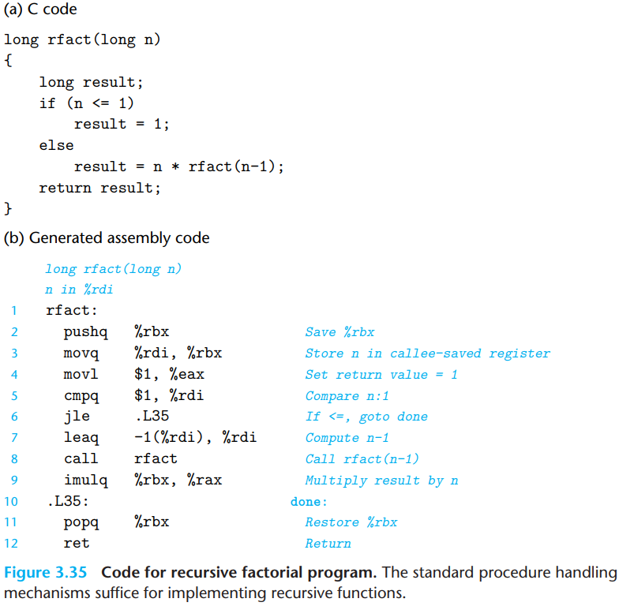

For data type $T$ and integer constant $N$, consider a declaration of the form
$$
T\ A[N]
$$
Let us denote the starting location as $X_A$. The declaration has two effects. First it allocates a contiguous region of $L \cdot N$ bytes in memory, where $L$ is the size(in bytes) of data type $T$. Second, it introduces an identifier $A$ that can be used as a pointer to the beginning of the array. The value of this pointer will be $X_A$. The array elements can be accessed using an integer index ranging between $0$ and $N-1$. Array element $i$ will be stored at address $X_A + L \cdot i$.

The unary operators `&` and `*` allow the generation and dereferencing of pointers. That is, for an expression `Expr` denoting some object, `&Expr` is a pointer giving the address of the object. For an expression `AExpr` denoting an address, `*AExpr` gives the value at that address. The expressions `Expr` and `*&Expr` are therefore equivalent. The array subscripting operation can be applied to both arrays and pointers. The array reference `A[i]` is identical to the expression `*(A+i)`. It computes the address of the $i$th array element and then accesses this memory location.

To access elements of multidimensional arrays, the compiler generates code to compute the offset of the desired element and then uses one of the `MOV` instructions with the start of the array as the base address and the(possibly scaled) offset as an index. In general, for an array declared as:
$$
T\ D[R][C]
$$
array element `D[i][j]` is at memory address
$$
\&D[i][j] = X_D + L(C \cdot i + j)
$$
where $L$ is the size of data type $T$ in bytes.

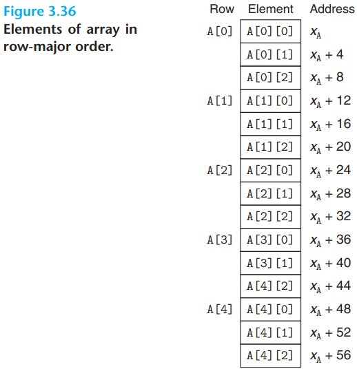

The C struct declaration creates a data type that groups objects of possibly different types into a single object. The different components of a structure are referenced by names. The implementation of structures is similar to that of arrays in that all of the components of a structure are stored in a contiguous region of memory and a pointer to a structure is the address of its first byte. The compiler maintains information about each structure type indicating the byte offset of each field. It generates references to structure elements using these offsets as displacements in memory referencing instructions.

Unions provide a way to circumvent the type system of C, allowing a single object to be referenced according to multiple types. The syntax of a union declaration is identical to that for structures, but its semantics are very different. Rather than having the different fields reference different blocks of memory, they all reference the same block.

Pointers are a central feature of the C programming language. They serve as a uniform way to generate references to elements within different data structures. Here we highlight some key principles of pointers and their mapping into machine code.

- Every pointer has an associated type.
- Every pointer has a value.
- Pointers are created with the `&` operator.
- Pointers are dereferenced with the `*` operator.
- Arrays and pointers are closely related.
- Casting from one type of pointer to another changes its type but not its value.
- Pointers can also point to functions.

Using the gdb Debugger:

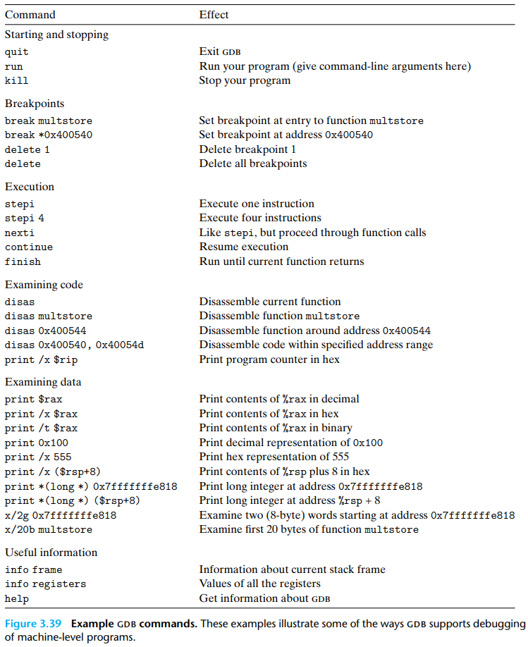

That C does not perform any bounds checking for array references, and that local variables are stored on the stack along with state information such as saved register values and return addresses. This combination can lead to serious program errors, where the state stored on the stack gets corrupted by a write to an out-of-bounds array element.

Thwarting buffer overflow attacks:

1. `Stack Randomization`. make the position of the stack vary from one run of a program to another. Thus, even if many machines are running identical code, they would all be using different stack addresses.
2. `Stack Corruption Detection`. store a special `canary` value in the stack frame between any local buffer and the rest of the stack state. This canary value, also referred to as a `guard value`, is generated randomly each time the program runs, and so there is no easy way for an attacker to determine what it is. Before restoring the register state and returning from the function, the program checks if the canary has been altered by some operation of this function or one that it has called. If so, the program aborts with an error.
3. `Limiting Executable Code Regions`. A final step is to eliminate the ability of an attacker to insert executable code into a system. One method is to limit which memory regions hold executable code. 

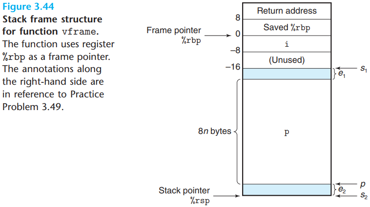

The `floating-point architecture` for a processor consists of the different aspects that affect how programs operating on floating-point data are mapped onto the machine, including:

- How floating-point values are stored and accessed. This is typically via some form of registers.
- The instructions that operate on floating-point data.
- The conventions used for passing floating-point values as arguments to functions and for returning them as results.
- The conventions for how registers are preserved during functions calls.

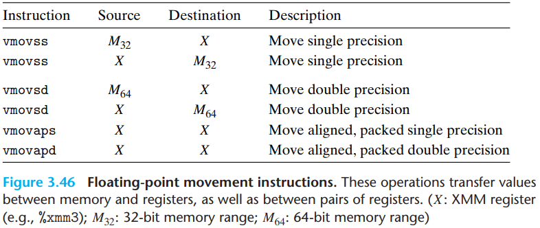

With x86-64, the XMM registers are used for passing floating-point arguments to functions and for returning floating-point values from them. The following conventions are observed:

- Up to eight floating-point arguments can be passed in XMM registers `%xmm0-%xmm7`. These registers are used in the order the arguments are listed. Additional floating-point arguments can be passed on the stack.
- A function that returns a floating-point value does so in register `%xmm0`.
- All XMM registers are caller saved. The callee may overwrite any of these registers without first saving it.

When a function contains a combination of pointer, integer, and floating-point arguments, the pointers and integers are passed in general-purpose registers, while the floating-point values are passed in XMM registers. This means that the mapping of arguments to registers depends on both their types and their ordering.

Here is a set of scalar AVX2 floating-point instructions that perform arithmetic operations. Each has either one $(S_1)$ or two $(S_1, S_2)$ source operands and a destination operand $D$. The first source operand $S_1$ can be either an XMM register or a memory location. The second source operand and the destination operands must be XMM registers. Each operation has an instruction for single precision and an instruction for double precision. The result is stored in the destination register:

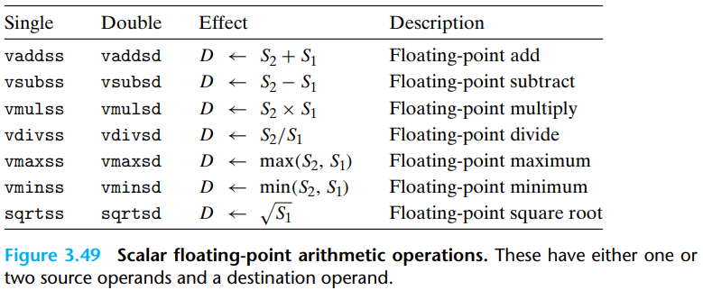

## Summary

TODO

