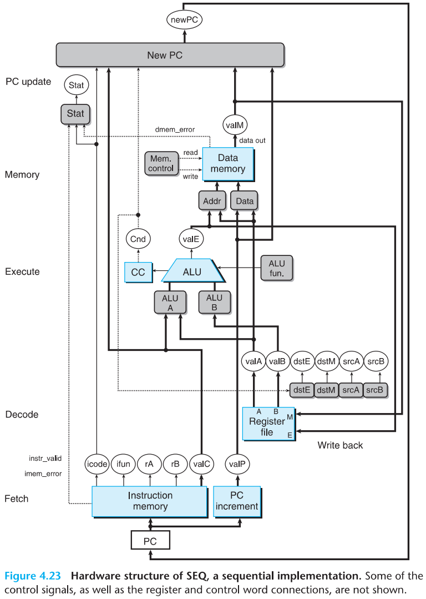
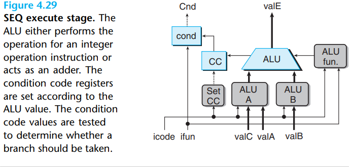

# 4 Processor Architecture

[TOC]

Each instruction in a Y86-64 program can read and modify some part of the processor state. This is  referred to as the `programmer-visible` state, where the "programmer" in this case is either someone writing programs in assembly code or a compiler generating machine-level code.

Here are some details about the Y86-64 instructions:

The specific encodings of the integer operation, branch, and conditional move instructions.

Logic gates are the basic computing elements for digital circuits. They generate an output equal to some Boolean function of the bit values at their inputs.

By assembling a number of logic gates into a network, we can construct computational blocks known as `combinational circuits`. Several restrictions are placed on how the networks are constructed:

- Every logic gate input must be connected to exactly one of the following:
  1. one of the system inputs (known as a `primary input`).
  2. the output connection of some memory element.
  3. the output of some logic gate.
- The outputs of two or more logic gates cannot be connected together. Otherwise, the two could try to drive the wire toward different voltages, possibly causing an invalid boltage or a circuit malfunction.
- The network must be acyclic. That is, there cannot be a path through a series of gates that forms a loop in the network. Such loops can cause ambiguity in the function computed by the network.

A `multiplexor`(commonly referred to as a "MUX") selects a value from among a set of different data signals, depending on the value of a control input signal. 

By assembling large networks of logic gates, we can construct combinational circuits that compute much more complex functions. Typically, we design circuits that operate on data `words`. These are groups of bit-level signals that represent an integer or some control pattern.

Combinational circuits that perform word-level computations are constructed using logic gates to compute the individual bits of the output word, based on the individual bits of the input words.

The selection expressions can be arbitrary Boolean expressions, and there can be an arbitrary number of cases. This allows case expressions to describe blocks where there are many choices of input signals with complex selection criteria.

In our processor designs, we will find many examples where we want to compare one signal against a number of possible matching signals, such as to test whether the code for some instruction being processed matched some category of instruction codes.

Our storage devices are all controlled by a single `clock`, a periodic signal that determines when new values are to be loaded into the devices. We consider two classes of memory devices:

- `Clocked registers`(or simply registers) store individual bits or words. The clock signal controls the loading of the register with the value at its input.
- `Random access memories`(or simply `memories`) store multiple words, using an address to select which word should be read or written.

In general, processing an instruction involves a number of operations. We organize them in a particular sequence of stages, attempting to make all instructions follow a uniform sequence, even though the instructions differ greatly in their actions. The detailed processing at each step depends on the particular instruction being executed. Creating this framework will allow us to design a processor that makes best use of the hardware. The following is an informal description of the stages and the operations performed within them:

- `Fetch`: The fetch stage reads the bytes of an instruction from memory, using the program counter (PC) as the memory address.
- `Decode`: TODO
- `Execute`: TODO
- `Memory`: TODO
- `Write back`: TODO
- `PC updata`: TODO

The processing required for instruction types `OPq`(integer and logical operations), `rrmovq`(register-register move), and `irmovq`(immediate-register move):

The processing of our three control transfer instructions: the different jumps, call, and ret:

The computations required to implement all of the Y86-64 instructions can be organized as a series of six basic stages: fetch, decode, execute, memory, write back, and PC update:

PRINCIPLE: No reading back

  The processor never needs to read back the state updated by an instruction in order to complete the processing of this instruction.

We use uppercase names for constant values:

1. Fetch Stage:

   

2. Decode and Write-Back Stages:

   

3. Execute Stage:

   

4. Memory Stage:

   

5. PC Update Stage:

   

6. Surveying SEQ

`pipeline diagram`: In this diagram, time flows from left to right. A series of instructions are writen from top to bottom. The solid rectangles indicate the times during which these instructions are executed. In this implementationn, we must complete one instruction before beginning the next. Hence, the boxes do not overlap one another vertically. The following formula gives the maximum rate at which we could operate the system:
$$
Throughput = \frac{1 instruction}{(20 + 300)picoseconds} \cdot \frac{1000 picoseconds}{1 nanosecond} \approx 3.12 GIPS
$$
We express throughput in units of giga-instructions per second (abbreviated GIPS), or billions of instructions per second. The total time required to perform a single instruction from beginning to end is known as the `latency`.

Limitations of Pipelining:

1. Nonuniform Partitioning.

   

2. logical dependencies

   

## Summary

TODO
