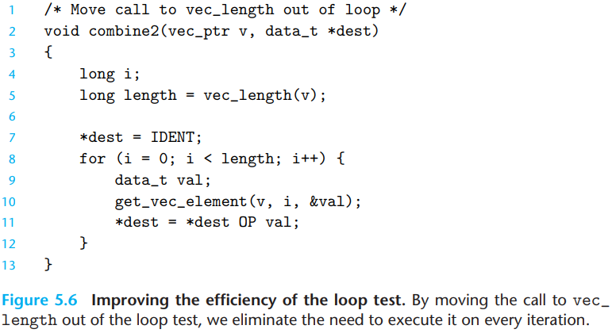
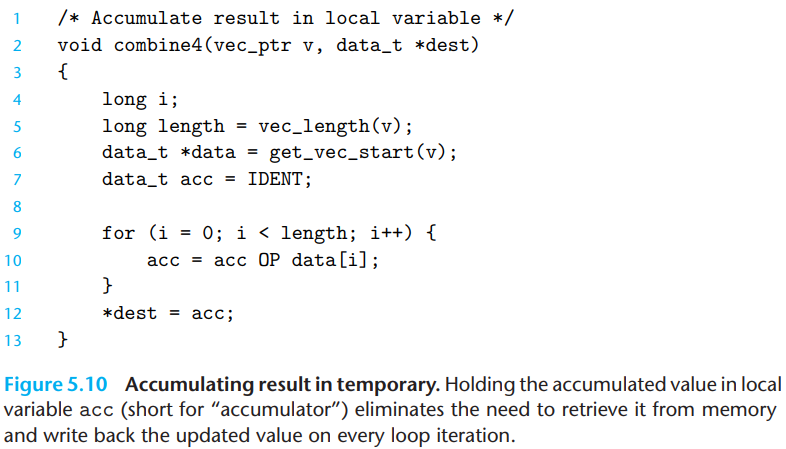
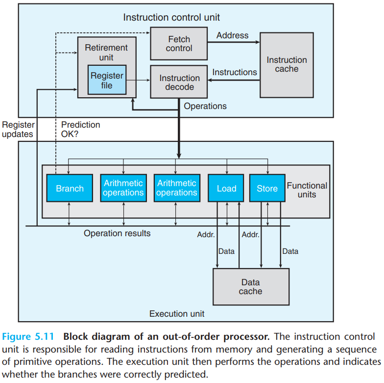
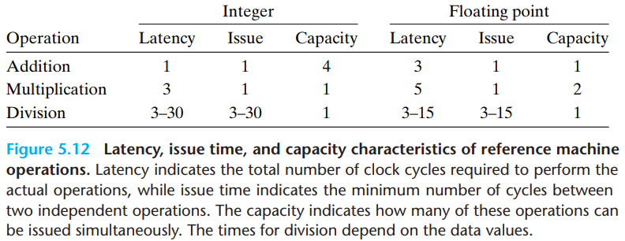

# 5 Optimizing Program Performance

[TOC]

Writing an efficient program requires several types of activities. First, we must select an appropriate set of algorithms and data structures. Second, we must write source code that the compiler can effectively optimize to turn into efficient executable code.

If a compiler cannot determine whether or not two pointers may be aliased, it must assume that either case is possible, limiting the set of possible optimizations.

We introduce the metric `cycles per element`, abbreviated CPI, to express program performance in a way that can guide us in improving the code.

`code motion`. Involve identifying a computation that is performed multiple times, (e.g., within a loop), but such that the result of the computation will not change. We can therefore move the computation to an earlier section of the code that does not get evaluated as often.

Procedure calls can incur overhead and also block most forms of program optimization.

Eliminating Unneeded Memory References.

Our hypothetical processor design is based loosely on the structure of recent Intel processors. These processors are described in the industry as being `superscalar`, which means they can perform multiple operations on every clock cycle and `out of order`, meaning that the order in which instructions execute need not correspond to their ordering in the machine-level program. The overall design has two main part: the `instruction control unit`(ICU), which is responsible for reading a sequence of instructions from memory and generating from these a set of primitive operations to perform on program data, and the `execution unit`(EU), which then executes these operations.

Each operation is characterized by its `latency`, meaning the total time required to perform the operation, the `issue` time, meaning the minimum number of clock cycles between two independent operations of the same type, and the `capacity`, indicating the number of functional units capable of performing that operation.

Loop unrolling is a program transformation that reduces the number of iterations for a loop by increasing the number of elements computed on each iteration.

For a combining operation that is associative and commutative, such as integer addition or multiplication, we can improve performance by splitting the set of combining operations into two or more parts and combining the results at the end. For example, let $P_n$ denote the product of elements $a_0, a_1, ..., a_{n-1}$:
$$
P_n = \prod_{i = 0}^{n - 1}a_i
$$
Assuming $n$ is even, we can also write this as $P_n = PE_n \times PO_n$, where $PE_n$ is the product of the elements with even indices, and $PO_n$ is the product of the elements with odd indices:
$$
PE_n = \prod_{i = 0}^{n/2 - 1}a_{2i} \\
PO_n = \prod_{i = 0}^{n / 2 - 1}a_{2i + 1}
$$
The benefits of loop parallelism are limited by the ability to express the computation in assembly code. If a program has a degree of parallelism $P$ that exceeds the number of available registers, then the compiler will resort to `spilling`, storing some of the temporary values in memory, typically by allocating space on the run-time stack.

A number of basic strategies for optimizing program performance:

- `High-level design`. Choose appropriate algorithms and data structures for the problem at hand. Be especially vigilant to avoid algorithms or coding techniques that yield asymptotically poor performance.
- `Basic coding principles`. Avoid optimization blockers so that a compiler can generate efficient code.
  - Eliminate excessive function calls. Move computations out of loops when possible. Consider selective compromises of program modularity to gai greater efficiency.
  - Eliminate unnecessary memory references. Introduce temporary variables to hold intermediate results. Store a result in an array or global variable only when the final value has been computed.
- `Low-level optimizations`. Structure code to take advantage of the hardware capabilities.
  - Unroll loops to reduce overhead and to enable further optimizations.
  - Find ways to increase instruction-level parallelism by techniques such as multiple accumulators and reassociation.
  - Rewrite conditional operations in a functional style to enable compilation via conditional data transfers.

## Summary

TODO