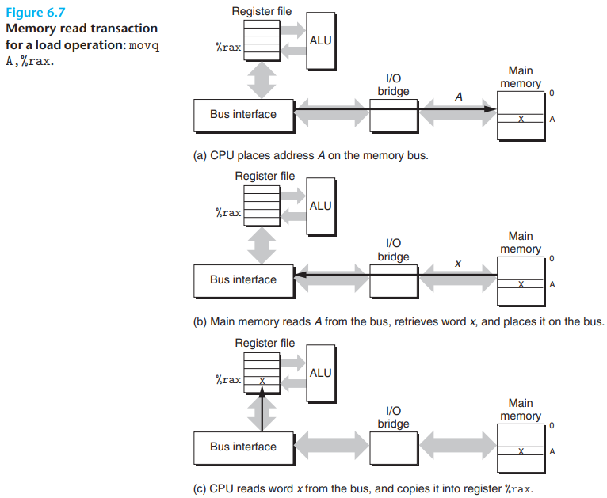
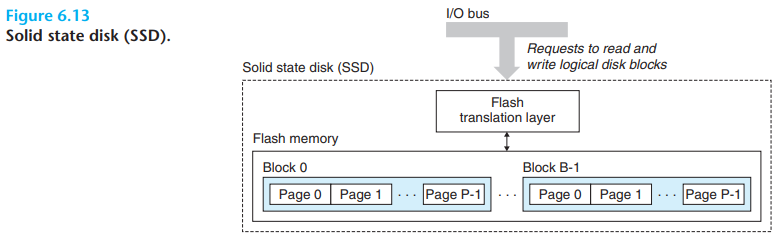
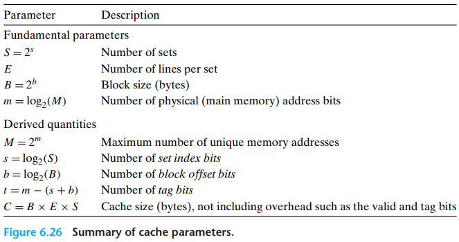
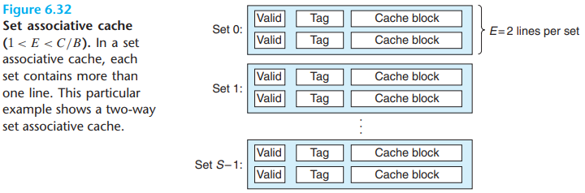

# 6 The Memory Hierarchy

[TOC]

In practice, a `memory system` is a hierarchy of storage device with different capacities, costs, and access times. CPU registers hold the most frequently used data. Small, fast `cache memories` nearby the CPU act as staging areas for a subset of the data and instructions stored in the relatively slow main memory. The main memory stages data stored on largeg, slow disks, which in turn often serve as staging areas for data stored on the disks or tapes of other machines connected by networks.

`Random access memory (RAM)` comes in two varieties -- static and dynamic. Static RAM (SRAM) is faster and significantly more expensive than dynamic RAM (DRAM).

Summarizes the characteristics of SRAM and DRAM memory. SRAM si persistent as long as power is applied. Unlike DRAM, no refresh is necessary. SRAM can be accessed faster than DRAM. SRAM is not sensitive to disturbances such as light and electrical noise. The trade-off is that SRAM cells use more transistors than DRAM cells and thus have lower densities, are more expensive, and consume more power.

The cells (bits) in a DRAM chip are partitioned into $d$ supercells, each consisting of $w$ DRAM cells. A $d \times w$ DRAM stores a total of $d\ w$ bits of information. The supercells are organized as a rectangular array with $r$ rows and $c$ columns, where $rc = d$. Each supercell has an address of the form $(i, j)$, where $i$ denotes the row and $j$ denotes the column.

Each DRAM chip is connected to some circuitry, known as the `memory controller`, that can transfer $w$ bits at a time to and from each DRAM chip. To read the contents of supercell $(i, j)$, the memory controller sends the row address $i$ to the DRAM, followed by the column address $j$. The DRAM responds by sending the contents of supercell $(i, j)$ back to the controller. The row address $i$ is called a `RAS (row access strobe) request`. Notice that the RAS and CAS requests share the same DRAM address pins.

There are many kinds of DRAM memories:

- `Fast page mode DRAM (FPM DRAM)`.
- `Extended data out DRAM (EDO DRAM)`.
- `Synchronous DRAM (SDRAM)`.
- `Double Data-Rate Synchronous DRAM (DDR SDRAM)`.
- `Video RAM (VRAM)`.

Data flows back and forth between the processor and the DRAM main memory over shared electrical conduits called `buses`. Each transfer of data between the CPU and memory is accomplished with a series of steps called a `bus transaction`. A `read transaction` transfers data from the main memory to the CPU. A `write transaction` transfers data from the CPU to the main memory.

A `bus` is a collection of parallel wires that carry address, data, and control signals. Depending on the particular bus design, data and address signals can share the same set of wires or can use different sets. Also, more than two devices can share the same bus. The contrl wires carry signals that synchronize the transaction and identify what kind of transaction is currently being performed.

The read transaction consists of three steps. First, the CPU places the address `A` on the system bus. The I/O bridge passes the signal along to the memory bus (Figure 6.7(a)). Next, the main memory senses the address signal on the memory bus, reads the address from the memory bus, fetches the data from the DRAM, and writes the data to the memory bus. The I/O bridge translates the memory bus signal into a system bus signal and passes it along to the system bus (Figure 6.7(b)). Finally, the CPU senses the data on the system bus, reads the data from the bus, and copies the data to register `%rax` (Figure 6.7(c)).

Conversely, when the CPU performs a store operation such as `movq %rax,A` where the contents of register `%rax` are written to address `A`, the CPU initiates a write transaction. Again, there are three basic steps. First, the CPU places the address on the system bus. The memory reads the address from the memory bus and waits for the data to arrive (Figure 6.8(a)). Next, the CPU copies the data in `%rax` to the system bus (Figure 6.8(b)). Finally, the main memory reads the data from the memory bus and stores the bits in the DRAM (Figure 6.8(c)).

The maximum number of bits that can be recorded by a disk is known as its `maximum capacity`. or simply `capacity`. Disk capacity is determined by the following technology factors:

- `Recording density` $(bits/in)$. The number of bits that can be squeezed into a 1-inch segment of a track.
- `Track density` $(tracks/in)$. The number of tracks that can be squeezed into a 1-inch segment of the radius extending from the center of the platter.
- `Areal density` $(bits/in^2)$. The product of the recording density and the track density.

The capacity of a disk is given by the following formula:
$$
Capacity = \frac{\#bytes}{sector} \times \frac{average \# sectors}{track} \times \frac{\#tracks}{surface} \times \frac{\#surfaces}{platter} \times \frac{\#platters}{disk}
$$
For example, suppose we have a disk with five platters, 512 bytes per sector, 20,000 tracks per surface, and an average of 300 sectors per track. Then the capacity of the disk is:
$$
\begin{equation}\begin{split}
Capacity &= \frac{512 bytes}{sector} \times \frac{300 sectors}{track} \times \frac{20,000 tracks}{surface} \times \frac{2 surfaces}{platter} \times \frac{5 platters}{disk} \\
&= 30,720,000,000 bytes \\
&= 30.72 GB
\end{split}\end{equation}
$$

Disks read and write data in sector-size blocks. The `access time` for a sector has three main components: `seek time, rotational latency, and transfer time`:

- `Seek time`. To read the contents of some target sector, the arm first positions the head over the track that contains the target sector. The time required to move the arm is called the `seek time`. The seek time, $T_{seek}$, spends on the previous position of the head and the speed that the arm moves across the surface. The average seek time in modern drives, $T_{avg\ seek}$, measured by taking the mean of serveral thousand seeks to random sectors, is typically on the order of 3 to 9 ms. The maximum time for a single seek, $T_{max\ seek}$, can be as high as 20 ms.

- `Rotational latency`. Once the head is in position over the track, the drive waits for the first bit of the target sector to pass under the head. The performance of this step depends on both the position of the surface when the head arrives at the target track and the rotational speed of the disk. In the worst case, the head just misses the target sector and waits for the disk to make a full rotation. Thus, the maximum rotational latency, in seconds, is given by
  $$
  T_{max\ rotation} = \frac{1}{RPM} \times \frac{60 secs}{1 min}
  $$
  The average rotational latency, $T_{avg\ rotation}$, is simply half of $T_{max\ rotation}$.

- `Transfer time`. When the first bit of the target sector is under the head, the drive can begin to read or write the contents of the sector. The transfer time for one sector depends on the rotational speed and the number of sectors per track. Thus, we can roughly estimate the average transfer time for one sector in seconds as 
  $$
  T_{avg\ transfer} = \frac{1}{RPM} \times \frac{1}{(average \# sectors/track)} \times \frac{60 secs}{1 min}
  $$

We can estimate the average time to access the contents of a disk sector as the sum of the average seek time, the average rotational latency, and the average transfer time.

- `A Universal Serial Bus (USB)` controller is a conduit for devices attached to a USB bus, which is a wildly popular standard for connecting a variety fo peripheral I/O devices, including keyboards, mice, modems, digital cameras, game controllers, printers, external disk drives, and solid state disk. USB 3.0 buses have a maximum bandwidth of 625 MB/s. USB 3.1 buses have a maximum bandwidth of 1,250 MB/s.
- `A graphics card (or adapter)` contains hardware and software logic that is responsible for painting the pixels on the display monitor on behalf of the CPU.
- `A host bus adapter` that connects one or more disks to the I/O bus using a communication protocol defined by a particular `host bus interface`. The two most popular such interfaces for disk are SCSI (pronounced "scuzzy") and SATA (pronounced "sat-uh"). SCSI disks are typically faster and more expensive than SATA drives. A SCSI host bus adapter (often called a SCSI controller) can support multiple disk drives, as opposed to SATA adapters, which can only support one drive.

There are several important concepts to take away from our discussion of storage technologies:

- Different storage technologies have different price and performance trade-offs.
- The price and performance properties of different storage technologies are changing at dramatically different rates.
- DRAM and disk performance are lagging behind CPU performance.

Well-written computer programs tend to exhibit good `locality`. This is, they tend to reference data items that are near other recently referenced data items or that were recently referenced themselves. This tendency, known as the `principle of locality`, is an enduring concept that has enormous impact on the design and performance of hardware and software systems.

Locality is typically described as having two distinct forms: `temporal locality` and `spatial locality`. In a program with good temporal locality, a memory location that is referenced once is likely to be referenced again multiple times in the near future. In a program with good spatial locality, if a memory location is referenced once, then the program is likely to reference a nearby memory location in the near future.

**programs with good locality run faster than programs with poor locality**.

This `multi-core` approach works in part because the power consumed by a processor is proportional to $P = fCV^2$, where $f$ is the clock frequency, $C$ is the capacitance, and $V$ is the voltage.

Since program instructions are stored in memory and must be fetched (read) by the CPU, we can also evaluate the locality of a program with respect to its instruction fetches.

In this section, we have introduced the fundamental idea of locality and have identified some simple rules for qualitatively evaluating the locality in a program:

- Programs that repeatedly reference the same variables enjoy good temporal locality.
- For programs with stride-$k$ reference patterns, the smaller the stride, the better the spatial locality. Programs with stride-$1$ reference patterns have good spatial locality. Programs that hop around memory with large strides have poor spatial locality.
- Loops have good temporal and spatial locality with respect to instruction fetches. The smaller the loop body and the greater the number of loop iterations, the better the locality.

In general, a cache (pronounced "cash") is a small, fast storage device that acts as a staging area for the data objects stored in a larger, slower device. The process of using a cache is known as caching (pronounced "cashing").

When a program needs a particular data object $d$ from level $k + 1$, it first looks for $d$ in one of the blocks currently stored at level $k$. If $d$ happens to be cached at level $k$, then we have what is called a `cache hit`. The program reads $d$ directly from level $k$, which by the nature of the memory hierarchy is faster than reading $d$ from level $k + 1$.

If, on the other hand, the data object $d$ is not cached at level $k$, then we have what is called a `cache miss`. When there is a miss, the cache at level $k$ fetches the block containing $d$ from the cache at level $k + 1$, possibly overwriting an existing block if the level $k$ cache is already full.

This process of overwriting an existing block is known as `replacing or evicting` the block. The block that is evicated is sometimes referred to as a `victim` block. The decision about which block to replace is governed by the cache's `replacement policy`.

After the cache at level $k$ has fetched the block from level $k + 1$, the program can read $d$ from level $k$ as before.

different kinds of cache misses:

- `compulsory misses` or `cold misses`: if the cache at level $k$ is empty, then any access of any data object will miss. An empty cache is sometimes referred to as `cold cache`, and misses of this kind are called `compulsory misses` or `cold misses`.
- `conflict miss` TODO

The essence of the memory hierarchy is that the storage device at each level is a cache for the next lower level. At each level, some form of logic must `manage` the cache. By this we mean that something has to partition the cache storage into blocks, transfer blocks between different levels, decide when there are hits and misses, and then deal with them. The logic that manages the cache can be hardware, software, or a combination of the two.

To summarize, memory hierarchies based on caching work becasue slower storage is cheaper than faster storage and because programs tend to exhibit locality:

- `Exploiting temporal locality`. Because of temporal locality, the same data objects are likely to be reused multiple times. Once a data object has been opied into the cache on the first miss, we can expect a number of subsequent hits on that object. Since the cache is faster than the storage at the next lower level, these subsequent hits can be served much faster than the original miss.
- `Exploiting spatial locality`. Blocks usually contain multiple data objects. Because of spatial locality, we can expect that the cost of copying a block after a miss will be amortized by subsequent references to other objects within that block.

Caches are grouped into different classes based on $E$, the number of cache lines per set. $A$ cache with exactly one line per set $(E = 1)$ is known as a `direct-mapped` cache (see Figure 6.27).

The process that a cache goes through of determining whether a request is a hit or a imss and then extracting the requested word consists of three steps:

1. set selection.

   

2. line matching.

   

3. word extraction.

You may be wondering why caches use the middle bits for the set index instead of the high-order bits. There is a good reason why the middle bits are better. Figure 6.31 shows why. If the high-order bits are used as an index, then some contiguous memory blocks will map to the same cache set.

1. Set Selection in Set Associative Caches

   

2. Line Matching and Word Selection in Set Associative Caches

   

3. Line Replacement on Misses in Set Associative Caches

A `fully associative cache` consists of a single set $(i.e, E = C / B)$ that contains all of the cache lines:

1. Set Selection in Fully Associative Caches

   

2. Line Matching and Word Selection in Fully Associative Caches

   

Suppose we write a word $w$ that is already cached (a `wite hit`). After the cache updates its copy of $w$, what does it do about updating the copy of $w$ in the next lower level of the hierarchy? The simplest approach, known as `write-through`, is to immediately write $w$'s cache block to the next lower level. While simple, write-through has the disadvantage of causing bus traffic with every write. Another approach, known as `write-back`, defers the update as long as possible by writing the updated block to the next lower level only when it is evicted from the cache by the replacement algorithm. Because of locality, write-back can significantly reduce the amount of bus traffic, but it has the disadvantage of additional complexity. The cache must maintain an additional `dirty bit` for each cache line that indicates whether or not the cache block has been modified.

Another issue is how to deal with write misses. One approach, known as `write allocate`, loads the corresponding block from the next lower level into the cache and then updates the cache block. Write-allocate tries to exploit spatial locality of writes, but it has the disadvantage that every miss results in a block transfer from the next lower level to the cache. The alternative, known as no-write-allocate, bypass the cache and writes the word directly to the next lower level. Write through caches are typically Write-through caches are typically no-write-allocate. Write-back caches are typically write-allocate.

To the programmer trying to write reasonably cache-friendly programs, we suggest adopting a mental model that assumes write-back, write-allocate caches.

Cache performance is evaluated with a number of metrics:

- `Miss rate`. The fraction of memory references during the execution of a program, or a part of a program, that miss. It is computed as $\#misses / \#references$.
- `Hit rate`. The fraction of memory references that hit. It is computed as $1-miss$ rate.
- `Hit time`. The time to deliver a word in the cache to the CPU, including the time for set selection, line identification, and word selection. Hit time is on the order of several clock cycles for L1 caches.
- `Miss penalty`. Any additional time required because of a miss. The penalty for L1 misses served from L2 is on the order of 10 cycles; from L3, 50 cycles; and from main memory, 200 cycles.

Optimizing the cost and performance trade-offs of cache memories is a subtle exercise that requires extensive simulation on realistic benchmark codes and thus is beyond our scope. However, it is possible to identify some of the qualitative trade-offs:

- Impact of Cache Size.

  On the one hand, a larger cache will tend to increase the hit rate. On the other hand, it is always harder to make large memories run faster.

- Impact of Block Size.

  Large blocks are a mixed blessing. On the one hand, larger blocks can help increase the hit rate by exploiting any spatial locality that might exist in a program. However, for a given cache size, larger blocks imply a smaller number of cache lines, which can hurt the hit rate in programs with more temporal locality than spatial locality. Larger blocks also have a negative impact on the miss penalty, since larger blocks cause larger transfer times.

- Impact of Associativity

  The issue here is the impact of the choice of the parameter $E$, the number of cache lines per set. The advantage of higher associativity (i.e., larger values of $E$) is that it decreases the vulnerability of the cache to thrashing due to conflict misses. However, higher associativity comes at a significant cost. Higher associativity is expensive to implement and hard to make fast. It requires more tag bits per line, additional LRU state bits per line, and additional control logic. Higher associativity can increase hit time, because of the increased complexity, and it can also increase the miss penalty because of the increased complexity of choosing a victim line.
  
- Impact of Write Strategy

  Write-through caches are simpler to implement and can use a `write buffer` that works independently of the cache to update memory. Furthermore, read misses are less expensive because they do not trigger a memory write. On the other hand, write-back caches result in fewer transfers, which allows more bandwidth to memory for I/O devices that perform DMA. Further, reducing the number of transfer becomes increasingly important as we move down the hierarchy and the transfer times increase. In general, caches further down the hierarchy are more likely to use write-back than write-through.

Programs with better locality will tend to have lower miss rates, and programs with lower miss rates will tend to run faster than programs with higher miss rates. Thus, good programmers should always try to write code that is `cache friendly`, in the sense that it has good locality. Here is the basic approach we use to try to ensure that our code is cache friendly:

1. `Make the common case go fast`. Programs often spend most of their time in a few core functions. These functions often spend most of their time in a few loops. So focus on the inner loops of the core functions and ignre the rest.
2. `Minimize the number of cache misses in each inner loop`. All other things being equal, such as the total number of loads and stores, loops with better miss rates will run faster.

The rate that a program reads data from the memory system is called the `read throughput`, or sometimes the `read bandwidth`. If a program reads $n$ bytes over a period of $s$ seconds, then the read throughput over that period is $n/s$, typically expressed in units of megabytes per second (MB/s).

There is an interesting technique called `blocking` that can improve the temporal locality of inner loops The general idea of blocking is to organize the data structures in a program into large chunks called `blocks`. (In this context, "block" refers to an application-level chunk of data, not to a cache block.) The program is structured so that it loads a chunk into the L1 cache, does all the reads and writes that it needs to on that chunk, then discards the chunk, loads in the next chunk, and so on.

Programmers who understand the nature of the memory hierarchy can exploit this understanding to write more efficient programs, regardless of the specific memory system organization. In particular, we recommend the following techniques:

- Focus your attention on the inner loops, where the bulk of the computations and memory accesses occur.
- Try to maximize the spatial locality in your programs by reading data objects sequentially, with stride 1, in the order they are stored in memory.
- Try to maximize the temporal locality in your programs by using a data object as often as possible once it has been read from memory. 

## Summary

The basic storage technologies are random access memories (RAMs), nonvolatile memories (ROMs), and disks. RAM comes in two basic forms. Static RAM (SRAM) is faster and more expensive and is used for cache memories. Dynamic RAM (DRAM) is slower and less expensive and is used for the main memory and graphics frame buffers. ROMs retain their information even if the supply voltage is turned off. They are used to store firmware. Rotating disks are mechanical nonvolatile storage devices that hold enormous amounts of data at a low cost per bit, but with much longer access times than DRAM. Solid state disks (SSDs) based on nonvolatile flash memory are becoming increasingly attractive alternatives to rotating disks for some applications.

In general, faster storage technologies are more expensive per bit and have smaller capacities. The price and performance properties of these technologies are changing at dramatically different rates. In particular, DRAM and disk access times are much larger than CPU cycle times. Systems bridge these gaps by organizing memory as a hierarchy of storage devices, with smaller, faster devices at the top and larger, slower devices at the bottom. Because well-written programs have good locality, most data are served from the higher levels, and the effect is a memory system that runs at the rate of the higher levels, but at the cost and capacity of the lower levels.

Programmers can dramatically improve the running times of their programs by writing programs with good spatial and temporal locality. Exploiting SRAM-based cache memories is especially important. Programs that fetch data primarily from cache memories can run much faster than programs that fetch data primarily from memory.

## Glossary

tape `/teɪp/` 磁带，胶布，终点，用胶布粘，用绳子捆绑，用卷尺测量

impact `/ɪmˈpækt/` 冲击，撞击，影响，挤入，压紧

particular `/pə'tɪkjələ(r)/` 特定的，专指的，特殊的，特别的，详情，细节

tremendously `/trə'mendəsli/` 惊人地，非常，十分

kilobyte `/'kɪləbaɪt/` （计算机）千字节（1024字节）

megabyte `/'meɡəbaɪt/` （计算机）兆字节

factor `/ˈfæktə(r)/` （数学）商，因素，因子，要素

transistor `/træn'zɪstə(r)/` 晶体管

circuit `/ˈsɜːkɪt/` 环形，电路，线路，巡回

analogous `/ə'næləɡəs/` 类似的

pendulum `/'pendjələm/` 摆锤，钟摆，摇摆不定

principle `/ˈprɪnsɪpl/` 原理，原则，行为准则

bistable `/baɪ'steɪbl/` 双稳态，双稳态的

disturbance `/dɪ'stɜːbəns/` 扰乱，骚动

perturb `/pə'tɜːb/` 使烦恼，使不安

capacitor `/kə'pæsɪtə(r)/` 电容器

farad `/'færæd/` （电容单位）法拉

dense `/dens/` 稠密的，密集的，浓密的，笨拙的

sensitive `/'sensətɪv/` 敏感的，灵敏的，感光的，善解人意的

ray `/reɪ/` 光线，射线，辐射，发光

camcorder `/'kæmkɔːdə(r)/` 摄录机，便携式摄像机

retention `/rɪ'tenʃn/` 保留物，保存，保持(力)，记忆力

circuitry `/'sɜːkɪtri/` 电路

erroneous `/ɪˈrəʊnɪəs/` 错误的

density `/ˈdensəti/` 浓度，稠密，密集，密度

conventional `/kən'venʃənl/` 传统的，惯例的，常规的

supercell `/suːpər'sel/` （计算机）超单元，硅藻土助滤剂，超级单体

pin `/pɪn/` （计算机）引脚，钉住，固定住，别针，徽章

terminology `/ˌtɜːmɪˈnɒlədʒi/` 术语，专门用语

unambiguous `/ˌʌnæm'bɪɡjuəs/` 不含糊的，清楚的

strobe `/strəʊb/` 频闪闪光灯，频闪观测器，频闪放电管

dimensional `/dɪ'menʃənəl/` 维度的，次元的，空间的，尺寸的

expansion `/ɪk'spænʃn/` 膨胀，扩展，扩充

dual `/ˈdjuːəl/` 两部分，双重的

retrieve `/rɪˈtriːv/` 取回，检索，挽救

aggregate `/ˈæɡrɪɡət /`  总数，合计，聚集

regularity `/ˌreɡju'lærəti/` 规律性，规则性，定期

consecutive `/kənˈsekjətɪv/` 连续的，连续不断的

individual `/ɪndɪˈvɪdʒʊ(ə)l/` 单独的，独特的，个人主义，个人，个体

counterpart `/ˈkaʊntəpɑːt/` 对手，副本，对应物

spirit `/ˈspɪrɪt/` 精神，思想，心灵，情绪，心境

firmware `/'fɜːmweə(r)/` （计算机）固件

voltage `/'vəʊltɪdʒ/` 电压

nonvolatile `/'nɒn'vɒlətaɪl/` 长存的，不挥发的，非挥发性的

zapping `/'zæpɪŋ/` 跳过广告节目

quartz `/kwɔːts/` 石英

ultraviolet `/ˌʌltrəˈvaɪələt/` 紫外线

akin `/əˈkɪn/` 类似的

reprogram `/rɪ'prəʊgræm/` （计算机）重编程序，改编指令序列

slew `/sluː/` slay的过去式，沼地，回转，许多，转向

laptop `/'læptɒp/` 便携式电脑，笔记本电脑

primitive `/'prɪmətɪv/` 原始的，简陋的，原始人

rely `/rɪˈlʌɪ/` 依靠，依赖

conduit `/'kɒndɪt/` 导管，水管，沟渠

chipset `/'tʃɪpset/` 芯片集

aspect `/ˈæspekt/`  外表，面貌，方面，层面，方位

northbridge `/'nɔːθbrɪdʒ/` （计算机）北桥

interconnect `/ˌɪntəkə'nekt/` 使互相连接，连接

sense `/sens/` 感官，意识，感觉

conversely `/'kɒnvɜːsli/` 相反地

initiate `/ɪˈnɪʃieɪt/` 开始，发动，发起，接纳，吸收

workhorse `/'wɜːkhɔːs/` 重负荷机器，驮马，做粗工者

enormous `/ɪˈnɔːməs/` 巨大的，庞大的，极大的

gigabyte `/'ɡɪɡəbaɪt/` （计算机）千兆字节

megabyte `/'meɡəbaɪt/` （计算机）兆字节

geometry `/dʒi'ɒmətri/` 几何，几何学

cylinder `/'sɪlɪndə(r)/` （磁盘）柱面，圆筒，汽缸，圆柱体

platter `/'plætə(r)/` （机械磁盘）盘片，大浅盘，一盘食物，留声机唱片

coat `/kəʊt/` 涂层，涂上，覆盖，包上，表皮，外套

magnetic `/mæɡ'netɪk/` 磁体，磁性物质，有磁性的，有吸引力的，催眠术的

spindle `/'spɪndl/` （机械磁盘）主轴，纺锤，轴，细长的人或物

revolution `/ˌrevə'luːʃn/` 旋转，革命，变革，重大改变

encase `/ɪn'keɪs/` 把...装入箱中，包起

concentric `/kənˈsentrɪk/` 同心的，同轴的

equidistant `/ˌiːkwɪ'dɪstənt/` 等距离的

density `/ˈdensəti/` 密度，浓度，稠密，密集

radius `/'reɪdiəs/` 半径范围，半径，辐射区

areal `/'eərɪəl/` 面积的，地区的，广大的

track `/træk/` （机械磁盘）磁道，轨道，跑道，踪迹，小路，追踪，跟踪

tireless `/'taɪələs/` 不知疲倦的，孜孜不倦的

innermost `/'ɪnəməʊst/` 最里面的，最深处，内心的

apart `/ə'pɑːt/` 分开，分离，隔开

envelope `/ˈɛnvələʊp/` 信封，膜，包装袋，气囊

contiguous `/kən'tɪɡjuəs/` 邻近的，连续的，接触的

radial `/'reɪdiəl/` 光线的，放射状的

motion `/ˈməʊʃn/` 运动，移动，手势，提议

underneath `/ˌʌndəˈniːθ/` 底面，底部，底下

unison `/'juːnɪsn/` 一致行动，(歌唱或演奏)齐声

micron `/'maɪkrɒn/` 微米，百万分之一米

analogous `/ə'næləɡəs/` 类似的

skyscraper `/ˈskaɪskreɪpə(r)/` 摩天大楼

orbit `/'ɔːbɪt/` 轨道，眼眶，势力范围，盘旋

tolerance `/ˈtɒlərəns/`  容错，公差，容量

dust `/dʌst/` 灰尘，尘土，粉尘

boulder `/'bəʊldə(r)/` 大圆石，巨砾

dominate `/ˈdɒmɪneɪt/` 支配，控制，统治，控制，占优势

roughly `/'rʌfli/` 粗略地，粗糙地，大约

interpret `/ɪnˈtɜːprət/` 解释，解释型（编程语言），说明，口译，领会，表演

defect `/ˈdiːfɛkt/` 缺陷，瑕疵，叛变

accommodate `/əˈkɒmədeɪt/` 容纳，住宿，调解，向..提供，随和，乐于助人，顾及的

conduit `/'kɒndɪt/` 导管，水管，沟渠

peripheral `/pə'rɪfərəl/` （计算机）外围设备，外围的，不重要的

mice `/maɪs/` mouse的复数形式，鼠标

modem `/'məʊdem/` （计算机）调制解调器

magnitude `/ˈmæɡnɪtjuːd/` 巨大，重大，重要性，地震等级

whereby `/weə'baɪ/` 凭借

involvement `/ɪn'vɒlvmənt/` 卷入，牵连，参与，兴趣，恋爱关系，性关系

characteristic `/ˌkærəktə'rɪstɪk/` 特点，特色，典型的

diameter `/daɪˈæmɪtər/` 直径

sustain `/səˈsteɪn/` 维持，持久，遭受，蒙受

attractive `/ə'træktɪv/` 有吸引力的

conventional `/kən'venʃənl/` 传统的，惯例的，常规的

sophisticate `/səˈfɪstɪkət/` 老练的，精密的，复杂的，老于世故的人，使...更精确

amortize `/ə'mɔːtaɪz/` 分期偿还，摊还

rugged `/ˈrʌɡɪd/` 健壮的，崎岖的，不平的，粗旷的

decrease `/dɪ'kriːs/` 减少，降低

dramatic `/drəˈmætɪk/` 戏剧性的，巨大的，突然的，令人吃惊的

cull `/kʌl/` 剔除，拣选

divergent `/daɪ'vɜːdʒənt/` 分歧的，分开的，偏离的

plummet `/'plʌmɪt/` 暴跌，垂直落下，铅锤

lag `/læɡ/` 落后，延迟，滞后

plot `/plɒt/` 图，绘图，情节，阴谋，密谋，计划，标示位置

semi `/'semi/` 一半的，部分的，不完全的，半挂货车

exhibit `/ɪɡˈzɪbɪt/` 展览，展出，表现，显示

spatial `/'speɪʃl/` 空间的

decade `/'dekeɪd/` 十年

dawn `/dɔːn/` 黎明，破晓

creation `/kri'eɪʃn/` 创造，创作

headlong `/'hedlɒŋ/` 头向前的，匆促而用力的，轻率的

proportional `/prə'pɔːʃənl/` （数学）比例项，成比例的

capacitance `/kə'pæsɪtəns/` 电容

exponential `/ˌekspə'nenʃl/` （数学）指数性的，成倍的，幂的

innovation `/ˌɪnə'veɪʃn/` 创新，革新

advent `/'ædvent/` 出现，到来

scalar `/ˈskeɪlər/` 数量，标量，无向量的

spatial `/'speɪʃl/` 空间的

conclude `/kənˈkluːd/` 推断，断定，终止，结束

contiguous `/kən'tɪɡjuəs/` 邻近的，连续的，接触的

interchange `/ˈɪntətʃeɪndʒ /` 互换，交换，替换

qualitatively `/'kwɒlɪtətɪvli/` 从质量方面看，品质上

hop `/hɒp/` 跳跃，单脚跳

glance `/ɡlɑːns/` 扫视，瞥，掠过，反光，闪现

permute `/pə'mjuːt/` （数学）排列，交换，变更

costlier `/'kɒstlɪə/` 较昂贵的

coincide `/ˌkəʊɪnˈsaɪd/` 巧合，一致，相符，重叠

archival `/ɑː'kaɪvəl/` 关于档案的，存档的

tape `/teɪp/` 磁带，胶布，终点，用胶布粘，用绳子捆绑，用卷尺测量

gulf `/ɡʌlf/` 海湾，吞没

eviction `/ɪˈvɪkʃn/` 驱逐，驱赶

victim `/ˈvɪktɪm/` 牺牲者，受害人，牺牲品

compulsory `/kəm'pʌlsəri/` 强制的，势在必行的，义务的

transient `/ˈtrænʃnt/` 短暂的，临时的，过往的

premium `/'priːmiəm/` 额外费用，奖金，溢价，保险费

essence `/ˈɛsns/` 本质，精油，香精

ubiquity `/juː'bɪkwətɪ/` 到处存在，(同时的)普遍存在

acronym `/ˈækrənɪm/` 首字母缩略语

amortize `/ə'mɔːtaɪz/` 分期偿还，摊还

compelling `/kəmˈpelɪŋ/` 引人入胜的，强迫，迫使，不可抗拒的

aggregate `/ˈæɡrɪɡət /`  总数，合计，聚集

induce `/ɪnˈdjuːs/` 诱导，引导，引产，催生

concrete `/ˈkɒŋkriːt/` 具体的，实体的，混凝土，水泥，实质性的，凝结，结合

unrealistic `/ˌʌnrɪə'lɪstɪk/` 不切实际的，不实在的

concatenation `/kɒnˌkætɪ'neɪʃən/` 连结，串联，连锁

tedious `/ˈtiːdiəs/` 沉闷的，乏味的，冗长的

baffle `/'bæfl/` 困惑，难倒，阻碍，受挫，挡板，隔音板

wonder `/'wʌndə(r)/` 惊奇，惊愕，奇迹，奇观，想知道，怀疑

thrash `/θræʃ/` 抖动，鞭打，抽打，翻来覆去

realistic `/ˌriːəˈlɪstɪk/` 现实的，实际的，逼真的

attractive `/ə'træktɪv/` 有吸引力的

nonvolatile `/'nɒn'vɒlətaɪl/` 长存的，不挥发的，非挥发性的

hypothetical `/ˌhaɪpə'θetɪkl/` 假定的，假设的

conventional `/kən'venʃənl/` 传统的，惯例的，常规的

candidate `/ˈkændɪdət/` 候选人，申请人，考生

reinforce `/ˌriːɪnˈfɔːs/` 加强，加固，增援，支持

hexadecimal `/ˌheksə'desɪml/` 十六进制的，十六的

evict `/ɪ'vɪkt/` 驱逐，驱赶，依法收回

mental `/'mentl/` 思想的，心理的，精神的，脑力的，精神病患者

impediment `/ɪm'pedɪmənt/` 障碍，阻碍，口吃

symmetric `/sɪ'metrɪk/` 对称的

anatomy `/əˈnætəmi/` 解刨，解刨学，人体

versa `/versa/` 反，反的

fraction `/ˈfrækʃn/` 部分，分数，小数，片段

penalty `/'penəlti/` 处罚，惩罚，罚球

subtle `/ˈsʌtl/` 细微的，微妙的，精妙的，敏锐的，隐约的

blessing `/'blesɪŋ/` 祝福，祷告，幸事

imply `/ɪmˈplaɪ/` 含有...的意思，暗示，暗指，说明，表明，使必要

associativity `/ə'səʊʃəˌtɪvɪtɪ/` 关联性，综合性

vulnerability `/ˌvʌlnərə'bɪləti/` （计算机）漏洞，易受攻击，弱点

victim `/ˈvɪktɪm/` 牺牲者，受害人，牺牲品

boil `/bɔɪl/` 煮沸，沸腾，翻滚

independent `/ˌɪndɪˈpendənt/` 独立的，自主的，公正的，无关的

innocuous `/ɪ'nɒkjuəs/` 无害的，无毒的，无关痛痒的

permute `/pə'mjuːt/` （数学）排列，交换，变更

wise `/waɪz/` 明智的，英明的，有见识的

tight `/taɪt/` 牢固的，紧的，严密的

algae `/'ældʒiː/` 藻类，水藻，海藻

grid `/ɡrɪd/` 格子，栅栏，网格，电网，赛车起跑线

parallelism `/'pærəlelɪzəm/` 并行度，平行，相似

fascinate `/ˈfæsɪneɪt/` 入迷，迷住，吸引

perpendicular `/ˌpɜːpən'dɪkjələ(r)/` 垂直的，直立的，陡峭的

ridge `/rɪdʒ/` 山脊，山脉

slope `/sləʊp/` 倾斜，斜坡，斜面，斜率，斜线

downhill `/ˌdaʊn'hɪl/` 向山下，走下坡路地，下坡的，向下的

elevation `/ˌelɪ'veɪʃn/` 海拔，高度，立视图，提升，提高

valley `/'væli/` 山谷，溪谷，流域

rearrange `/ˌriːə'reɪndʒ/` 重新排序，重新安排，重新布置

minor `/'maɪnə(r)/` 轻微的，次要的，辅修课目，未成年人

innermost `/'ɪnəməʊst/` 最里面的，最深处，内心的

equivalence `/ɪ'kwɪvələns/` 相等，等值

stun `/stʌn/` 打昏，给...深刻印象，使...震惊，让...愣住

accomplishment `/ə'kʌmplɪʃmənt/` 成就，完成

incentive `/ɪnˈsentɪv/` 刺激，激励

discard `/dɪs'kɑːd/` 丢牌，弃牌，抛弃

dubbed `/'dʌbd/` 配音的，译制的，命名的

bulk `/bʌlk/` 大部分，庞大，巨大

