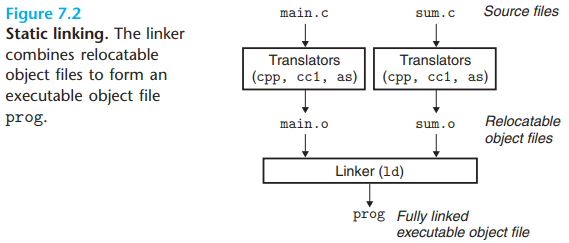
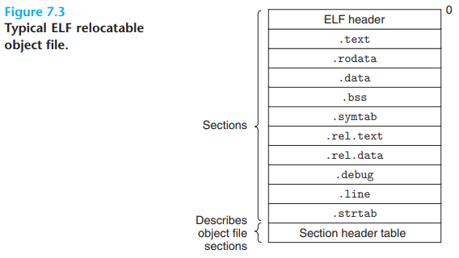
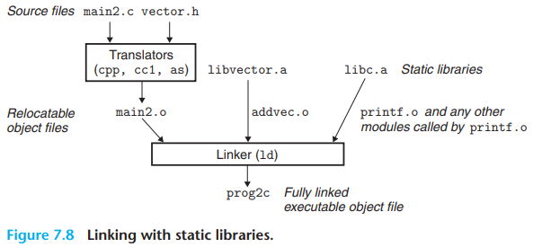
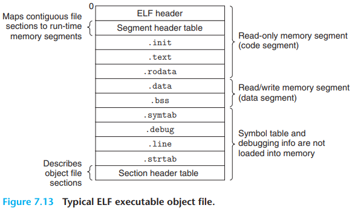
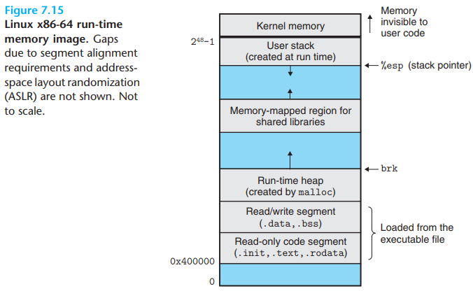
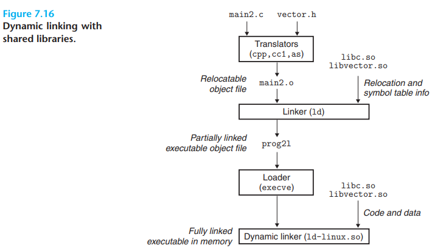
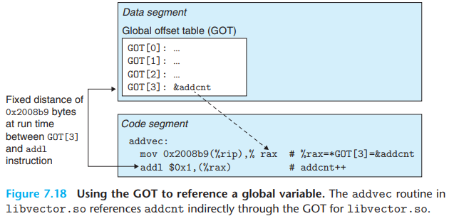
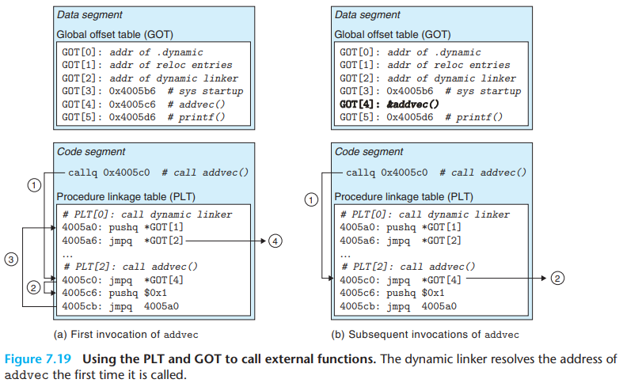

# 7 Linking

[TOC]

Linking is the process of collecting and combining various pieces of code and data into a single file that can be `loaded` (copied) into memory and executed.

Why bother learning about linking?

- Understanding linkers will help you build large programs.
- Understanding linkers will help you avoid dangerous programming errors.
- Understanding linking will help you understand how language scoping rules are implemented.
- Understanding linking will help you understand other important systems concepts.
- Understanding linking will enable you to exploit shared libraries.

Most compilation systems provide a `compiler driver` that invokes the language preprocessor, compiler, assembler, and linker, as needed on behalf of the user.

To build the executable, the linker must perform two main tasks:

1. `Symbol resolution`. Object files define and reference symbols, where each symbol corresponds to a function, a global variable, or a `static variable` (i.e., any C variable declared with the `static` attribute). The purpose of symbol resolution is to associate each symbol `reference` with exactly one symbol `definition`.
2. `Relocation`. Compilers and assemblers generate code and data sections that start at address 0. The linker `relocates` these sections by associating a memory location with each symbol definition, and then modifying all of the references to those symbols so that they point to this memory location. The linker blindly performs these relocations using detailed instructions, generated by the assembler, called `relocation entries`.

Object files come in three forms:

- `Relocatable object file`. Contains binary code and data in a form that can be combined with other relocatable object files at compile time to create an executable object file.
- `Executable object file`. Contains binary code and data in a form that can be copied directly into memory and executed.
- `Shared object file`. A special type of relocatable object file that can be loaded into memory and linked dynamically, at either load time or run time.

Compilers and assemblers generate relocatable object files (including shared object files). Linkers generate executable object files. Technically, an `object module` is a sequence of bytes, and an `object file` is an object module stored on disk in a file.

- `ELF header` The ELF header begins with a 16-byte sequence that describes the word size and byte ordering of the system that generated the file. The rest of the ELF header contains information that allows a linker to parse and interpret the object file. This includes the size of the ELF header, the object file type (e.g., relocatable, executable, or shared), the machine type (e.g., x86-64), the file offset of the section header table, and the size of the various sections are described by the `section header table`, which contains a fixed-size entry for each section in the object file.
- `.text` The machine code of the compiled program.
- `.rodata` Read-only data such as the format strings in printf statements, and jump tables for switch statements.
- `.data` Initialized global and static C variables. Local C variables are maintained at run time on the stack and do not appear in either the `.data` or `.bss` sections.
- `.bss` Uninitialized global and static C variables, along with any global or static variables that are initialized to zero. This section occupies no actual space in the object file; it is merely a placeholder. Object file formats distinguish between initialized and uninitialized variables for space efficiency: uninitialized variables do not have to occupy any actual disk space in the object file. At run time, these variables are allocated in memory with an initial value of zero.
- `.symtab` A symbol table with information about functions and global variables that are defined and referenced in the program. Some programmers mistakenly believe that a program must be compiled with the `-g` option to get symbol table information. In fact, every relocatable object file has a symbol table in `.symtab` (unless the programmer has specifically removed it with the STRIP command). However, unlike the symbol table inside a compiler, the `.symtab` symbol table does not contain entries for local variables.
- `.rel.text` A list of locations in the `.text` section that will need to be modified when the linker combines this object file with others. In general, any instruction that calls an external function or references a global variable will need to be modified. On the other hand, instructions that call local functions do not need to be modified. Note that relocation information is not needed in executable object files, and is usually omitted unless the user explicitly instructs the linker to include it.
- `.rel.data` Relocation information for any global variables that are referenced or defined by the module. In general, any initialized global variable whose initial value is the address of a global variable or externally defined function will need to be modified.
- `.debug` A debugging symbol table with entries for local variables and typedefs defined in the program, global variables defined and referenced in the program, and the original C source file. It is only present if the compiler driver is invoked with the `-g` option.
- `.line` A mapping between line numbers in the original C source program and machine code instructions in the `.text` section. It is only present if the compiler driver is invoked with the `-g` option.
- `.strtab` A string table for the symbol tables in the `.symtab` and `.debug` sections and for the section names in the section headers. A string table is a sequence of null-terminated character strings.

Each relocatable object module, `m`, has a symbol table that contains information about the symbols that are defined and referenced by `m`. In the context of a linker, there are three different kinds of symbols:

- Global symbols that are defined by module `m` and that can be referenced by other modules. Global linker symbols correspond to `nonstatic` C functions and global variables.
- Global symbols that are referenced by module `m` but defined by some other module. Such symbols are called `externals` and correspond to nonstatic C functions and global variables that are defined in other modules.
- Local symbols that are defined and referenced exclusively by module `m`. These correspond to static C functions and global variables that are defined with the static attribute. These symbols are visible anywhere within module `m`, but cannot be referenced by other modules.

At compile time, the compiler exports each global symbol to the assembler as either `strong` or `weak`, and the assembler encodes this information implicitly in the symbol table of the relocatable object file. Functions and initialized global variables get strong symbols. Uninitialized global variables get weak symbols.

Given this notion of strong and weak symbols, Linux linkers use the following rules for dealing with duplicate symbol names:

- Rule 1. Multiple strong symbols with the same name are not allowed.
- Rule 2. Given a strong symbol and multiple weak symbols with the same name, choose the strong symbol.
- Rule 3. Given multiple weak symbols with the same name, choose any of the weak symbols.

During the symbol resolution phase, the linker scans the relocatable object files and archives left to right in the same sequential order that they appear on the compiler driver's command line. (The driver automatically translates any `.c` files on the command line into `.o` files.) During this scan, the linker maintains a set $E$ of relocatable object files that will be merged to form the executable, a set $U$ of unresolved symbols (i.e., symbols referred to but not yet defined), and a set $D$ of symbols that have been defined in previous input files. Initially, $E$, $U$, and $D$ are empty:

- For each input file $f$ on the command line, the linker determines if $f$ is an object file or an archive. If $f$ is an object file, the linker adds $f$ to $E$, updates $U$ and $D$ to reflect the symbol definitions and references in $f$, and proceeds to the next input file.
- If $f$ is an archive, the linker attempts to match the unresolved symbols in $U$ against the symbols defined by the members of the archive. If some archive member $m$ defines a symbol that resolves a reference in $U$, then $m$ is added to $E$, and the linker updates $U$ and $D$ to reflect the symbol definitions and references in $m$. This process iterates over the member object files in the archive until a fixed point is reached where $U$ and $D$ no longer change. At this point, any member object files not contained in $E$ are simply discarded and the linker proceeds to the next input file.
- If $U$ is nonempty when the linker finishes scanning the input files on the command line, it prints an error and terminates. Otherwise, it merges and relocates the object files in $E$ to build the output executable file.

Once the linker has completed the symbol resolution step, it has associated each symbol reference in the code with exactly one symbol definition (i.e., a symbol table entry in one of its input object modules). At this point, the linker knows the exact sizes of the code and data sections in its input object modules. It is now ready to begin the relocation step, where it merges the input modules and assigns run-time addresses to each symbol. Relocation consists of two steps:

1. `Relocating sections and symbol definitions`. In this step, the linker merges all sections of the same type into a new aggregate section of the same type.
2. `Relocating symbol references within sections`. In this step, the linker modifies every symbol reference in the bodies of the code and data sections so that they point to the correct run-time addresses. To perform this step, the linker relies on data structures in the relocatable object modules known as relocation entries, which we describe next.

Whenever the assembler encounters a reference to an object whose ultimate location is unknown, it generates a `relocation entry` that tells the linker how to modify the reference when it merges the object file into an executable. Relocation entries for code are placed in `.rel.text`. Relocation entries for data are placed in `.rel.data`.

ELF defines 32 different relocation types, many quite arcane. We are concerned with only the two most basic relocation types:

- `R_X86_64_PC32`. Relocate a reference that uses a 32-bit PC-relative address. When the CPU executes an instruction using PC-relative addressing, it forms the `effective address` (e.g., the target of the call instruction) by adding the 32-bit value encoded in the instruction to the current run-time value of the PC, which is always the address of the next instruction in memory.
- `R_X86_64_32`. Relocate a reference that uses a 32-bit absolute address. with absolute addressing, the CPU directly uses the 32-bit value encoded in the instruction as the effective address, without further modifications.

The ELF header describes the overall format of the file. It also includes the program's `entry point`, which is the address of the first instruction to execute when the program runs. The `.text`, `.rodata`, and `.data` sections have been relocated to their eventual run-time memory addresses. The `.init` section defines a small function, called `_init`, that will be called by the program's initialization code. Since the executable is `fully linked` (relocated), it needs no `.rel` sections.

ELF executables are designed to be easy to load into memory, with contiguous chunks of the executable file mapped to contiguous memory segments. This mapping is described by the `program header table`.

For any segment $s$, the linker must choose a starting address, $vaddr$, such that 
$$
vaddr\ mod\ align = off\ mod\ align
$$
where $off$ is the offset of the segment's first section in the object file, and $align$ is the alignment specified in the program header $(2^{21} = 0\times200000)$. This alignment requirement is an optimization that enables segments in the object file to be transferred efficiently to memory when the program executes. The reason is somewhat subtle and is due to the way that virtual memory is organized as large contiguous power-of-2 chunks of bytes.

Static libraries still have some significant disadvantages:

- Static libraries, like all software, need to be maintained and update periodically. If application programmers want to use the most recent version of a library, they must somehow become aware that the library has changed and then explicitly relink their programs against the updated library.
- At run tie, the code for these functions is duplicated in the text segment of each running process. On a typical system that is running hundreds of processes, this can be a significant waste fo scarce memory system resources.

Shared libraries are modern innovations that address the disadvantages of static libraries. A shared library is an object module that, at either run time or load time, can be loaded at an arbitrary memory address and linked with a program in memory. This process is known as `dynamic linking` and is performed by a program called a `dynamic linker`.

The dynamic linker then finishes the linking task by performing the following relocations:

- Relocating the text and data of `libc.so` into some memory segment.
- Relocating the text and data of `libvector.so` into another memory segment.
- Relocating any references in `prog21` to symbols defined by `libc.so` and `libvector.so`.

Code that can be loaded without needing any relocations is known as `position independent code` (PIC). Users direct GNU compilation systems to generate PIC code with the `-fpic` option to GCC. Shared libraries must always be compiled with this option.

Compilers generate PIC references to global variables by exploiting the following interesting fact: no matter where we load an object module (including shared object modules) in memory, the data segment is always the same distance from the code segment. Thus, the distance between any instruction in the code segment and any variable in the data segment is a run-time constant, independent of the absolute memory locations of the code and data segments.

Compilers that want to generate PIC references to global variables exploit this fact by creating a table called the `global offset table` (GOT) at the beginning of the data segment. The GOT contains an 8-byte entry for each global data object (procedure or global variable) that is referenced by the object module. The compiler also generates a relocation record for each entry in the GOT. At load time, the dynamic linker relocates each GOT entry so that it contains the absolute address of the object. Each object module that references global objects has its own GOT.

`lazy binding`. that defers the binding of each procedure address until the first time the procedure is called.

Lazy binding is implemented with a compact yet somewhat complex interaction between two data structures: the GOT and the `procedure linkage table` (PLT). If an object module calls any functions that are defined in shared libraries, then it has its own GOT and PLT. The GOT is part of the data segment. The PLT is part of the code segment.

Figure 7.19(a) shows how the GOT and PLT work together to lazily resolve the run-time address of function `addvec` the first time it is called:

- Step 1. Instead of directly calling `addvec`, the program calls into `PLT[2]`, which is the PLT entry for `advec`.
- Step 2. The first PLT instruction does an indirect jump through `GOT[4]`. Since each GOT entry initially points to the second instruction in its corresponding PLT entry, the indirect jump simply transfers control back to the next instruction in `PLT[2]`.
- Step 3. After pushing an ID for `addvec` (0x1) onto the stack, `PLT[2]` jumps to `PLT[0]`.
- Step 4. `PLT[0]` pushes an argument for the dynamic linker indirectly through `GOT[1]` and then jumps into the dynamic linker indirectly through `GOT[2]`. The dynamic linker uses the two stack entries to determine the run-time location of `addvec`, overwrites `GOT[4]` with this address, and passes control to `addvec`.

Figure 7.19(b) shows the control flow for any subsequent invocations of `addvec`:

- Step 1. Control passes to `PLT[2]` as before.
- Step 2. However, this time the indirect jump through `GOT[4]` transfers control directly to `addvec`.

Figure 7.19 shows how the PLT and GOT work together to resolve the address of a function at run time. First, let's examine the contents of each of these tables:

- `Procedure linkage table (PLT)`. The PLT is an array of 16-byte code entries. `PLT[0]` is a special entry that jumps into the dynamic linker. Each shared library function called by the executable has its own PLT entry. Each of these entries is responsible for invoking a specific function. `PLT[1]` (not shown here) invokes the system startup function (`__libc_start_main`), which initializes the execution environment, calls the main function, and handles its return value. Entries starting at `PLT[2]` invoke functions called by the user code. 
- `Global offset table (GOT)`. As we have seen, the GOT is an array of 8-byte address entries. When used in conjunction with the PLT, `GOT[0]` and `GOT[1]` contain information that the dynamic linker uses when it resolves function addresses. `GOT[2]` is the entry point for the dynamic linker in the `ld-linux.so` module. Each of the remaining entries corresponds to a called function whose address needs to be resolved at run time. Each has a matching PLT entry.

`library interpositioning`. Given some `target function` to be interposed on, you create a `wrapper function` whose prototype is identical to the target function. Using some particular interpositioning mechanism, you then trick the system into calling the wrapper function instead of the target function. The wrapper function typically executes its own logic, then calls the target function and passes its return value back to the caller.

Interpositioning can occur at compile time, link time, or run time as the program is being loaded and executed.

Linking can be performed at compile time by static linkers and at load time and run time by dynamic linkers. Linkers manipulate binary files called object files, which come in three different forms: relocatable, executable, and shared. Relocatable object files are combined by static linkers into an executable object file that can be loaded into memory and executed. Shared object files (shared libraries) are linked and loaded and begins executing, or on demand, when the program calls functions from the dlopen library.

The two main tasks of linkers are symbol resolution, where each global symbol in an object file is bound to a unique definition, and relocation, where the ultimate memory address for each symbol is determined and where references to those objects are modified.

Static linkers are invoked by compiler drivers such as GCC. They combine multiple relocatable object files into a single executable object file. Multiple object files can define the same symbol, and the rules that linkers use for silently resolving these multiple definitions can introduce subtle bugs in user programs.

Multiple object files can be concatenated in a single static library. Linkers use libraries to resolve symbol references in other object modules. The left-to-right sequential scan that many linkers use to resolve symbol references is another source of confusing link-time errors.

Loaders map the contents of executable files into memory and run the program. Linkers can also produce partially linked executable object files with unresolved references to the routines and data defined in a shared library. At load time, the loader maps the partially linked executable into memory and then calls a dynamic linker, which completes the linking task by loading the shared library and relocating the references in the program.

Shared libraries that are compiled as position-independent code can be loaded anywhere and shared at run time by multiple processes. Applications can also use the dynamic linker at run time in order to load, link, and access the functions and data in shared libraries.

There are a number of tools available on Linux systems to help you understand and manipulate obejct files. In particular, the GNU binutils package is especially helpful and runs on every Linux platform:

- `AR`. Creates static libraries, and inserts, deletes, lists, and extracts members.
- `STRINGS`. Lists all of the printable strings contained in an object file.
- `STRIP`. Deletes symbol table information form an object file.
- `NM`. Lists the symbols defined in the symbol table of an object file.
- `SIZE`. Lists the names and sizes of the sections in an object file.
- `READELF`. Displays the complete structure of an object file, including all of the information encoded in the ELF header. Subsumes the functionality of `SIZE` and `NM`.
- `OBJDUMP` The mother of all binary tools. Can display all of the information in an object file. Its most useful function is disassembling the binary instructions in the `.text` section.

Linux systems also provide the `LDD` program for manipulating shared libraries:

- `LDD`. Lists the shared libraries that an executable needs at run time.

## Summary

Linking can be performed at compile time by static linkers and at load time and run time by dynamic linkers. Linkers manipulate binary files called object files, which come in three different forms: relocatable, executable, and shared. Relocatable object files are combined by static linkers into an executable object file that can be loaded into memory and executed. Shared object files (shared libraries) are linked and loaded by dynamic linkers at run time, either implicitly when the calling program is loaded and begins executing, or on demand, when the program calls functions from the `dlopen` library.

The two main tasks of linkers are symbol resolution, where each global symbol in an object file is bound to unique definition, and relocation, where the ultimate memory address for each symbol is determined and where references to those objects are modified.

Static linkers are invoked by compiler drivers such as GCC. They combine multiple relocatable object files into a single executable object file. Multiple object files can define the same symbol, and the rules that linkers use for silently resolving these multiple definitions can introduce subtle bugs in user programs.

Multiple object files can be concatenated in a single static library. Linkers use libraries to resolve symbol references in other object modules. The left-to-right sequential scan that many linkers use to resolve symbol references is another source of confusing link-time errors.

Loaders map the contents of executable files into memory and  run the program. Linkers can also produce partially linked executable object files with unresolved references to the routines and data defined in a shared library. At load time, the loader maps the partially linked executable into memory and then calls a dynamic linker, which completes the linking task by loading the shared library and relocating the references in the program.

Shared libraries that are compiled as position-independent code can be loaded anywhere and shared at run time by multiple processes. Applications can also use the dynamic linker at run time in order to load, link, and access the functions and data in shared libraries.

## Glossary

crucial `/'kruːʃl/` 决定性的，关键的

monolithic `/ˌmɒnə'lɪθɪk/` 单体的，整体的

decompose `/ˌdiːkəmˈpəʊz/` 分解，腐烂

introductory `/ˌɪntrə'dʌktəri/` 介绍的，前言的，序文的

bother `/'bɒðə(r)/` 麻烦，烦扰，焦急，使不安

affect `/ə'fekt/` 影响，感动，作用

exhibit `/ɪɡˈzɪbɪt/` 展览，展出，表现，显示

baffle `/'bæfl/` 困惑，难倒，阻碍，受挫，挡板，隔音板

scoping `/s'kəʊpɪŋ/` （计算机）辖域

paging `/'peɪdʒɪŋ/` （计算机）分页，传呼，页面调度

sophisticate `/səˈfɪstɪkət/` 老练的，精密的，复杂的，老于世故的人，使...更精确

significant `/sɪɡˈnɪfɪkənt/` 重要的，显著的，相当数量地

shrink `/ʃrɪŋk/` 收缩，退缩，减低

thorough `/'θʌrə/` 彻底的，完成，非常

concrete `/ˈkɒŋkriːt/` 具体的，实体的，混凝土，水泥，实质性的，凝结，结合

couch `/kaʊtʃ/` 长椅，睡椅，兽穴，埋伏，躺下

hereafter `/ˌhɪər'ɑːftə(r)/` 将来，来世，此后

vary `/ˈveəri/` 变化，变更，差异

throughout `/θruː'aʊt/` 贯穿，遍及，自始至终

form `/fɔːm/`  形式，形状，表格，形成，建立，常规

prog `/prɒg/` (非正式)相当于program，掠夺

contiguous `/kən'tɪɡjuəs/` 邻近的，连续的，接触的

blindly `/'blaɪndli/` 摸索地，盲目地，蛮干地

merely `/'mɪəli/` 仅仅，只不过

concatenate `/kɑnˈkæt(ə)ˌneɪt/` 连接，串联，连锁

sandwiched `/'sænwɪtʃ/` 三明治，夹在中间，插入

efficiency `/ɪ'fɪʃnsi/` 功率，效率

occupy `/ˈɒkjupaɪ/`  使用，占用，占领，居住

acronym `/ˈækrənɪm/` 首字母缩略语

stuck `/stʌk/` 卡住，刺入，困住

abbreviation `/əˌbriːviˈeɪʃn/` 缩写，缩略，省略号

relocatable `/riː'ləʊkætəbl/` 可再定位的

arbitrary `/ˈɑːbɪtrəri/` 任意的，武断的，随心所欲的，专制的

indicate `/ˈɪndɪkeɪt/` 指示，说明，象征，显示，预示

trickier `/'trɪki/` 棘手的，狡猾的，巧妙的

cryptic `/'krɪptɪk/` 隐秘的，秘密的，用密码的，隐晦的

hitch `/hɪtʃ/` 猛拉，急促猛推，跛行，妨碍，免费搭车，拴住，连住，急拉，拉紧，蹒跚，被缠结

tricky `/'trɪki/` 棘手的，狡猾的，巧妙的

somehow `/'sʌmhaʊ/` 以某种方式，不知怎么地

discard `/dɪs'kɑːd/` 丢牌，弃牌，抛弃

baffle `/'bæfl/` 困惑，难倒，阻碍，受挫，挡板，隔音板

unwary `/ʌn'weəri/` 不小心的，疏忽的

mangle `/'mæŋɡl/` 碾压，损坏，糟蹋，碾压机

inverse `/ˌɪn'vɜːs/` （数学）逆反函数，负数，倒数，倒转的，相反的

demangling `/dɪ'mɑːŋɡlɪŋ/` （计算机）识别解码

assembler `/ə'semblə(r)/` （计算机）汇编程序，装配工

duplicate `/ˈdjuːplɪkeɪt/` 复制，副本

insidious `/ɪnˈsɪdɪəs/` 潜伏的，暗中滋生的，阴险的，有隐患的，不知不觉中恶化的

incomprehensible `/ɪnˌkɒmprɪ'hensəbl/` 不能理解的，费解的

inadvertently `/ˌɪnəd'vɜːtəntli/` 不注意地，疏忽地，非故意地

precision `/prɪˈsɪʒn/` 精确，准确，细致

manifest `/ˈmanɪfɛst/` 明显的，清楚显示，证明，显现，货单

extensive `/ɪkˈstensɪv/` 广阔的，广泛的

appropriate `/əˈprəʊpriət/`  合适的，恰当的，盗用，占用，侵吞，拨出（款项）

feasible `/'fiːzəbl/` 可行的，可能的

decouple `/diːˈkʌpl/` 分离，隔断，解耦

prone `/prəʊn/` 易于...的，有...倾向的，俯卧的

specify `/ˈspesɪfaɪ/` 具体说明，明确规定，详述，标志语，指示符

concatenate `/kɑnˈkæt(ə)ˌneɪt/` 连接，串联，连锁

baffle `/'bæfl/` 困惑，难倒，阻碍，受挫，挡板，隔音板

scenario `/sɪˈnɑː.ri.əʊ/` 可能发生的事态，设想，剧本，情节，情况

aggregate `/ˈæɡrɪɡət /`  总数，合计，聚集

ultimate `/ˈʌltɪmət/` 根本的，最终的，精华

addend `/ə'dend/` 加数

arcane `/ɑː'keɪn/` 神秘的，不可思议的

eventually `/ɪˈventʃuəli/` 最后，终于

abut `/ə'bʌt/` 邻接，毗连

intentionally `/ɪnˈten.ʃən.əl.i/` 有意的，故意的

revisit `/ˌriː'vɪzɪt/` 回顾，重温，再访，重游

gradually `/'ɡrædʒuəli/` 逐渐地

reveal `/rɪˈviːl/` 揭示，显示，透露

impatient `/ɪm'peɪʃnt/` 不耐烦的，急躁的

banner `/'bænə(r)/` 横幅，旗帜，大标题，杰出的，特别好的，用横幅装饰，以大标题报道

sophisticate `/səˈfɪstɪkət/` 老练的，精密的，复杂的，老于世故的人，使...更精确

appropriate `/əˈprəʊpriət/`  合适的，恰当的，盗用，占用，侵吞，拨出（款项）

opposed `/əˈpəʊzd/` 完全不同的，相反的

throughput `/'θruːpʊt/` 产量，吞吐量

interpreter `/ɪn'tɜːprɪtə(r)/` （计算机）解释器，口译员

precious `/ˈpreʃəs/` 宝贝，宝贵的，珍贵的

priori `/priːˈɔː.ri/` 演绎的，先验的（由原因推出结果的）

dedicate `/'dedɪkeɪt/` 致力于，献出

chunk `/tʃʌŋk/` 大块，段

inefficient `/ˌɪnɪ'fɪʃnt/` 无效率的，无能的，不称职的

overlap `/ˈəʊvəlæp/` 重叠，交替

fragment `/'fræɡmənt/` 碎片，片段，使破碎，分裂

procedure `/prəˈsiːdʒə/` 程序

handful `/'hændfʊl/` 一把，少数，棘手之事

nontrivial `/'nɒn'trɪvɪəl/` 非平凡的，重要的

overhead `/ˌəʊvə'hed/` 在头顶上，在空中，经常性开支，普通费用

thereafter `/ˌðeər'ɑːftə(r)/` 其后，从那时以后

conjunction `/kən'dʒʌŋkʃn/` 结合，关联，连词，(事件等的)同时发生

interpose `/ˌɪntə'pəʊz/` （计算机）打桩，插入，介入，插嘴，调停

interposition `/ˌɪntəpə'zɪʃən/` 计算机）打桩，插入，干涉，插入物

fascinate `/ˈfæsɪneɪt/` 入迷，迷住，吸引

ultimate `/ˈʌltɪmət/` 根本的，最终的，精华

subtle `/ˈsʌtl/` 细微的，微妙的，精妙的，敏锐的，隐约的

literature `/'lɪtrətʃə(r)/` 文学，文献

neat `/niːt/` 整洁的，小巧的，整齐的，灵巧的

monograph `/ˈmɒnəɡrɑːf/` 专著，专论

discrepancy `/dɪs'krepənsi/` 差异，不一致，分歧

drill `/drɪl/` 钻孔，钻孔机，钻子，反复操练，播种机，练习，(军事)训练

nasty `/'nɑːsti/` 下流的，严重的

pretty `/'prɪti/` 相当的，漂亮的，好看的

