# 8 Exceptional Control Flow

From the time you first apply power to a processor until the time you shut it off, the program counter assumes a sequence of values
$$
a_0, a_1, ..., a_{n-1}
$$
where each $a_k$ is the address of some corresponding instruction $I_k$. Each transition from $a_k$ to $a_{k+1}$ is called a `control transfer`. A sequence of such control transfer is called the `flow of control`, or `control flow`, of the processor.

Modern systems react to these situations by making abrupt changes in the control flow. In general, we refer to these abrupt changes as `exceptional control flow` (ECF). ECF occurs at all levels of a computer system.

As programmers, there are a number of reasons why it is important for you to understand ECF:

- Understanding ECF will help you understand important systems concepts.
- Understanding ECF will help you understand how applications interact with the operating system.
- Understanding ECF will help you write interesting new application programs.
- Understanding ECF will help you understand concurrency.
- Understanding ECF will help you understand how software exceptions work.

An `exception` is an abrupt change in the control flow in response to some change in the processor's state.

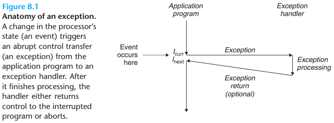

In any case, when the processor detects that the event has occurred, it makes an indirect procedure call (the exception), through a jump table called an `exception table`, to an operating system subroutine (the `exception handler`) that is specifically designed to process this particular kind of event. When the exception handler finishes processing, one of three things happens, depending on the type of event that caused the exception:

1. The handler returns control to the current instruction $I_{curr}$, the instruction that was executing when the event occurred.
2. The handler returns control to $I_{next}$, the instruction that would have executed next had the exception not occurred.
3. The handler aborts the interrupted program.

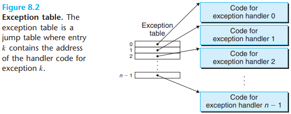

At system boot time (when the computer is reset or powered on), the operating system allocates and initializes a jump table called an `exception table`, so that entry $k$ contains the address of the handler for exception $k$.

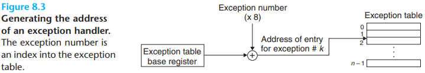

At run time (when the system is executing some program), the processor detects that an event has occurred and determines the corresponding exception number $k$. The processor then triggers the exception by making an indirect procedure call, through entry $k$ of the exception table, to the corresponding handler.

The exception number is an index into the exception table, whose starting address is contained in a special CPU register called the `exception table base register`.

An exception is akin to a procedure call, but with some important differences:

- As with a procedure call, the processor pushes a return address on the stack before branching to the handler. However, depending on the class of exception, the return address is either the current instruction (the instruction that was executing when the event occurred) or the next instruction (the instruction that would have executed after the current instruction had the event not occurred).
- The processor also pushes some additional processor state onto the stack that will be necessary to restart the interrupted program when the handler returns.
- When control is being transferred from a user program to the kernel, all of these items are pushed onto the kernel's stack rather than onto the user's stack.
- Exception handlers run in `kernel mode`, which means they have complete access to all system resources.

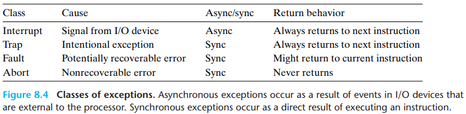

- Interrupts

  `Interrupts` occur `asynchronously` as a result of signals from I/O devices that are external to the processor. Hardware interrupts are asynchronous in the sense that they are not caused by the execution of any particular instruction. Exception handlers for hardware interrupts are often called `interrupt handlers`.

  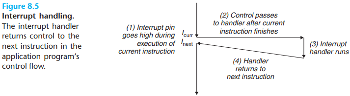

- Traps and System Calls

  `Traps` are `intentional` exceptions that occur as a result of executing an instruction. Like interrupt handlers, trap handlers return control to the next instruction. The most important use of traps is to provide a procedure-like interface between user programs and the kernel, known as a `system call`.

  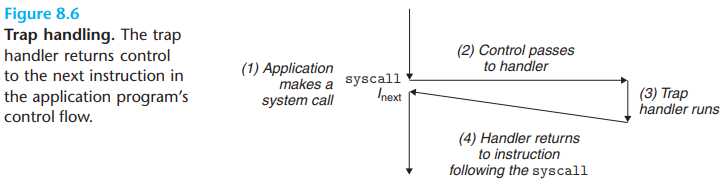

  From a programmer's perspective, a system call is identical to a regular function call. However, their implementations are quite different. Regular functions run in user mode, which restricts the types of instructions they can execute, and they acess the same stack as the calling function. A system call runs in `kernel mode`, which allows it to execute privileged instructions and access a stack defined in the kernel.

- Faults

  Faults result from error conditions that a handler might be able to correct. When a fault occurs, the processor transfers control to the fault handler. If the handler is able to correct the error condition, it returns control to the faulting instruction, thereby re-executing it. Otherwise, the handler returns to an `abort` routine in the kernel that terminates the application program that caused the fault.

  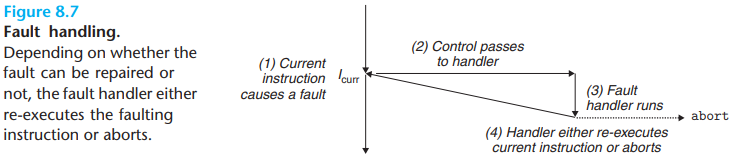

- Aborts

  Aborts result from unrecoverable fatal errors, typically hardware errors such as parity errors that occur when DRAM or SRAM bits are corrupted. Abort handlers never return control to the application program.

  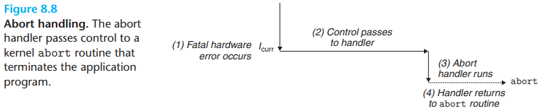

There are up to 256 different exception types [50]. Numbers in the range from 0 to 31 correspond to exceptions that are defined by the Intel architects and thus are identical for any x86-64 system. Numbers in the range from 32 to 255 correspond to interrupts and traps that are defined by the operating system.

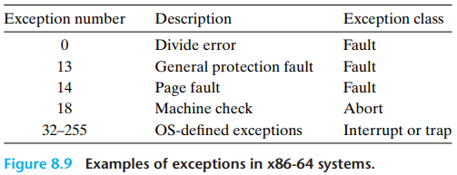

The classic definition of a process is `an instance of a program in execution`. Each program in the system runs in the `context` of some process. The context consists of the state that the program needs to run correctly. This state includes the program's code and data stored in memory, its stack, the contents of its general purpose registers, its program counter, environment variables, and the set of open file descriptors.

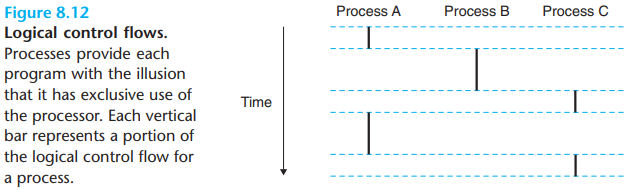

The key point in Figure 8.12 is that processes take turns using the processor. Each process executes a portion of its flow and then is `preempted` (temporarily suspended) while other processes take their turns. To a program running in the context of one of these processes, it appears to have exclusive use of the processor.

A logical flow whose execution overlaps in time with another flow is called a `concurrent flow`, and the two flows are said to `run concurrently`. More precisely, flows $X$ and $Y$ are concurrent with respect to each other if and only if $X$ begins after $Y$ begins and before $Y$ finishes, or $Y$ begins after $X$ begins and before $X$ finishes.

The general phenomenon of multiple flows executing concurrently is known as `concurrency`. The notion of a process taking turns with other processes is also known as `multitasking`. Each time period that a process executes a portion of its flow is called a `time slice`. Thus, multitasking is also referred to as `time slice`.

Notice that the idea of concurrent flows is independent of the number of processor cores or computers that the flows are running on. If two flows overlap in time, then they are concurrent, even if they are running on the same processor. However, we will sometimes find it useful to identify a proper subset of concurrent flows known as `parallel flows`. If two flows are running concurrently on different processor cores or computers, then we say that they are `parallel flows`, that they are `running in parallel`, and have `parallel execution`.

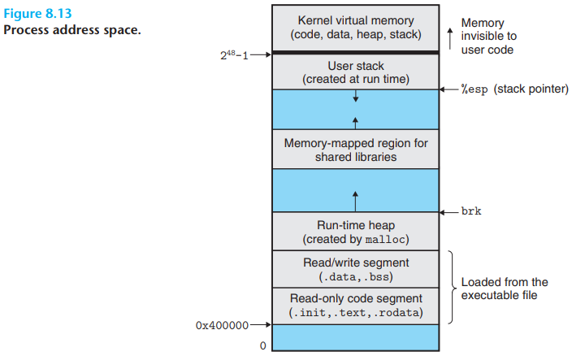

In order for the operating system kernel to provide an airtight process abstraction, the processor must provide a mechanism that restricts the instructions that an application can execute, as well as the portions of the address space that it can access.

Processors typically provide this capability with a `mode bit` in some control register that characterizes the privileges that the process currently enjoys. When the mode bit is set, the process is runing in `kernel mode` (sometimes called `supervisor mode`). A process running in kernel mode can execute any instruction in the instruction set and access any memory location in the system.

A process running application code is initially in user mode. The only way for the process to change from user mode to kernel mode is via an exception such as an interrupt, a fault, or a trapping system call. When the exception occurs, and control passes to the exception handler, the processor changes the mode from user mode to kernel mode. The handler runs in kernel mode. When it returns to the application code, the processor changes the mode from kernel mode back to user mode.

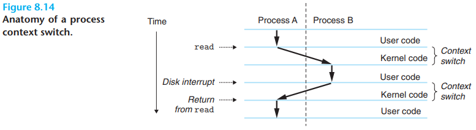

The operating system kernel implements multitasking using a higher-level form of exceptional control flow known as a `context switch`.

The kernel maintains a `context` for each process. The context is the state that the kernel needs to restart a preempted process. It consists of the values of objects such as the general-purpose registers, the floating-point registers, the program counter, user's stack, status registers, kernel's stack, and various kernel data structures such as a `page table` that characterizes the address space, a `process table` that contains information about the current process, and a `file table` that contains information about the files that the process has opened.

A context switch can occur while the kernel is executing a system call on behalf of the user.

A context switch can also occur as a result of an interrupt.

From a programmer's perspective, we can think of a process as being in one of three states:

- `Running`. The process is either executing on the CPU or waiting to be executed and will eventually be scheduled by the kernel.
- `Stopped`. The execution of the process is suspended and will not be scheduled. A process stops as a result of receiving a SIGSTOP, SIGTSTP, SIGTTIN, or SIGTTOU signal, and it remains stopped until it receives a SIGCONT signal, and it remains stopped until it receives a SIGCONT signal, at which point it becomes running again.
- `Terminated`. The process is stopped permanently. A process becomes terminated for one of three reasons: (1) receiving a signal whose default action is to terminate the process, (2) returning from the main routine, or (3) calling the `exit` function.

When a process terminates for any reason, the kernel does not remove it from the system immediately. Instead, the process is kept around in a terminated state until it is `reaped` by its parent. When the parent reaps the terminated child, the kernel passes the child's exit status to the parent and then discards the terminated process, at which point it ceases to exist. A terminated process that has not yet been reaped is called a `zombie`.

When a parent process terminates, the kernel arranges for the `init` process to become the adopted parent of any orphaned children. The `init` process, which has a PID of 1, is created by the kernel during system start-up, never terminates, and is the ancestor of every process. If a parent process terminates without reaping its zombie children, then the kernel arranges for the init process to reap them. 

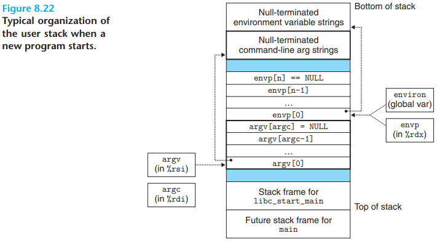

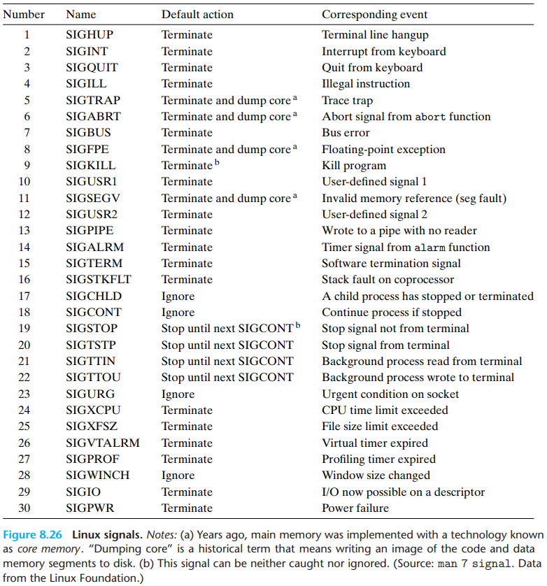

A signal is a small message that notifies a process that an event of some type has occurred in the system.

Each signal type corresponds to some kind of system event. Low-level hardware exceptions are processed by the kernel's exception handlers and would not normally be visible to user processes. Signals provide a mechanism for exposing the occurrence of such exceptions to user processes.

The transfer of a signal to a destination process occurs in two distinct steps:

1. `Sending a signal`. The kernel sends (delivers) a signal to a destination process by updating some state in the context of the destination process. The signal is delivered for one of two reasons: (1) The kernel has detected a system event such as a divide-by-zero error or the termination of a child process. (2) A process has invoked the `kill` function (discussed in the next section) to explicitly request the kernel to send a signal to the destination process. A process can send a signal to itself.

2. `Receiving a signal`. A destination process `receives` a signal when it is forced by the kernel to react in some way to the delivery of the signal. The process can either ignore the signal, terminate, or catch the signal by executing a user-level function called a `signal handler`.

   

A signal that has been sent but not yet received is called a `pending signal`. At any point in time, there can be at most one pending signal of a particular type. If a process has a pending signal of type $k$, then any subsequent signals of type $k$ sent to that process are not queued; they are simply discarded. A process can selectively `block` the receipt of certain signals. When a signal is blocked, it can be delivered, but the resulting pending signal will not be received until the process unblocks the signal.

A pending signal is received at most once. For each process, the kernel maintains the set of pending signals in the pending bit vector, and the set of blocked signals in the blocked bit vector. The kernel sets bit $k$ in pending whenever a signal of type $k$ is delivered and clears bit $k$ in pending whenever a signal of type $k$ is received.

When the kernel switches a process $p$ from kernel mode to user mode (e.g., returning from a system call or completing a context switch), it checks the set of unblocked pending signals (pending & ~ blocked) for $p$. If this set is empty (the usual case), then the kernel passes control to the next instruction ($I_{next}$) in the logical control flow of $p$. However, if the set is nonempty, then the kernel chooses some signal $k$ in the set (typically the smallest $k$) and forces $p$ to receive signal $k$. The receipt of the signal triggers some `action` by the process. Once the process completes the action, then control passes back to the next instruction ($I_{next}$) in the logical control flow of $p$. Each signal type has a predefined `default` action, which is one of the following:

- The process terminates.
- The process terminates and dumps core.
- The process stops (suspends) until restarted by a SIGCONT signal.
- The process ignores the signal.

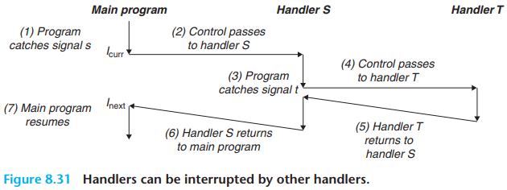

Linux provides implicit and explicit mechanisms for blocking signals:

- `Implicit blocking mechanism`. By default, the kernel blocks any pending signals of the type currently being processed by a handler.
- `Explicit blocking mechanism`. Applications can explicitly block and unblock selected signals using the `sigprocmask` function and its helpers.

Signal handling is one of thornier aspects of Linux system-level programming. Handlers have attributes that make them difficult to reason about: (1) Handlers run concurrently with the main program and share the same global variables, and thus can interfere with the main program and with other handlers. (2) The rules for how and when signals are received is often counterintuitive. (3) Different systems can have different signal-handling semantics.

Linux systems provide a number of useful tools for monitoring and manipulating processes:

- `STRACE`. Prints a trace of each system call invoked by a running program and its children.
- `PS`. Lists processes (including zombies) currently in the system.
- `TOP`. Prints information about the resource usage of current processes.
- `PMAP` Displays the memory map of a process.
- `/proc`. A virtual filesystem that exports the contents of numerous kernel data structures in an ASCII text form that can be read by user programs.

## Summary

Exceptional control flow (ECF) occurs at all levels of a computer system and is a basic mechanism for providing concurrency in a computer system.

At the hardware level, exceptions are abrupt changes in the control flow that are triggered by events in the processor. The control flow passes to a software handler, which does some processing and then returns control to the interrupted control flow.

There are four different types of exceptions: interrupts, faults, aborts, and traps. Interrupts occur asynchronously (with respect to any instructions) when an external I/O device such as a timer chip or a disk controller sets the interrupt pin on the processor chip. Control returns to the instruction following the faulting instruction. Faults and aborts occur synchronously as the result of the execution of an instruction. Fault handlers restart the faulting instruction, while abort handlers never return control to the interrupted flow. Finally, traps are like function calls that are used to implement the system calls that provide applications with controlled entry points into the operating system code.

At the operating system level, the kernel uses ECF to provide the fundamental notion of a process. A process provides applications with two important abstractions: (1) logical control flows that give each program the illusion that it has exclusive use of the processor, and (2) private address spaces that provide the illusion that each program has exclusive use of the main memory.

At the interface between the operating system and applications, applications can create child processes, wait for their child processes to stop or terminate, run new programs, and catch signals from other processes. The semantics of signal handling is subtle and can vary from system to system. However, mechanisms exist on Posix-compliant systems that allow programs to clearly specify the expected signal-handling semantics.

Finally, at the application level, C programs can use nonlocal jumps to bypass the normal call/return stack discipline and branch directly from one function to another.

## Glossary

abrupt `/ə'brʌpt/` 突然的，意外的，陡峭的

interval `/ˈɪntəvl/` 间隔，间隙

recipient `/rɪˈsɪpiənt/` 接受者，收件人，受方

individual `/ɪndɪˈvɪdʒʊ(ə)l/` 单独的，独特的，个人主义，个人，个体

sidestep `/'saɪdstep/` 回避，向旁侧避让

discipline `/ˈdɪsəplɪn/` 训练，行为准则，纪律，学科

overlap `/ˈəʊvəlæp/` 重叠，交替

violate `/'vaɪəleɪt/` 违反，扰乱，亵渎

discipline `/ˈdɪsəplɪn/` 训练，行为准则，纪律，学科

pivotal `/'pɪvətl/` 重要的，关键的，轴的

intersection `/ˌɪntə'sekʃn/` 交集，十字路口，交叉点

aim `/eɪm/` 目标，瞄准，对准，针对

demystify `/ˌdiː'mɪstɪfaɪ/` 使非神秘化

anatomy `/əˈnætəmi/` 解刨，解刨学，人体

nonnegative `/'nɒn'negətɪv/` 非负的，正的

resident `/'rezɪdənt/` 居民，住客，住院医生

procedure `/prəˈsiːdʒə/` 程序

fault `/fɔːlt/` 过失，错误

intentional `/ɪn'tenʃənl/` 存心的，有意的，故意的

perspective `/pə'spektɪv/` 角度，远景，看法，透视

contiguous `/kən'tɪɡjuəs/` 邻近的，连续的，接触的

asynchronous `/eɪ'sɪŋkrənəs/` 异步的

illusion `/ɪˈluːʒn/` 幻觉，幻想，错觉

exclusive `/ɪkˈskluːsɪv/` 专有的，独占的，专有的，排外的，独家

completion `/kəm'pliːʃn/` 完成，结束

portion `/ˈpɔːʃ(ə)n/` 一部分，命运，份额，分担的责任

stall `/stɔːl/` 停顿，栅栏，小隔间，货摊，失速，熄火，拖延

phenomenon `/fəˈnɒmɪnən/` 现象，杰出的人，奇人，奇事

behalf `/bɪ'hɑːf/` 代表，利益，方面

airtight `/'eətaɪt/` 密封的，不透气的，无懈可击的

supervisor `/'suːpəvaɪzə(r)]/` （计算机）超级用户，监督人，主管人，管理人，督学，检查员，导师

preempt `/prɪ'empt/` 优先，取代，先占，以优先购买权获得

interim `/'ɪntərɪm/` 暂时的，临时的，中间的，过渡时期，暂定

bloat `/bləʊt/` 膨胀，肿胀的，自傲

concise `/kən'saɪs/` 简明的，简要的

impression `/ɪm'preʃn/` 印象，印记，印刷

permissible `/pə'mɪsəbl/` 可允许的，容许的

positive `/'pɒzətɪv/` 正数，正面，积极的，肯定的，正面的

eventually `/ɪˈventʃuəli/` 最后，终于

permanent `/'pɜːmənənt/` 永久的，持久的，烫发

unambiguous `/ˌʌnæm'bɪɡjuəs/` 不含糊的，清楚的

subtle `/ˈsʌtl/` 细微的，微妙的，精妙的，敏锐的，隐约的

fairly `/ˈfeəli/` 公平的

straightforward `/ˌstreɪt'fɔːwəd/` 笔直的，易懂的，坦率的

arbitrary `/ˈɑːbɪtrəri/` 任意的，武断的，随心所欲的，专制的

subsequent `/ˈsʌbsɪkwənt/` 随后的，后来的，之后的

respective `/rɪˈspek.tɪv/`  各自的，分别的

sketch `/sketʃ/` 素描，速写，框架，概述，草图

precedence `/'presɪdəns/` 优先，居先

feasible `/'fiːzəbl/` 可行的，可能的

topological `/tɒpə'lɒdʒɪkəl/` 拓扑的

permutation `/ˌpɜːmju'teɪʃn/` 交换，排列

vertices `/'vɜːteks/` （几何学）顶点，最高点，头顶

reap `/riːp/` 收割，获得，收获

discard `/dɪs'kɑːd/` 丢牌，弃牌，抛弃

cease `/siːs/` 终止，停止

orphan `/ˈɔːfn/` 孤儿

ancestor `/ˈænsestə(r)/` 祖先，祖宗

folklore `/ˈfəʊklɔː(r)/` 民俗，民俗学，民间传说

suspend `/sə'spend/` 暂停，中止，悬浮

flawed `/flɔːd/` 有裂纹的，有瑕疵的，有缺陷的

foreground `/'fɔːɡraʊnd/` 前景，最显著的位置

forcibly `/'fɔːsəbli/` 强行的，强烈的

receipt `/rɪ'siːt/` 收据，收条，收到

invocation `/ˌɪnvə'keɪʃn/` （计算机）调用，祈祷，实施

immediate `/ɪ'miːdiət/` 直接的，最接近的，利己的，目前的

thornier `/'θɔːni/` 多刺的，棘手的，痛苦的

counterintuitive `/kaʊntərɪn'tjuːɪtɪv/` 违反直觉的

semantics `/sɪ'mæntɪks/` 语义学，符号学

conservative `/kənˈsɜːvətɪv/` 保守的，守旧的，保守党

guideline `/ˈɡʌɪdlʌɪn/` 指导方针

horrendous `/hɒ'rendəs/` 可怕的，令人震惊的

forewarn `/fɔː'wɔːn/` 预先警告，事先告知

forearm `/'fɔːrɑːm/` 前臂

reentrant `/riː'entrənt/` （计算机）重入，凹入的，凹角

inconsistent `/ˌɪnkənˈsɪst(ə)nt/` 反常的，不一致的，前后矛盾的，反复无常的

conservative `/kənˈsɜːvətɪv/` 保守的，守旧的，保守党

prove `/pruːv/` 证明，检验，发酵

intuitive `/ɪn'tjuːɪtɪv/` 直觉的

unwieldy `/ʌnˈwiːldi/` 笨重的，笨手笨脚的，不灵巧的

nasty `/'nɑːsti/` 下流的，严重的

foreground `/'fɔːɡraʊnd/` 前景，最显著的位置

infinite `/'ɪnfɪnət/` 无穷的，无限的

caught `/kɔːt/` 接住，拦截，抓住，握住

glance `/ɡlɑːns/` 扫视，瞥，掠过，反光，闪现

permit `/pəˈmɪt/` 允许，许可证，特许证

intermediate `/ˌɪntə'miːdiət/` 中间的，中级的，中等的，中学生，调解，调解人，媒介

unintended `/ˌʌnɪn'tendɪd/` 非计划中的，非故意的

arrival `/ə'raɪvl/` 到达，达到，到达者，新生儿

clause `/klɔːz/` 条款，从句，子句

akin `/əˈkɪn/` 类似的

couple `/'kʌpl/` 连接，交配，配对

ampersand `/ˈampəsand/` 符号&

conceptual `/kən'septʃuəl/` 概念的

hurdle `/ˈhəːdl/` 栏，障碍，跨栏赛
