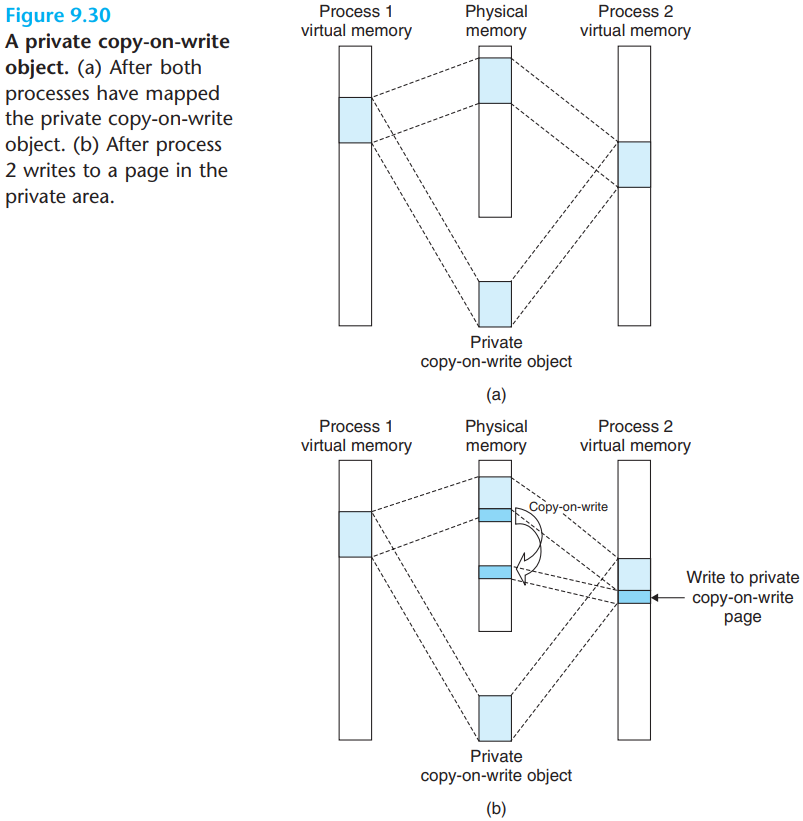

# 9 Virtual Memory

[TOC]

With one clean mechanism, virtual memory provides three important capabilities: 

1. It uses main memory efficiently by treating it as a cache for an address space stored on disk, keeping only the active areas in main memory and transferring data back and forth between disk and memory as needed.
2. It simplifies memory management by providing each process with a uniform address space.
3. It protects the address space of each process fro corruption by other processes.

The main memory of a computer system is organized as an array of $M$ contiguous byte-size cells. Each byte has a unique `physical address`(PA). The first byte has an address of 0, the next byte an address of 1, the next byte an address of 2, and so on. Given this simple organization, the most natural way for a CPU to access memory would be to use physical addresses. We call this approach `physical addressing`.

Modern processors use a form of addressing known as `virtual addressing`. With virtual addressing, the CPU accesses main memory by generating a `virtual address`(VA), which is converted to the appropriate physical address before being sent to main memory. The task of converting a virtual address to a physical one is known as `address translation`. Like exception handling, address translation requires close cooperation between the CPU harware and the operating system. Dedicated hardware on the CPU chip called the `memory management unit`(MMU) translates virtual addresses on the fly, using a lookup table stored in main memory whose contents are managed by the operating system.

An `address space` is an ordered set of nonnegative integer addresses:
$$
\{0, 1, 2, ...\}
$$
If the integers in the address space are consecutive, then we say that it is a `linear address space`.

In a system with virtual memory, the CPU generates virtual address from an address space of $N = 2^n$ addresses called the `virtual address space`:
$$
\{0, 1, 2, ..., N - 1\}
$$
The size of an address space is characterized by the number of bits that are needed to represent the largest address.

A system also has a `physical address space` that corresponds to the $M$ bytes of physical memory in the system:
$$
\{0, 1, 2, ..., M - 1\}
$$
At any point in time, the set of virtual pages is partitioned into three disjoint subsets:

- `Unallocated`. Pages that have not yet been allocated (or created) by the VM system. Unallocated blocks do not have any data associated with them, and thus do not occupy any space on disk.
- `Cached`. Allocated pages that are currently cached in physical memory.
- `Uncached`. Allocated pages that are not cached in physical memory.

We will use the term `SRAM cache` to denote the L1, L2, and L3 cache memories between the CPU and main memory, and the term `DRAM cache` to denote the VM system's cache that caches virtual pages in main memory.

A page table is an array of `page table entries`(PTEs). Each page in the virtual address space has a PTE at a fixed offset in the page table. For our purposes, we will assume that each PTE consists of a `valid` bit and an $n$-bit address field. The valid bit indicates whether the virtual page is currently cached in DRAM. If the valid bit is set, the address field indicates the start of the corresponding physical page in DRAM where the virtual page is cached. If the valid bit is not set, then a null address indicates that the virtual page has not yet been allocated. Otherwise, the address points to the start of the virtual page on disk.

In virtual memory parlance, a DRAM cache miss is known as a page fault.

Any modern computer system must provide the means for the operating system to control access to the memory system. A user process should not be allowed to modify its read-only code section. Nor should it be allowed to read or modify any of the code and data structures in the kernel. It should not be allowed to read or write the private memory of other processes, and it should not be allowed to modify any virtual pages that are shared with other processes, unless all parties explicitly allow it (via calls to explicit interprocess communication system calls).

Formally, address translation is a mapping between the elements of an $N$-element virtual address space (VAS) and an $M$-element physical address space (PAS),
$$
MAP: VAS \rightarrow PAS \cup \phi
$$
where
$$
MAP(A) = 
\begin{cases}
\cfrac A', &if\ data\ at\ virtual\ addr. A\ are\ present\ at\ physical\ addr. A'\ in\ PAS\\
\phi, &if\ data\ at\ virtual\ addr. A\ are\ not present\ in\ physical\ memory
\end{cases}
$$

How the MMU uses the page table to perform this mapping. A control register in the CPU, the `page table base register`(PTBR) points to the current page table. The $n$-bit virtual address has two components: a $p$-bit `virtual page offset`(VPO) and an $(n - p)$-bit `virtual page number`(VPN). The MMU uses the VPN to select the appropriate PTE.

Figure 9.13(a) shows the steps that the CPU hardware performs when there is a page hit:

- Step 1. The processor generates a virtual address and sends it to the MMU.
- Step 2. The MMU generates the PTE address and requests it from the cache/main memory.
- Step 3. The cache/main memory returns the PTE to the MMU.
- Step 4. The MMU constructs the physical address and sends it to the cache/main memory.
- Step 5. The cache/main memory returns the requested data word to the processor.

Figure 9.13(b) shows the steps that handling a page fault requires cooperation between hardware and the operating system kernel:

- Steps 1 to 3. The same sa steps 1 to 3 in Figure 9.13(a).
- Step 4. The valid bit in the PTE is zero, so the MMU triggers an exception, which transfers control in the CPU to a page fault exception handler in the operation system kernel.
- Step 5. The fault handler identifies a victim page in physical memory, and if that page has been modified, pages it out to disk.
- Step 6. The fault handler pages in the new page and updates the PTE in memory.
- Step 7. The fault handler returns to the original process, causing the faulting instruction to be restarted. The CPU resends the offending virtual address to the MMU.

Integrating Caches and VM:

A TLB is asmall, virtually addressed cache where each line holds a block consisting of a single PTE, A TLB usually has a high degree of associativity.

Summarizes address translation with a $k$-level page table hierarchy. The virtual address is partitioned into $k$ VPNs and a VPO. Each VPN $i, 1 \leq i \leq k$, is an index into a page table at level $i$. Each PTE in a level $j$ table, $1 \leq j \leq k - 1$, points to the base of some page table at level $j + 1$. Each PTE in a level $k$ table contains either the PPN of some physical page or the address of a disk block. To construct the physical address, the MMU must access $k$ PTEs before it can determine the PPN. As with a single-level hierarchy, the PPO is identical to the VPO.

Linux maintains a separate virtual address space for each process.

The kernel maintains a distinct task structure (task_struct in the source code) for each process in the system. The elements of the task structure either contain or point to all of the information that the kernel needs to run the process.

Suppose the MMU triggers a page fault while trying to translate some virtual address A. The exception results in a transfer of control to the kernel's page fault handler, which then performs the following steps:

Linux initializes the contents of a virtual memory arera by associating it with an `object` on disk, a process known as `memory mapping`. Areas can be mapped to one of the types of objects:

1. Regular file in the Linux file system.
2. Anonymous file.

An object can be mapped into an area of virtual memory as either a `shared object` or a `private object`. If a process maps a shared obejct into an area of its virtual address space, then any writes that the process makes to that area are visible to any other processes that have also mapped the shared object into their virtual memory. Further, the changes are also reflected in the original object on disk.

Changes made to an area mapped to a private object, on the other hand, are not visible to other processes, and any writes that the process makes to the area are not reflected back to the object on disk. A virtual memory area into which a shared object is mapped is often called a `shared area`. Similarly for a `private area`.

Private objects are mapped into virtual memory using a clever technique known as copy-on-write. A private object begins life in exactly the same way as a shared object, with only one copy of the private object stored in physical memory.

Allocators come in two basic styles. Both styles require the application to explicitly allocate blocks. They differ about which entity is responsible for freeing allocated blocks:

- `Explicit allocators` require the application to explicitly free any allocated blocks. 

  Explicit allocators must operate within some rather stringent constraints:

  - Handling arbitrary request sequences.
  - Making immediate responses to requests.
  - Using only the heap.
  - Aligning blocks (alignment requirement).
  - Not modifying allocated blocks.

  Working within these constraints, the author of an allocator attempts to meet the often conflicting performance goals of maximizing throughput and memory utilization:

  - Goal 1: Maximizing throughput. Given some sequence of n allocate and free requests:
    $$
    R_0, R_1, ..., R_k, ..., R_{n-1}
    $$
    we would like to maximize an allocator’s throughput, which is defined as the number of requests that it completes per unit time. 

  - Goal 2: Maximizing memory utilization.

- `Implicit allocators`, on the other hand, require the allocator to detect when an allocated block is no longer being used by the program and then free the block.

There are a number of ways to characterize how efficiently an allocator uses the heap. In our experience, the most useful metric is `peak utilization`. As before, we are given some sequence of $n$ allocate and free requests
$$
R_0, R_1, ..., R_k, ..., R_{n-1}
$$
If an application requests a block of $p$ bytes, then teh resulting allocated block has a payload of $p$ bytes. After request $R_k$ has completed, let the `aggregate payload`, denoted $P_k$, be the sum of the payloads of the currently allocated blocks, and let $H_k$ denote teh current (monotonically nondecreasing) size of the heap.

Then the peak utilization over the first $k + 1$ requests, denoted by $U_k$, is given by 
$$
U_k = \frac{max_{i \leq k}P_i}{H_k}
$$
The objective of the allocator, then, is to maximize the peak utilization $U_{n - 1}$ over the entire sequence.

The primary cause of poor heap utilization is a phenomenon known as `fragmentation`, which occurs when otherwise unused memory is not available to satisfy allocate requests. There are two forms of fragmentation: `internal fragmentation` and `external fragmentation`.

