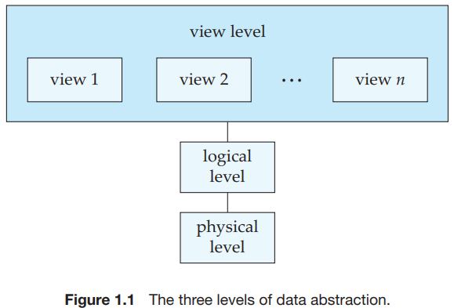
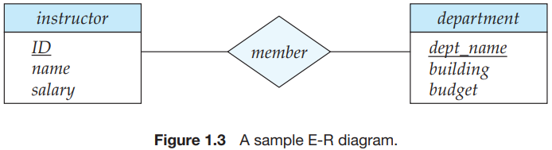
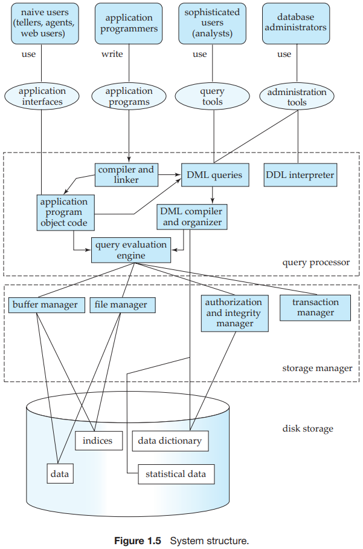
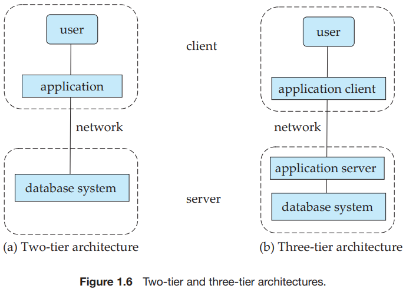

# Chapter1 Introduction

[TOC]

For the system to be usable, it must retrieve data efficiently. The need for efficiency has led designers to use complex data structures to represent data in the database. Since many database-system users are not computer trained, developers hide the complexity from users through several levels of abstraction, to simplify users' interactions with the system:

- `Physical level`. The lowest level of abstraction describes `how` the data are actually stored. The physical level describes complex low-level data structures in detail.
- `Logical level`. The next-higher level of abstraction describes `what` data are stored in the database, and what relationships exist among those data. The logical level thus describes the entire database in terms of small number of relatively simple structures. Although implementation of the simple structures at the logical level may involve complex physical-level structures, the user of the logical level does not need to be aware of this complexity. This is referred to as physical data independence. Database administrators, who must decide what information to keep in the database, use the logical level of abstraction.
- `View level`. The highest level of abstraction describes only part of the entire database. Even though the logical level uses simpler structures, complexity remains because of the variety of information stored in  a large database. Many users of the database system do not need all this information; instead, they need to access only a part of the database. The view level of abstraction exists to simplify their interaction with the system. The system may provide many views for the same database.

Database change over time as information is inserted and deleted. The collection of information stored in the database at a particular moment is called an `instance` of the database. The overall design of the database is called the database `schema`.

Database systems have several schemas, partitioned according to the levels of abstraction. The `physical schema` describes the database design at the physical level, while the `logical schema` describes the database design at the logical level. A database may also have several schemas at the view level, sometimes called `subschemas`, that describe different views of the database.

Application programs are said to exhibit `physical data independence` if they do not depend on the physical schema, and thus need not be rewritten if the physical schema changes.

Underlying the structure of a database is the `data model`: a collection of conceptual tools for describing data, data relationships, data semantics, and consistency constraints. A data model provides a way to describe the design of a database at the physical, logical, and view levels. 

The data models can be classified into four different categories:

- Relational Model.
- Entity-Relationship Model.
- Object-Based Data Model.
- Semistructured Data Model.

A database system provides a `data-definition language` to specify the database schema and a `data-manipulation language` to express database queries and updates.

A `data-manipulation language (DML)` is a language that enables users to access or manipulate data as organized by the appropriate data model. The types of access are:

- Retrieval of information stored in the database.
- Insertion of new information into the database.
- Deletion of information from the database.
- Modification of information stored in the database.

There are basically two types:

- `Procedural DMLs` require a user to specify `what` data are needed and `how` to get those data.
- `Declarative DMLs` (also referred to as nonprocedural DMLs) require a user to specify how to get those data.

A Special language called a `data-definition language(DDL)`, We specify the storage structure and access methods used by the database system by a set of statements in a special type of DDL called a `data storage and definition` language. These statements define the implementation details of the database schemas, which are usually hidden from the users.

The data values stored in the database must satisfy certain `consistency constraints`. Thus, database systems implement integrity constraints that can be tested with minimal overhead:

- `Domain Constraints`.
- `Referential Integrity`.
- `Assertions`.
- `Authorization`.

To access the database, DML statements need to be executed from the host language. There are two ways to do this:

- By providing an application program interface (set of procedures) that can be used to send DML and DDL statements to the database and retrieve the results.
- By extending the host language syntax to embed DML calls within the host language program. 

A `relationship` is an association among several entities. The set of all entities of the same type and the set of all relationships of the same type are termed an `entity set` and `relationship set`, respectively.

The overall logical structure (schema) of a database can be expressed graphically by an `entity-relationship (E-R) diagram`. The are several ways in which to draw these diagrams. One of the most popular is to use the `Unified Modeling Language (UML)`. In the notation we use, which is based on UML, and E-R diagram is represented as follows:

- Entity sets are represented by a rectangular box with the entity set name in the header and the attributes listed below it.
- Relationship sets are represented by a diamond connecting a pair of related entity sets. The name of the relationship is placed inside the diamond.

The `storage manager` is the component of a database system that provides the interface between the low-level data stored in the database and the application programs and queries submitted to the system. The storage manager is responsible for the interaction with the file manager. The raw data stored on the disk using the file system provided by the operating system. The storage manager translates the various DML statements into low-level fiel-system commands. Thus, the storage manager is responsible for storing, retrieving, and updating data in the database.

The storage manager components include:

- `Authorization and integrity manager`, which tests for the satisfaction of integrity constraints and checks the authority of users to access data.
- `Transaction manager`, which ensures that the database remains in a consistent (correct) state despite system failures, and that concurrent transaction executions proceed without conflicting.
- `File manager`, which manages the allocation of space on disk storage and the data structures used to represent information stored on disk.
- `Buffer manager`, which is responsible for fetching data from disk storage into main memory, and deciding what data to cache in main memory. The buffer manager is a critical part of the database system, since it enables the database to handle data sizes that are much larger than the size of main memory.

The storage manager implements several data structures as part of the physical system implementation:

- Data files, which store the database itself.
- Data dictionary, which stores metadata about the structure of the database, in particular the schema of the database.
- Indices, which can provide fast access to data items.

The query processor components include:

- `DDL interpreter`, which interprets DDL statements and records the definitions in the data dictionary.
- `DML compiler`, which translates DML statements in a query language into an evaluation plan consisting of low-level instructions that the query evaluation engine understands.
- `Query evaluation engine`, which executes low-level instructions generated by the DML compiler.

A `transaction` is a collection of operations that performs a single logical function in a database application. Each transaction is a unit of both atomicity and consistency.

Ensuring the atomicity and durability properties is the responsibility of the database system itself--specifically, of the `recovery manager`.

`failure recovery`. that is, detect system failures and restore the database to the state that existed prior to the occurrence of the failure.

The `concurrency-control manager` control the interaction among the concurrent transactions, to ensure the consistency of the database.

The `transaction manager` consists of the concurrency-control manager and the recovery manager.

In a `three-tier architecture`, the client machine acts as merely a front end and does not contain any direct database calls. Instead, the client end communicates with an `application server`, usually through a forms interface. The application server in turn communicates with a database system to access data. The `business logic` of the application, which says what actions to carry out under what conditions, is embedded in the application server, instead of being distributed sacross multiple clients. 

The term `data mining` refers loosely to the process of semiautomatically analyzing large databases to find useful patterns. 

There are four different types of database-system users, differentiated by the way they expect to interact with the system. Different types of user interfaces have been designed for the different types of users:

- `Naive users` are unsophisticated users who interact with the system by invoking one of the application programs that have been written previously.
- `Application programmers` are computer professionals who write application programs.
- `Sophisticated users` interact with the system without writing programs. Instead, they form their requests either using a database query language or by using tools such as data analysis software.
- `Specialized users` are sophisticated users who write specialized database applications that do not fit into the traditional data-processing framework.

A person who has such central control over the system is called a `database administrator (DBA)`. The functions of a DBA include:

- Schema definition.
- Storage structure and access-method definition.
- Schema and physical-organization modification.
- Granting of authorization for data access.
- Routine maintenance.

## Summary

- A `database-management system` (DBMS) consists of a collection of interrelated data and a collection of programs to access that data. The data describe one particular enterprise.
- The primary goal of a DBMS is to provide an environment that is both convenient and efficient for people to use in retrieving and storing information.
- Database systems are ubiquitous today, and most people interact, either directly or indirectly, with databases many times every day.
- Database systems are designed to store large bodies of information. The management of data involves both the difinition of structures for the storage of information and the provision of mechanisms for the manipulation of information. In addition, the database system must provide for the safety of the information stored, in the face of system crashes or attempts at unauthorized access. If data are to be shared among several users, the system must avoid possible anomalous results.
- A major purpose of a database system is to provide users with an abstract view of the data. This is, the system hides certain details of how the data are stored and maintained.
- Underlying the structure of a database is the `data model`: a collection of conceptual tools for describing data, data relationships, data semantics, and data constraints.
- The relational data model is the most widely deployed model for storing data in databases. Other data models are the object-oriented model, the object relational model, and semistructured data models.
- A `data-minipulation language (DML)` is a language that enable users to access or manipulate data. Nonprocedural DMLs, which require a user to specify only what data are needed, without specifying exactly how to get those data, are widely used today.
- A `data-definition language (DDL)` is a language for specifying the database schema and as well as other properties of the data.
- Database design mainly involves teh design of the database schema. The entity-relationship (E-R) data model is a widely used data model for database design. It provides a convenient graphical representation to view data, relationships, and constraints.
- A database system has several subsystems:
  - The `storage manager` subsystem provides the interface between the low level data stored in the database and the application programs and queries submitted to the system.
  - The `query processor` subsystem compiles and executes DDL and DML statements.
- `Transaction management` ensures that the database remains in a consistent(correct) state despite system failures. The transaction manager ensures that concurrent transaction executions proceed without conflicting.
- The architecture of a database system is greatly influenced by the underlying computer system on which the database system runs. Database systems can be centralized, or client-server, where one server machine executes work on behalf of multiple client machines. Database systems can also be designed to exploit parallel computer architectures. Distributed databases span multiple geographically separated machines.
- Database applications are typically broken up into a front-end part that runs at client machines and a part that runs at the back end. In two-tier architectures, the front end directly communicates with a database running at the back end. In three-tier architectures, the back end part is itself broken up into an application server and a database server.
- Knowledge-discovery techniques attemp to discover automatically statistical rules and patterns from data. The field of `data miniing` combines knowledgediscovery techniques that enable them to be used on extermely large databases.
- There are four different types of database-system users, differentiated by the way they expect to interact with the system. Different types of user interfaces have been designed for the different types of users.

## Glossary

interrelate `/ˌɪntərɪ'leɪt/` 互相关连，相关

despite `/dɪˈspaɪt/` 尽管，即使，憎恨，轻视

anomalous `/ə'nɒmələs/` 反常的，不规则的

receipt `/rɪ'siːt/` 收据，收条，收到

payroll `/'peɪrəʊl/` 工资单，工薪总额

paycheck `/'peɪtʃek/` 薪水支票，工资

inventory `/ˈɪnvəntri/` 库存，财产清单

tier `/tɪə(r)/` 排，行，层，等级，层层排列

