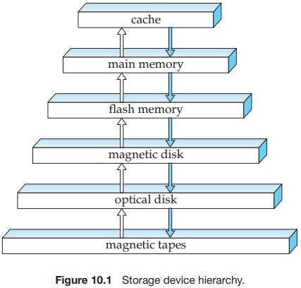
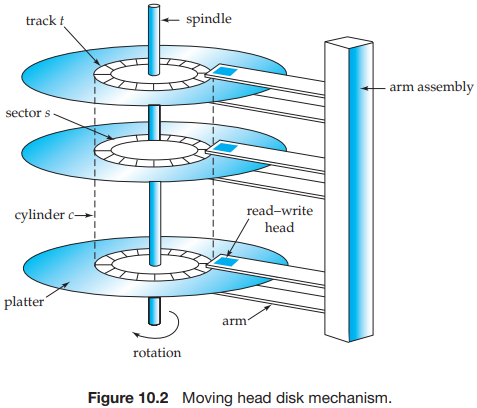
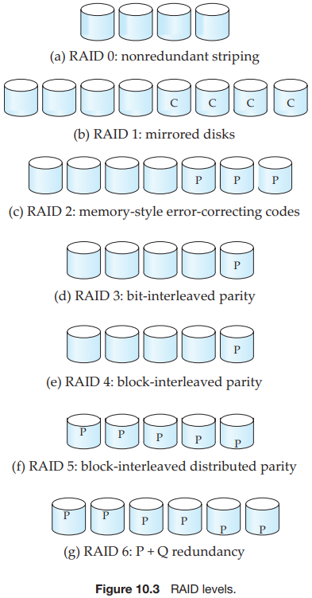
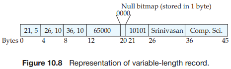
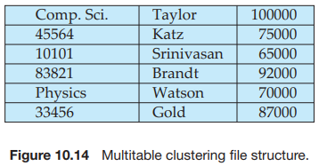

# CHAPTER10 Storage and File Structure

Several types of data storage exist in most computer systems. These storage media are classified by the speed with which data can be accessed, by the cost per unit of data to buy the medium, and by the medium's reliability. Among the media typically available are these:

- Cache.
- Main memory.
- Flash memory.
- Magnetic-disk storage.
- Optical storage.
- Tape storage.

Physical characteristics of disks:

The main measures of the qualities of a disk are capacity, access time, data-transfer rate, and reliability:

- `Access time` is the time from when a read or write request is issued to when data transfer begins. 
- The `average seek time` is the average of the seek times, measured over a sequence of (uniformly distributed) random requests.
- Once the head has reached the desired track, the time spent waiting for the sector to be accessed to appear under the head is called the `rotational latency time`.
- The `data transfer rate` is the rate at which data can be retrieved from or stored to the disk.
- The final commonly used measure of a disk is the `mean time to failure (MTTF)`, which is a measure of the reliability of the disk. The mean time to failure of a disk (or of any other system) is the amount of time that, on average, we can expect the system to run continuously without any failure.

A number of techniques have been developed for improving the speed of access to blocks:

- `Buffering`. 
- `Read-ahead`.
- `Scheduling`.
- `File organization`.
- `Nonvolatile write buffers`.
- `Log disk`.

There are two types of flash memory, NOR flash and NAND flash. NOR flash allows random access to individual words of memory, and has read time comparable to main memory.

A variety of disk-organization techniques, collectively called `redundant arrays of independent disks (RAID)`, have been proposed to achieve improved performance and reliability.

The solution to the problem of reliability is to introduce `redundancy`; that is, we store extra information that is not needed normally, but that can be used in the event of failure of a disk to rebuild the lost information. Thus, even if a disk fails, data are not lost, so the effective mean time to failure is increased, provided that we count only failures that lead to loss of data or to nonavailability of data.

The simplest (but most expensive) approach to introducing redundancy is to duplicate every disk. This technique is called `mirroring` (or, sometimes, `shadowing`). A logical disk then consists of two physical disks, and every write is carried out on both disks. If one of the disks fails, the data can be read from the other. Data will be lost only if the second disk fails before the first failed disk is repaired.

The mean time to failure (where failure is the loss of data) of a mirrored disk depends on the mean time to failure of the individual disks, as well as on the `mean time to repair`, which is the time it takes (on an average) to replace a failed disk and to restore the data on it.

With multiple disks, we can improve the transfer rate as well (or instead) by `striping data` across multiple disks. In its simplest form, data striping consists of splitting the bits of each byte across multiple disks; such striping is called `bit level striping`.

`Block-level striping` stripes blocks across multiple disks. It treats the array of disks as a single large disk, and it gives blocks logical numbers; we assume the block numbers start from $0$. With an array of $n$ disks, block-level striping assigns logical block $i$ of the disk array to disk $(i\ mod\ n) + 1$; it uses the $\lfloor i/n \rfloor$The physical block of the disk to store the logical block $i$.

In summary, there are two main goals of parallelism in a disk system:

1. Load-balance multiple small accesses (block accesses), so that the throughput of such accesses increases.
2. Parallelize large accesses so that the response time of large accesses is reduced.

Mirroring provides high reliability, but it is expensive. Striping provides high data-transfer rates, but does not improve reliability. Various alternative schemes aim to provide redundancy at lower cost by combining disk striping with "parity" bits. These schemes have different cost-performance trade-offs. The schemes are classified into `RAID levels`, as follow:

- `RAID level 0` refers to disk arrays with striping at the level of blocks, but without any redundancy (such as mirroring or parity bits).
- `RAID level 1` refers to disk mirroring with block striping.
- `RAID level 2`, known as memory-style error-correcting-code (ECC) organization, employs parity bits. 
- `RAID level 3`, bit-interleaved parity organization.
- `RAID level 4`, block-interleaved parity organization.
- `RAID level 5`, block-interleaved distributed parity.
- `RAID level 6`, the $P + Q$ redundancy scheme, is much like RAID level 5, but stores extra redundant information to guard against multiple disk failures.

The factors to be taken into account in choosing a RAID level are:

- Monetary cost of extra disk-storage requirements.
- Performance requirements in terms of number of I/O operations.
- Performance when a disk has failed.
- Performance during rebuild (this is, while the data in a failed disk are being rebuilt on a new disk).

RAID can be implemented with no change at the hardware level, using only software modification. Such RAID implementations are called `software RAID`. However, there are significant benefits to be had by building special-purpose hardware to support RAID, which we outline below; systems with special hardware support are called `hardware RAID` systems.

To minimize the chance of such data loss, good RAID controllers perform `scrubbing`; that is, during periods when disks are idle, every sector of every disk is read, and if any sector is found to be unreadable, the data are recovered from the remaining disks in the RAID organization, and the sector is written back. (If the physical sector is demaged, the disk controller would remap the logical sector address to a different physical sector on disk.)

Some hardware RAID implementations permit `hot swapping`; this is, faulty disks can be removed and replaced by new ones without turning power off. Hot swapping reduces the mean time to repair, since replacement of a disk does not have to wait until a time when the system can be shut down.

A database is mapped into a number of different files that are maintained by the underlying operating system. These files reside permanently on disks. A `file` is organized logically as a sequence of records. These records are mapped onto disk blocks. Files are provided as basic construct in operating systems, so we shall assume the existence of an underlying `file system`. We need to consider ways of representing logical data models in terms of files.

Each file is also logically partitioned into fixed-length storage units called `blocks`, which are the units of both storage allocation and data transfer. Most databases use block sizes of 4 to 8 kilobytes by default, but many databases allow the block size to be specified when a database instance is created. Larger block sizes can be useful in some database applications.

In a relational database, tuples of distinct relations are generally of different sizes. One approach to mapping the database to files is to use several files, and to store records of only one fixed length in any given file. An alternative is to structure our files so that we can accommodate multiple lengths for records; however, files of fixed-length records are easier to implement than are files of variable-length records. Many of the techniques used for the former can be applied to the variable-length case. Thus, we begin by considering a file of fixed-length records, and consider storage of variable-length records later.

Variable-length records arise in database systems in several ways:

- Storage of multiple record types in a file.
- Record types that allow variable lengths for one or more fields.
- Record types that allow repeating fields, such as arrays or multisets.

Different techniques for implementing variable-length records exist. Two different problems must be solved by any such technique:

- How to represent a single record in such a way that individual attributes can be extracted easily.
- How to store variable-length records within a block, such that records in a block can be extracted easily.

We next address the problem of storing variable-length records in a block. The `slotted-page structure` is commonly used for organizing records within a block, and is shown in Figure 10.9. There is a header at the beginning of each block, containing the following information:

1. The number of record entries in the header.
2. The end of free space in the block.
3. An array whose entries contain the location and size of each record.

Several of the possible ways of organizing records in files are:

- Heap file organization. Any record can be placed anywhere in the file where there is space for the record. There is no ordering of records. Typically, there is a single file for each relation.
- Sequential file organization. Records are stored in sequential order, according to the value of a "search key" of each record.
- Hashing file organization. A hash function is computed on some attribute of each record. The result of the hash function specifies in which block of the file the record should be placed.

A `sequential file` is designed for efficient processing of records in sorted order based on some search key. A `search key` is any attribute or set of attributes; it need not be the primary key, or even a superkey. To permit fast retrieval of records in search-key order, we chain together records by pointers. The pointer in each record points to the next record in search-key order. Furthermore, to minimize the number of block accesses in sequential file processing, we store records physically in search-key order, or as close to search-key order as possible.

A `multitable clustering file organization` is a file organization, such as that illustrated in Figure 10.14, that stores related records of two or more relations in each block.

Relational schemas and other metadata about relations are stored in a structure called the `data dictionary or `system catalog`. Among the types of information that the system must store are these:

- Names of the relations.
- Names of the attributes of each relation.
- Domains and length of attributes.
- Names of views defined on the database, and definitions of those views.
- Integrity constraints (for example, key constraints).

In addition, many systems keep the following data on users of  the system:

- Names of authorized users.
- Authorization and accounting information about users.
- Passwords or other information used to authenticate users.

Further, the database may store statistical and descriptive data about the relations, such as:

- Number of tuples in each relation.
- Method of storage for each relation (for example, clustered or nonclustered).

The data dictionary may also note the storage organization (sequential, hash, or heap) of relations, and the location where each relation is stored:

- If relations are stored in operating system files, the dictionary would note the names of the file (or files) containing each relation.
- If the database stores all relations in a single file, the dictionary may note the blocks containing records of each relation in a data structure such as a linked list.

In which we study indices, we shall see a need to store information about each index on each of the relations:

- Name of the index.
- Name of the relation being indexed.
- Attributes on which the index is defined.
- Type of index formed.

Further, to serve the database system well, the buffer manager must use techniques more sophisticated than typical virtual-memory management schemes:

- `Buffer replacement strategy`.
- `Pinned blocks`.
- `Forced output of blocks`.

## Summary

- Several types of data storage exist in most computer systems. They are classified by the speed with which they can access data, by their cost per unit of data to buy the memory, and by their reliability. Among the media available are cache, main memory, flash memory, magnetic disks, optical disks, and magnetic tapes.
- Two factors determine the reliability of storage media: whether a power failure or system crash causes data to be lost, and what the likelihood is of physical failure of the storage device.
- We can reduce the likelihood of physical failure by retaining multiple copies of data. For disks, we can use mirroring. Or we can use more sophisticated methods based on redundant arrays of independent disks (RAID). By striping data across disks, these methods offer high throughput rates on large accesses; by introducing redundancy across disks, they improve reliability greatly. Several different RAID organizations are possible, each with different cost, performance, and reliability characteristics. RAID level 1 (mirroring) and RAID level 5 are the most commonly used.
- We can organize a file logically as a sequence of records mapped onto disk blocks. One approach to mapping the database to files is to use several files and to store records of only one fixed length in any given file. An alternative is to structure files so that they can accommodate multiple lengths for records. The slotted-page method is widely used to handle varying-length records within a disk block.
- Since data is transferred between disk storage and main memory in units of a block, it is worthwhile to assign file records to blocks in such a way that a single block contains related records. If we can access several of the records we want with only one block access, we save disk accesses. Since disk accesses are usually the bottleneck in the performance of a database system, careful assignment of records to blocks can pay significant performance dividends.
- The data dictionary, also referred to as the system catalog, keeps track of metadata, that is, data about data, such as relation names, attribute names and types, storage information, integrity constraints, and user information.
- One way to reduce the number of disk accesses is to keep as many blocks as possible in main memory. Since it is not possible to keep all blocks in main memory, we need to manage the allocation of the space available in main memory for the storage of blocks. The `buffer` is that part of main memory available for the storage of copies of disk blocks. The subsystem responsible for the allocation of buffer space is called the `buffer manager`.

## Glossary

probe `/prəʊb/` 盘问，追问，探查

universal `/ˌjuːnɪˈvɜːsl/` 普遍的，全体的，通用的，通用原理

floppy `/'flɒpi/` （计算机）软盘（disk），松软的，懒散的

obsolete `/ˈɒbsəliːt/` 过期的，过时的，淘汰，废弃

moderate `/ˈmɒdərət /` 温和的，适度的，合理的，中立的，理中客

optical `/'ɒptɪkl/` 光学的，视觉的

playtime `/'pleɪtaɪm/` 播放时长，课间休息时间，娱乐时间，上演时间

versatile `/ˈvɜːsətaɪl/` 多才多艺的，多功能的，多用途的

compact `/ˈkɑːmpækt/` 小巧的，紧凑的，紧密的，合约，协定，压实，小型汽车

jukebox `/'dʒuːkbɒks/` 自动电唱机

archival `/ɑː'kaɪvəl/` 关于档案的，存档的

satellite `/'sætəlaɪt/` 卫星，人造卫星

relegate `/'relɪɡeɪt/` 使降级，流放，移交，委任

museum `/mju'ziːəm/` 博物馆，展览馆

bulk `/bʌlk/` 大部分，庞大，巨大

competitor `/kəm'petɪtə(r)/` 竞争者，对手

rigid `/'rɪdʒɪd/` 坚硬的，死板的，僵硬的

sector `/'sektə(r)/` （计算机）扇区，部门，部分，区域

track `/træk/` （机械磁盘）磁道，轨道，跑道，踪迹，小路，追踪，跟踪

density `/ˈdensəti/` 密度，浓度，稠密，密集

micron `/'maɪkrɒn/` 微米，百万分之一米

breeze `/briːz/` 微风，清风，和风

flat `/flæt/` 平坦的，扁平的，低调的，单调的，平直的，公寓，变平，降调

crash `/kræʃ/` （计算机）闪崩，崩溃，撞击，坠毁，破产，暴跌

scrape `/skreɪp/` 刮掉，擦掉，擦伤

airborne `/'eəbɔːn/` 升空，空运的，空中传播的

oxide `/'ɒksaɪd/` 氧化物

coat `/kəʊt/` 涂层，涂上，覆盖，包上，表皮，外套

corrupt `/kəˈrʌpt/` 贪污，腐败，不道德的，破坏，损坏

scatter `/ˈskætə(r)/` 散开，驱散，分散，散播

reposition `/ˌriːpə'zɪʃən/` （计算机）重定位，调换位置，储藏，保存

disregard `/ˌdɪsrɪ'ɡɑːd/` 漠视，不理会，不顾，忽视

contiguous `/kən'tɪɡjuəs/` 邻近的，连续的，接触的

adjacent `/əˈdʒeɪs(ə)nt/` 附近的，相邻的

ahead `/əˈhɛd/` 先前，向前，今后，领先，在...前，先进

consecutive `/kənˈsekjətɪv/` 连续的，连续不断的

rotational `/rəʊ'teɪʃənl/` 回转的，轮流的

cylinder `/'sɪlɪndə(r)/` （磁盘）柱面，圆筒，汽缸，圆柱体

intimate `/'ɪntɪmət/` 亲密的，私人的，暗示，透露

fragment `/'fræɡmənt/` 碎片，片段，使破碎，分裂

intensive `/ɪnˈtensɪv/`  密集的，加强器

drastic `/ˈdræstɪk/` 极端的，激烈的，重大的

devote `/dɪˈvəʊt/` 致力于，奉献，投入时间，专注于

monetary `/ˈmʌnɪtri/` 货币的，金融的，金钱的

corrupt `/kəˈrʌpt/` 贪污，腐败，不道德的，破坏，损坏

consistency `/kənˈsɪstənsi/` 一致性，连贯性，平滑度，坚实度，粘稠度

hybrid `/ˈhʌɪbrɪd/` 杂交，混合

propose `/prəˈpəʊz/` 提议，求婚，打算

justification `/ˌdʒʌstɪfɪ'keɪʃn/` 正当的理由，辩护

derivation `/ˌderɪ'veɪʃn/` （计算机）派生，推导，衍生

bibliographic `/ˌbɪbliə'ɡræfɪkl/` 书籍解题的,著书目录的

spite `/spaɪt/` 恶意，怨恨，刁难，冒犯

concern `/kənˈsəːn/` 关注，担心

spread `/spred/` 传播，散开，散布，范围，差额，幅度

pictorially `/pɪk'tɔːriəli/` 绘画般地

parity `/'pærəti/` 势均力敌，等值

moreover `/mɔːrˈəʊvə(r)/` 此外，而且

subsume `/səb'sjuːm/` 归入，纳入，包含，包括

reed `/riːd/` 簧片，芦苇

solomon `/ˈsɒləmən/` 智者，聪明人

monetary `/ˈmʌnɪtri/` 货币的，金融的，金钱的

diminish `/dɪ'mɪnɪʃ/` 减少，变少，减损，贬低

negating `/nɪ'ɡeɪt/` 否定，否认，使无效

intensive `/ɪnˈtensɪv/`  密集的，加强器

tremendously `/trə'mendəsli/` 惊人地，非常，十分

penalty `/'penəlti/` 处罚，惩罚，罚球

defect `/ˈdiːfɛkt/` 缺陷，瑕疵，叛变

corruption `/kəˈrʌpʃn/` 腐化堕落，贪污受贿，出错

latent `/'leɪtnt/` 潜伏的，潜在的

rot `/rɒt/` 腐烂，败坏，胡话

scrub `/skrʌb/` 擦洗，刷去，矮树，渺小之物

tertiary `/'tɜːʃəri/` 第三的，第三位的，第三世纪的，第三重音，第三会员，高等教育的

alternative `/ɔːlˈtɜːnətɪv/`  二者择一的，可替代的，非主流的，非传统的，另类的

accommodate `/əˈkɒmədeɪt/` 容纳，住宿，调解，向..提供，随和，乐于助人，顾及的

integrity `/ɪnˈteɡrəti/` 正直，诚实，完整，完好，完善

statistical `/stə'tɪstɪkl/` 统计的，统计学的

bottleneck `/'bɒtlnek/` 瓶颈，阻塞，妨碍，狭窄的

integrity `/ɪnˈteɡrəti/` 正直，诚实，完整，完好，完善

