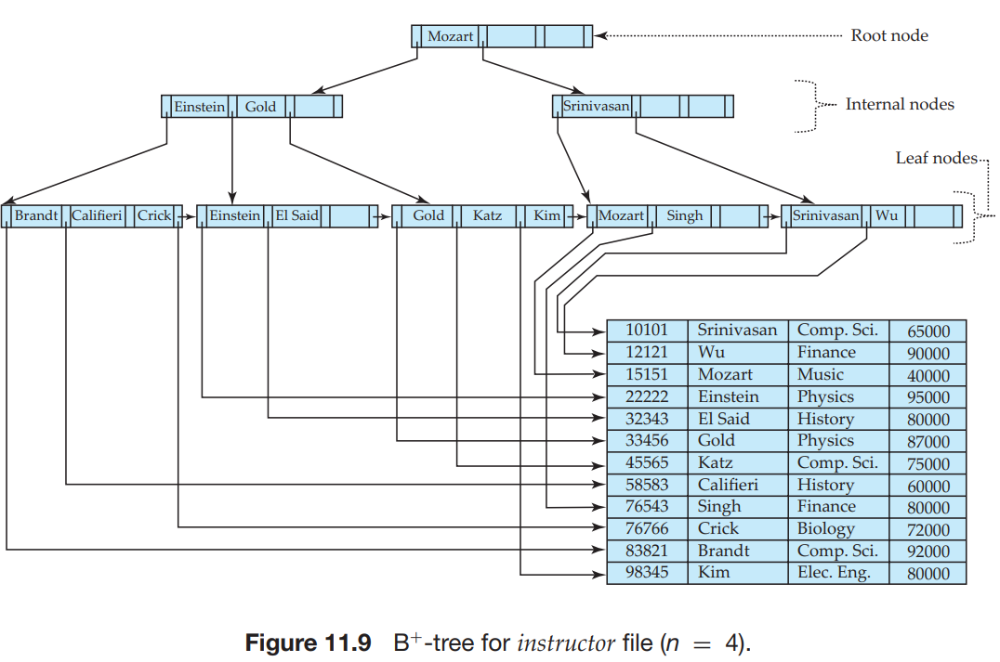
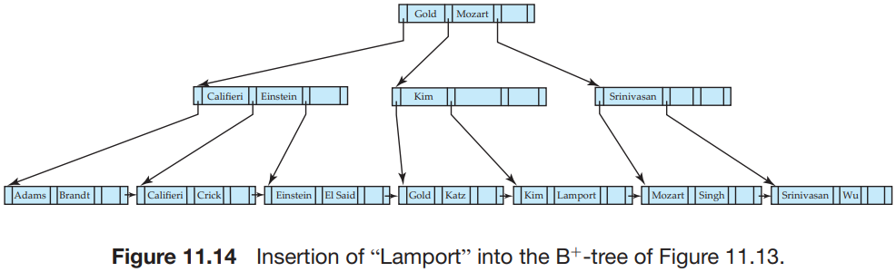
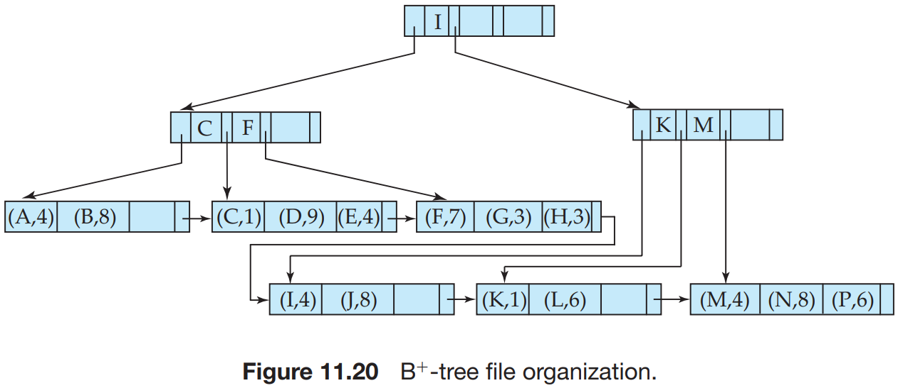

# Chapter 11 Indexing and Hashing

There are two basic kinds of indices:

- Ordered indices. Based on a sorted ordering of the values.
- Hash indices. Based on a uniform distribution of values across a range of buckets. The bucket to which a value is assigned is determined by a function, called a `hash function`.

Consider several techniques for both ordered indexing and hashing. No one technique is the best. Rather, each technique is best suited to particular database applications. Each technique must be evaluated on the basis of these factors:

- Access types: The types of access that are supported efficiently. Access types can include finding records with a specified attribute value and finding records whose attribute values fall in a specified range.
- Access time: The time it takes to find a particular data item, or set of items, using the technique in question.
- Insertion time: The time it takes to insert a new data item. This value includes the time it takes to find the correct place to insert the new data item, as well as the time it takes to update the index structure.
- Deletion time: The time it takes to delete a data item. This value includes the time it takes to find the item to be deleted, as well as the time it takes to update the index structure.
- Space overhead: The additional space occupied by an index structure. Provided that the amount of additional space is moderate, it is usually worthwhile to sacrifice the space to achieve improved performance.

A file may have serveral indices, on different search keys. If the file containing the records is sequentially ordered, a `clustering index` is an index whose search key also defines the sequential order of the file. Clustering indices are also called `primary indices`; the term primary index may appear to denote an index on a primary key, but such indices can in fact be built on any search key. The search key of a clustering index is often the primary key, although that is not necessarily so. Indices whose search key specifies an order different from the sequential order of the file are called `nonclustering indices`, or `secondary` indices. The terms "clustered" and "nonclustered" are often used in place of "clustering" and "nonclustering".

Such files, with a clustering index on the search key, are called `index-sequential files`.

An `index entry`, or `index record`, consists of a search-key value and pointers to one or more records with that value as their search-key value. The pointer to a record consists of the identifier of a disk block and an offset within the disk block to identify the record within the block.

There are two types of ordered indices that we can use:

- Dense index: In a dense index, an index entry appears for every search-key value in the file. In a dense clustering index, the index record contains the search-key value and a pointer to the first data record with that search-key value. The rest of the records with the same search-key value would be stored sequentially after the first record, since, because the index is a clustering one, records are sorted on the same search key.

  In a dense nonclustering index, the index must store a list of pointers to all records with the same search-key value.

- Sparse index: In a sparse index, an index entry appears for only some of the search-key values. Sparse indices can be used only if the relation is stored in sorted order of the search key, that is, if the index is a clustering index. As is true in dense indices, each index entry contains a search-key value and a pointer to the first data record with that search-key value. To locate a record, we find the index entry with the largest search-key value that is less than or equal to the search-key value for which we are looking. We start at the record pointed to by that index entry, and follow the pointers in the file until we find the desired record.

Regardless of what form of index is used, every index must be updated whenever a record is either inserted into or deleted from the file. Further, in case a record in the file is updated, any index whose search-key attribute is affected by the update must also be updated;

We first describe algorithms for updating single-level indices:

- Insertion. First, the system performs a lookup using the search-key value that appears in the record to be inserted. The actions the system takes next depend on whether the index is dense or sparse:

  - Dense indices:

    1. If the search-key value does not appear in the index, the system inserts an index entry with the search-key value in the index at the appropriate position.

    2. Otherwise, the following actions are taken:

       a. If the index entry stores pointers to all records with the same search key value, the system adds a pointer to the new record in the index entry.

       b. Otherwise, the index entry stores a pointer to only the first record with the search-key value. The system then places the record being inserted after the other records with the same search-key values.

  - Sparse indices: We assume that the index stores an entry for each block. If the system creates a new block, it inserts the first search-key value (in search-key order) appearing in the new block into the index. On the other hand, if the new record has the least search-key value in its block, the system updates the index entry poiting to the block; if not, the system makes no change to the index.

- Deletion. To delete a record, the system first looks up the record to be deleted. The actions the system takes next depend on whether the index is dense or sparse:

  - Dense indices:

    1. If the deleted record was the only record with its particular search-key value, then the system deletes the corresponding index entry from the index.

    2. Otherwise, the following actions are taken:

       a. If the index entry stores pointers to all records with the same search key value, the system deletes the pointer to the deleted record from the index entry.

       b. Otherwise, the index entry stores a pointer to only the first record with the search-key value. In this case, if the deleted record was the first record with the search-key value, the system updates the index entry to point to the next record.

  - Sparse indices:

    1. If the index does not contain an index entry with the search-key value of the deleted record, nothing needs to be done to the index.

    2. Otherwise, the system takes the following actions:

       a. If the deleted record was the only record with its search key, the system replaces the corresponding index record with an index record for the next search-key value (in search-key order). If the next search-key value already has an index entry, the entry is deleted instead of being replaced.

       b. Otherwise, if the index entry for the search-key value points to the record being deleted, the system updates the index entry to point to the next record with the same search-key value.

Secondary indices must be dense, with an index entry for every search-key value, and a pointer to every record in the file. A clustering index may be sparse, storing only some of the search-key values, since it is always possible to find records with intermediate search-key values by a sequential access to a part of the file, as described earlier. If a secondary index stores only some of the search-key values, records with intermediate search-key values may be anywhere in the file, and, in general, we cannot find them without searching the entire file.

Secondary indices improve the performance of queries that use keys other than the search key of the clustering index. However, they impose a significant overhead on the modification of the database. The designer of a database decides which secondary indices are desirable on the basis of an estimate of the relative frequency of queries and modifications.

A search key containing more than one attribute is referred to as a `composite search key`. The structure of the index is the same as that of any other index, the only difference being that the search key is not a single attribute, but rather is a list of attributes. The search key can be represented as a tuple of values, of the form $(a_1, \cdots, a_n)$, where the indexed attributes are $A_1, \cdots, A_n$. The ordering of search-key values is the `lexicographic ordering`.

The $B^{+}-tree$ Index structure is the most widely used of several index structures that maintain their efficiency despite the insertion and deletion of data. A $B^{+}-tree$ An index takes the form of a `balanced tree` in which every path from the root of the tree to a leaf of the tree is of the same length. Each non-leaf node in the tree has between $\lceil n/2 \rceil$ and $n$ children, where $n$ is fixed for a particular tree.

A $B^{+}-tree$ Index is a multilevel index, but it has a structure that differs from that of the multilevel index-sequential file. Figure 11.7 shows a typical node of a $B^{+}-tree$. It contains up to $n-1$ search-key values $K_1, K_2, \cdots, K_{n - 1}$, and $n$ pointers $P_1, P_2, \cdots, P_n$. The search-key values within a node are kept in sorted order; thus, if $i < j$, then $K_i < K_j$.

- We consider first the structure of the `leaf nodes`. For $i = 1, 2, ..., n - 1$, pointer $P_1$ points to a file record with a search-key value $K_i$.
- Each leaf can hold up to $n - 1$ values. We allow leaf nodes to contain as few as $\lceil (n - 1)/2 \rceil$ values. 
- The ranges of values in each leaf do not overlap, except if there are duplicate search-key values, in which case a value may be present in more than one leaf. Specifically, if $L_i$ and $L_j$ are leaf nodes and $i < j$, then every search-key value in $L_i$ is less than or equal to every search-key value in $L_j$. If the $B^{+}-tree$ Index is used as a dense index (as is usually the case), every search-key value must appear in some leaf node.
- Since there is a linear order on the leaves based on the search-key values that they contain, we use $P_n$ to chain together the leaf nodes in search-key order. This ordering allows for efficient sequential processing of the file.
- The `non-leaf nodes` of the $B^{+}-tree$ form a multilevel (sparse) index on the leaf nodes. The structure of nonleaf nodes is the same as that for leaf nodes, except that all pointers are pointers to tree nodes. A non-leaf node may hold up to $n$ pointers, and must hold at least $\lceil n/2 \rceil$ pointers. The number of pointers in a node is called the `fanout` of the node. Nonleaf nodes are also referred to as `internal nodes`.
- Unlike other non-leaf nodes, the root node can hold fewer than $\lceil n/2 \rceil$ pointers; however, it must hold at least two pointers, unless the tree consists of only one node. It is always possible to construct a $B^{+}-tree$, for any $n$, that satisfies the preceding requirements.

- Queries on $B^{+}-Trees$

  

  Suppose that we wish to find records with a search-key value of $V$. Intuitively, the function starts at the root of the tree and traverses the tree down until it reaches a leaf node that would contain the specified value if it exists in the tree. Specifically, starting with the root as the current node, the function repeats the following steps until a leaf node is reached. First, the current node is examined, looking for the smallest $i$ such that search-key value $K_i$ is greater than or equal to $V$. Suppose such a value is found; then, if $K_i$ is equal to $V$The current node is set to the node pointed to by $P_{i+1}$, otherwise $K_i > V$, and the current node is set to the node pointed to by $P_i$. If no such value $K_i$ is found, then clearly $V > K_{m - 1}$, where $P_m$ It is the last non-NULL pointer in the node. In this case, the current node is set to that pointed to by $P_m$. The above procedure is repeated, traversing down the tree until a leaf node is reached.

  At the leaf node, if there is a search-key value equal to $V$, let $K_i$ be the first such value; pointer $P_i$ directs us to a record with a search-key value $K_i$. The function then returns the leaf node $L$ and the index $i$. If no search-key with value $V$ is found in the leaf node, no record with key value $V$ exists in the relation, and function find returns null, to indicate failure.

- Updates on $B^{+}-Trees$

  - Insertion. We first find the leaf node in which the search-key value would appear. We then insert an entry (that is, a search-key value and record pointer pair) in the leaf node, positioning it such that the search keys are still in order.

    

    

  - Deletion. Using the same technique as for lookup, we find the leaf node containing the entry to be deleted, by performing a lookup on the search-key value of the deleted record; if there are multiple entries with the same search-key value, we search across all entries with the same search-key value until we find the entry that points to the record being deleted. We then remove the entry from the leaf node. All entries in the leaf node that are to the right of the deleted entry are shifted left by one position, so that there are no gaps in the entries after the entry is deleted.

    

    

  If a relation can have more than one record containing the same search key value (that is, two or more records can have the same values for the indexed attributes), the search key is said to be a `nonunique search key`.

Although insertion and deletion operations on $B^{+}-trees$ are complicated, they require relatively few I/O operations, which is an important benefit since I/O operations are expensive. It can be shown that the number of I/O operations needed in the worst case for an insertion is proportional to $log_{\lceil n/2 \rceil}(N)$, where $n$ is the maximum number of pointers in a node, and $N$ is the number of records in the file being indexed.

We use the $B^{+}-tree$ structure not only as an index, but also as an organizer for records in a file. In a $B^{+}-tree file organization$, the leaf nodes of the tree store records, instead of storing pointers to records. Figure 11.20 shows an example of a $B^{+}-tree$ file organization.

`Covering indices` are indices that store the values of some attributes (other than the search-key attributes) along with the pointers to the record. Storing extra attribute values is useful with secondary indices, since they allow us to answer some queries using just the index, without even looking up the actual records.

Formally, let $K$ denote the set of all search-key values, and let $B$ denote the set of all bucket addresses. A `hash function` $h$ is a function from $K$ to $B$. Let $h$ denote a hash function.

To insert a record with a search key $K_i$, we compute $h(K_i)$, which gives the address of the bucket for that record. Assume for now that there is space in the bucket to store the record. Then, the record is stored in that bucket.

To perform a lookup on a search-key value $K_i$We simply compute $h(K_i)$Then search the bucket with that address. Suppose that two search keys, $K_5$ and $K_7$, have the same hash value; that is, $h(K_5) = h(K_7)$. If we perform a lookup on $K_5$, the bucket $h(K_5)$ contains records with search-key values $K_5$ and records with search-key values $K_7$. Thus, we have to check the search-key value of every record in the bucket to verify that the record is one that we want.

Deletion is equally straightforward. If the search-key value of the record to be deleted is $K_i$, we compute $h(K_i)$Then search the corresponding bucket for that record, and delete the record from the bucket.

Hashing can be used for two different purposes. In a `hash file organization`, we obtain the address of the disk block containing a desired record directly by computing a function on the search-key value of the record. In a `hash index organization` we organize the search keys, with their associated pointers, into a hash file structure.

Since we do not know at design time precisely which search-key values will be stored in the file, we want to choose a hash function that assigns search-key values to buckets in such a way that the distribution has these qualities:

- The distribution is `uniform`. That is, the hash function assigns each bucket the same number of each key values from the set of `all` possible search-key values.
- The distribution is `random`. That is, in the average case, each bucket will have nearly the same number of values assigned to it, regardless of the actual distribution of search-key values. More precisely, the hash value will not be correlated to any externally visible ordering on the search-key values, such as alphabetic ordering or ordering by the length of the search keys; the hash function will appear to be random.

So far, we have assumed that, when a record is inserted, the bucket to which it is mapped has space to store the record. If the bucket does not have enough space, a `bucket overflow` is said to occur. Bucket overflow can occur for several reasons:

- Insufficient buckets. The number of buckets, which we denote $n_B$, must be chosen such that $n_B > n_r / f_r$, where $n_r$ denotes the total number of records that will be stored and $f_r$ denotes the number of records that will fit in a bucket. This designation, of course, assumes that the total number of records is known when the hash function is chosen.
- Skew. Some buckets are assigned more records than are others, so a bucket may overflow even when other buckets still have space. This situation is called bucket `skew`. Skew can occur for two reasons:
  1. Multiple records may have the same search key.
  2. The chosen hash function may result in nonuniform distribution of search keys.

So that the probability of bucket overflow is reduced, the number of buckets is chosen to be $(n_r / f_r) * (1 + d)$, where $d$ is a fudge factor, typically around 0.2. Some space is wasted: About 20 percent of the space in the buckets will be empty. But the benefit is that the probability of overflow is reduced.

Hashing can be used not only for file organization, but also for index-structure creation. A `hash index` organizes the search keys, with their associated pointers, into a hash file structure. We construct a hash index as follows. We apply a hash function on a search key to identify a bucket, and store the key and its associated pointers in the bucket (or in overflow buckets).

To make a choice of file organization and indexing techniques for a relation, the implementor or the database designer must consider the following issues:

- Is the cost of periodic reorganization of the index or hash organization acceptable?
- What is the relative frequency of insertion and deletion?
- Is it desirable to optimize average access time at the expense of increasing the worst-case access time?
- What types of queries are users likely to pose?

A `bitmap` is simply an array of bits. In its simplest form, a `bitmap index` on the attribute $A$ of relation $\gamma$ consists of one bitmap for each value that $A$ can take. Each bitmap has as many bits as the number of records in the relation. The $i$th bit of the bitmap for value $v_j$ is set to $1$ if the record numbered $i$ has the value $v_j$ for attribute $A$. All other bits of the bitmap are set to $0$.
