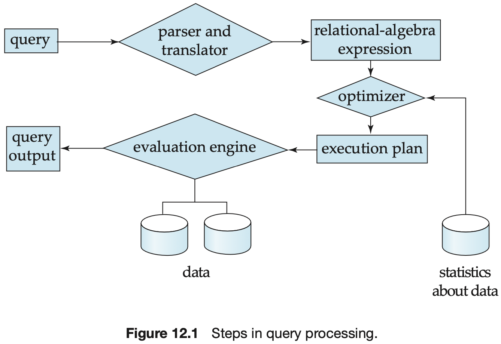
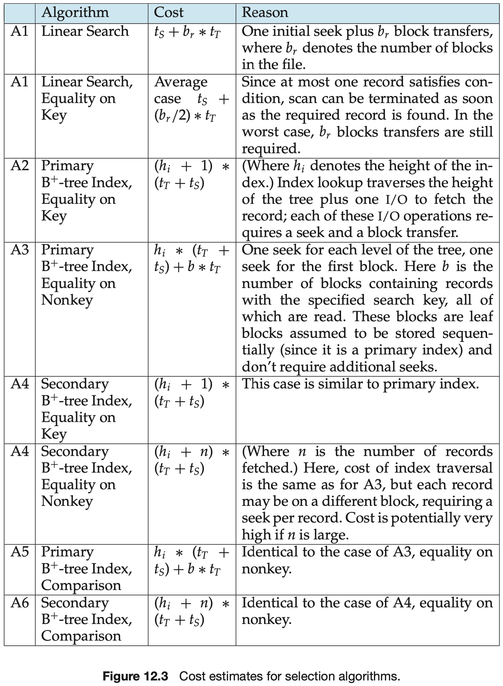
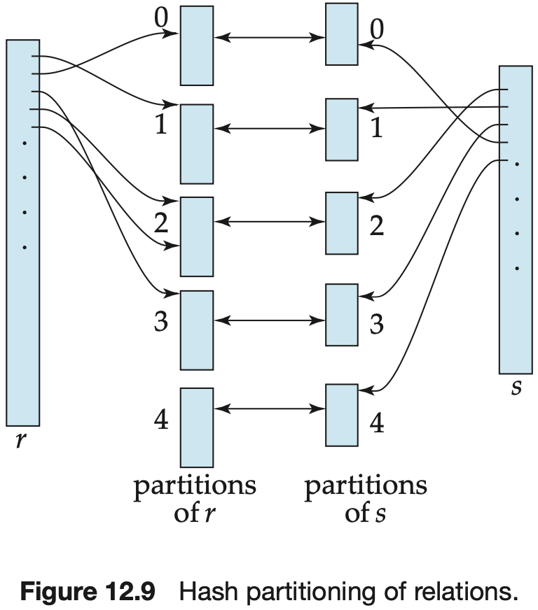

# CHAPTER 12 Query Processing

`Query processing` refers to the range of activities involved in extracting data from a database.

A relational algebra operation annotated with instructions on how to evaluate it is called an `evaluation primitive`.

A sequence of primitive operations that can be used to evaluate a query is a `query-execution plan` or `query-evaluation plan`.

The `query-execution engine` takes a query-evaluation plan, executes that plan, and returns the answers to the query.

The `response time` for a query-evaluation plan (that is, the wall-clock time required to execute the plan), assuming no other activity is going on in the computer, would account for all these costs, and could be used as a measure of the cost of the plan. Unfortunately, the response time of a plan is very hard to estimate without actually executing the plan, for the following reasons:

1. The response time depends on the contents of the buffer when the query begins execution; this information is not available when the query is optimized and is hard to account for even if it were available.
2. In a system with multiple disks, the response time depends on how accesses are distributed among disks, which is hard to estimate without detailed knowledge of the data layout on the disk.

As a result, instead of trying to minimize the response time, optimizers generally try to minimize the total `resource consumption` of a query plan.

In query processing, the `file scan` is the lowest-level operator to access data.

The most straightforward way of performing a selection is as follows:

- A1(`linear search`).
- A2(`primary index, equality on key`).
- A3(`primary index, equality on nonkey`).
- A4(`secondary index, equality`).
- A5(`primary index, comparison`).
- A6(`secondary index, comparison`).
- A7(`conjunction selection using one index`).
- A8(`conjunctive selection using composite index`).
- A9(`conjunctive selection by intersection of identifiers`).
- A10(`disjunctive selection by union of identifiers`).

Sorting of relations that do not fit in memory is called `external sorting`.

The most commonly used technique for external sorting is the `external sort-merge` algorithm.

The preceding merge operation is a generalization of the two-way merge used by the standard in-memory sort-merge algorithm; it merges $N$ runs, so it is called an `N-way merge`.

The performance of the nested-loop and block nested-loop procedures can be further improved:

- If the join attributes in a natural join or an equijoin form a key on the inner relation, then for each outer relation tuple the inner loop can terminate as soon as the first match is found.
- In the block nested-loop algorithm, instead of using disk blocks as the blocking unit for the outer relation, we can use the biggest size that can fit in memory, while leaving enough space for the buffers of the inner relation and the output.
- We can scan the inner loop alternately forward and backward.
- If an index is available on the inner loop's join attribute, we can replace file scans with more efficient index lookpups.

The `merge-join` algorithm (also called the `sort-merge-join` algorithm) can be used to compute natural joins and equi-joins.

The `hybrid merge-join algorithm` merges the sorted relation with the leaf entries of the secondary $B^{+}$-tree index.

`Has-table overflow` occurs in partition $i$ of the build relation $s$ if the hash index on $S_i$ is larger than main memory.

Some of the partitions will have more tuples than the average, whereas others will have fewer; partitioning is then said to be `skewed`.

`Overflow resolution` is performed during the build phase if a hash-index overflow is detected.

`Overflow avoidance` performs the partitioning carefully so that overflows never occur during the build phase.

The `hybrid hash-join` algorithm performs another optimization; it is useful when memory sizes are relatively large, but not all of the build relation fits in memory.

The result of each evaluation is `materialized` in a temporary relation for subsequent use.

An alternative approach is to evaluate several operations simultaneously in a `pipeline`, with the results of one operation passed on to the next, without the need to store a temporary relation.

It is easiest to understand intuitively how to evaluate an expression by looking at a pictorial representation of the expression in an `operator tree`.

Evaluation as just described is called `materialized evaluation`, since the results of each intermediate operation are created (materialized) and then are used for evaluation of the next-level operations.

Creating a pipeline of operations can provide two benefits:

1. It eliminates the cost of reading and writing temporary relations, reducing the cost of query evaluation.
2. It can start generating query results quickly if the root operator of a query-evaluation plan is combined in a pipeline with its inputs.

Pipelines can be executed in either of two ways:

1. In a `demand-driven pipeline`, the system makes repeated requests for tuples from the operation at the top of the pipeline.
2. In a `producer-driven pipeline`, operations do not wait for requests to produce tuples, but instead generate the tuples `eagerly`.

Each operation in a demand-driven pipeline can be implemented as an `iterator` that provides the following functions: `open()`, `next()`, and `close()`.

The iterator maintains the `state` of its execution in between calls so that successive `next()` requests receive successive result tuples.

Using producer-driven pipelining can be thought of as `pushing` data up an operation tree from below, whereas using demand-driven pipelining can be thought of as `pulling` data up an operation tree from the top.

## Summary

TODO