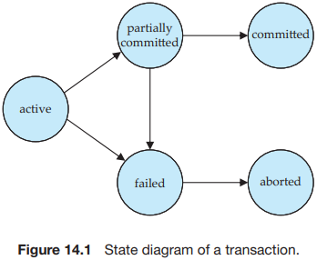
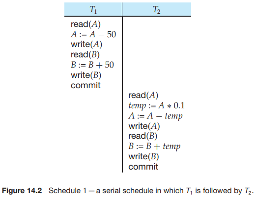
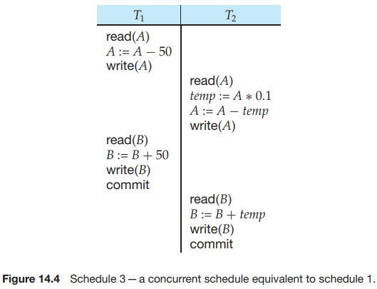
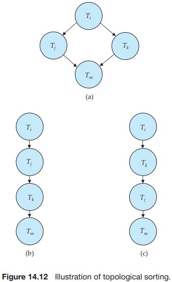

# Chapter 14 Transactions

Collections of operations that form a single logical unit of work are called `transactions`. A database system must ensure proper execution of transactions despite failures -- either the entire transaction executes, or none of it does. Furthermore, it must manage concurrent execution of transactions in a way that avoids the introduction of inconsistency.

A `transaction` is a unit of program execution that accesses and possibly updates various data items.

ACID properties:

- `Atomicity`. Either all operations of the transaction are reflected properly in the database, or none are.
- `Consistency`. Execution of a transaction in isolation (that is, with no other transaction executing concurrently) preserves the consistency of the database.
- `Isolation`. Even though multiple transactions may execute concurrently, the system guarantees that, for every pair of transactions $T_i$ and $T_j$, it appears to $T_i$ that either $T_j$ finished execution before $T_i$ started or $T_j$ started execution after $T_i$ finished. Thus, each transaction is unaware of other transactions executing concurrently in the system.
- `Durability`. After a transaction completes successfully, the changes it has made to the database persist, even if there are system failures.

Because of the failure, the state of the system no longer reflects a real state of the world that the database is supposed to capture. We term such a state an `inconsistent state`.

We therefore establish a simple abstract transaction model. A transaction must be in one of the following state:

- Active, the initial state; the transaction stays in this state while it is executing.
- Partially committed, after the final statement has been executed.
- Failed, after the discovery that normal execution can no longer proceed.
- Aborted, after the transaction has been rolled back and the database has been restored to its state prior to the start of the transaction.
- Committed, after successful completion.

There are two good reasons for allowing concurrency:

- Improved throughput and resource utilization.
- Reduced wait time.

The database system must control the interaction among the concurrent transactions to prevent them from destroying the consistency of the database. It does so through a variety of mechanisms called `concurrency-control schemes`.

The execution sequences just described are called `schedules`. They represent the chronological order in which instructions are executed in the system.

These schedules are `serial`: Each serial schedule consists of a sequence of instructions from various transactions, where the instructions belonging to one single transaction appear together in that schedule. Recalling a well-known formula from combinatorics, we note that, for a set of $n$ transactions, there exist $n$ factorial $(n!)$ different valid serial schedules.

It is the job of the database system to ensure that any schedule that is executed will leave the database in a consistent state. The `concurrency-control` component of the database system carries out this task.

We can ensure consistency of the database under concurrent execution by making sure that any schedule that is executed has the same effect as a schedule that could have occurred without any concurrent execution. That is, the schedule should, in some sense, be equivalent to a serial schedule. Such schedules are called `serializable` schedules.

If a schedule $S$ can be transformed into a schedule $S'$ by a series of swaps of nonconflicting instructions, we say that $S$ and $S'$ are `conflict equivalent`.

The concept of conflict equivalence leads to the concept of conflict serializability. We say that a schedule $S$ is `conflict serializable` if it is conflict equivalent to a serial schedule. Thus, schedule 3 is conflict serializable, since it is conflict equivalent to the serial schedule 1.

A `serializability order` of the transactions can be obtained by finding a linear order consistent with the partial order of the `precedence graph`. This process is called `topological sorting`. There are, in general, several possible linear orders that can be obtained through a topological sort.

A `recoverable schedule` is one where, for each pair of transactions $T_i$ and $T_j$ such that $T_j$ reads a data item previously written by $T_i$, the commit operation of $T_i$ appears before the commit operation of $T_j$.

This phenomenon, in which a single transaction failure leads to a series of transaction rollbacks, is called `cascading rollback`.

Formally, a `cascadeless schedule` is one where, for each pair of transactions $T_i$ and $T_j$ such that $T_j$ reads a data item previously written by $T_i$, the commit operation of $T_i$ appears before the read operation of $T_j$. It is easy to verify that every cascadeless schedule is also recoverable.

The isolation levels specified by the SQL standard are as follows:

- `Serializable` usually ensures serializable execution.
- `Repeatable read` allows only committed data to be read and further requires that, between two reads of a data item by a transaction, no other transactio is allowed to update it. However, the transaction may not be serializable with respect to other transactions.
- `Read committed` allows only committed data to be read, but does not require repeatable reads.
- `Read uncommitted` allows uncommitted data to be read. It is the lowest isolation level allowed by SQL.

all the isolation levels above additionally disallow `dirty writes` that is, they disallow writes to a data item that has already been written by another transaction that has not yet committed or aborted.

There are various `concurrency-control` policies:

- Locking
- Timestamps
- Multiple Versions and Smapshot Isolation

## Summary

- A `transaction` is a `unit` of program execution that accesses and possibly updates various data items. Understanding the concept of a transaction is critical for understanding and implementing updates of data in a database in such a way that concurrent executions and failures of various forms do not result in the database becoming inconsistent.
- Transactions are required to have the ACID properties: atomicity, consistency, isolation, and durability.
  - Atomicity ensures that either all the effects of a transaction are reflected in the database, or none are; a failure cannot leave the database in a state where a transaction is partially executed.
  - Consistency ensures that, if the database is initially consistent, the execution of the transaction (by itself) leaves the database in a consistent state.
  - Isolation ensures that concurrently executing transactions are isolated from one another, so that each has the impression that not other transaction is executing concurrently with it.
  - Durability ensures that, once a transaction has been committed, that transaction's updates do not get lost, even if there is a system failure.
- Concurrent execution of transactions improves the throughput of transactions and system utilization, and also reduces waiting time of transactions.
- The various types of storage in a computer are volatile storage, nonvolatile storage, and stable storage. Data in volatile storage, such as in RAM, are lost when the computer crashes. Data in nonvolatile storage, such as disk, are not lost when the computer crashes, but may occasionally be lost because of failures such as disk crashes. Data in stable storage are never lost.
- Stable storage that must be accessible online is approximated with mirrored disks, or other forms of RAID, which provide redundant data storage. Offline, or archival, stable storage may consist of multiple tape copies of data sotred in physically secure locations.
- When several transactions execute concurrently on the database, the consistency of data may no longer be preserved. It is therefore necessary for the system to control the interaction among the concurrent transactions.
  - Since a transaction is unit that preserves consistency, a serial execution of transactions guarantees that consistency is preserved.
  - A `schedule` captures the key actions of transactions that affect concurrent execution, such as `read` and `write` operations, while abstracting away internal details of the execution of the transaction.
  - We require that any schedule produced by concurrent processing of a set of transactions will have an effect equivalent to a schedule produced when these transactions are run `serializability`.
  - There are several different notions of equialence leading to the concepts of conflict `serializability` and view `serializability`.
- Serializability of schedules generated by concurrently executing transactions can be ensured through one of a variety of mechanisms called `concurrency-control` policies.
- We can test a given schedule for conflict serializability by constructing a `precedence graph` for the schedule, and by searching for absence of cycles in the graph. However, there are more efficient concurrency-control policies for ensuring serializability.
- Schedules must be recoverable, to make sure that if transaction $a$ sees the effects of transaction $b$, and $b$ then abort, then $a$ also gets aborted.
- Schedules should preferably be cascadeless, so that the abort of a transaction does not result in cascading aborts of other transactions. Cascadelessness is ensured by allowing transactions to only read committed data.
- The concurrency-control-management component of the database is responsible for handling the concurrency-control policies. Chapter 15 decribes concurrency-control policies.
