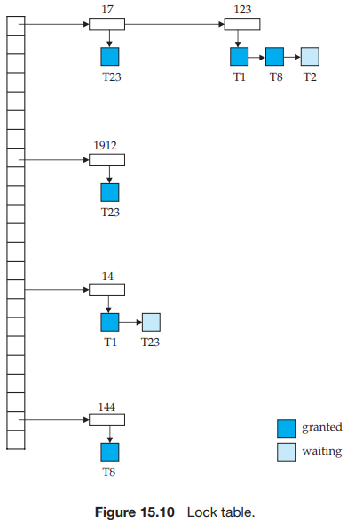
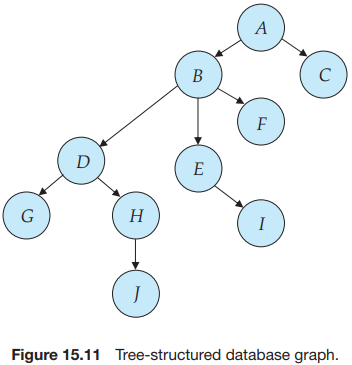
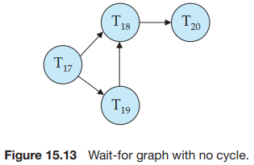
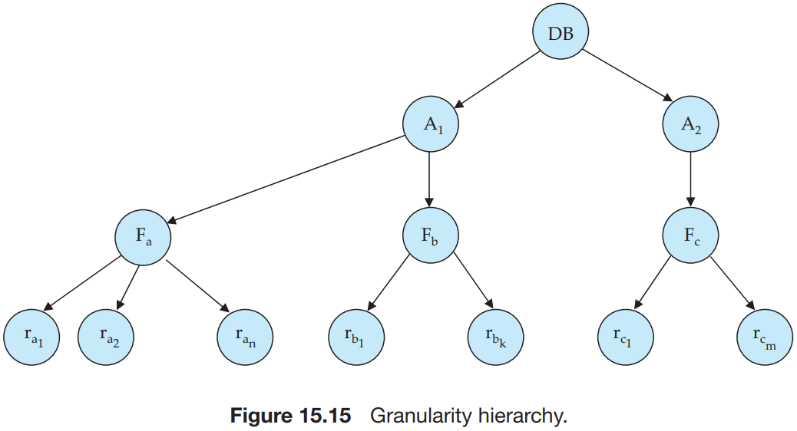

# CHAPTER 15 Concurrency Control

There are various modes in which a data item may be locked. In this section, we restrict our attention to two modes:

1. `Shared`. If a transaction $T_i$ has obtained a `shared-mode lock` (denoted by $S$) on item $Q$, then $T_i$ can read, but cannot write, $Q$.
2. `Exclusive`. If a transaction $T_i$ has obtained an `exclusive-mode lock` (denoted by $X$) on item $Q$, then $T_i$ can both read and write $Q$.

We require that every transaction `request` a lock in an appropriate mode on the data item $Q$, depending on the types of operations that it will perform on $Q$. The transaction makes the request to the concurrency-control manager. The transaction can proceed with the operation only after the concurrency-control manager `grants` the lock to the transaction. The use of these two lock modes allows multiple transactions to read a data item, but limits write access to just one transaction at a time.

To state this more generally, given a set of lock modes, we can define a `compatibility function` on them as follows: Let $A$ and $B$ represent arbitrary lock modes. Suppose that a transaction $T_i$ requests a lock of mode $A$ on item $Q$ on which transaction $T_j (T_i \neq T_j)$ currently holds a lock of mode $B$. If transaction $T_i$ can be granted a lock on $Q$ immediately, in spite of the presence of the mode $B$ lock, then we say mode $A$ is `compatible` with mode $B$. Such a function can be represented conveniently by a matrix.

Let $\lbrace T_0, T_1, ..., T_n \rbrace$ be a set of transactions participating in a schedule $S$. We say that $T_i$ `precedes` $T_j$ in $S$, written $T_i \rightarrow T_j$, if there exists a data item $Q$ such that $T_i$ has held lock mode $A$ on $Q$, and $T_j$ has held lock mode $B$ on $Q$ later, and $comp(A, B) = false$. If $T_i \rightarrow T_j$, then that precedence implies that in any equivalent serial schedule, $T_i$ must appear before $T_j$.

We say that a schedule $S$ is `legal` under a given locking protocol if $S$ is a possible schedule for a set of transactions that follows the rules of the locking protocol. We say that a locking protocol `ensures` conflict serializability if and only if all legal schedules are conflict serializable; in other words, for all legal schedules the associated $\rightarrow$ relation is acyclic.

We can avoid starvation of transactions by granting locks in the following manner: When a transaction $T_i$ requests a lock on a data item $Q$ in a particular mode $M$, the concurrency-control manager grants the lock provided that:

1. There is no other transaction holding a lock on $Q$ in a mode that conflicts with $M$.
2. There is no other transaction that is waiting for a lock on $Q$ and that made its lock request before $T_i$.

Thus, a lock request will never get blocked by a lock request that is made later.

One protocol that ensures serializability is the `two-phase locking protocol`. This protocol requires that each transaction issue lock and unlock requests in two phases:

1. `Growing phase`. A transaction may obtain locks, but may not release any lock.
2. `Shrinking phase`. A transaction may release locks, but may not obtain any new locks.

Strict two-phase locking and rigorous two-phase locking (with lock conversions) are used extensively in commercial database systems.

A simple but widely used scheme automatically generates the appropriate lock and unlock instructions for a transaction, on the basis of read and write requests from the transaction:

- When a transaction $T_i$ issues a $reqd(Q)$ operation, the system issues a $lock-S(Q)$ instruction followed by the $read(Q)$ instruction.
- When $T_i$ issue a $write(Q)$ operation, the system checks to see whether $T_i$ already holds a shared lock on $Q$. If it does, then the system issues an $upgrade(Q)$ instruction, followed by the $write(Q)$ instruction. Otherwise, the system issues a $lock-X(Q)$ instruction, followed by the $write(Q)$ instruction.
- All locks obtained by a transaction are unlocked after that transaction commits or aborts.

A `lock manager` can be implemented as a process that receives messages from transactions and sends message in reply. The lock-manager process replies to lock-request messages, or with messages requesting rollback of the transaction (in case of deadlocks). Unlock messages require only an acknowledgment in response, but may result in a grant message to another waiting transaction. The lock manager processes requests this way:

- When a lock request message arrives, it adds a record to the end of the linked list for the data item, if the linked list is present. Otherwise it creates a new linked list, containing only the record for the request.

  It always grants a lock request on a data item that is not currently locked. But if the transaction requests a lock on an item on which a lock is currently held, the lock manager grants the request only if it is compatible with the locks that are currently held, and all earlier requests have been granted already. Otherwise the request has to wait.

- When the lock manager receives an unlock message from a transaction, it deletes the record for that data item in the linked list corresponding to that transaction. It tests the record that follows, if any, as described in the previous paragraph, to see if that request can now be granted. If it can, the lock manager grants that request, and processes the record following it, if any, similarly, and so on.

- If a transaction aborts, the lock manager deletes any waiting request made by the transaction. Once the database system has taken appropriate actions to undo the transaction, it releases all locks held by the aborted transaction.

In the `tree protocol`, the only lock instruction allowed is `lock-x`. Each transaction $T_i$ can lock a data item at most once, and must observe the following rules:

1. The first lock by $T_i$ may be on any data item.
2. Subsequently, a data item $Q$ can be locked by $T_i$ only if the parent of $Q$ is currently locked by $T_i$.
3. Data items may be unlocked at any time.
4. A data item that has been locked and unlocked by $T_i$ cannot subsequently be relocked by $T_i$.

All schedules that are legal under the tree protocol are conflict serializable.

A system is in a deadlock state if there exists a set of transactions such that every transaction in the set is waiting for another transaction in the set. More precisely, there exists a set of waiting transactions $\lbrace T_0, T_1, ..., T_n \rbrace$ such that $T_0$ is waiting for a data item that $T_1$ holds, and $T_1$ is waiting for a data item that $T_2$ holds, and $T_n$ is waiting for a data item that $T_0$ holds. None of the transactions can make progress in such a situation.

There are two principal methods for dealing with the deadlock problem:

- Deadlock Prevention

  There are two approaches to deadlock prevention:

  1. One approach ensures that no cyclic waits can occur by ordering the requests for locks, or requiring all locks to be acquired together.
  2. The other approach is closer to deadlock recovery, and performs transaction rollback instead of waiting for a lock, whenever the wait could potentially result in a deadlock.

- Deadlock Detection and Recovery

  

  Deadlocks can be described precisely in terms of a directed graph called a `wait-for graph`. This graph consists of a pair $G = (V, E)$, where $V$ is a set of vertices and $E$ is a set of edges. The set of vertices consists of all the transactions in the system. Each element in the set $E$ of edge is an ordered pair $T_i \rightarrow T_j$. If $T_i \rightarrow T_j$ is in $E$. Then there is a directed edge from transaction $T_i$ to $T_j$, implying that transaction $T_i$ is waiting for a transaction $T_j$ to release a data item that it needs.

  When transaction $T_i$ requests a data item currently being held by transaction $T_j$, then the edge $T_i \rightarrow T_j$ is inserted in the wait-for graph. This edge is removed only when transaction $T_j$ is no longer holding a data item needed by transaction $T_i$.

  When a detection algorithm determines that a deadlock exists, the system must `recover` from the deadlock. The most common solution is to roll back one or more transactions to break the deadlock. Three actions need to be taken:

  1. Selection of a victim.
  2. Rollback.
  3. Starvation.

The `multiple-granularity locking protocol` uses these lock modes to ensure serializability. It requires that a transaction $T_i$ that attempts to lock a node $Q$ must follow these rules:

1. Transaction $T_i$ must observe the lock-compatibility function of Figure 15.16.
2. Transaction $T_i$ must lock the root of the tree first, and can lock it in any mode.
3. Transaction $T_i$ can lock a node $Q$ in $S$ or $IS$ mode only if $T_i$ currently has the parent of $Q$ locked in either $IX$ or $IS$ mode.
4. Transaction $T_i$ can lock a node $Q$ in $X$, $SIX$, or $IX$ mode only if $T_i$ currently has the parent of $Q$ locked in either $IX$ or $SIX$ mode.
5. Transaction $T_i$ can lock a node only if $T_i$ has not previously unlocked any node (that is, $T_i$ is two phase).
6. Transaction $T_i$ can unlock a node $Q$ only if $T_i$ currently has none of the children of $Q$ locked.

Observe that the multiple-granularity protocol requires that locks be acquired in `top-down`(root-to-leaf) order, whereas locks must be released in `bottom-up`(leaf-to-root) order.

This protocol enhances concurrency and reduces lock overhead. It is particularly useful in applications that include a mix of:

- Short transactions that access only a few data items.
- Long transactions that produce reports from an entire file or set of files.

With each transaction $T_i$ in the system, we associate a unique fixed timestamp, denoted by $TS(T_i)$. This timestamp is assigned by the database system before the transaction $T_i$ starts execution. If a transaction $T_i$ has been assigned timestamp $TS(T_i)$, and a new transaction $T_j$ enters the system, then $TS(T_i) < TS(T_j)$. There are two simple methods for implementing this scheme:

1. Use the value of the `system clock` as the timestamp; that is, a transaction's timestamp is equal to the value of the clock when the transaction enters the system.
2. Use a `logical counter` that is incremented after a new timestamp has been assigned; that is, a transaction's timestamp is equal to the value of the counter when the transaction enters the system.

The timestamps of the transactions determine the serializability order. Thus, if $TS(T_i) < TS(T_j)$, then the system must ensure that the produced schedule is equivalent to a serial schedule in which transaction $T_i$ appears before transaction $T_j$.

To implement this scheme, we associate with each data item $Q$ two timestamp values:

- $W-timestamp(Q)$ denotes the largest timestamp of any transaction that executed $write(Q)$ successfully.
- $R-timestamp(Q)$ denotes the largest timestamp of any transaction that executed $read(Q)$ successfully.

The `timestamp-ordering protocol` ensures that any conflicting $read$ and $write$ operations are executed in timestamp order. This protocol operates as follows:

1. Suppose that transaction $T_i$ issues $read(Q)$.
   - If $TS(T_i) < W-timestamp(Q)$, then $T_i$ needs to read a value of $Q$ that was already overwritten. Hence, the read operation is rejected, and $T_i$ is rolled back.
   - If $TS(T_i) \geq W-timestamp(Q)$, then the read operation is executed, and $R-timestamp(Q)$ is set to the maximum of $R-timestamp(Q)$ and $TS(T_i)$.
2. Suppose that transaction $T_i$ issues $write(Q)$.
   - If $TS(T_i) < R-timestamp(Q)$, then the value of $Q$ that $T_i$ is producing was needed previously, and the system assumed that that value would never be produced. Hence, the system rejects the write operation and rolls $T_i$ back.
   - If $TS(T_i) < W-timestamp(Q)$, then $T_i$ is attempting to write an obsolete value of $Q$. Hence, the system rejects this write operation and rolls $T_i$ back.
   - Otherwise, the system executes the write operation and sets $w-timestamp(Q)$ to $TS(T_i)$.

If a transaction $T_i$ is rolled back by the concurrency-control scheme as result of issuance of either a read or write operation, the system assigns it a new timestamp and restarts it.

`Thomas' write rule` is this: Suppose that transaction $T_i$ issues $write(Q)$:

1. If $TS(T_i) < R-timestamp(Q)$, then the value of $Q$ that $T_i$ is producing was previously needed, and it had been assumed that the value would never be produced. Hence, the system rejects the write operation and rolls $T_i$ back.
2. If $TS(T_i) < W-tiemstamp(Q)$, then $T_i$ is attempting to write an obsolete value of $Q$. Hence, this write operation can be ignored.
3. Otherwise, the system executes the write operation and sets $W-timestamp(Q)$ to $TS(T_i)$.

The `validation protocol` requires that each transaction $T_i$ executes in two or three different phases in its lifetime, depending on whether it is a read-only or an update transaction. The phases are, in order:

1. Read phase. During this phase, the system executes transaction $T_i$. It reads the values of the various data items and stores them in variables local to $T_i$. It performs all write operations on temporary local variables, without updates of the actual database.
2. Validation phase. The validation test (described below) is applied to transaction $T_i$. This determines whether $T_i$ is allowed to proceed to the write phase without causing a violation of serializability. If a transaction fails the validation test, the system aborts the transaction.
3. Write phase. If the validation test succeeds for transaction $T_i$, the temporary local variables that hold the results of any write operations performed by $T_i$ are copied to the database. Read-only transactions omit this phase.

Each transaction msut go through the phases in the order shown. However, phases of concurrently executing transactions cna be interleaved.

To perform the validation test, we need to known when the various phase of transactions took place. We shall, therefore, associate three different timestamps with each transaction $T_i$:

1. $Start(T_i)$, the time when $T_i$ started its execution.
2. $Validation(T_i)$, the time when $T_i$ finished its read phase and started its validation phase.
3. $Finish(T_i)$, the time when $T_i$ finished its write phase.

We determine the serializability order by the timestamp-ordering technique, using the value of the timestamp $Validation(T_i)$. Thus, the value $TS(T_i) = Validation(T_i)$ and, if $TS(T_j) < TS(T_k)$, then any produced schedule must be equivalent to a serial schedule in which transaction $T_j$ appears before transaction $T_k$. The reason we have chosen $Validation(T_i)$, rather than $Start(T_i)$, as the timestamp of transaction $T_i$ is that we can expect faster response time provided that conflict rates among transactions are indeed low.

The `validation test` for transaction $T_i$ requires that, for all transactions $T_k$ with $TS(T_k) < TS(T_i)$, one of the following two conditions must hold:

1. $Finish(T_k) < Start(T_i)$. Since $T_k$ completes its execution before $T_i$ started, the serializability order is indeed maintained.
2. The set of data items written by $T_k$ does not intersect with the set of data items read by $T_i$, and $T_k$ completes its write phase before $T_i$ starts its validation phase $(Start(T_i) < Finish(T_k) < Validation(T_i))$. This condition ensures that the writes of $T_k$ and $T_i$ cannot affect the read of $T_k$, the serializability order is indeed maintained.

The timestamp-ordering protocol can be extended to a multiversion protocol. With each transaction $T_i$ in the system, we associate a unique static timestamp, denoted by $TS(T_i)$. With each data item $Q$, a sequence of versions $<Q_1, Q_2, ..., Q_m>$ is associated. Each version $Q_k$ contains three data fields:

- $Content$ is the value of version $Q_k$.
- $W-timestamp(Q_k)$ is the timestamp of the transaction that created version $Q_k$.
- $R-timestamp(Q_k)$ is the largest timestamp of any transaction that successfully read version $Q_k$.

A transaction -- say, $T_i$ -- creates a new version $Q_k$ of data item $Q$ by issuing a $write(Q)$ operation. The content field of the version holds the value written by $T_i$. The system initializes the $W-timestamp$ and $R-timestamp$ to $TS(T_i)$. It updates the $R-timestamp$ value of $Q_k$ whenever a transaction $T_j$ reads the content of $Q_k$, and $R-timestamp(Q_k) < TS(T_j)$.

1. If transaction $T_i$ issues a $read(Q)$, then the value returned is the content of version $Q_k$.
2. If transaction $T_i$ issues $write(Q)$, and if $TS(T_i) < R-timestamp(Q_k)$, then the system rolls back transaction $T_i$. On the other hand, if $TS(T_i) = W-tiamestamp(Q_k)$, the system overwrites the contents of $Q_k$; otherwise(if $TS(T_i) > R-timestamp(Q_k)$), it creates a new version of $Q$.

## Summary

- When several transactions execute concurrently in the database, the consistency of data may no longer be preserved. It is necessary for the system to control the interaction among the concurrent transactions, and this control is achieved through one of a variety of mechanisms called `concurrency-control` schemes.
- To ensure serializability, we can use various concurrency-control schemes. All these schemes either delay an operation or abort the transaction that issued the operation. The most common ones are locking protocols, timestamp ordering schemes, validation tedchniques, and multiversion schemes.
- A locking protocol is a set of rules that state when a transaction may lock and unlock each of the data items in the database.
- The two-phase locking protocol allows a transaction to lock a new data item only if that transaction has not yet unlocked any data item. The protocol ensures serializability, but not deadlock freedom. In the absence of information concerning the manner in which data items are accessed, the two-phase locking protocol is both necessary and sufficient for ensuring serializability.
- The strict two-phase locking protocol permits release of exclusive locks only at the end of transaction, in order to ensure recoverability and cascadelessness of the resulting schedules. The rigorous two-phase locking protocol releases all locks only at the end of the transaction.
- Graph-based locking protocols impose restrictions on the order in which items are accessed, and can thereby ensure serializability without requiring the use of two-phase locking, and can additionally ensure deadlock freedom.
- Various locking protocols do not guard against deadlocks. One way to prevent deadlock is to use an ordering of data items, and to request locks in a sequence consistent with the ordering.
- Another way to prevent deadlock is to use preemption and transaction rollbacks. To control the preemption, we assign a unique timestamp to each transaction. The system uses these timestamps to decide whether a transaction should wait or roll back. If a transaction is rolled back, it retains its old timestamp when restarted. The wound-wait scheme is a preemptive scheme.
- If deadlocks are not prevented, the system must deal wth them by using a deadlock detection and recovery scheme. To do so, the system constructs a wait-for graph. A system is in a deadlock state if and only if the wait-for graph contains a cycle. When the deadlock detection algorithm determines that a deadlock exists, the system must recover from the deadlock. It does so by rolling back one or more transactions to break the deadlock.
- There are circumstances where it would be advantageous to group several data items, and to treat them as one aggregate data item for purposes of working, resulting in multiple levels of granularity. We allow data items of various sizes, and define a hierarchy of data items, where the small items are nested within larger ones. Such a hierarchy can be represented graphically as a tree. Locks are acquired in root-to-leaf order; they are released in leaf-to-root order. The protocol ensures serializability, but not freedom from deadlock.
- A timestamp-ordering scheme ensures serializability by selecting an ordering in advance between every pair of transactions. A unique fixed timestamp is associated with each transaction in the system. The timestamps of the transactions determine the serializability order. Thus, if the timestamp of transaction $T_i$ is smaller than the timestamp of transaction $T_j$, then the scheme ensures that the produced schedule is equivalent to a serial schedule in which transaction $T_i$ appears before transaction $T_j$. It does so by rolling back a transaction whenever such an order is violated.
- A validation scheme is an appropriate concurrency-control method in cases where a majority of transactions are read-only transactions, and thus the rate of conflicts among these transactions is low. A unique fixed tiemstamp is associated with each transaction in the system.  The serializability order is determined by the timestamp of the transaction. A transaction in this scheme is never delayed. It must, however, pass a validation test to complete. If it does not pass the validation test, the system rolls it back to its initial state. 
- A multiversion concurrency-control scheme is based on the creation of a new version of a data item for each transaction that writes that item. When a read operation is issued, the system selects one of the versions to be read. The concurrency-control scheme ensures that the version to be read is selected in a manner that ensures serializability, by using timestamps. A read operation always succeeds:
  - In multiversion timestamp ordering, a write operation may result in the rollback of the transaction.
  - In multiversion two-phase locking, write operations may result in a lock wait or, possibly, in deadlock.
- Snapshot isolation is a multiversion concurrency-control protocol based on validation, which, unlike multiversion two-phase locking, does not require transactions to be declared as read-only or update. Snapshot isolation does not guarantee serializability, but is nevertheless supported by many database systems.
- A `delete` operation may be performed only if the transaction deleting the tuple has an exclusive lock on the tuple to be deleted. A transaction that inserts a new tuple into the database is given an exclusive lock on the tuple.
- Insertions can lead to the phantom phenomenon, in which an insertion logically conflicts with a query even though the two transactions may access no tuple in common. Such conflict cannot be detected if locking is done only on tuples accessed by the transactions. The index-locking technique solves this problem by requiring locks on certain index nodes. These locks ensure that all conflicting transactions conflict on a real data item, rather than on a phantom.
- Weak levels of consistency are used in some applications where consistency of query results is not critical, and using serializability would result in queries adversely affecting transaction processing. Degree-two consistency is one such weaker level of consistency; cursor stability is a special case of degree two consistency, and is widely used.
- Concurrency control is a challenging task for tansactions that span user interactions. Applications often implement a scheme base on validation of writes using version numbers stored in tuples; this scheme provide a weak level of serializability, and can be implemented at the application level without modifications to the database.
- Special concurrency-control techniques can be developed for special data structures. Often, special techniques are applied in $B^+$-trees to allow greater concurrency. These techniques allow nonserializable access to the $B^+$-tree, but they ensure that the $B^+$-tree structure is correct, and ensure that accesses to the database itself are serializable.

