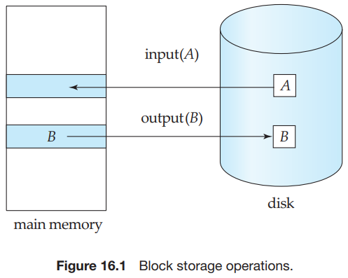
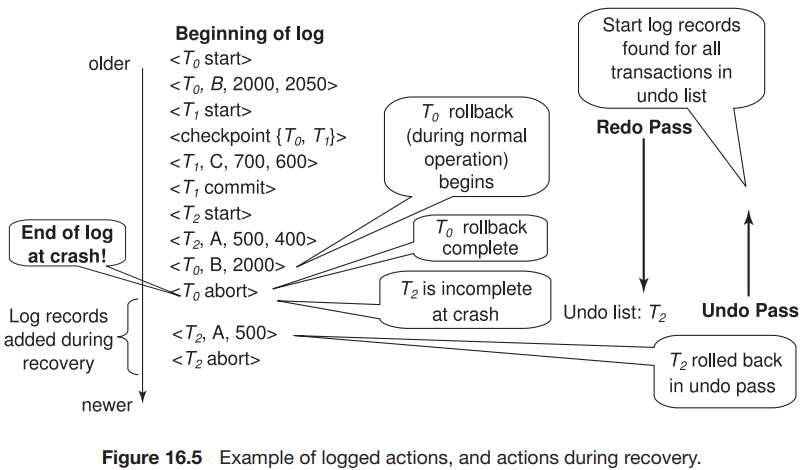
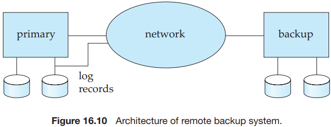

# Chapter 16 Recovery System

The types of failure:

- Transaction failure:
  - Logical error.
  - System error.
- System crash.
- Disk failure.

Recovery algorithms have two parts:

1. Actions taken during normal transaction processing to ensure that enough information exists to allow recovery from failures.
2. Actions taken after a failure to recover the database contents to a state that ensures database consistency, transaction atomicity, and durability.

We identified three categories of storage:

- Volatile storage.
- Nonvolatile storage.
- Stable storage.

Block transfer between memory and disk storage can result in:

- Successful completion.
- Partial failure.
- Total failure.

The blocks residing on the disk are referred to as `physical blocks`; the blocks residing temporarily in main memory are referred to as `buffer blocks`. The area of memory where blocks reside temporarily is called the `disk buffer`.

Block movements between disk and main memory are initiated through the following two operations:

1. $input(B)$ transfers the physical block $B$ to main memory.
2. $output(B)$ transfers the buffer block $B$ to the disk, and replaces the appropriate physical block there.

Conceptually, each transaction $T_i$ has a private work area in which copies of data items accessed and updated by $T_i$ are kept. The system creates this work area when the transaction is initiated; the system removes it when the transaction either commits or aborts. Each data item $X$ kept in the work area of transaction $T_i$ is denoted by $x_i$. Transaction $T_i$ interacts with the database system by transferring data to and from its work area to the system buffer. We transfer data by these two operations:

1. $read(X)$ assigns the value of data item $X$ to the local variable $x_i$. It executes this operation as follows:
   - If block $B_X$ on which $X$ resides is not in main memory, it issues $input(B_X)$.
   - It assigns to $x_i$ the value of $X$ from the buffer block.
2. $write(X)$ assigns the value of local variable $x_i$ to data item $X$ in the buffer block. It executes this operation as follows:
   - If block $B_X$ on which $X$ resides is not in main memory, it issues $input(B_X)$.
   - It assigns the value of $x_i$ to $X$ in buffer $B_x$.

A buffer block is eventually written out to the disk either because the buffer manager needs the memory space for other purposes or because the database system wishes to reflect the change to $B$ on the disk. We shall say that the database system performs a `force-output` of buffer $B$ if it issues an $output(B)$.

There are several types of log records. An `update log record` describes a single database write. It has these fields:

- Transaction identifier, which is the unique identifier of the transaction that performed the write operation.
- Data-item identifier, which is the unique identifier of the data item written.
- Old value, which is the value of the data item prior to the write.
- New value, which is the value that the data item will have after the write.

We represent an update log record as $<T_i, X_j, V_1, V_2>$, indicating that transaction $T_i$ has performed a write on data item $X_j \cdot X_j$ had value $V_1$ before the write, and has value $V_2$ after the write. Other special log records exist to record significant events during transaction processing, such as the start of a transaction and the commimt or abort of a transaction. Among the types of log records are:

- $<T_i\ start>$. Transaction $T_i$ has started.
- $<T_i\ commit>$. Transaction $T_i$ has committed.
- $<T_i abort>$. Transaction $T_i$ has aborted.

If a transaction does not modify the database until it has committed, it is said to use the `deferred-modification` technique.

If database modifications occur while the transaction is still active, the transaction is said to use the `immediate-modification` technique.

`Transaction Rollback` of a transaction $T_i$ is performed as follows:

1. The log is scanned backward, and for each log record of $T_i$ of the form $<T_i, X_j, V_1, V_2>$ that is found:
   - The value $V_1$ is written to data item $X_j$, and
   - A special redo-only log record $<T_i, X_j, V_1>$ is written to the log, where $V_1$ is the value being restored to data item $X_j$ during the rollback. These log records are sometimes called `compensation log records`. Such records do not need undo information, since we never need to undo such an undo operation.
2. Once the log record $<T_i\ start>$ is found the backward scan is stopped, and a log record $<T_i\ abort>$ is written to the log.

`Recovery After a System Crash`. Recovery actions, when the database system is restarted after a crash, take place in two phases:

1. In the `redo phase`, the system replays updates of all transactins by scanning the log forward from the last checkpoint. 

   The specific steps taken while scanning the log are as follows:

   - The list of transactions to be rolled back, undo-list, is initially set to the list $L$ in the $<checkpoint\ L>$ log record.
   - Whenever a normal log record of the form $<T_i, X_j, V_1, V_2>$, or a redo-only log record of the form $<T_i, X_j, V_2>$ is encountered, the operation is redone; that is, the value $V_2$ is written to data item $X_j$.
   - Whenever a log record of the form $<T_i\ start>$ is found, $T_i$ is added to undo-list.
   - Whenever a log record of the form $<T_i\ abort>$ or $<T_i\ commit>$ is found, $T_i$ is removed from undo-list.

2. In the `undo phase`, the system rolls back all transactions in the undo-list. It performs rollback by scanning the log backward from the end.

   - Whenever it finds a log record belongign to a transaction in the undolist, it performs undo actions just as if the log record had been found during the rollback of a failed transaction.
   - When the system finds a $<T_i\ start>$ log record for a transaction $T_i$ in undo-list, it writes a $<T_i\ abort>$ log record to the log, and removes $T_i$ from undo-list.
   - The undo phase terminates once undo-list becomes empty, that is, the system has found $<T_i\ start>$ log records for all transactions that were initially in undo-list.

As a result of log buffering, a log record may reside in only main memory(volatile storage) for a considerable time before it is output to stable storage. Since such log records are lost if the system crashes, we must impose additional requirements on the recovery techniques to ensure transaction atomicity:

- Transaction $T_i$ enters the commit state after the $<T_i\ commit>$ log record has been output to stable storage.
- Before the $<T_i\ commit>$ log record can be output to stable storage, all log records pertaining to transaction $T_i$ must have been output to stable storage.
- Before a block of data in main memory can be output to the database (in nonvolatile storage), all log records pertaining to data in that block must have been output to stable storage.

We can manage the database buffer by using one of two approaches:

1. The database system reserves part of main memory to serve as a buffer that it, rather than the operating system, manages.
2. The database system implements its buffer within the virtual memory provided by the operating system.

`high availability`. the tiem for which the system is unusable must be extremely small.

Several issues must be addressed in designing a remote backup system:

- Detection of failure.

- Transfer of control.

- Time to recover.

- Time to commit.

  The degrees of durability can be classified as follows:

  - One-safe.
  - Two-very-safe.
  - Two-safe.

## Summary

- A computer system, like any other mechanical or electrical device, is subject to failure. There are a variety of causes of such failure, including disk crash, power failure, and software errors. In each of these cases, information concerning the database system is lost.
- In addition to system failures, transactions may also fail for various reasons, such as violation of integrity constraints or deadlocks.
- An integral part of a database system is a recovery scheme thst is responsible for the detection of failures and for the restoration of the database to a state that existed before the occurrence of the failure.
- The various types of storage in a computer are volatile storage, nonvolatile storage, and stable storage. Data in volatile storage, such as in RAM, are lost when the computer crashes. Data in nonvolatile storage, such as disk, are not lost when the computer crashes, but may occasionally be lost because of failures such as disk crashes. Data in stable storage are never lost.
- Stable storage that must be accessible online is approximated with mirrored disks, or other forms of RAID, which provide redundant data storage. Offline, or archival, stable storage may consist of multiple tape copies of data stored in a physically secure location.
- In case of failure, the state of the database system may no longer be consistent; that is, it may not reflect a state of the world that the database is supposed to capture. To preserve consistency, we require that each transaction be atomic. It is the responsibility of the recovery scheme to ensure the atomicity and durability property.
- In log-based schemes, all updates are recorded on a log, which must be kept in stable storage. A transaction is considered to have committed when its last log record, which is the commit log record for the transaction, has been output to stable storage.
- Log records contain old values and new values for all updated data items. The new values are used in case the updates need to be redone after a system crash. The old values are used to roll back the updates of the transaction if the transaction abort during normal operation, as well as to roll back the updates of the transaction in case the system crashed before the transaction committed.
- In the deferred-modifications scheme, during the execution of a transaction, all the write operations are deferred until the transaction has been committed, at which time the system uses the information on the log associated with the transaction in executing the deferred writes. With deferred modification, log records do not need to contain old values of updated data items.
- To reduce the overhead of searching the log and redoing transactions, we can use checkpointing techniques.
- Modern recovery algorithms are based on the concept of repeating history, whereby all actions taken during normal operation (since the last completed checkpoint) are replayed during the redo pass of recovery. Repeating history restores the system state to what it was at the time the last log record was output to stable storage before the system crashed. Undo is then performed from this state, by executing an undo pass that processes log records of incomplete transactions in reverse order.
- Undo of an incomplete transaction writes out special redo-only log records, and an abort log record. After that, the transaction can be considered to have completed, and it will not be undone again.
- Transaction processing is based on a storage model in which main memory holds a log buffer, a database buffer, and a system buffer. The system buffer holds pages of system object code and local work areas of transactions.
- Efficient implementation of a reovery scheme requires that the number of writes to the database and to stable storage be minimized. Log records may be kept in volatile log buffer initially, but must be written to stable storage when one of the following conditions occurs:
  - Before the $<T_i\ commit>$ log record may be output to stable storage, all log records pertaining to transaction $T_i$ must have been output to stable storage.
  - Before a block of data in main memory is output to the database (in nonvolatile storage), all log records pertaining to data in that block must have been output to stable storage.
- Modern recovery techniques support high-concurrency locking techniques, such as those used for $B^+$-tree concurrency control. These techniques allow early release of lower-level locks obtained by operations such as inserts or deletes, which allows other such operations to be performed by other transactions. After lower-level locks are released, physical undo is not possible, and instead logical undo, such as a deletion to undo an insertion, is required. Transactions retain higher-level locks that ensure that concurrent transactions cannot perform actions that could make logical undo of an operation impossible.
- To recover from failures that result in the loss of nonvolatile storage, we must dump the entire contents of the database onto stable storage periodically-say, once per day. If a failure occurs that results in the loss of physical database blocks, we use the most recent dump in restoring the database to a previous consistent state. Once this restoration has been accomplished, we use the log to bring the database system to the most recent consistent state.
- The ARIES recovery scheme is a state-of-the-art scheme that supports a number of features to provide greater concurrency, reduce logging overheads, and minimize recovery time. It is also based on repeating history, and allows logical undo operations. The scheme flushes pages on a continuous basis and does not need to flush all pages at the time of a checkpoint. It uses log sequence numbers (LSNs) to implement a variety of optimizations that reduce the time taken for recovery.
- Remote backup systems provide a high degree of availability, allowing transaction processing to continue even if the primary site is destroyed by a fire, flood, or earthquake. Data and log records from a primary site are continually backed up to a remote backup site. If the primary site fails, the remote backup site takes over transaction processing, after executing certain recovery actions.