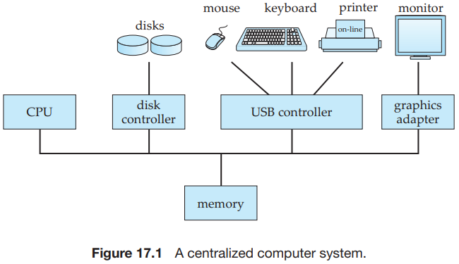
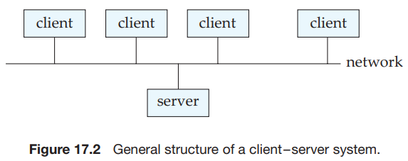
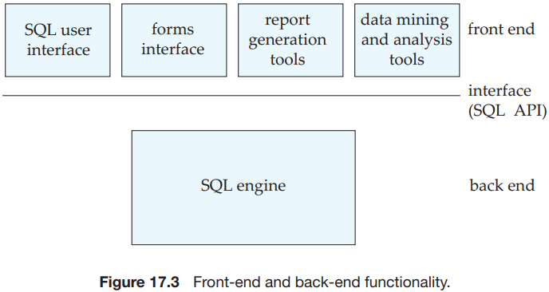
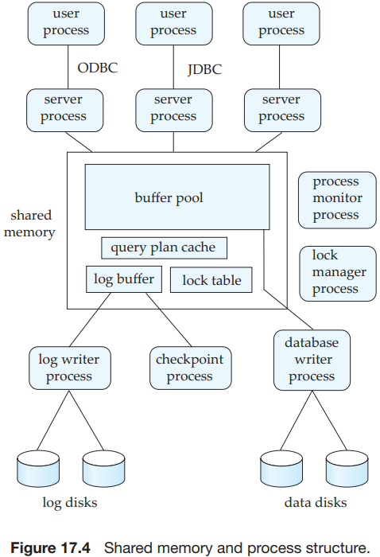
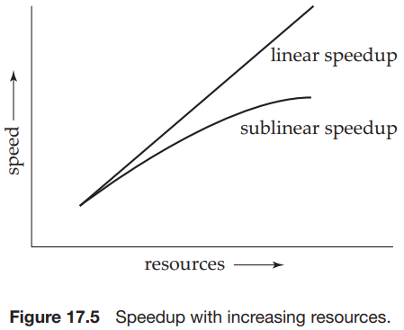
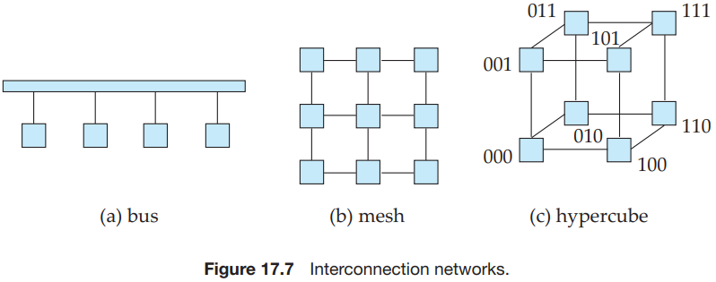
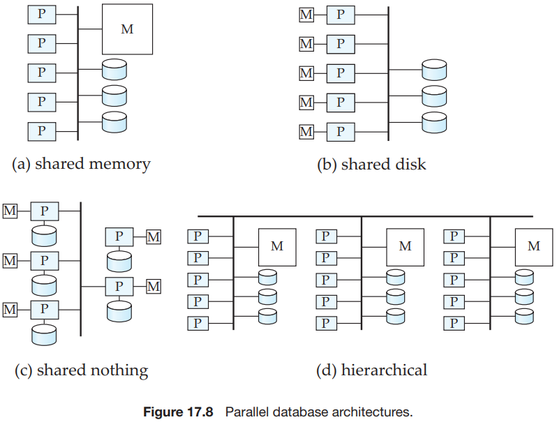
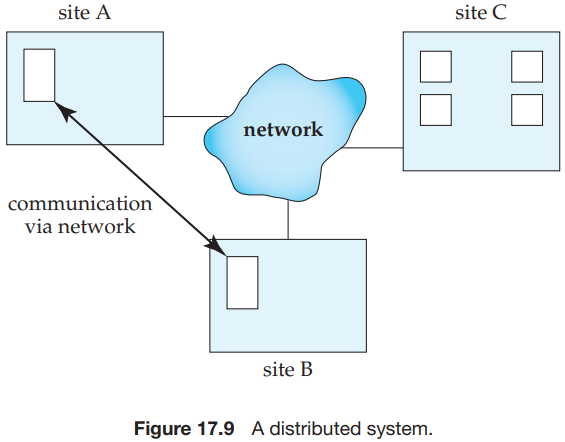
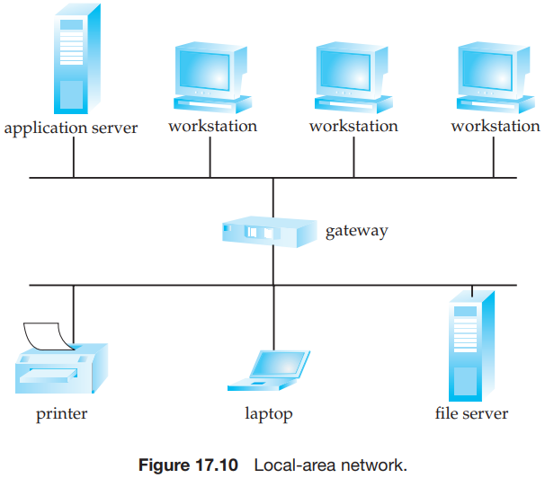
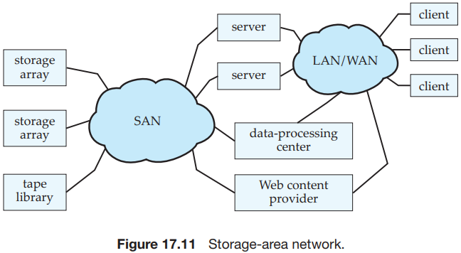

# Chapter 17 Database-System Architectures

Some transaction-processing systems provide a `transactional remote procedure call` interface to connect clients with a server. These calls appear like ordinary procedure calls to the programmer, but all the remote procedure calls from a client are enclosed in a single transaction at the server end. Thus, if the transaction aborts, the server can undo the effects of the individual remote procedure calls.

Server systems can be broadly categorized as transaction servers and data servers:

- `Transaction-server` systems, also called `query-server` systems, provide an interface to which clients can send requests to perform an action, in response to which they execute the action and send back results to the client. 
- `Data-server systems` allow clients to interact with the sesrvers by making requests to read or update data, in units such as files or pages.

The processes that form part of the database system include:

- Server processes.
- Lock manager process.
- Database writer process.
- Log writer process.
- Checkpoint process.
- Process monitor process.

The shared memory contains all shared data, such as:

- Buffer pool.
- Lock table.
- Log buffer, containing log records waiting to be output to the log on stable storage.
- Cached query plans, which can be reused if the same query is submitted again.

There are two main measures of performance of a database system:

1. `throughput`. The number of tasks that can be completed in a given time interval.
2. `response time`. The amount of time it takes to complete a single task from the time it is submitted.

A system that processes a large number of small transactions can improve throughput by processing many transactions in parallel. A system that processes large transactions can improve response time as well as throughput by performing subtasks of each transaction in parallel.

Running a given task in less time by increasing the degree of parallelism is called `speedup`.

Handling larger tasks by increasing the degree of parallelism is called `scaleup`.

Suppose that the execution time of a task on the larger machine is $T_L$, and that the execution time of the same task on the smaller machine is $T_S$. The speedup due to parallelism is defined as $T_S/T_L$. The parallel system is said to demonstrate `linear speedup` if the speedup is $N$ When the larger system has $N$ times the resources (processor, disk, and so on) of the smaller system. If the speedup is less than $N$, The system is said to demonstrate `sublinear speedup`.

Scaleup relates to the ability to process larger tasks in the same amount of time by providing more resources. Let $Q$ be a task, and let $Q_N$ be a task that is $N$ times bigger than $Q$. Suppose that the execution time of task $Q$ on a given machine $M_S$ is $T_S$, and the execution time of task $Q_N$ on a parallel machine $M_L$, which is $N$ times larger than $M_S$ is $T_L$. The scaleup is then defined as $T_S / T_L$. The parallel system $M_L$ is said to demonstrate `linear scaleup` on task $Q$ if $T_L = T_S$. If $T_L > T_S$, the system is said to demonstrate `sublinear scaleup`. 

There are two kinds of scaleup that are relevant in parallel database systems, depending on how the size of the task is measured:

- In `batch scaleup`.
- In `transaction scaleup`.

A number of factors work against efficient parallel operation and can diminish both speedup and scaleup:

- Start-up costs.
- Interference.
- Skew.

Parallel systems consist of a set of components (processors, memory, and disks) that can communicate with each other via an `interconnection network`:

- Bus. All the system components can send data on and receive data from a single communication bus.
- Mesh. The components are nodes in a grid, and each component connects to all its adjacent components in the grid. In a two-dimensional mesh, each node connects to four adjacent nodes, while in a three-dimensional mesh, each node connects to six adjacent nodes.
- Hypercube. The components are numbered in binary, and a component is connected to another if the binary representations of their numbers differ in exactly one bit. Thus, each of the $n$ Components is connected to $log(n)$ other components.

There are several architectural models for parallel machines:

- Shared memory.
- Shared disk.
- Shared nothing.
- Hierarchical.

In a `shared-memory` architecture, the processors and disks have access to a common memory, typically via a bus or through an interconnection network. The benefit of shared memory is extremely efficient communication between processors - data in shared memory can be accessed by any processor without being moved with software.

In the `shared-disk` model, all processors can access all disks directly via an interconnection network, but the processors have private memories. There are two advantages of this architecture over a shared-memory architecture:

- First, since each processor has its own memory, the memory bus is not a bottleneck.
- Second, it offers a cheap way to provide a degree of `fault tolerance`: If a processor (or its memory) fails, the other processors can take over its tasks, since the database is resident on disks that are acessible from all processors.

There are several reasons for building distributed database systems, including sharing of data, autonomy, and availability:

- Sharing data.
- Autonomy.
- Availability.

The `two-phase commit protocol` (2PC) is the most widely used of these protocols. The basic idea behind 2PC is for each site to execute the transaction until it enters the partially committed state, and then leave the commit decision to a single coordinator site; the transaction is said to be in the `ready` state at a site at this point. The coordinator decides to commit the transaction only if the transaction reaches the ready state at every site where it executed; otherwise (for example, if the transaction aborts at any site), the coordinator decides to abort the transaction. Every site where the transaction executed must follow the decision of the coordinator. If a site fails when a transaction is in ready state, when the site recovers from failure it should be in a position to either commit or abort the transaction, depending on the decision of the coordinator.

The primary disadvantage of distributed database systems is the added complexity required to ensure proper coordination among the sites. This increased complexity takes various forms:

- Software-development cost.
- Greater potential for bugs.
- Increased processing overhead.

Distributed databases and client-server systems are built around communication networks. There are basically two types of networks:

- local-area networks (LAN).

  

  

- wide-area networks (WAN).

  WANs can be classified into two types:

  - In `discontinuous connection` WANs.
  - In `continuous connection` WANs.

## Summary

- Centralized database systems run entirely on a single computer. With the growth of personal computers and local-area networking, the database front-end functionality has moved increasingly to clients, with server systems providing the back-end functionality. Client-server interface protocols have helped the growth of client-server database systems.
- Servers can be either transaction servers or data servers, although the use of transaction servers greatly exceeds the use of data servers for providing database services.
  - Transaction servers have multiple processes, possibly running on multiple processors. So that these processes have access to common data, such as the database buffer, systems store such data in shared memory. In addition to processes that handle queries, there are system processes that carry out tasks such as lock and log management and checkpointing.
  - Data-server systems supply raw data to clients. Such systems strive to minimize communication between clients and servers by caching data and locks at the clients. Parallel database systems use similar optimizations.
- Parallel database systems consist of multiple processors and multiple disks connected by a fast interconnection network. Speedup measures how much we can increase processing speed by increasing parallelism for a single transaction. Scaleup measures how well we can handle an increased number of transactions by increasing parallelism. Interference, skew, and start-up costs act as barriers to getting ideal speedup and scaleup.
- Parallel database architectures include the shared-memory, shared-disk, shared-nothing, and hierarchical architectures. These architectures have different trade-offs of scalability versus communication speed.
- A distributed database system is a collection of partially independent database systems that (ideally) shared a common schema, and coordinate processing of transactions that access nonlocal data. The systems communicate with one another through a communication network.
- Local-area networks connect nodes that are distributed over small geographical areas, such as a single building or a few adjacent buildings. Wide-area networks connect nodes spread over a large geographical area. The Internet is the most extensively used wide-area network today.
- Storage-area networks are a special type of local-area network designed to provide fast interconnection between large banks of storage devices and multiple computers.

  