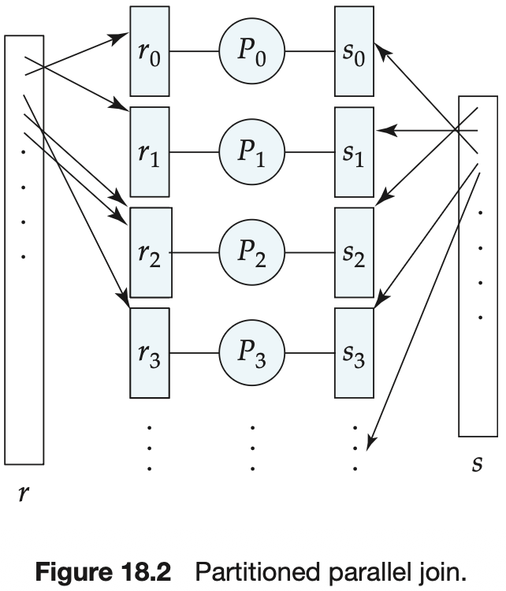
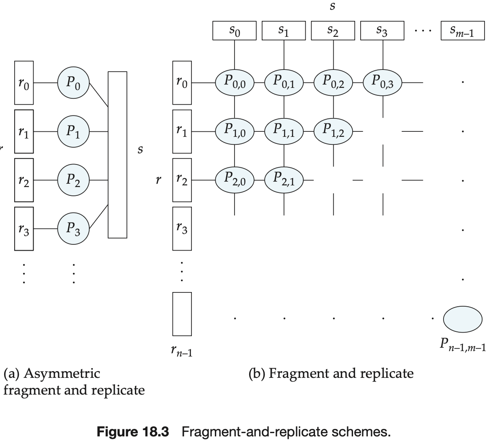

# Chapter 18 Parallel Databases

We present three basic data-partitioning strategies. Assume that there are $n$ disks, $D_0, D_1, \cdots, d_{n-1}$, across which the data are to be partitioned:

- `Round-robin`. This strategy scans the relation in any order and sends the $i$th tuple to disk number $D_{i\ mod\ n}$. The round-robin scheme ensures an even distribution of tuples across disks; that is, each disk has approximately the same number of tuples as the others.
- `Hash partitioning`. This declustering strategy designates one or more attributes from the given relation's schema as the partitioning attributes. A hash function is chosen whose range is $\{0, 1, \cdots, n - 1\}$. Each tuple of the original relation is hashed on the partitioning attributes. If the hash function returns $i$, then the tuple is placed on disk $D_i$.
- `Range partitioning`. This strategy distributes tuples by assigning contiguous attribute-value ranges to each disk. It chooses a partitioning attribute, A, and a `partitioning vector` $[v_0, v_1, \cdots, v_{n-2}]$, such that, if $i < j$, then $v_i < v_j$. The relation is partitioned as follows: Consider a tuple $t$ such that $t[A] = x$. If $x < v_0$, then $t$ goes on disk $D_0$ If $x \geq v_{n-2}$, then $t$ goes on disk $D_{n-1}$. If $v_i \leq x < v_{i+1}$, then $t$ goes on disk $D_{i + 1}$.

When a relation is partitioned (by a technique other than round-robin), there may be a `skew` in the distribution of tuples, with a high percentage of tuples placed in some partitions and fewer tuples in other partitions. The ways that skew may appear are classified as:

- Attribute-value skew.
- Partition skew.

**Attribute-value skew** refers to the fact that some values appear in the partitioning attributes of many tuples. All the tuples with the same value for the partitioning attribute end up in the same partition, resulting in skew. **Partition skew** refers to the fact that there may be load imbalance in the partitioning, even when there is no attribute skew.

A **balanced range-partitioning vector** can be constructed by sorting: The relation is first sorted on the partitioning attributes.

The I/O overhead for constructing balanced range-partition vectors can be reduced by constructing and storing a frequency table, or **histogram**, of the attribute values for each attribute of each relation.

In the **virtual processor** approach, we pretend there are several times as many `virtual processors` as the number of real processors.

In **interquery parallelism**, different queries or transactions execute in parallel with one another.

Various protocols are available to guarantee cache coherency; often, **cache-coherency** protocols are integrated with concurrency-control protocols so that their overhead is reduced. One such protocol for a shared-disk system is this:

1. Before any read or write access to a page, a transaction locks the page in shared or exclusive mode, as appropriate. Immediately after the transaction obtains either a shared or exclusive lock on a page, it also reads the most recent copy of the page from the shared disk.
2. Before a transaction releases an exclusive lock on a page, it flushes the page to the shared disk; then, it releases the lock.

The shared-disk protocols can be extended to shared-nothing architectures by this scheme: Each page has a **home processor** $P_i$, and is stored on disk $D_i$. When other processors want to read or write the page, they send requests to the home processor $P_i$ of the page, since they cannot directly communicate with the disk.

**Intraquery parallelism** refers to the execution of a single query in parallel on multiple processors and disks.

In summary, the execution of a single query can be parallelized in two different ways:

- **Intraoperation parallelism**. We can speed up processing of a query by parallelizing the execution of each individual operation, such as sort, select, project, and join.
- **Interoperation parallelism**. We can speed up processing of a query by executing in parallel the different operations in a query expression.

If the relation has been partitioned in any other way, we can sort it in one of two ways:

1. We can range-partition it on the sort attributes, and then sort each partition separately.
2. We can use a parallel version of the external sort-merge algorithm.

**Range-partitioning sort** works in two steps: first range partitioning the relation, then sorting each partition separately.

**Parallel external sort-merge** is an alternative to range partitioning. Suppose that a relation has already been partitioned among disks $D_0, D_1, ..., D_{n - 1}$ (It does not matter how the relation has been partitioned). Parallel external sort-merge then works this way:

1. Each processor $P_i$ locally sorts the data on disk $D_i$.
2. The system then merges the sorted runs on each processor to get the final sorted output.

, The merging of the sorted runs in step 2 can be parallelized by this sequence of actions:

1. The system range-partitions the sorted partitions at each processor $P_1$(all by the same partition vector) across the processors $P_0, P_1, ..., P_{m - 1}$. It sends the tuples in sorted order, so that each processor receives the tuples in sorted streams.
2. Each processor $P_i$ performs a merge on the streams as they are received, to get a single sorted run.
3. The system concatenates the sorted runs on processors $P_0, P_1, ..., P_{m - 1}$ to get the final result.

**Partitioned join** then works this way: The system partitions the relations $r$ and $s$ each into $n$ partitions, denoted $r_0, r_1, ..., r_{n - 1}$ and $s_0, s_1, ..., s_{n - 1}$. The system sends partitions $r_i$ and $s_i$ to processor $P_i$, where their join is computed locally.

In a partitioned join, however, there are two different ways of partitioning $r$ and $s$:

- Range partitioning on the join attributes.
- Hash partitioning on the join attributes.

We can parallelize such joins by using a technique called `fragment and replicate`. We first consider a special case of fragment and replicate --**asymmetric fragment-and-replicate join** --which works as follows:

1. The system partitions one of the relations--say, $r$. Any partitioning technique can be used on $r$, including round-robin partitioning.
2. The system replicates the other relation, $s$, across all the processors.
3. Processor $P_i$ then locally computes the join of $r_i$ with all of $s$, using any join technique.

Cost of Parallel Evaluation of Operations:

- **Start-up costs** for initiating the operation at multiple processors.
- **Skew** in the distribution of work among the processors, with some processors getting a larger number of tuples than others.
- **Contention for resources** -- such as memory, disk, and the communication network -- resulting in delays.
- **Cost of assembling** the final result by transmitting partial results from each processor.

The time taken by a parallel operation can be estimated as:
$$
T_{part} + T_{asm} + max(T_0, T_1, ..., T_{n - 1})
$$
, where $T_{part}$ is the time for partitioning the relations, $T_{asm}$ is the time for assembling the results, and $T_i$ is the time taken for the operation at processor $P_i$.

Operations in a query expression that do not depend on one another can be executed in parallel. This form of parallelism is called **independent parallelism**.

TODO
