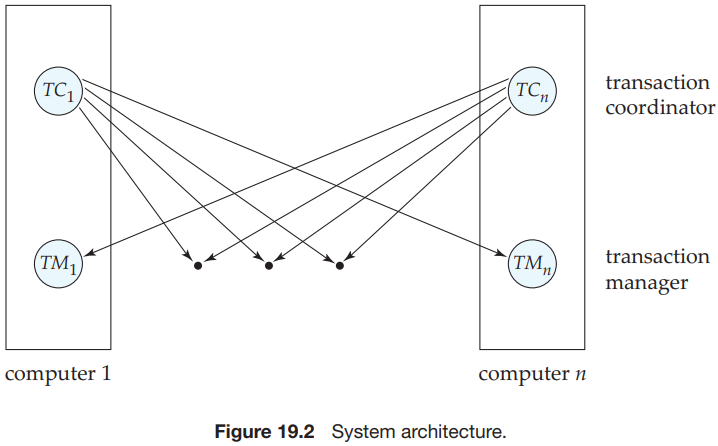
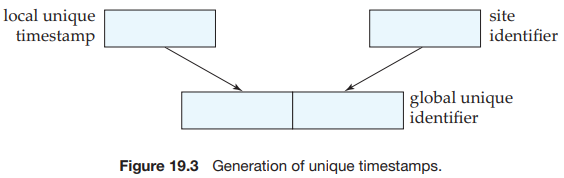
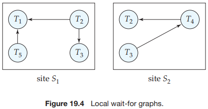
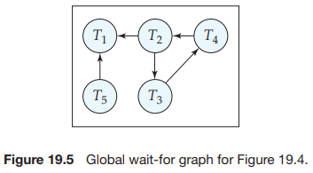

# CHAPTER 19 Distributed Databases

In a `homogeneous distributed database` system, all sites have identical database management system software, are aware of one another, and agree to cooperate in processing users’ requests. In such a system, local sites surrender a portion of their autonomy in terms of their right to change schemas or database-management system software. That software must also cooperate with other sites in exchanging information about transactions, to make transaction processing possible across multiple sites.

In contrast, in a `heterogeneous distributed database`, different sites may use different schemas and different database management system software. The sites may not be aware of one another, and they may provide only limited facilities for cooperation in transaction processing. The differences in schemas are often a major problem for query processing, while the divergence in software becomes a hindrance for processing transactions that access multiple sites.

Consider a relation $r$ That is to be stored in the database. There are two approaches to storing this relation in the distributed database:

- Replication. The system maintains several identical replicas (copies) of the relation, and stores each replica at a different site. The alternative to replication is to store only one copy of relation $r$.
- Fragmentation. The system partitions the relation into several fragments, and stores each fragment at a different site.

There are a number of advantages and disadvantages to replication:

- Availability. If one of the sites contains a relation $r$ fails, then the relation $r$ can be found on another site. Thus, the system can continue to process queries involving $r$, despite the failure of one site.
- Increased parallelism. In the case where the majority of accesses to the relation $r$ result in only the reading of the relation, then several sites can process queries involving $r$ in parallel. The more replicas of r there are, the greater the chance that the needed data will be found in the site where the transaction is executing. Hence, data replication minimizes the movement of data between sites.
- Increased overhead on update. The system must ensure that all replicas of a relation $r$ are consistent; otherwise, erroneous computations may result. Thus, whenever $r$ is updated, the update must be propagated to all sites containing replicas. The result is increased overhead. 

If relation $r$ is fragmented, $r$ is divided into a number of $fragments\ r_1, r_2,...,r_n$. These fragments contain sufficient information to allow reconstruction of the original relation $r$. There are two different schemes for fragmenting a relation:

- `Horizontal fragmentation` splits the relation by assigning each tuple of $r$ to one or more fragments.

  In horizontal fragmentation, a relation $r$ is partitioned into a number of subsets, $r_1, r_2,...,r_n$. Each tuple of a relation $r$ must belong to at least one of the fragments, so that the original relation can be reconstructed, if needed.

- `Vertical fragmentation` splits the relation by decomposing the scheme $R$ of relation $r$.

  Vertical fragmentation of $r(R)$ Involves the definition of several subsets of attributes $R_1, R_2,..., R_n$ of the schema $R$ so that:
  $$
  R = R_1 \cup R_2 \cup \cdots \cup R_n
  $$
  Each fragment $r_i$ of $r$ is defined by:
  $$
  r_i = \prod R_i (r)
  $$
  The fragmentation should be done in such a way that we can reconstruct relation $r$ from the fragments by taking the natural join:
  $$
  r = r_1 \bowtie r_2 \bowtie r_3 \bowtie ··· \bowtie r_n
  $$
  

The user of a distributed database system should not be required to know where
the data are physically located nor how the data can be accessed at the specific
local site. This characteristic, called data transparency, can take several forms:

- `Fragmentation transparency`. Users are not required to know how a relation has been fragmented.

- `Replication transparency`. Users view each data object as logically unique. The distributed system may replicate an object to increase either system performance or data availability. Users do not have to be concerned with what data objects have been replicated, or where replicas have been placed.

- `Location transparency`. Users are not required to know the physical location of the data. The distributed database system should be able to find any data as long as the data identifier is supplied by the user transaction

The `local transactions` are those that access and update data in only one local database; the `global transactions` are those that access and update data in several local databases.

Each site has its own local transaction manager, whose function is to ensure the ACID properties of those transactions that execute at that site. The various transaction managers cooperate to execute global transactions. To understand how such a manager can be implemented, consider an abstract model of a transaction system, in which each site contains two subsystems:

- The `transaction manager` manages the execution of those transactions (or subtransactions) that access data stored in a local site. Note that each such transaction may be either a local transaction (that is, a transaction that executes at only that site) or part of a global transaction (that is, a transaction that executes at several sites).
- The `transaction coordinator` coordinates the execution of the various transactions (both local and global) initiated at that site.

The structure of a transaction manager is similar in many respects to the structure of a centralized system. Each transaction manager is responsible for:

- Maintaining a log for recovery purposes.
- Participating in an appropriate concurrency-control scheme to coordinate the concurrent execution of the transactions executing at that site.

The transaction coordinator subsystem is not needed in the centralized environment, since a transaction accesses data at only a single site. A transaction coordinator, as its name implies, is responsible for coordinating the execution of all the transactions initiated at that site. For each such transaction, the coordinator is responsible for:

- Starting the execution of the transaction.
- Breaking the transaction into a number of subtransactions and distributing these subtransactions to the appropriate sites for execution.
- Coordinating the termination of the transaction, which may result in the transaction being committed at all sites or aborted at all sites.

A distributed system may suffer from the same types of failure that a centralized system does (for example, software errors, hardware errors, or disk crashes). There are, however, additional types of failure with which we need to deal in a distributed environment. The basic failure types are:

- Failure of a site.
- Loss of messages.
- Failure of a communication link.
- Network partition.

If we are to ensure atomicity, all the sites in which a transaction $T$ executed must agree on the final outcome of the execution. $T$ must either commit at all sites, or it must abort at all sites. To ensure this property, the transaction coordinator of $T$ must execute a commit protocol:

- `two-phase commit protocol (2PC)`

  Consider a transaction $T$ initiated at site $S_i$ , where the transaction coordinator is $C_i$ .

  When $T$ completes its execution— that is, when all the sites at which $T$ has executed inform $C_i$ that $T$ has completed—$C_i$ starts the 2PC protocol.

  1. Phase 1. $C_i$ adds the record $<prepare\ T>$ to the log, and forces the log onto stable storage. It then sends a prepare $T$ message to all sites at which $T$ executed. On receiving such a message, the transaction manager at that site determines whether it is willing to commit its portion of $T$. If the answer is no, it adds a record $<no\ T>$ to the log, and then responds by sending an abort $T$ message to $C_i$ . If the answer is yes, it adds a record $<ready\ T>$ to the log, and forces the log (with all the log records corresponding to $T$) onto stable storage. The transaction manager then replies with a ready $T$ message to $C_i$ .
  2. Phase 2. When $C_i$ receives responses to the prepare $T$ message from all the sites, or when a prespecified interval of time has elapsed since the prepare $T$ message was sent out, $C_i$ can determine whether the transaction $T$ can be committed or aborted. Transaction $T$ can be committed if $C_i$ received a ready $T$ message from all the participating sites. Otherwise, transaction $T$ must be aborted. Depending on the verdict, either a record $<commit\ T>$ or a record $<abort\ T>$ is added to the log and the log is forced onto stable storage. At this point, the fate of the transaction has been sealed. Following this point, the coordinator sends either a commit $T$ or an abort $T$ message to all participating sites. When a site receives that message, it records the message in the log.

  The 2PC protocol responds in different ways to various types of failures:

  - Failure of a participating site.
  - Failure of the coordinator.
  - Network partition.

- `three-phase commit protocol (3PC)`

  The three-phase commit (3PC) protocol is an extension of the two-phase commit protocol that avoids the blocking problem under certain assumptions. In particular, it is assumed that no network partition occurs, and not more than $k$ sites fail, where $k$ is some predetermined number. Under these assumptions, the protocol avoids blocking by introducing an extra third phase where multiple sites are involved in the decision to commit. Instead of directly noting the commit decision in its persistent storage, the coordinator first ensures that at least $k$ other sites know that it intended to commit the transaction. If the coordinator fails, the remaining sites first select a new coordinator. This new coordinator checks the status of the protocol from the remaining sites; if the coordinator had decided to commit, at least one of the other $k$ sites that it informed will be up and will ensure that the commit decision is respected. The new coordinator restarts the third phase of the protocol if some site knew that the old coordinator intended to commit the transaction. Otherwise the new coordinator aborts the transaction.

`Persistent messages` are messages that are guaranteed to be delivered to the recipient exactly once (neither less nor more), regardless of failures, if the transaction sending the message commits, and are guaranteed to not be delivered if the transaction aborts.

We now consider the `implementation` of persistent messaging. Persistent messaging can be implemented on top of an unreliable messaging infrastructure, which may lose messages or deliver them multiple times, by these protocols:

- Sending site protocol.
- Receiving site protocol.

In the `single lock-manager` approach, the system maintains a single lock manager that resides in a single chosen site—say $S_i$. All lock and unlock requests are made at site $S_i$. When a transaction needs to lock a data item, it sends a lock request to $S_i$. The lock manager determines whether the lock can be granted immediately. If the lock can be granted, the lock manager sends a message to that effect to the site at which the lock request was initiated. Otherwise, the request is delayed until it can be granted, at which time a message is sent to the site at which the lock request was initiated. The transaction can read the data item from any one of the sites at which a replica of the data item resides. In the case of a write, all the sites where a replica of the data item resides must be involved in the writing.

The scheme has these advantages:

- Simple implementation. This scheme requires two messages for handling lock requests and one message for handling unlock requests.
- Simple deadlock handling. Since all lock and unlock requests are made at one site, the deadlock-handling algorithms discussed in Chapter 15 can be applied directly.

The disadvantages of the scheme are:

- Bottleneck. The site $S_i$ becomes a bottleneck, since all requests must be processed there.
- Vulnerability. If the site $S_i$ fails, the concurrency controller is lost. Either processing must stop, or a recovery scheme must be used so that a backup site can take over lock management from $S_i$.

A compromise between the advantages and disadvantages can be achieved through the `distributed-lock-manager` approach, in which the lock-manager function is distributed over several sites. 

Each site maintains a local lock manager whose function is to administer the lock and unlock requests for those data items that are stored in that site. When a transaction wishes to lock a data item $Q$ that is not replicated and resides at site $S_i$ , a message is sent to the lock manager at site $S_i$ requesting a lock (in a particular lock mode). If data item $Q$ is locked in an incompatible mode, then the request is delayed until it can be granted. Once it has determined that the lock request can be granted, the lock manager sends a message back to the initiator indicating that it has granted the lock request.

When a system uses data replication, we can choose one of the replicas as the `primary copy`. For each data item $Q$, the primary copy of $Q$ must reside in precisely one site, which we call the `primary site` of $Q$.

The `majority protocol` works this way: If data item $Q$ is replicated in $n$ different sites, then a lock-request message must be sent to more than one-half of the $n$ sites in which $Q$ is tored. Each lock manager determines whether the lock can be granted immediately (as far as it is concerned). As before, the response is delayed until the request can be granted. The transaction does not operate on $Q$ until it has successfully obtained a lock on a majority of the replicas of $Q$.

The `majority protocol` suffers from these disadvantages:

- `Implementation`. The majority protocol is more complicated to implement than are the previous schemes. It requires at least $2(n/2 + 1)$ messages for handling lock requests and at least $(n/2 + 1)$ messages for handling unlock requests.
- `Deadlock handling`. In addition to the problem of global deadlocks due to the use of a distributed-lock-manager approach, it is possible for a deadlock to occur even if only one data item is being locked.

The `biased protocol` is another approach to handling replication. The difference from the majority protocol is that requests for shared locks are given more favorable treatment than requests for exclusive locks:

- `Shared locks`. When a transaction needs to lock data item $Q$, it simply requests a lock on $Q$ from the lock manager at one site that contains a replica of $Q$.
- `Exclusive locks`. When a transaction needs to lock data item $Q$, it requests a lock on $Q$ from the lock manager at all sites that contain a replica of $Q$.

The `quorum consensus` protocol is a generalization of the majority protocol. The quorum consensus protocol assigns each site a nonnegative weight. It assigns reqd and write operations on an item $x$ two integers, called `read quorum` $Q_r$ and `write quorum` $Q_w$, that must satisfy the following condition, where $S$ is the total weight of all sites at which $x$ resides:
$$
Q_r + Q_w > S\ and\ 2 * Q_w > S
$$
To execute a read operation, enough replicas must be locked that their total weight is a least $r$. To execute a write operation, enough replicas must be locked so that their total weight is at least $w$.

`Timestamping` is that each transaction is given a `unique` timestamp that the system uses in deciding the serialization order. There are two primary methods for generating unique timestamps, one centralized and one distributed.:

- In the centralized scheme, a single site distributes the timestamps. The site can use a logical counter or its own local clock for this purpose.
- In the distributed scheme, each site generates a unique local timestamp by using either a logical counter or the local clock. We obtain the unique global timestamp by concatenating the qunique local timestamp with the site identifier, which also must be unique.

Replication with Weak Degrees of Consistency:

- With `master-slave replication`. the database allows updates at a primary site, and automatically propagates updates to replicas at other sites. Transactions may read the replicas at other sites, but are not permitted to update them.
- `multimaster replication (also called update-anywhere replication)` updates are permitted at any replica of a data item, and are automatically propagated to all replicas. This model is the basic model used to manage replicas in distributed databases. Transactions update the local copy and the system updates other replicas transparently.

`transaction-consistent snapshot`. that is, the replica should reflect all updates of transactions up to some transaction in the serialization order, and should not reflect any updates of later transactions in the serialization order.

Many database systems provide an alternative form of updating: They update at one site, with `lazy propagation` of updates to other sites, instead of immediately applying updates to all replicas as part of the transaction performing the update. Schemes based on lazy propagation allow transaction processing (including updates) to proceed even if a site is disconnected from the network, thus improving availability, but, unfortunately, do so at the cost of consistency. One of two approaches is usually followed when lazy propagation is used:

- Updates at replicas are translated into updates at a primary site, which are then propagated lazily to all replicas. This approach ensures that updates to an item are ordered serially, although serializability problems can occur, since transactions may read an old value of some other data item and use it to perform an update.
- Updates are performed at any replica and propagated to all other replicas. This approach can cause even more problems, since the same data item may be updated concurrently at multiple sites.

If we allow deadlocks to occur and rely on deadlock detection, the main problem in a distributed system is deciding how to maintain the wait-for graph. Common techniques for dealing with this issue require that each site keep a `local wait-for graph`.  The nodes of the graph correspond to all the transactions (local as well as nonlocal) that are currently either holding or requesting any of the items local to that site. For example:

These local wait-for graphs are constructed in the usual manner for local transactions and data items. When a transaction $T_i$ on site $S_1$ needs a resouce in site $S_2$, it sends a request message to site $S_2$. If the resource is held by transaction $T_j$, the system inserts an edge $T_i \rightarrow T_j$ in the local wait-for graph of site $S_2$.

In the `centralized deadlock detection` approach, the system constructs and maintains a `global wait-for graph`(the union of all the local graphs) in a `single` site: the deadlock-detection coordinator. Since there is communication delay in the system, we must distinguish between two types of wait-for graphs. The `real` graph describes the real but unknown state of the system at any instance in time, as would be seen by an omniscient observer. The `constructed` graph is an approximation generated by the controller during the execution of the controller's algorithm. Obviously, the controller must generate the constructed graph in such a way that, whenever the detection algorithm is invoked, the reported results are correct. `Correct` means in this case that, if a deadlock exists, it is reported promptly, and if the system reports a deadlock, it is indeed in a deadlock state.

The global wait-for graph can be reconstructed or updated under these conditions:

- Whenever a new edge is inserted in or removed from one of the local wait-for graphs.
- Periodically, when a number of changes have occurred in a local wait-for graph.
- Whenever the coordinator needs to invoke the cycle-detection algorithm.

This scheme may produce unnecessary rollbacks if:

- `False cycles` exist in the global wait-for graph.
- A `deadlock` has indeed occurred and a victim has been picked, while one of the transactions was aborted for reasons unrelated to the deadlock.

One of the goals in using distributed databases is `high availability`; that is, the database must function almost all the time. In particular, since failures are mote likely in large distributed systems, a distributed database must continue functioning even when there are various types of failures. The ability to continue functioning even during failures is referred to as `robustness`.

For a distributed system to be robust, it must `detect` failures, `reconfigure` the system so that computation may continue, and `recover` when a processor or a link is repaired.

`CAP theorem`. which states that any distributed database can have at most two of the following three properties:

- Consistency.
- Availability.
- Partition-tolerance.

The proof of the CAP theorem uses the following definition of consistency, with replicated data: an execution of a set of operations (reads and writes) on replicated data is said to be `consistent` if its result is the same as if the operations were executed on a single site, in some sequential order, and the sequential order is consistent with the ordering of operations issued by each process (transaction).

A multidatabase system supports two types of transactions:

1. `Local transactions`. These transactions are executed by each local database system outside of the multidatabase system's control.
2. `Global transactions`. These transactions are executed under the multidata-base system's control.

## Summary

- A distributed database system consists of a collection of sites, each of which maintains a local database system. Each site is able to process local transactions: those transactions that access data in only that single site. In addition, a site may participate in the execution of global transactions requires communication among the sites.

- Distributed databases may be homogeneous, where all sites have a common schema and dtabase system code, or heterogeneous, where the schemas and system codes may differ.

- There are several issues involved in storing a relation in the distributed database, including replication and fragmentation. It is essential that the system minimize the degree to which a user needs to be aware of how a relation is stored.

- A distributed system may suffer from the same types of failure that can afflict a centralized system. There are, however, additional failures with which we need to deal in a distributed environment, including the failure of a site, the failure of a link, loss of a message, and network partition. Each of these problems needs to be considered in the design of a distributed recovery scheme.

- To ensure atomicity, all the sites in which a transaction $T$ executed must agree on the final outcome of the execution. $T$ either commits at all sites or aborts at all sites. To ensure this property, the transaction coordinator of $T$ must execute a commit protocol. The most widely used commit protocol is the two-phase commit protocol.

- The two-phase commit protocol may lead to blocking, the situation in which the fate of a transaction cannot be determined until a failed site (the coordinator) recovers. We can use the three-phase commit protocol to reduce the probability of blocking.

- Persistent messaging provides an alternative model for handling distributed transactions. The model breaks a single transaction into parts that are executed at different databases. Persistent messages (which are guaranteed to be delivered exactly once, regardless of failures), are sent to remote sites to request actions to be taken there. While persistent messaging avoids the blocking problem, application developers have to write code to handle various types of failures.

- The various concurrency-control schemes used in a centralized system can be modified for use in a distributed environment.

  - In the case of locking protocols, the only change that needs to be incorporated is in the way that the lock manager is implemented. There are a variety of different approaches here. One or more central coordinators may be used. If, instead, a distributed-lock-manager approach is taken, replicated data must be treated specially.
  - Protocols for handling replicated data include the primary copy, majority, biased, and quorum consensus protocols. These have different trade-offs in terms of cost and ability to work in the presence of failures.
  - In the case of timestamping and validation schemes, the only needed change is to develop a mechanism for generating unique global timestamps.
  - Many database systems support lazy replication, where updates are propagated to replicas outside the scope of the transaction that performed the update. Such facilities must be used with great care, since they may result in nonserializable executions.

- Deadlock detection in a distributed-lock-manager environment requires cooperation between multiple sites, since there may be global deadlocks even when there are no local deadlocks.

- To provide high availability, a distributed database must detect failures, reconfigure itself so that computation may continue, and recover when a processor or a link is repaired. The task is greatly complicated by the fact that it is hard to distinguish between network partitions and site failures.

  The majority protocol can be extended by using version numbers to permit transaction processing to proceed even in the presence of failures. While the protocol has a significant overhead, it works regardless of the type of failure. Less-expensive protocols are available to deal with site failures, but they assume network partitioning does not occur.

- Some of the distributed algorithms require the use of a coordinator. To provide high availability, the system must maintain a backup copy that is ready to assume responsibility if the coordinator fails. Another approach is to choose the new coordinator after the coordinator has failed. The algorithms that determine which site should act as a coordinator are called **election algorithms**.

- Queries on a distributed database may need to access multiple sites. Several optimization techniques are available to identify the best set of sites to access. Queries can be written automatically in terms of fragments of relations and then choices can be made among the replicas of each fragment. Semijoin techniques may be employed to reduce data transfer involved in joining relations (or fragments or relicas thereof) across distinct sites.

- Heterogeneous distributed databases allow sites to have their own schemas and database system code. A multidatabase system provides an environment in which new database applications can access data from a variety of preexisting databases located in various heterogeneous hardware and software environments. The local database systems may employ different logical models and data-definition and data-manipulation languages, and may differ in their concurrency-control and transaction-management mechanisms. A multidatabase system creates the illusion of logical database integration, without requiring physical database integration.

- A large number of data-storage systems on the cloud have been built in recent years, in response to data storage needs of extremely large-scale Web applications. These data-storage systems allow scalability to thousands of nodes, with geographic distribution, and high availability. However, they do not support the usual ACID properties, and they achieve availability during partitions at the cost of consistency of replicas. Current data-storage systems also do not support SQL, and provide only a simple `put()/get()` interface. While cloud computing is attractive even for traditional databases, there are several challenges due to lack of control on data placement and geographic replication.

- Directory systems can be viewed as a specialized form of database, where information is organized in a hierarchical fashion similar to the way files are organized in a file system. Directories are accessed by standardized directory access protocols such as LADAP. Directories can be distributed across multiple sites to provide autonomy to individual sites. Directories can contain referrals to other directories, which help build an integrated view whereby a query is sent to a single directory, and it is transparently executed at all relevant directories.

## Glossary

granted `/'ɡrɑːntɪd/` 的确，假定

quorum `/'kwɔːrəm/` （计算机）仲裁，法定人数

presence `/'prezns/` 出席，存在，到场

prevent `/prɪˈvent/` 阻止，阻挠，阻碍，预防

omniscient `/ɒm'nɪsiənt/` 全知的，无所不知的

coordinator `/kəʊ'ɔːdɪneɪtə/` （计算机）协调器，协调者

victim `/ˈvɪktɪm/` 牺牲者，受害人，牺牲品

homogeneous `/ˌhɒmə'dʒiːniəs/` 同质的，同种的

fragmentation `/ˌfræɡmen'teɪʃn/` 分裂，破碎

fate `/feɪt/` 命运，宿命

heterogeneous `/ˌhetərə'dʒiːniəs/` （计算机）非均匀的，异种的，异质的，由不同成分形成的

integration `/ˌɪntɪ'ɡreɪʃn/` 集成，综合，同化

autonomy `/ɔː'tɒnəmi/` 自治，自治权，自主

