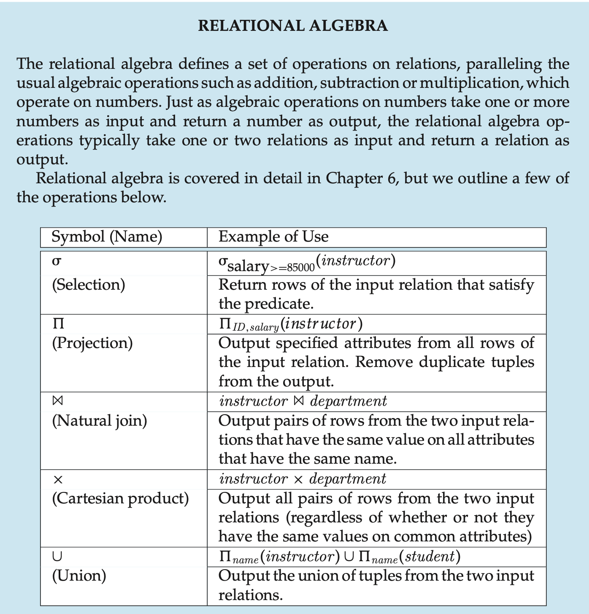

# Chapter2 Introduction to the Relational Model

A relational database consists of a collection of `tables`, each of which is assigned a unique name.

In general, a row in a table represents a `relationship` among a set of values.

Thus, in the relational model, the term `relation` is used to refer to a table, while the term `tuple` is used to refer to a row. Similarly, the term `attribute` refers to a column of a table.

We use the term `relation instance` to refer to a specific instance of a relation, i.e., containing a specific set of rows.

For each attribute of a relation, there is a set of permitted values, called the `domain` of that attribute.

We require that, for all relations $r$, the domains of all attributes of $r$ be atomic, A domain is `atomic` if elements of the domain are considered to be indivisible units.

The `null` value is a special value that signifies that the value is unknown or does not exist.

When we talk about a database, we must differentiate between the `database schema`, which is the logical design of the database, and the `database instance`, which is a snapshot of the data in the database at a given instant in time.

The concept of a relation corresponds to the programming-language notion of a variable, while the concept of a `relation schema` corresponds to the programming-language notion of type definition.

That is, the values of the attribute values of a tuple must be such that they can `uniquely identify` the tuple.

A `superkey` is a set of one or more attributes that, taken collectively, allow us to identify uniquely a tuple in the relation.

The `name` attribute of an `instructor`, on the other hand, is not a superkey, because several instructors might have the same name.

We are often interested in superkeys for which no proper subset is a superkey. Such minimal superkeys are called `candidate keys`.

It is possible that several distinct sets of attributes could serve as a candidate key.

We shall use the term `primary key` to denote a candidate key that is chosen by the database designer as the principal means of identifying tuples within a relation.

Primary keys must be chosen with care.

The primary key should be chosen such that its attribute values are never, or very rarely, changed.

A relation, say $r_1$, may include among its attributes the primary key of another relation, say $r_2$. This attribute is called a `foreign key` from $r_1$, referencing $r_2$. The relation $r_1$ is also called `referencing the relation` of the foreign key dependency, and $r_2$ is called the `referenced relation` of the foreign key.

A `referential integrity constraint` requires that the values appearing in specified attributes of any tuple in the referencing relation also appear in specified attributes of at least one tuple in the referenced relation.

A database schema, along with primary key and foreign key dependencies, can be depicted by `schema diagrams`.

A `query language` is a language in which a user requests information from the database.

In a `procedural language`, the user instructs the system to perform a sequence of operations on the database to compute the desired result.

In a `nonprocedural language`, the user describes the desired information without giving a specific procedure fo obtaining that information.

All procedural relational query languages provide a set of operations that can be applied to either a single relation or a pair of relations.

The `join` operation allows the combining of two relations by merging pairs of tuples, one from each relation, into a single tuple.

The `Cartesian product` operation combines tuples from two relations, but unlike the join operation, its result contains `all` pairs of tuples from the two relations, regardless of whether their attribute values match.

The `union` operation performs a set union of two "similarly structured" tables.

