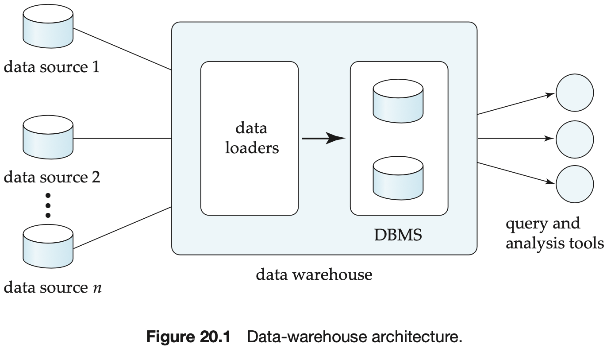

# CHAPTER 20 Data Warehousing and Mining

Database query languages are not suited to the performance of detailed `statistical analyses` of data.

The area of `decision support` can be broadly viewed as covering all the above areas, although some people use the term in a narrower sense that excludes statistical analysis and data mining.

A `data warehouse` is a repository (or archive) of information gathered from multiple sources, stored under a unified schema at a single site. Once gathered, the data are stored for a long time, permitting access to historical data.

Among the issues to be addressed in building a warehouse are the following:

- When and how to gather data.
- What schema to use?
- Data transformation and cleansing.
- How to propagate updates.
- What data to summarize?

To minimize storage requirements, dimension attributes are usually short identifiers that are foreign keys into other tables called `dimension tables`.

In `column-oriented storage`, each attribute of a relation is stored in a separate file, with values from successive tuples stored at successive positions in the file.

Column-oriented storage has at least two major benefits over row-oriented storage:

1. When a query needs to access only a few attributes of a relation with a large number of attributes, the remaining attributes need not be fetched from disk into memory. In contrast, in row-oriented storage, not only are irrelevant attributes fetched into memory, but they may also get prefetched into processor cache, wasting cache space and memory bandwidth if they are stored adjacent to attributes used in the query.
2. Storing values of the same type together increases the effectiveness of compression; compression can greatly reduce both the disk storage cost and the time to retrieve data from the disk.

The term `data mining` refers loosely to the process of semiautomatically analyzing large databases to find useful patterns.

Some types of knowledge discovered from a database can be represented by a set of `rules`.

The discovered knowledge has numerous applications. The most widely used applications are those that require some sort of `prediction`.

Another class of applications looks for `associations`, for instance, books that tend to be bought together.

Associations are an example of `descriptive patterns`. `Clusters` are another example of such patterns.

The `classification` problem is this: Given that items belong to one of several classes, and given past instances (called `training instances`) of items along with the classes to which they belong, the problem is to predict the class to which a new item belongs. The class of the new instance is not known, so other attributes of the instance must be used to predict the class.

The process of building a classifier starts from a sample of data, called a `training set`.

The decision-tree classifier is a widely used technique for classification. As the name suggests, `decision-tree classifiers` use a tree; each leaf node has an associated class, and each internal node has a predicate (or more generally, a function) associated with it.

`Greedy` algorithm, which works recursively, starting at the root and building the tree downward.

A `partitioning attribute` and `partitioning conditions` must be selected to create child nodes.

The purity of a set $S$ of training, instances can be measured quantitatively in several ways. Suppose there are $k$ classes, and of the instances in $S$ the fraction of instances in class $i$ is $p_i$. One measure of purity, the `Gini measure`, is defined as:
$$
Gini(S) = 1 - \sum_{i-1}^{k}p_i^2
$$
, when all instances are in a single class, the Gini value is 0, while it reaches its maximum ($of\ 1 - 1/k$) if each class has the same number of instances. Another measure of purity is the `entropy measure`, which is defined as:
$$
Entropy(S) = - \sum_{i - 1}^{k}p_i{log_2 p_i}
$$
, the entropy value is 0 if all instances are in a single class, and reaches its maximum when each class has the same number of instances. The entropy measure derives from information theory. When a set $S$ is split into multiple sets $S_, i = 1, 2, ..., r$, we can measure the purity of the resultant set of sets as:
$$
Purity(S_1, S_2, ..., S_r) = \sum_{i=1}^{r} \frac{|S_i|}{|S|} purity(S_i)
$$
, that is, the purity is the weighted average of the purity of the sets $S_i$.

The `information gain` due to a particular split of $S$ into $S_i, i = 1, 2, ..., r$ is then:
$$
Information\_gain(S, \{S_1, S_2, ..., S_r\}) = purity(S) - purity(S_1, S_2, ..., S_r)
$$
The `information content` of a particular split can be defined in terms of entropy as:
$$
Information\_content(S, \{S_1, S_2, ..., S_r\}) = -\sum_{i-1}^{r} \frac{|S_i|}{|S|} log_2 \frac{|S_i|}{|S|}
$$
The `best split` for an attribute is the one that gives the maximum `information gain ratio`, defined as:
$$
\frac{Information\_gain(S, \{S_1, S_2, ..., D_r\})}{Information\_content(S, \{S_1, S_2, ..., S_r\})}
$$
Attributes can be either `continuous valued`, that is, the values can be ordered in a fashion meaningful to classification, 

`Overfitting`: A subtree is overfitted if it has been so highly tuned to the specifics of the training data that it makes many classification errors on other data.

`Bayes' theorem`: 
$$
p(c_j | d) = \frac{p(d|c_j) p(c_j)}{p(d)}
$$
, where $p(d|c_j)$ is the probability of generating instance $d$ given class $c_j, p(c_j)$ is the probability of occurrence of class $c_j$, and $p(d)$ is the probability of instance $d$ occurring. Of these, $p(d)$ can be ignored since it is the same for all classes. $p(c_j)$ is simply the fraction of training instances that belong to class $c_j$.

`Naive Bayesian classifiers` assume attributes have independent distributions, and thereby estimate:
$$
p(d|c_j) = p(d_1 | c_j) * p(d_2 | c_j) * ... * p(d_n|c_j)
$$
, the probability of the instance $d$ occurring is the product of the probability of occurrence of each of the attribute values $d_i$ of $d$, given the class is $c_j$.

The `Support Vector Machine` (SVM) is a type of classifier that has been found to given very accurate classification across a range of applications.

The quality of classification can be measured in several different ways:

1. `Accuracy`, defined as $(t\_pos + t\_neg) / (pos + neg)$, that is, the fraction of the time when the classifier gives the correct classification.
2. `Recall` (also known as `sensitivity`) defined as `t_pos/pos`, that is, how many of the actual positive cases are classified as positive.
3. `Precision`, defined as `t_pos / (t_pos + f_pos)`, that is, how often the positive prediction is correct.
4. `Specificity`, defined as `t_neg/neg`.

Rules have an associated `support`; as well as an associated `confidence`. These are defined in the context of the population:

- `Support` is a measure of what fraction of the population satisfies both the antecedent and the consequent of the rule.
- `Condidence` is a measure of how often the consequent is true when the antecedent is true.

`Text mining` applies data-mining techniques to textual documents.

`Data-visualization` system help users to examine large volumes of data, and to detect patterns visually.