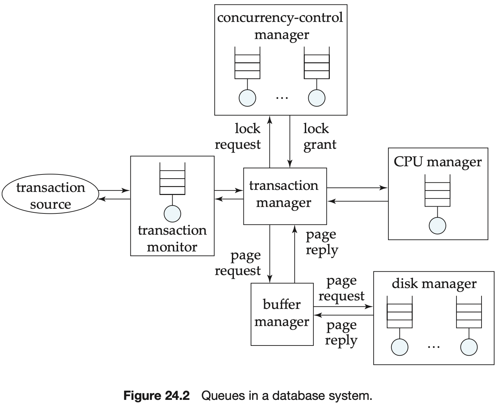

# CHAPTER 24 Advanced Application Development

The JDBC API also provides a feature called `batch update` that allows a number of inserts to be performed using a single communication with the database.

Another aspect of improving set orientation lies in rewriting queries with `nested subqueries`.

To support bulk load operations, most database systems provide a `bulk import` utility and a corresponding `bulk export` utility.

Typically, there is a table, which we shall call the `master table`, and updates to the master table are received as a batch.

The performance of most systems (at least before they are tuned) is usually limited primarily by the performance of one or a few components, called `bottlenecks`.

However, database systems are much more complex, and can be modeled as `queueing systems`.

To learn more about the theory of queueing systems, generally referred to as `queueing theory`, you can consult the references cited in the bibliographical notes.

The best way to spend the money is to achieve the maximum number of transactions per second. A reduction of 1 I/O per second saves:
$$
(price\ per\ disk\ drive)/(access\ per\ second\ per\ disk)
$$
, thus, if a particular page is accessed $n$ times per second, the saving due to keeping it in memory is $n$ times the above value. Storing a page in memory costs:
$$
(price\ per\ megabyte\ of\ memory)/(pages\ per\ megabyte\ of\ memory)
$$
, thus, the break-even point is:
$$
n * \frac{price\ per\ disk\ drive}{access\ per\ second\ per\ disk} = \frac{price\ per\ megabyte\ of\ memory}{pages\ per\ megabyte\ of\ memory}
$$
, we can rearrange the equation and substitute current values for each of the above parameters to get a value for $n$; if a page is accessed more frequently than this, it is worth buying enough memory to store it.

`5-minute rule`: if a page is used more frequently than once in 5 minutes, it should be cached in memory.

`1-minute rule`: which said that sequentially accessed data should be cached in memory if they are used at least once in 1 minute.

Alternatively, in the `flash-as-buffer` approach, flash storage is used as a persistent buffer, with each block having a permanent location on disk, but stored in flash instead of being written to disk as long as it is frequently used.

The `column store` approach to storing data is based on vertical partitioning, but takes it to the limit by storing each attribute (column) of the relation in a separate file. Column stores have been shown to perform well for several data-warehouse applications.

In the case of `immediate view maintenance`, if the updates of a transaction affect the materialized view, the materialized view must be updated as part of the same transaction.

In the case of `deferred view maintenance`, the materialized view is updated later; until it is updated, the materialized view may be inconsistent with the database relations.

In the case of `deferred view maintenance`, the materialized view is updated later; until it is updated, the materialized view may be inconsistent with the database relations.

The selection tools perform `workload compression`, that is, create a representation of the workload using a small number of updates and queries.

Data items that are updated very frequently can result in poor performance with locking, with many transactions waiting for locks on those data items. Such data items are called `update hot spots`.

A transaction that gives a raise to every employee in a large corporation could be split up into a series of small transactions, each of which updates a small range of employeeids. Such transactions are called `minibatch transactions`.

To avoid this problem, some databases provide for automatic `lock escalation`; with this technique, if a transaction has acquired a large number of tuple locks, tuple locks are upgraded to page locks, or even full relation locks.

`Performance benchmarks` are suites of tasks that are used to quantify the performance of software systems.

The right way to average out the numbers is to take the `time to completion` for the workload, rather than the average `throughput` for each transaction type.

The `harmonic mean` of $n$ throughputs $t_1, ..., t_n$ is defined as:
$$
\frac{n}{\frac{1}{t_1} + \frac{1}{t_2} + ... + \frac{1}{t_n}}
$$
`Online transaction processing (OLTP)` and `decision support`, including `online analytical processing (OLAP)`, are two broad classes of applications handled by database systems.

The `Transaction Processing Performance Council (TPC)` has defined a series of benchmark standards for database systems.

The performance metric is throughput, expressed as `transactions per second(TPS)`.

The TPC benchmark also measures performance in term of `price per TPS`.

The `composite query per hour metric`, which is the overall metric, is then obtained as the square root of the product of the power and throughput metrics. A `composite price/performance metric` is defined by dividing the system price by the composite metric.

Testing of programs involves designing a `test suite`, that is, a collection of test cases. Testing is not a one-time process, since programs evolve continuously, and bugs may appear as an unitended consequence of a change in the program; such a bug is referred to as program `regression`.

`Regression testing` involves running the program on each test case in a test suite, and checking that the program genrates the expected test output.

A test case that produces different outputs on an intended query and a mutant of the query is said to `kill the mutant`.

Testing can also be used to ensure that an application meets performance requirements. To carry out such `performance testing`, the test database must be of the same size as the real database would be.

When an organization decides to replace a legacy system with a new system, it may follow a process called `reverse engineering`, which consists of going over the code of the legacy system to come up with schema designs in the required data model (such as an E-R model or an object-oriented data model).

The overall process is called `re-engineering`.

Abruptly transitioning to a new system, which is called the `big-bang approach`, carries several risks.

An alternative approach, called the `chicken-little approach`, incrementally replaces the functionality of the legacy system.

`Standards` define the interface of a software system.

`Formal standards` are those developed by a standards organization or by industry groups, through a public process.

Dominant products sometimes become `de facto standards`, in that they become generally accepted as standards without any formal process of recognition.

The `ODBC` standard is a widely used standard for communication between client applications and database systems. ODBC is based on the SQL `Call Level Interface (CLI)` standards developed by the `X/Open` industry consortium and the SQL Access Group, but it has several extensions.

The X/Open consortium has also developed the `X/Open XA standards` for interoperation of databases.

The `Object Database Management Group (ODMG)` was a group formed by OODB vendors to standardize the data model and language interfaces to OODBs.

The `Object Management Group (OMG)` is a consortium of companies, formed with the objective of developing a standard architecture for distributed software applications based on the object-oriented model.

The `Common Object Request Broker Architecture (CORBA)` provides a detailed specification of the ORB, and includes an `Interface Description Language (IDL)`, which is used to define the data types used for data interchange.

Microsoft introduced the `Entity data model`, which incorporates ideas from the entity-relationship and object-oriented data models, and an approach to integrating querying with the programming language, called `Language Integrated Querying` or `LINQ`.

Supply-chain management requires standardization of a variety of things such as:

- Global company identifier.
- Global product identifier.
- Global class identifier.
- Interfaces between trading partners.

`Simple Object Access Protocol (SOAP)` is a remote procedure call standard that uses XML to encode data (both parameters and results), and uses HTTP as the transport protocol; that is, a procedure call becomes an HTTP request.