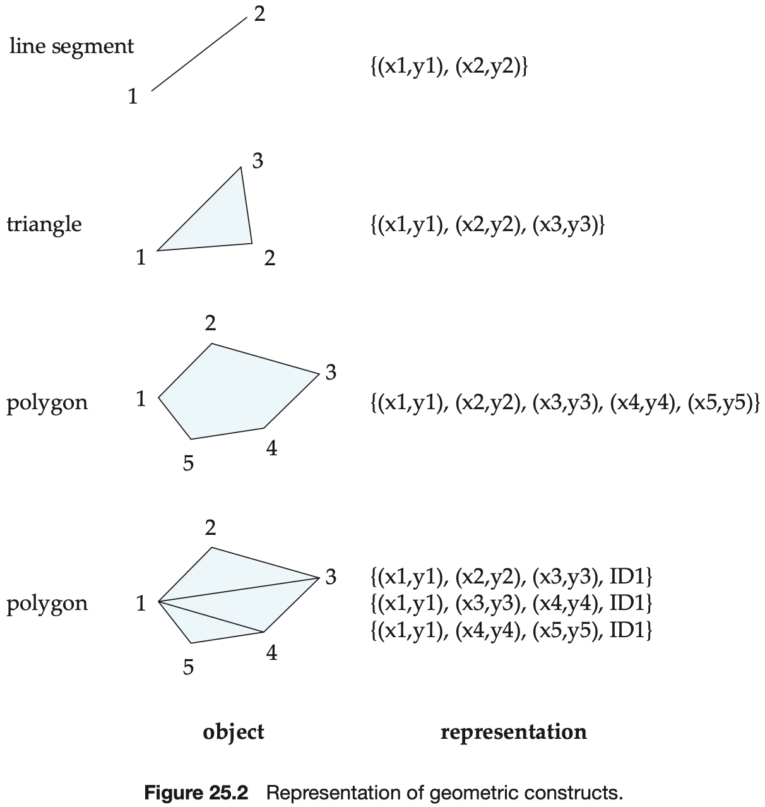
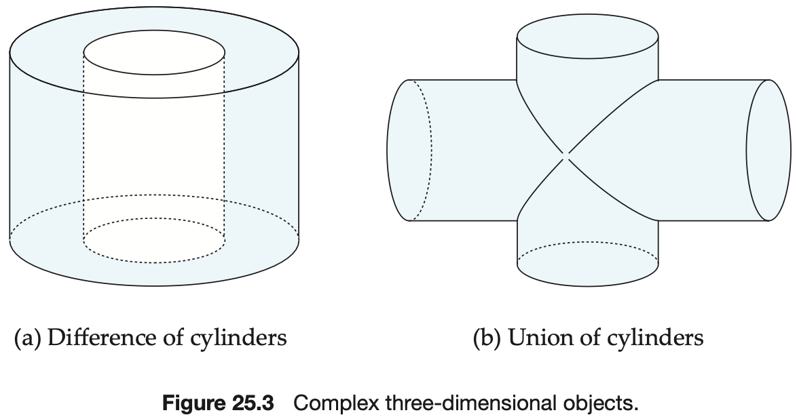
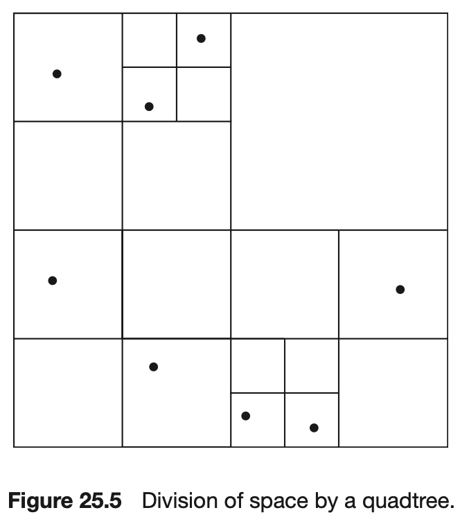
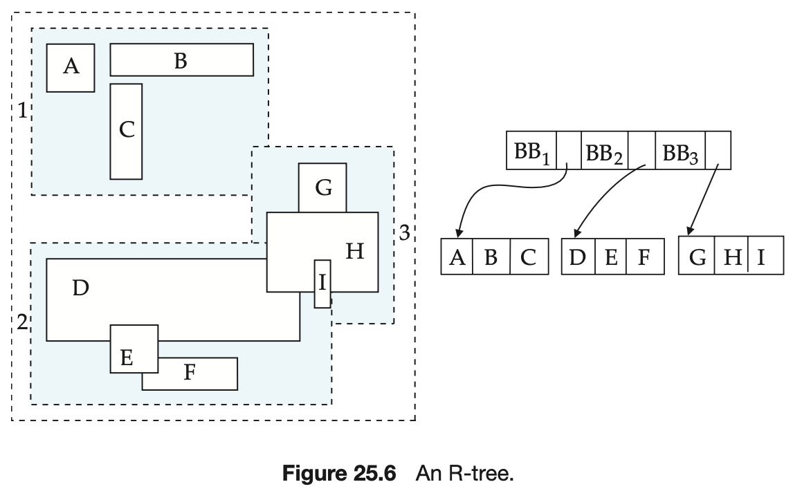

# CHAPTER 25 Spatial and Temporal Data and Mobility

Databases that store information about states of the real world across time are called `temporal databases`.

The `valid time` for a fact is the set of time intervals during which the fact is true in the real world. The `transaction time` for a fact is the time interval during which the fact is current within the database system.

A `temporal relation` is one where each tuple has an associated time when it is true; the time may be either valid time or transaction time. Of course, both valid time and transaction time can be stored, in which case the relation is said to be a `bitemporal relation`.

The `Universal Coordinated Time (UTC)` is a standard reference point for specifying time, with local times defined as offsets from UTC.

A database relation without temporal information is sometimes called a `snapshot relation`, since it reflects the state in a snapshot of the real world.

A `temporal selection` is a selection that involves the time attributes; a `temporal projection` is a projection where the tuples in the projection inherit their times from the tuples in the original relation.

A `temporal join` is a join, with the time of a tuple in the result being the intersection of the times of the tuples from which it is derived.

A `temporal functional dependency` $X \underrightarrow{T} \gamma$ holds on a relation schema $R$ if, for all legal instances $\gamma$ or $R$, all snapshots of $\gamma$ satisfy the functional dependency $X \rightarrow \gamma$.

Two types of spatial data are particularly important:

- `Computer-aided-design (CAD) data`, which includes spatial information about how objects--such as buildings, cars, or aircraft--are constructed.
- `Geographic data` such as road maps, land-usage maps, topographic elevation maps, political maps showing boundaries, land-ownership maps, and so on. `Geographic information systems` are special-purpose databases tailored for storing geographic data.

A `polyline` (also called a `linestring`) consists of a connected sequence of line segments and can be represented by a list containing the coordinates of the endpoints of the segments, in sequence.

In an alternative representation, a polygon can be divided into a set of triangles, This process is called `triangulation`, and any polygon can be triangulated.

`Computer-aided-design (CAD)` systems traditionally stored data in memory during editing or other processing, and wrote the data back to a file at the end of a session of editing.

Three-dimensional surfaces may also be represented by `wireframe models`, which essentially model the surface as a set of simpler objects, such as line segments, triangles, and rectangles.

Vehicle navigation systems are systems that are mounted in automobiles and provide road maps and trip-planning services. They include a `Global Positioning System (GPS)` unit, which uses information broadcast from GPS satellites to find the current location with an accuracy of tens of meters.

`Geographic data` can be categorized into two types:

- `Raster data`.
- `Vector data`.

`Topographical` information, that is information about the elevation (height) of each point on a surface, can be represented in raster form.

There are a number of types of queries that involve spatial locations:

- `Nearness queries` request objects that lie near a specified location.
- `Region queries` deal with spatial regions.
- Queries may also request `intersections` and `unions` of regions.

A tree structure called a `k-d tree` was one of the early structures used for indexing in multiple dimensions. Each level of a k-d tree partitions the space into two.

The `k-d-B tree` extends the k-d tree to allow multiple child nodes for each internal node, just as a B-tree extends a binary tree, to reduce the height of the tree. k-d-B trees are better suited for secondary storage than k-d trees.

An alternative representation fro two-dimensional data is a `quadtree`.

This type of quadtree is called a `PR quadtree`, to indicate it stores points, and that the division of space is divided based on regions, rather than on the actual set of points stored. We can use `region quadtrees` to store array (raster) information.

A storage structure called an `R-tree` is useful for indexing of objects such as points, line segments, rectangles, and other polygons. An R-tree is a balanced tree structure with the indexed objects stored in leaf nodes, much like a $B^{+}-tree$.

We shall now see how to implement search, insert, and delete operations on an R-tree:

- Search. As the figure shows, the bounding boxes associated with sibling nodes may overlap; in $B^{+}-trees$, $k-d trees$, and quadtrees, in contrast, the ranges do not overlap.
- Insert. When we insert an object into an R-tree, we select a leaf node to hold the object. Ideally we should pick a leaf node that has space to hold a new entry, and whose bounding box contains the bounding box of the object.
- Deletion. Deletion can be performed like a $B^{+}-tree$ deletion, borrowing entries from sibling nodes, or merging sibling nodes if a node becomes under-full. An alternative approach redistributes all the entries of under-full nodes to sibling nodes, with the aim of improving the clustering of entries in the R-tree.

Continuous media systems are characterized by their real-time information-delivery requirements:

- Data must be delivered sufficiently fast that no gaps in the audio or video result.
- Data must be delivered at a rate that does not cause overflow of system buffers.
- Synchronization among distinct data streams must be maintained.

`Mobile computing` has proved useful in many applications.
