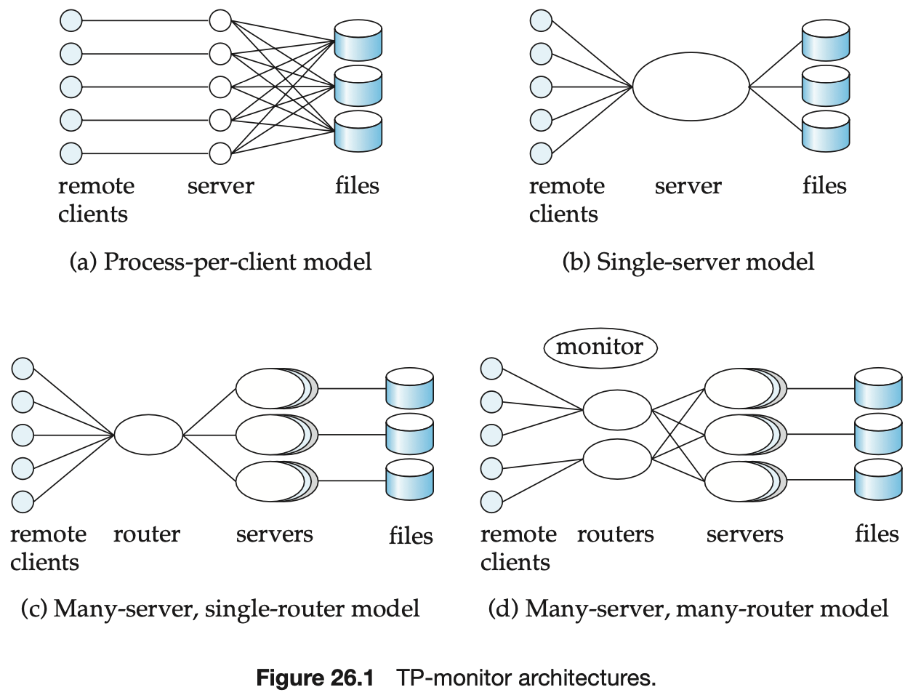
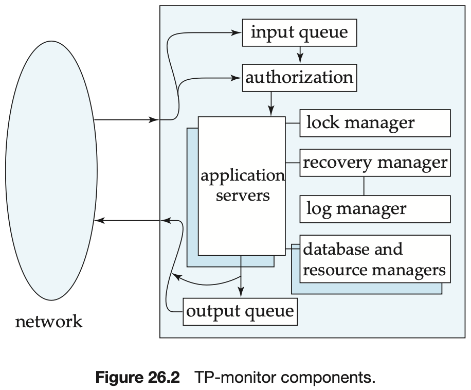

# CHAPTER 26 Advanced Transaction Processing

`Transaction-processing monitors (TP monitors)` are systems that were developed in the 1970s and 1980s, initially in response to a need to support a large number of remote terminals (such as airline-reservation terminals) from a single computer. The term `TP monitor` initially stood for `teleprocessing monitor`.

`Process-per-client model` is illustrated in Figure 26.1a. This model presents several problems with respect to memory utilization and processing speed:

- Per-process memory requirements are high. Even if memory for program code is shared by all processes, each process consumes memory for local data and open file descriptors, as well as for operating-system overhead, such as page tables to support virtual memory.
- The operating system divides up available CPU time among processes by switching among them; this technique is called `multitasking`. Each `context switch` between one process and the next has considerable CPU overhead; even on today's fast systems, a context switch can take hundreds of microseconds.

`Single-server model` illustrated in Figure 26.1b. This model is also used in client-server environments, where clients send requests to a single server process. The server process handles tasks, such as user authentication, that would normally be handled by the operating system.

`Many-server, single-router model` is illustrated in Figure 26.1c. This model supports independent server processes for multiple applications; further, each application can have a pool of server processes, any one of which can handle a client session.

`Many-server, many-router model` is illustrated in Figure 26.1d. A controller process starts up the other processes and supervises their functioning.

