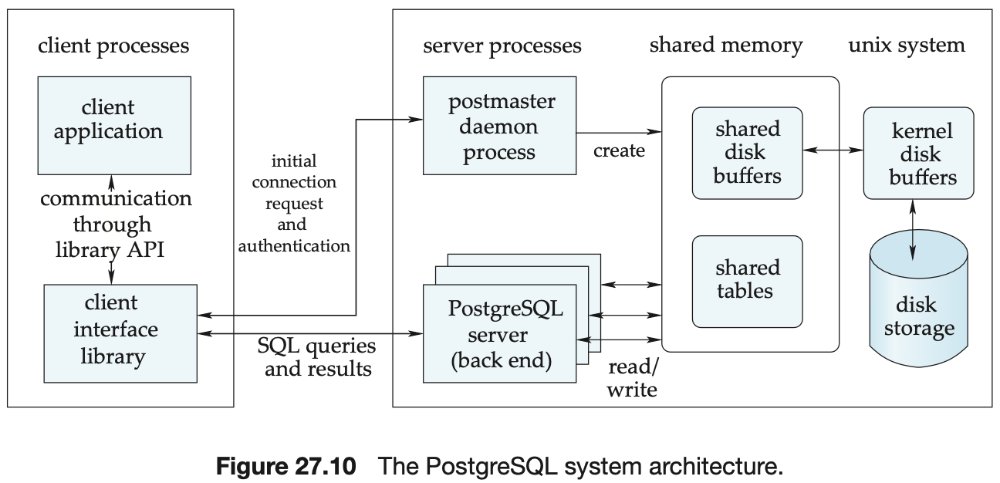

# CHAPTER 27 PostgreSQL


PostgreSQL types fall into the following categories:

- `Base types`. Base types are also known as `abstract data types`; that is, modules that encapsulate both state and a set of operations.
- `Composite types`. These correspond to table rows; that is, they are a list of field names and their respective types.
- `Domains`. A domain type is defined by coupling a base type with a constraint that values of the type must satisfy.
- `Enumerated types`. These are similar to `enum` types used in programming languages such as C and Java.
- `Pseudotypes`. Currently, PostgreSQL supports the following pseudotypes: `any`, `anyarray`, `anyelement`, `anyenum`, `anynonarray cstring`, `internal`, `opaque`, `language handler`, `record`, `trigger`, and `void`.
- `Polymorphic types`. Four of the pseudotypes `anyelement`, `anyarray, `anymonarray`, and `anyenum` are collectively known as ploymorphic.

The SQL standard defines the different isolation levels in terms of three phenomena that violate serializability. The three phenomena are called:

- `Dirty read`. The transaction reads values written by another transaction that hasn't committed yet.
- `Nonrepeatable read`. A transaction reads the same object twice during execution and finds a different value the second time, although the transaction has not changed the value in the meantime.
- `Phantom read`. A transaction re-executes a query returning a set of rows that satisfy a search condition and finds that the set of rows satisfying the condition has changed as a result of another recently committed transaction.

A tuple is visible for a transaction $T$ if the following two conditions hold:

1. The tuple was created by a transaction that committed before transaction $T$ took its snapshot.
2. Updates to the tuple (if any) were executed by a transaction that is either
   - aborted, or
   - started running after $T$ took its snapshot, or
   - was active when $T$ took its snapshot.

, to be precise, a tuple is also visible to $T$ if it was created by $T$ and not subsequently updated by $T$.

PostgreSQL supports the following types of indices:

- B-tree.
- Hash.
- GiST.
- GIN.

For some of the index types described above, PostgreSQL supports more complex variations such as:

- Multicolumn indices.
- Unique indices.
- Indices on expressions.
- Operator classes.
- Partial indices.

An index may be added to the database using the `create index` command. For example:

```sql
create index inst_sal_idx on instructor(salary);
```

Some of the important operators of the executor can be categorized as follows:

1. Access methods.
   - Sequential scans.
   - Index scans.
   - Bitmap index scans.
2. Join methods.
3. Sort.
4. Aggregation.



