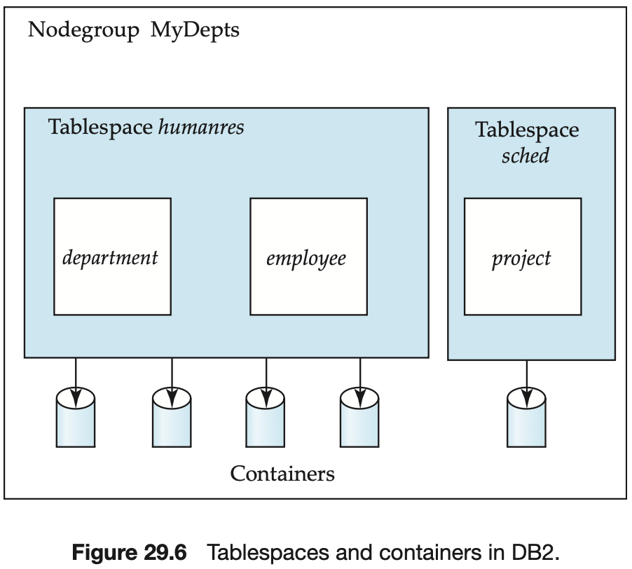
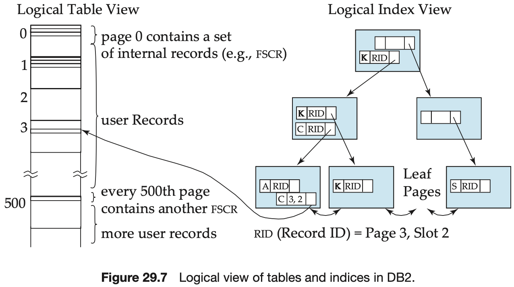
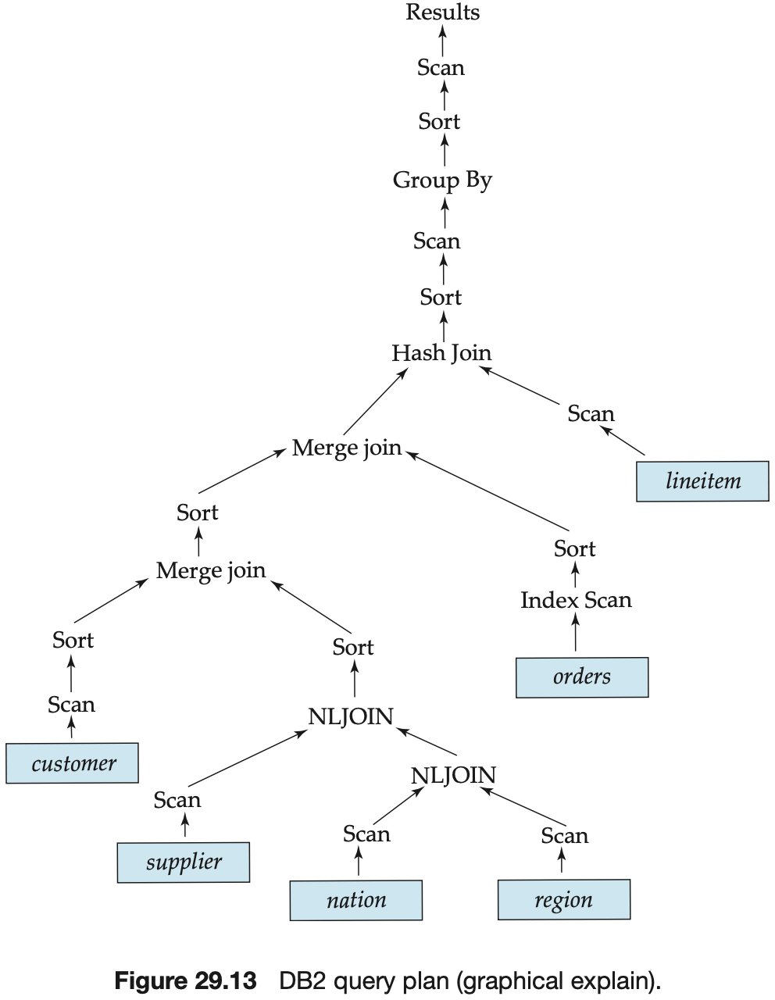
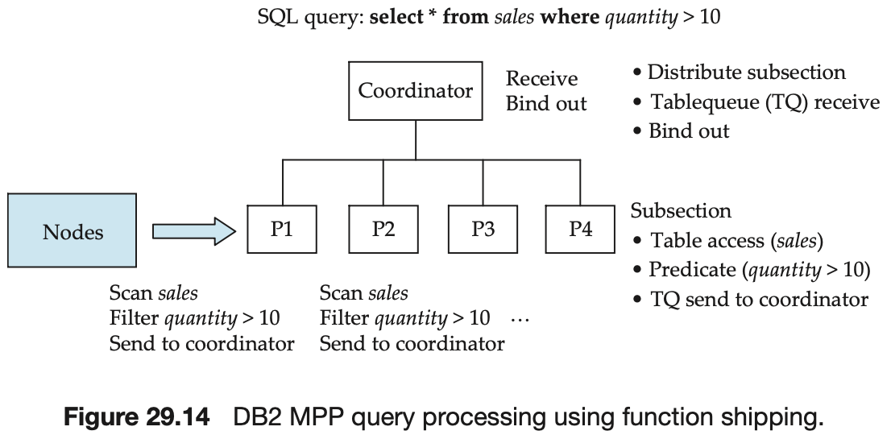
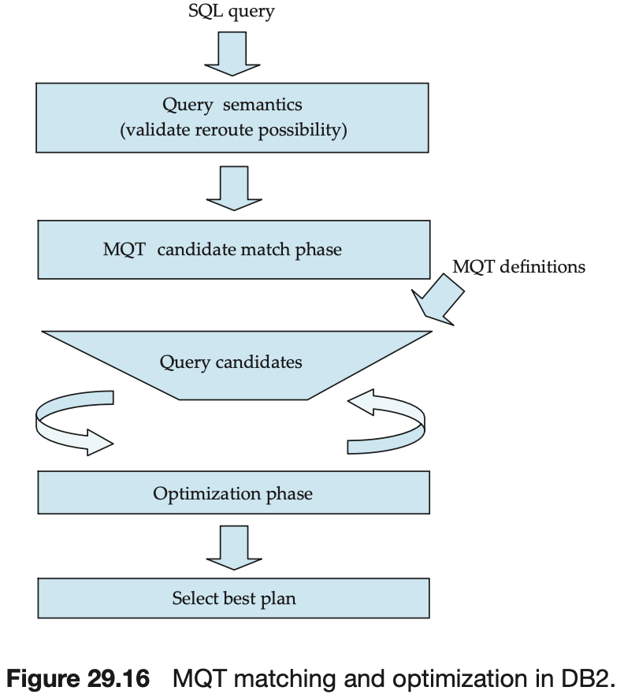

# CHAPTER 29 IBM DB2 Universal Database

DB2 supports a comprehensive set of access methods on relational tables. The list of access methods includes:

- Table scan.
- Index scan.
- Block index scan.
- Index only.
- List prefetch.
- Block and record index ANDing.
- Block and record index ordering.

In DB2 a materialized view is called a `materialized query table (MQT)`. MQTs are specified by using the create table statement.

